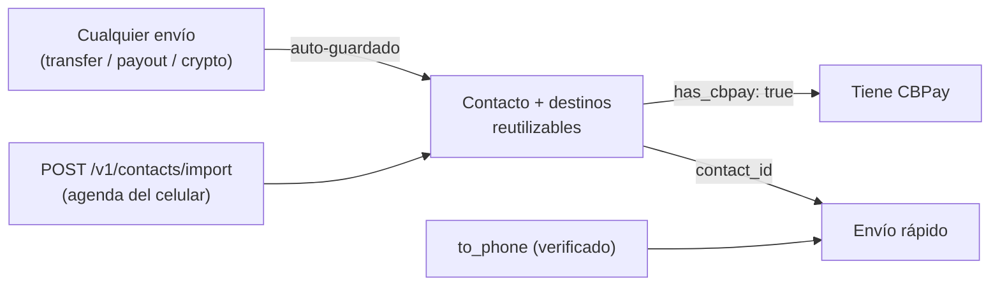

import { EnvUrls } from "/snippets/env-urls.jsx";

<EnvUrls lang="es" />

La **libreta de contactos** elimina el tipeo repetido de datos: cada envío
(transferencia interna, payout fiat o retiro crypto) guarda el destino como
contacto automáticamente, puedes **importar la agenda del celular** para
descubrir quién de tus contactos tiene CBPay, y las transferencias aceptan
directamente un **número de teléfono** o un `contact_id` como destino.



## Los contactos se crean solos

Cada envío guarda su destino en tu libreta (deduplicado: repetir el mismo
destino no crea contactos duplicados, solo lo marca como usado):

| Envío | Qué se guarda |
|---|---|
| Transferencia interna | La cuenta CBPay destino (nombre, email y su teléfono si está verificado) |
| Payout fiat | El beneficiario completo (banco, cuenta, documento…) por país y método |
| Retiro crypto | La dirección por red (nómbrala con `contact_name` en el retiro) |

¿No quieres guardar un destino puntual? Agrega `"save_contact": false` al
body del envío. El auto-guardado jamás afecta el envío: si algo falla, el
envío sale igual.

## Importar la agenda del celular

Sube los contactos del teléfono (hasta **1.000 por request**; pagina si hay
más) y CBPay te dice **quién ya tiene cuenta** — el match es por número de
teléfono y solo contra cuentas del mismo operador:

```bash
curl -X POST https://api.qbank.cl/platform/v1/contacts/import \
  -H "Authorization: Bearer <token>" \
  -H "Content-Type: application/json" \
  -d '{
    "contacts": [
      { "name": "Carlos Soto", "phones": ["+56 9 8765 4321"] },
      { "name": "Ana Pérez", "phones": ["912345678"] },
      { "name": "Tía Rosa", "phones": ["no-es-numero"] }
    ]
  }'
```

Respuesta `200`:

```json
{
  "imported": 2,
  "matched": 1,
  "total": 3,
  "contacts": [
    { "name": "Carlos Soto", "phone": "+56987654321", "contact_id": "3f8a…", "has_cbpay": true },
    { "name": "Ana Pérez", "phone": "+56912345678", "contact_id": "9c1d…", "has_cbpay": false },
    { "name": "Tía Rosa", "skipped": true, "reason": "no_valid_phone" }
  ]
}
```

- Los números se normalizan a **E.164** solos: acepta `+…`, `00…` y números
  locales (se les antepone el país de tu cuenta). Los inválidos se saltan.
- Re-importar es seguro: los contactos existentes no se duplican.
- `has_cbpay: true` significa que ese teléfono corresponde a una cuenta
  activa del mismo operador — puedes transferirle al instante.

## Enviar plata por teléfono

Las transferencias internas aceptan `to_phone` (además de `to_account_id`,
`to_email` y `to_contact_id`):

```bash
curl -X POST https://api.qbank.cl/platform/v1/transfers \
  -H "Authorization: Bearer <token>" \
  -H "Content-Type: application/json" \
  -d '{
    "to_phone": "+56987654321",
    "amount": "25.000000",
    "description": "Almuerzo",
    "idempotency_key": "alm-2026-07-10"
  }'
```

<Warning>
Por seguridad, `to_phone` solo resuelve cuentas con el teléfono
**verificado por OTP** (jamás adivinamos un destino de dinero con un número
sin verificar). Si el número no está verificado: `404 recipient_not_found`;
si más de una cuenta comparte el número: `422 recipient_ambiguous` (usa
`to_account_id` o `to_email`).
</Warning>

## Enviar a un contacto

Cualquier envío acepta el contacto directo:

<CodeGroup>

```bash Transferencia (contacto con CBPay)
curl -X POST https://api.qbank.cl/platform/v1/transfers \
  -H "Authorization: Bearer <token>" \
  -H "Content-Type: application/json" \
  -d '{ "to_contact_id": "3f8a…", "amount": "10.000000", "idempotency_key": "t-991" }'
```

```bash Payout (beneficiario guardado)
curl -X POST https://api.qbank.cl/platform/v1/payouts \
  -H "Authorization: Bearer <token>" \
  -H "Content-Type: application/json" \
  -d '{
    "country": "CL", "currency": "CLP", "amount": "45000",
    "beneficiary_contact_id": "7b2c…",
    "idempotency_key": "pago-arriendo-07"
  }'
```

```bash Retiro crypto (dirección guardada)
curl -X POST https://api.qbank.cl/platform/v1/crypto/withdrawals \
  -H "Authorization: Bearer <token>" \
  -H "Content-Type: application/json" \
  -d '{ "chain": "tron", "to_contact_id": "5d4e…", "amount": "100.000000", "idempotency_key": "w-2211" }'
```

</CodeGroup>

- **Payouts**: usa el beneficiario guardado más reciente del contacto para
  ese país (y método si lo envías; si no, se usa el del destino guardado).
  Un `beneficiary` explícito en el body siempre gana. Sin destino guardado
  para ese corredor: `422 no_saved_destination`.
- **Crypto**: usa la dirección guardada para esa `chain`; un `to_address`
  explícito gana.
- **Transfers**: usa la cuenta CBPay enlazada del contacto; si el contacto
  solo tiene teléfono, se intenta por su número (verificado). Contacto sin
  ninguno: `422 contact_not_linked`.

## Administrar la libreta

```bash
# Listado con búsqueda y filtros
curl "https://api.qbank.cl/platform/v1/contacts?q=carlos&has_cbpay=true&page=1&page_size=50" \
  -H "Authorization: Bearer <token>"

# Crear a mano
curl -X POST https://api.qbank.cl/platform/v1/contacts \
  -H "Authorization: Bearer <token>" \
  -H "Content-Type: application/json" \
  -d '{ "display_name": "Carlos Soto", "phone": "+56987654321", "email": "carlos@mail.com", "favorite": true }'

# Detalle (incluye los destinos guardados)
curl https://api.qbank.cl/platform/v1/contacts/{contact_id} \
  -H "Authorization: Bearer <token>"

# Editar / borrar
curl -X PATCH https://api.qbank.cl/platform/v1/contacts/{contact_id} \
  -H "Authorization: Bearer <token>" -H "Content-Type: application/json" \
  -d '{ "alias": "Carlitos", "favorite": true }'
curl -X DELETE https://api.qbank.cl/platform/v1/contacts/{contact_id} \
  -H "Authorization: Bearer <token>"
```

Detalle de un contacto (`200`):

```json
{
  "contact_id": "3f8a1b2c-…",
  "display_name": "Carlos Soto",
  "alias": "Carlitos",
  "phone": "+56987654321",
  "email": "carlos@mail.com",
  "has_cbpay": true,
  "cbpay_account_id": "389d34a3-…",
  "source": "import",
  "favorite": true,
  "destinations": [
    { "destination_id": "aa11…", "type": "cbpay", "last_used_at": "2026-07-10T15:00:00Z", "created_at": "2026-07-08T10:00:00Z" },
    { "destination_id": "bb22…", "type": "payout", "country": "CL", "currency": "CLP", "method": "bank_transfer",
      "details": { "name": "Carlos Soto", "tax_id": "12.345.678-5", "bank_code": "012", "account_type": "checking", "account_number": "123456789" },
      "last_used_at": "2026-07-09T18:30:00Z", "created_at": "2026-07-09T18:30:00Z" },
    { "destination_id": "cc33…", "type": "crypto", "chain": "tron", "address": "TVJ6njG5Fyrq6XwYok3xPQx8kR7HQx6vXk",
      "last_used_at": "2026-07-07T12:00:00Z", "created_at": "2026-07-07T12:00:00Z" }
  ],
  "created_at": "2026-07-07T12:00:00Z",
  "updated_at": "2026-07-10T15:00:00Z"
}
```

También puedes agregar destinos a mano (`POST
/v1/contacts/{id}/destinations` con `type: payout|crypto|cbpay` y sus
campos) y borrarlos (`DELETE .../destinations/{destination_id}`).

## Errores

| HTTP | `error` | Causa | Solución |
|---|---|---|---|
| 400 | `invalid_phone` | El teléfono no se pudo normalizar a E.164 | Envíalo como `+<país><número>` |
| 400 | `batch_too_large` | Import con más de 1.000 contactos | Pagina la subida |
| 404 | `not_found` | El contacto/destino no existe o no es tuyo | Verifica el id |
| 404 | `recipient_not_found` | Ningún teléfono verificado coincide | Pide al destinatario verificar su teléfono, o usa email/account_id |
| 409 | `duplicate` | Ya tienes un contacto con ese teléfono/email | Edita el existente |
| 422 | `recipient_ambiguous` | Más de una cuenta comparte el teléfono | Usa `to_account_id` o `to_email` |
| 422 | `contact_not_linked` | El contacto no tiene cuenta CBPay asociada | Transfiérele por otro medio o hazle un payout |
| 422 | `no_saved_destination` | El contacto no tiene destino guardado para ese corredor/chain | Envía el `beneficiary`/`to_address` explícito (quedará guardado) |

## Preguntas frecuentes

<AccordionGroup>
<Accordion title="¿El destinatario se entera de que lo tengo como contacto?">
No. La libreta es privada de tu cuenta: importar la agenda o guardar
contactos no notifica a nadie ni comparte tus datos. Solo tú ves tu libreta.
</Accordion>
<Accordion title="¿Por qué un contacto que sé que tiene CBPay aparece has_cbpay: false?">
El match es por número de teléfono exacto (E.164) contra cuentas del mismo
operador. Si esa persona registró otro número (o ninguno) en su cuenta, no
hay match. En cuanto registre y verifique ese teléfono, un re-import lo
detecta.
</Accordion>
<Accordion title="¿Puedo transferirle a un contacto con has_cbpay: false?">
No por transferencia interna (no hay cuenta a la cual abonar). Pero puedes
hacerle un payout fiat a su cuenta bancaria o un envío crypto a su wallet —
y esos destinos también quedan guardados en el contacto.
</Accordion>
<Accordion title="¿Qué pasa si dos personas de mi org tienen el mismo número?">
El envío por teléfono falla explícito con 422 recipient_ambiguous — nunca
adivinamos un destino de dinero. Usa to_account_id o to_email en ese caso.
</Accordion>
<Accordion title="¿El import me puede servir para saber si un número cualquiera tiene CBPay?">
El match es solo contra cuentas de tu mismo operador, con un cap de 1.000
contactos por request y bajo el rate limit global de la API. No expone
datos de la cuenta matcheada más allá del hecho de existir (necesario para
poder transferirle).
</Accordion>
</AccordionGroup>
