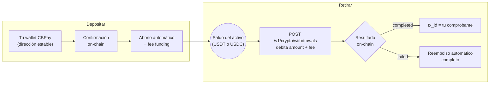

Tus saldos stablecoin viven conectados a la blockchain. Combinaciones
soportadas:

| Red | Activo | Saldo que acredita |
|---|---|---|
| `tron` | `usdt` | USDT |
| `eth` | `usdt` | USDT |
| `eth` | `usdc` | USDC |

Cada depósito acredita el **saldo de su propio activo** (una wallet USDC
abona tu saldo USDC). `BTC` y `GOLD` son saldos sin riel on-chain: se
mueven solo por transferencias internas y abonos del operador.



Las wallets son **puertas de entrada**: puedes tener varias (empresas), pero
el saldo de la cuenta es uno solo.

| Tipo de cuenta | Wallets por red |
|---|---|
| Persona | **1** |
| Empresa | **Ilimitadas** (usa `label` para distinguirlas) |

## Crear una wallet

<CodeGroup>

```bash Persona (1 por red)
curl -X POST https://api.qbank.cl/platform/v1/crypto/wallets \
  -H "Authorization: Bearer <token>" \
  -H "Content-Type: application/json" \
  -d '{ "chain": "tron" }'
```

```bash Empresa (con label, ilimitadas)
curl -X POST https://api.qbank.cl/platform/v1/crypto/wallets \
  -H "Authorization: Bearer <token>" \
  -H "Content-Type: application/json" \
  -d '{
    "chain": "tron",
    "label": "Tesorería principal"
  }'
```

```bash Empresa, red Ethereum
curl -X POST https://api.qbank.cl/platform/v1/crypto/wallets \
  -H "Authorization: Bearer <token>" \
  -H "Content-Type: application/json" \
  -d '{
    "chain": "eth",
    "label": "Cobros e-commerce"
  }'
```

```bash Wallet USDC (solo Ethereum)
curl -X POST https://api.qbank.cl/platform/v1/crypto/wallets \
  -H "Authorization: Bearer <token>" \
  -H "Content-Type: application/json" \
  -d '{
    "chain": "eth",
    "asset": "usdc",
    "label": "Tesorería USDC"
  }'
```

</CodeGroup>

`asset` es opcional y por defecto `usdt`. El límite de una wallet por red
para personas es por combinación red+activo: una persona puede tener su
wallet `eth`/`usdt` **y** su wallet `eth`/`usdc`.

Respuesta `201`:

```json
{
  "wallet_id": "b7e3…",
  "chain": "tron",
  "asset": "USDT",
  "address": "TQmZ…",
  "label": "Tesorería principal",
  "created_at": "2026-07-07T12:00:00Z",
  "creation_fee": "1.000000"
}
```

Si una persona intenta una segunda wallet en la misma red — `422`:

```json
{
  "error": "wallet_limit_reached",
  "message": "person accounts can hold one wallet per network"
}
```

- Cada creación tiene un **costo fijo** (`wallet_creation`) configurado por
  CBPay — puede diferenciarse para personas y empresas, e incluso por
  cuenta. Con comisión 0 (el default) es gratis. Si la creación falla, el
  cargo se reembolsa automáticamente.
- Una **persona** que ya tiene wallet en esa red recibe
  `422 wallet_limit_reached`; las **empresas** pueden crear tantas como
  necesiten (una por proveedor, por sucursal, por producto…). Todas las
  diferencias persona/empresa están en
  [personas y empresas](/es/conceptos/personas-y-empresas).
- `label` es opcional y solo descriptivo.

## Ver mis wallets

```bash
curl https://api.qbank.cl/platform/v1/crypto/wallets \
  -H "Authorization: Bearer <token>"
```

```json
{
  "wallets": [
    {
      "wallet_id": "b7e3…",
      "chain": "tron",
      "asset": "USDT",
      "address": "TQmZ…",
      "label": "Tesorería principal",
      "created_at": "2026-07-07T12:00:00Z"
    },
    {
      "wallet_id": "a1c9…",
      "chain": "eth",
      "asset": "USDT",
      "address": "0x8f3B…",
      "label": "Cobros e-commerce",
      "created_at": "2026-07-07T12:05:00Z"
    }
  ]
}
```

## Depositar

Envía el activo de la wallet a su dirección, **por la red correcta**.
Cuando el depósito se confirma on-chain, el saldo de ese activo se acredita
automáticamente (neto de la comisión de `funding` si CBPay la configuró) y
se emite el webhook `crypto_deposit_credited`:

```json
{
  "account_id": "…",
  "chain": "tron",
  "asset": "USDT",
  "tx_id": "b1946ac9…",
  "amount": "499.000000",
  "fee": "1.000000"
}
```

<Warning>
Envía **solo el activo de la wallet y por su red** (USDT a una wallet
USDT, USDC a una wallet USDC). Las direcciones son tuyas y estables:
puedes reutilizarlas para todos tus depósitos.
</Warning>

### Tiempos de confirmación

| Red | Detección | Abono (confirmación de la red) |
|---|---|---|
| TRON | Casi inmediata | **~1 minuto** (19 confirmaciones) |
| Ethereum | Casi inmediata | **Algunos minutos** según congestión |

El abono siempre llega con el webhook y el `tx_id` para verificarlo en el
explorador de la red.

## Transferir (retiros on-chain)

Envía USDT o USDC desde su saldo a cualquier dirección externa (`asset`
opcional, default `USDT`; USDC solo por `eth`):

<CodeGroup>

```bash USDT por TRON
curl -X POST https://api.qbank.cl/platform/v1/crypto/withdrawals \
  -H "Authorization: Bearer <token>" \
  -H "Content-Type: application/json" \
  -d '{
    "chain": "tron",
    "to_address": "TVJ6…",
    "amount": "100.000000",
    "idempotency_key": "retiro-2026-07-07-b"
  }'
```

```bash USDC por Ethereum
curl -X POST https://api.qbank.cl/platform/v1/crypto/withdrawals \
  -H "Authorization: Bearer <token>" \
  -H "Content-Type: application/json" \
  -d '{
    "chain": "eth",
    "asset": "USDC",
    "to_address": "0x8f3B…",
    "amount": "50.000000",
    "idempotency_key": "retiro-usdc-2026-07-09-a"
  }'
```

</CodeGroup>

Respuesta `202` — se debita `amount + fee` y la transacción se transmite:

```json
{
  "withdrawal_id": "5e8c…",
  "chain": "tron",
  "asset": "USDT",
  "to_address": "TVJ6…",
  "amount": "100.000000",
  "fee": "1.000000",
  "total_debit": "101.000000",
  "status": "processing",
  "tx_id": "…"
}
```

<Note>
Cada retiro guarda la dirección como [contacto](/es/guias/contactos)
automáticamente — nómbralo con `"contact_name"` en el body, o desactívalo
con `"save_contact": false`. Para repetir un envío, usa
`"to_contact_id"` en vez de `to_address` (se usa la dirección guardada del
contacto para esa `chain`).
</Note>

El estado final llega por el webhook `crypto_withdrawal_status_changed`:
**`completed`** (el `tx_id` es tu comprobante) o **`failed`** (se reembolsa
el débito completo).

También puedes consultar el retiro en cualquier momento:

```bash
curl https://api.qbank.cl/platform/v1/crypto/withdrawals/5e8c… \
  -H "Authorization: Bearer <token>"
```

```json
{
  "withdrawal_id": "5e8c…",
  "chain": "tron",
  "asset": "USDT",
  "to_address": "TVJ6…",
  "amount": "100.000000",
  "fee": "1.000000",
  "total_debit": "101.000000",
  "status": "completed",
  "status_code": "confirmed",
  "status_message": "confirmed on-chain",
  "tx_id": "7d1f…"
}
```

<Note>
Para mover saldo a **otra cuenta CBPay** no uses la blockchain: las
[transferencias internas](/es/guias/transferencias) son instantáneas y
gratis.
</Note>

## Movimientos

```bash
# Actividad on-chain: depósitos + retiros, con tx_id y filtros de fecha
curl "https://api.qbank.cl/platform/v1/crypto/transactions?from=2026-07-01&to=2026-07-08" \
  -H "Authorization: Bearer <token>"
```

```json
{
  "page": 1,
  "page_size": 50,
  "deposits": [
    {
      "chain": "tron",
      "asset": "USDT",
      "tx_id": "b1946ac9…",
      "from_address": "TX9a…",
      "amount": "499.000000",
      "reference": "dep_8813…",
      "created_at": "2026-07-07T12:10:00Z"
    }
  ],
  "withdrawals": [
    {
      "withdrawal_id": "5e8c…",
      "chain": "tron",
      "asset": "USDT",
      "to_address": "TVJ6…",
      "amount": "100.000000",
      "fee": "1.000000",
      "total_debit": "101.000000",
      "status": "completed",
      "tx_id": "7d1f…",
      "created_at": "2026-07-07T15:00:00Z"
    }
  ]
}
```

```bash
# Saldo actual (available + held)
curl https://api.qbank.cl/platform/v1/balances \
  -H "Authorization: Bearer <token>"

# Historial contable completo (funding, retiros, comisiones de wallet…)
curl "https://api.qbank.cl/platform/v1/movements?type=funding&from=2026-07-01&to=2026-07-08" \
  -H "Authorization: Bearer <token>"
```

Cada depósito acredita el **saldo del activo de su wallet** (USDT o USDC);
las wallets son puertas de entrada, el saldo por moneda es uno solo.

## Errores

| HTTP | `error` | Causa |
|---|---|---|
| 400 | `invalid_chain` | Red no soportada (usa `tron` o `eth`) |
| 400 | `invalid_asset` | Combinación red/activo sin riel on-chain (soportadas: `tron`/`usdt`, `eth`/`usdt`, `eth`/`usdc` — `BTC` y `GOLD` no operan on-chain) |
| 400 | `to_address_required` | Falta la dirección destino del retiro |
| 402 | `insufficient_funds` | Saldo insuficiente en ese activo (para el retiro o la comisión de creación) |
| 422 | `wallet_limit_reached` | Una persona intentó crear una segunda wallet para la misma red+activo |
| 422 | (retiro con `status: failed`) | Rechazado al transmitir; débito reembolsado |
| 503 | `withdrawals_unavailable` | Retiros no habilitados aún para este corredor |
