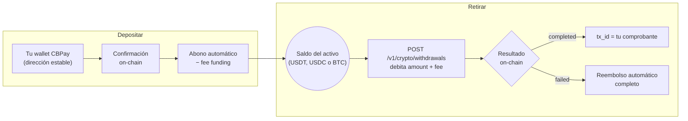

import { EnvUrls } from "/snippets/env-urls.jsx";

<EnvUrls lang="es" />

Tus saldos crypto viven conectados a la blockchain. Combinaciones
soportadas:

| Red | Activo | Saldo que acredita |
|---|---|---|
| `tron` | `usdt` | USDT |
| `eth` | `usdt` | USDT |
| `eth` | `usdc` | USDC |
| `btc` | `btc` | BTC |

Cada depósito acredita el **saldo de su propio activo** (una wallet USDC
abona tu saldo USDC; la wallet Bitcoin abona tu saldo BTC). `GOLD` es el
único saldo sin riel on-chain: se mueve solo por transferencias internas y
abonos del operador.



## Tu cuenta nace con sus wallets

Toda cuenta — persona y empresa — se crea con **una wallet de depósito por
cada combinación soportada** (`tron`/`usdt`, `eth`/`usdt`, `eth`/`usdc` y
`btc`/`btc`), **sin costo** y de forma automática: apenas te registras ya
tienes tus cuatro direcciones listas para recibir fondos.

```bash
# Recién creada la cuenta, tus direcciones ya existen:
curl https://api.qbank.cl/platform/v1/crypto/wallets \
  -H "Authorization: Bearer <token>"
```

```json
{
  "page": 1,
  "page_size": 50,
  "wallets": [
    { "wallet_id": "9d68…", "chain": "tron", "asset": "USDT", "address": "TXMD…", "label": "", "type": "deposit", "receive_only": true, "created_at": "2026-07-11T23:33:20Z" },
    { "wallet_id": "a83d…", "chain": "eth", "asset": "USDT", "address": "0xefe0…", "label": "", "type": "deposit", "receive_only": true, "created_at": "2026-07-11T23:33:20Z" },
    { "wallet_id": "fb88…", "chain": "eth", "asset": "USDC", "address": "0xa072…", "label": "", "type": "deposit", "receive_only": true, "created_at": "2026-07-11T23:33:20Z" },
    { "wallet_id": "c1d4…", "chain": "btc", "asset": "BTC", "address": "bc1qf66…", "label": "", "type": "deposit", "receive_only": true, "created_at": "2026-07-11T23:33:20Z" }
  ]
}
```

<Note>
La provisión corre en segundo plano al crear la cuenta: si consultas en el
mismo segundo del registro puede faltar alguna dirección — reintenta a los
pocos segundos.
</Note>

Las wallets de depósito son **puertas de entrada**, no billeteras
operativas: solo sirven para **recibir** crypto que se abona a tu saldo
virtual. No envían fondos, no se exportan ni se importan (para eso están
las [wallets segregadas](/es/guias/wallets-segregadas)).

<Note>
Dos productos, dos rutas: las wallets de depósito viven en
`/v1/crypto/wallets` y las segregadas en `/v1/segregated-wallets`. Toda
respuesta de wallet trae el discriminador `type` (`deposit` /
`segregated`) para distinguirlas siempre.
</Note>

| Tipo de cuenta | Wallets de depósito por combinación red+activo |
|---|---|
| Persona | **1** (las de nacimiento ya ocupan el cupo) |
| Empresa | **1** (las de nacimiento ya ocupan el cupo) |

## ¿Puedo crear más wallets de depósito?

No. Toda cuenta — persona y empresa — tiene exactamente **una wallet de
depósito por combinación** red+activo, y nacen todas con la cuenta.
`POST /v1/crypto/wallets` existe solo para reponer un par que falte (caso
excepcional): con las cuatro wallets ya provisionadas responde
`422 wallet_limit_reached`.

```bash
curl -X POST https://api.qbank.cl/platform/v1/crypto/wallets \
  -H "Authorization: Bearer <token>" \
  -H "Content-Type: application/json" \
  -d '{ "chain": "eth", "asset": "usdc" }'
```

Con el par ya provisionado — `422`:

```json
{
  "error": "wallet_limit_reached",
  "message": "accounts hold one deposit wallet per network/asset pair (created automatically with the account); use segregated wallets for additional wallets"
}
```

- Las wallets **de nacimiento son siempre gratis**; el fee `wallet_creation`
  solo aplicaría a una reposición manual (con comisión 0, el default, es
  gratis; si la creación falla, el cargo se reembolsa automáticamente).
- ¿Necesitas **varias wallets** con saldo propio (por cliente, por
  proyecto, por unidad de negocio)? Ese es el producto
  [wallets segregadas](/es/guias/wallets-segregadas): empresas sin límite,
  personas 1 por combinación red+activo.

## Ver mis wallets

```bash
curl https://api.qbank.cl/platform/v1/crypto/wallets \
  -H "Authorization: Bearer <token>"
```

```json
{
  "wallets": [
    {
      "wallet_id": "b7e3…",
      "chain": "tron",
      "asset": "USDT",
      "address": "TQmZ…",
      "label": "",
      "type": "deposit",
      "receive_only": true,
      "created_at": "2026-07-07T12:00:00Z"
    },
    {
      "wallet_id": "a1c9…",
      "chain": "eth",
      "asset": "USDT",
      "address": "0x8f3B…",
      "label": "",
      "type": "deposit",
      "receive_only": true,
      "created_at": "2026-07-07T12:00:00Z"
    },
    {
      "wallet_id": "fb88…",
      "chain": "eth",
      "asset": "USDC",
      "address": "0xa072…",
      "label": "",
      "type": "deposit",
      "receive_only": true,
      "created_at": "2026-07-07T12:00:00Z"
    },
    {
      "wallet_id": "c1d4…",
      "chain": "btc",
      "asset": "BTC",
      "address": "bc1qf66…",
      "label": "",
      "type": "deposit",
      "receive_only": true,
      "created_at": "2026-07-07T12:00:00Z"
    }
  ]
}
```

<Note>
Las direcciones Bitcoin son **bech32 nativas** (`bc1q…`): cualquier wallet
o exchange moderno puede enviarles fondos. Los montos BTC usan 8 decimales
(`"0.00050000"`).
</Note>

## Depositar

Envía el activo de la wallet a su dirección, **por la red correcta**.
Cuando el depósito se confirma on-chain, el saldo de ese activo se acredita
automáticamente (neto de la comisión de `funding` si CBPay la configuró) y
se emite el webhook `crypto_deposit_credited`:

```json
{
  "account_id": "…",
  "chain": "tron",
  "asset": "USDT",
  "tx_id": "b1946ac9…",
  "amount": "499.000000",
  "fee": "1.000000"
}
```

<Warning>
Envía **solo el activo de la wallet y por su red** (USDT a una wallet
USDT, USDC a una wallet USDC, BTC a la wallet Bitcoin). Las direcciones
son tuyas y estables: puedes reutilizarlas para todos tus depósitos.
</Warning>

### Tiempos de confirmación

| Red | Detección | Abono (confirmación de la red) |
|---|---|---|
| TRON | Casi inmediata | **~1 minuto** (19 confirmaciones) |
| Ethereum | Casi inmediata | **Algunos minutos** según congestión |
| Bitcoin | Al primer bloque (~10 min) | **~30 minutos** (3 confirmaciones) |

El abono siempre llega con el webhook y el `tx_id` para verificarlo en el
explorador de la red.

## Transferir (retiros on-chain)

Envía USDT, USDC o BTC desde su saldo a cualquier dirección externa
(`asset` opcional: default `USDT` en `tron`/`eth` y `BTC` en `btc`; USDC
solo por `eth`):

<CodeGroup>

```bash USDT por TRON
curl -X POST https://api.qbank.cl/platform/v1/crypto/withdrawals \
  -H "Authorization: Bearer <token>" \
  -H "Content-Type: application/json" \
  -d '{
    "chain": "tron",
    "to_address": "TVJ6…",
    "amount": "100.000000",
    "idempotency_key": "retiro-2026-07-07-b"
  }'
```

```bash USDC por Ethereum
curl -X POST https://api.qbank.cl/platform/v1/crypto/withdrawals \
  -H "Authorization: Bearer <token>" \
  -H "Content-Type: application/json" \
  -d '{
    "chain": "eth",
    "asset": "USDC",
    "to_address": "0x8f3B…",
    "amount": "50.000000",
    "idempotency_key": "retiro-usdc-2026-07-09-a"
  }'
```

```bash BTC por Bitcoin
curl -X POST https://api.qbank.cl/platform/v1/crypto/withdrawals \
  -H "Authorization: Bearer <token>" \
  -H "Content-Type: application/json" \
  -d '{
    "chain": "btc",
    "to_address": "bc1qw50…",
    "amount": "0.00050000",
    "idempotency_key": "retiro-btc-2026-07-15-a"
  }'
```

</CodeGroup>

<Note>
En Bitcoin el destino puede ser una dirección bech32 (`bc1q…`), taproot
(`bc1p…`) o legacy (`1…` / `3…`). El **fee de red** de Bitcoin lo cubre la
propia operación — recibes el estado final por webhook como en cualquier
otro retiro.
</Note>

Respuesta `202` — se debita `amount + fee` y la transacción se transmite:

```json
{
  "withdrawal_id": "5e8c…",
  "chain": "tron",
  "asset": "USDT",
  "to_address": "TVJ6…",
  "amount": "100.000000",
  "fee": "1.000000",
  "total_debit": "101.000000",
  "status": "processing",
  "tx_id": "…"
}
```

<Note>
Cada retiro guarda la dirección como [contacto](/es/guias/contactos)
automáticamente — nómbralo con `"contact_name"` en el body, o desactívalo
con `"save_contact": false`. Para repetir un envío, usa
`"to_contact_id"` en vez de `to_address` (se usa la dirección guardada del
contacto para esa `chain`).
</Note>

El estado final llega por el webhook `crypto_withdrawal_status_changed`:
**`completed`** (el `tx_id` es tu comprobante) o **`failed`** (se reembolsa
el débito completo).

También puedes consultar el retiro en cualquier momento:

```bash
curl https://api.qbank.cl/platform/v1/crypto/withdrawals/5e8c… \
  -H "Authorization: Bearer <token>"
```

```json
{
  "withdrawal_id": "5e8c…",
  "chain": "tron",
  "asset": "USDT",
  "to_address": "TVJ6…",
  "amount": "100.000000",
  "fee": "1.000000",
  "total_debit": "101.000000",
  "status": "completed",
  "status_code": "confirmed",
  "status_message": "confirmed on-chain",
  "tx_id": "7d1f…"
}
```

<Note>
Para mover saldo a **otra cuenta CBPay** no uses la blockchain: las
[transferencias internas](/es/guias/transferencias) son instantáneas y
gratis.
</Note>

### Travel Rule (retiros sobre el umbral)

Por regulación internacional (FATF R.16, "Travel Rule"), los retiros
on-chain **desde 1.000 USD** exigen declarar quién recibe los fondos antes
de mover el dinero. Bajo el umbral nada cambia. Hay dos caminos:

<Tabs>
<Tab title="Wallet propia (self-hosted)">

Si el destino es una wallet del propio titular (no un exchange), declara
`wallet_type` y el nombre del beneficiario:

```bash
curl -X POST https://api.qbank.cl/platform/v1/crypto/withdrawals \
  -H "Authorization: Bearer <token>" \
  -H "Content-Type: application/json" \
  -d '{
    "chain": "tron",
    "to_address": "TVJ6…",
    "amount": "1500.000000",
    "wallet_type": "self_hosted",
    "beneficiary_name": "Maria Perez",
    "idempotency_key": "retiro-2026-07-12-a"
  }'
```

La respuesta incluye `"travel_rule_status": "self_hosted_attested"`.

</Tab>
<Tab title="Otra institución (travel address)">

Si el destino es una cuenta en otra institución compatible, pide al
beneficiario su **travel address** (código que empieza con `ta…`) y
envíala junto con su nombre — la dirección de pago la entrega la
institución receptora, por lo que `to_address` puede omitirse:

```bash
curl -X POST https://api.qbank.cl/platform/v1/crypto/withdrawals \
  -H "Authorization: Bearer <token>" \
  -H "Content-Type: application/json" \
  -d '{
    "chain": "tron",
    "amount": "1500.000000",
    "travel_address": "ta2AQSjBotWQf38c8sxYYK2Kfis…",
    "beneficiary_name": "Maria Perez",
    "idempotency_key": "retiro-2026-07-12-b"
  }'
```

El intercambio con la institución receptora ocurre en línea. Si aprueba,
el retiro sale hacia la dirección que ella entregó y la respuesta incluye
`"travel_rule_status": "approved"`. Si la institución rechaza
(`travel_rule_rejected`) o aún no responde (`travel_rule_pending`), el
retiro no se ejecuta y no se debita nada — reintenta más tarde con la
**misma** `idempotency_key`.

</Tab>
</Tabs>

| Error | Qué significa | Qué hacer |
|---|---|---|
| `travel_rule_required` | Retiro sobre el umbral sin datos del beneficiario | Agrega `travel_address` o `wallet_type: "self_hosted"` + `beneficiary_name` |
| `travel_rule_beneficiary_required` | Falta `beneficiary_name` | Envía el nombre del titular del destino |
| `travel_rule_address_mismatch` | Tu `to_address` no coincide con la dirección aprobada por la institución receptora | Omite `to_address` o usa la dirección del intercambio aprobado |
| `travel_rule_rejected` | La institución receptora rechazó la transferencia | Verifica los datos del beneficiario con el destinatario |
| `travel_rule_pending` | La institución receptora aún no resuelve | Reintenta más tarde con la misma `idempotency_key` |
| `travel_rule_unavailable` | Intercambio temporalmente no disponible | Reintenta con la misma `idempotency_key` |

## Movimientos

```bash
# Actividad on-chain: depósitos + retiros, con tx_id y filtros de fecha
curl "https://api.qbank.cl/platform/v1/crypto/transactions?from=2026-07-01&to=2026-07-08" \
  -H "Authorization: Bearer <token>"
```

```json
{
  "page": 1,
  "page_size": 50,
  "deposits": [
    {
      "chain": "tron",
      "asset": "USDT",
      "tx_id": "b1946ac9…",
      "from_address": "TX9a…",
      "amount": "499.000000",
      "reference": "dep_8813…",
      "created_at": "2026-07-07T12:10:00Z"
    }
  ],
  "withdrawals": [
    {
      "withdrawal_id": "5e8c…",
      "chain": "tron",
      "asset": "USDT",
      "to_address": "TVJ6…",
      "amount": "100.000000",
      "fee": "1.000000",
      "total_debit": "101.000000",
      "status": "completed",
      "tx_id": "7d1f…",
      "created_at": "2026-07-07T15:00:00Z"
    }
  ]
}
```

```bash
# Saldo actual (available + held)
curl https://api.qbank.cl/platform/v1/balances \
  -H "Authorization: Bearer <token>"

# Historial contable completo (funding, retiros, comisiones de wallet…)
curl "https://api.qbank.cl/platform/v1/movements?type=funding&from=2026-07-01&to=2026-07-08" \
  -H "Authorization: Bearer <token>"
```

Cada depósito acredita el **saldo del activo de su wallet** (USDT, USDC o
BTC); las wallets son puertas de entrada, el saldo por moneda es uno solo.

## Errores

| HTTP | `error` | Causa |
|---|---|---|
| 400 | `invalid_chain` | Red no soportada (usa `tron`, `eth` o `btc`) |
| 400 | `invalid_asset` | Combinación red/activo sin riel on-chain (soportadas: `tron`/`usdt`, `eth`/`usdt`, `eth`/`usdc`, `btc`/`btc` — `GOLD` no opera on-chain) |
| 400 | `to_address_required` | Falta la dirección destino del retiro |
| 402 | `insufficient_funds` | Saldo insuficiente en ese activo (para el retiro o la comisión de creación) |
| 422 | `wallet_limit_reached` | La cuenta ya tiene su wallet de depósito de esa combinación red+activo (aplica a personas y empresas) |
| 422 | (retiro con `status: failed`) | Rechazado al transmitir; débito reembolsado |
| 503 | `withdrawals_unavailable` | Retiros no habilitados aún para este corredor |
## FAQ

<AccordionGroup>
<Accordion title="¿Tengo que crear las wallets de depósito?">
No. Toda cuenta nace con sus wallets de depósito para todos los pares
soportados (`tron:usdt`, `eth:usdt`, `eth:usdc`, `btc:btc`), sin costo. El
endpoint de creación solo auto-repara un par faltante — una segunda wallet
del mismo par responde `wallet_limit_reached` (422).
</Accordion>
<Accordion title="¿Cuándo se acredita un depósito a mi saldo?">
La detección es casi en tiempo real (`pending`); el crédito ocurre cuando la
red alcanza las confirmaciones requeridas de esa chain. Síguelo con
`GET /v1/crypto/transactions` o los webhooks de `crypto_deposit`.
</Accordion>
<Accordion title="¿Qué pasa si mi retiro falla?">
El monto debitado (incluida la comisión) se reembolsa a tu saldo
automáticamente. Reintenta con la **misma** `idempotency_key` — la
plataforma jamás re-transmite por su cuenta.
</Accordion>
<Accordion title="¿Por qué mi retiro pide datos del beneficiario?">
Los retiros sobre el umbral USD de Travel Rule de tu organización exigen
`wallet_type: self_hosted` más `beneficiary_name`, o una `travel_address`
(los errores 422 `travel_rule_*` te guían campo a campo).
</Accordion>
<Accordion title="¿Puedo retirar GOLD on-chain?">
No — GOLD es un saldo solo de ledger sin riel on-chain. Conviértelo primero
con [Swaps](/es/guias/swaps) a un asset retirable.
</Accordion>
<Accordion title="¿Por qué mi retiro se bloqueó con compliance_hold?">
La dirección de destino no pasó el screening de compliance. La operación
queda registrada como fallida y tus fondos se reembolsan; contacta a tu
equipo CBPay si crees que es un falso positivo.
</Accordion>
</AccordionGroup>
