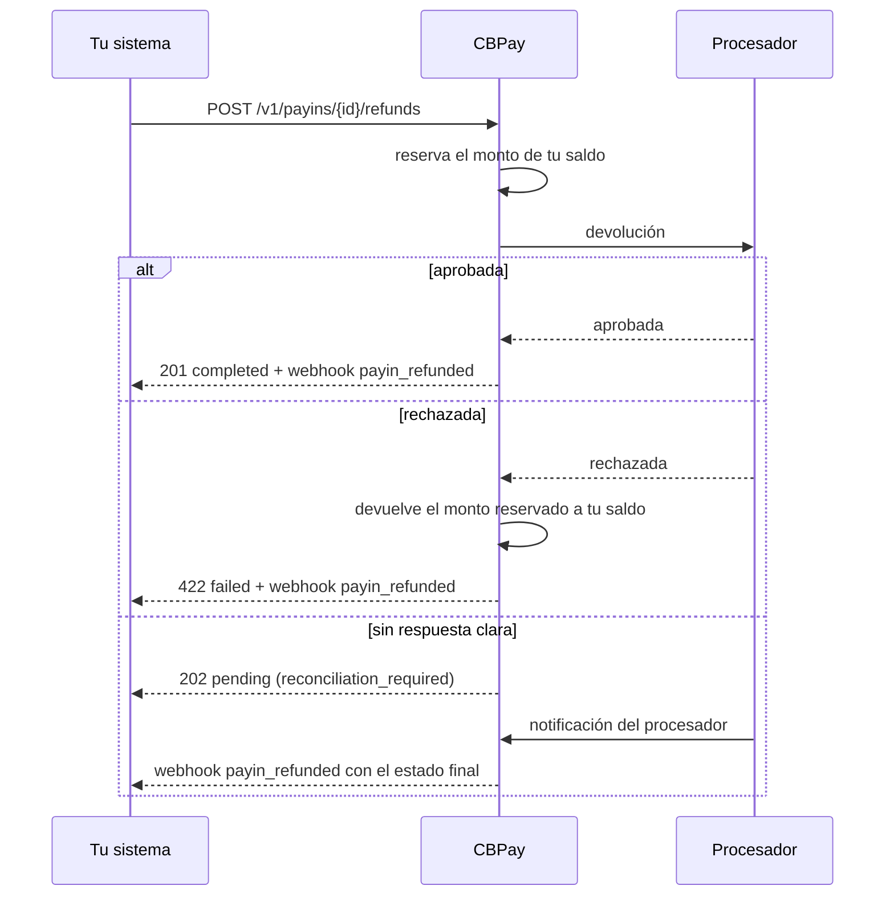

import { EnvUrls } from "/snippets/env-urls.jsx";

<EnvUrls lang="es" />

Cuando necesitas devolverle la plata a un tarjetahabiente —un pedido
cancelado, un cargo duplicado, un reclamo resuelto a favor del cliente—
la devolución es una operación **de tu cuenta**: el procesador le
devuelve el dinero a la tarjeta y nosotros **debitamos ese mismo valor
de tu saldo**, con su asiento en la cartola, su comprobante verificable
y su webhook.

Es lo contrario de un cobro: el cobro acredita, la devolución debita.

## Qué se puede devolver

| Requisito | Detalle |
|---|---|
| Método | Solo cobros con **tarjeta** (`method: "card"`, incluye checkout pagado con tarjeta y cargos MIT sobre tarjeta guardada) |
| Estado | El cobro debe estar `credited` **y con su saldo ya disponible** — un cobro con tarjeta bajo una ventana de settlement (`settlement_pending: true`, saldo que cae a `settle_at`) no se puede devolver hasta que se libere el settlement |
| Saldo | Necesitas **saldo USDT** suficiente al momento de pedirla |
| Monto | Total o parcial; varias parciales sobre el mismo cobro suman hasta el tope |

Los cobros por QR, transferencia anunciada, cuenta de depósito dedicada
y collect **no** se devuelven por este camino (`refund_not_supported`):
esos rieles no tienen capacidad de devolución en el procesador. Los
cobros POS se devuelven por el riel crypto con
`POST /v1/pos/charges/{id}/refunds`.

<Warning>
La **comisión y el margen de cambio no se reembolsan**. Se debita de tu
saldo el valor que el cobro trajo (bruto), no el neto que se acreditó:
si cobraste 100.00 USD y te acreditamos 97.10 USDT después de una
comisión de 2.90, devolver el total debita **100.000000 USDT**. La
diferencia la pones tú, igual que en cualquier procesador de tarjetas.
</Warning>

## Ciclo de vida



| Estado | Qué significa | Qué hacer |
|---|---|---|
| `pending` | La pedimos al procesador y todavía no hay respuesta definitiva. Tu saldo ya está reservado. | Esperar el webhook. **No** reintentes con otra clave: duplicarías la devolución. |
| `completed` | El procesador la aprobó. El débito quedó firme en tu cartola. | Nada. Estado final. |
| `failed` | El procesador la rechazó. El monto reservado volvió a tu saldo, exacto. | Revisa `failure_reason` y decide si corresponde reintentar con una clave nueva. |

<Warning>
Un `202 pending` **no es un error**: la devolución puede estar hecha. Si
reintentas con una `idempotency_key` distinta, el pagador recibe la plata
dos veces. Reintenta siempre con la **misma** clave (te devolvemos el
objeto original) o espera el webhook.
</Warning>

## Pedir una devolución

<Steps>
<Step title="Devuelve el total del cobro">

Omite `amount` para devolver todo lo que queda por devolver:

```bash
curl -X POST https://api.qbank.cl/platform/v1/payins/9f1c2b30-…/refunds \
  -H "Authorization: Bearer <token>" \
  -H "Content-Type: application/json" \
  -d '{
    "reason": "pedido cancelado por el cliente",
    "idempotency_key": "refund-pedido-8841"
  }'
```

```json
{
  "refund_id": "3a7d51c8-…",
  "payin_id": "9f1c2b30-…",
  "account_id": "c57f05b6-…",
  "kind": "refund",
  "status": "completed",
  "currency": "USD",
  "local_amount": "100.00",
  "usdt_debited": "100.000000",
  "requested_by": "account",
  "reason": "pedido cancelado por el cliente",
  "idempotency_key": "refund-pedido-8841",
  "receipt_url": "https://api.qbank.cl/platform/v1/payin-refunds/3a7d51c8-…/receipt",
  "created_at": "2026-07-25T14:02:11Z",
  "updated_at": "2026-07-25T14:02:14Z"
}
```

La respuesta es `201` cuando el procesador aprueba en el acto, `202`
cuando queda en curso y `422` cuando rechaza.

</Step>
<Step title="O devuelve una parte">

Manda `amount` en la **moneda del cobro** (no en USDT). El débito se
calcula proporcional al valor que ese cobro trajo:

```bash
curl -X POST https://api.qbank.cl/platform/v1/payins/9f1c2b30-…/refunds \
  -H "Authorization: Bearer <token>" \
  -H "Content-Type: application/json" \
  -d '{
    "amount": "40.00",
    "reason": "reembolso parcial por producto faltante",
    "idempotency_key": "refund-pedido-8841-parcial-1"
  }'
```

```json
{
  "refund_id": "b02e77af-…",
  "payin_id": "9f1c2b30-…",
  "kind": "refund",
  "status": "completed",
  "currency": "USD",
  "local_amount": "40.00",
  "usdt_debited": "40.000000",
  "requested_by": "account",
  "receipt_url": "https://api.qbank.cl/platform/v1/payin-refunds/b02e77af-…/receipt",
  "created_at": "2026-07-25T14:20:03Z",
  "updated_at": "2026-07-25T14:20:06Z"
}
```

Puedes pedir varias parciales del mismo cobro. Cuando la suma supera lo
que queda por devolver, respondemos `422 refund_exceeds_payin` sin tocar
tu saldo.

</Step>
<Step title="Anula en vez de devolver (mismo día)">

Si el cobro todavía no se liquidó en el procesador, `kind: "void"` lo
anula en vez de generar una devolución. Para tu saldo el efecto es el
mismo; para el tarjetahabiente, la anulación suele reflejarse antes en
su estado de cuenta.

```bash
curl -X POST https://api.qbank.cl/platform/v1/payins/9f1c2b30-…/refunds \
  -H "Authorization: Bearer <token>" \
  -H "Content-Type: application/json" \
  -d '{ "kind": "void", "idempotency_key": "void-pedido-8841" }'
```

Si el cobro ya no admite anulación, el procesador la rechaza y puedes
pedir la devolución normal.

</Step>
<Step title="Consulta el estado">

```bash
curl https://api.qbank.cl/platform/v1/payin-refunds/3a7d51c8-… \
  -H "Authorization: Bearer <token>"
```

Y el historial de un cobro:

```bash
curl "https://api.qbank.cl/platform/v1/payins/9f1c2b30-…/refunds?from=2026-07-01&to=2026-07-25" \
  -H "Authorization: Bearer <token>"
```

</Step>
</Steps>

## Segundo factor

`POST /v1/payins/{payinID}/refunds` es una operación que **saca plata de
tu cuenta**, así que exige segundo factor cuando la origina una persona
con su sesión (acción `payin_refund`). Si tu organización lo tiene
activo, la primera llamada responde `403 otp_required` con un
`challenge_id`: verifica el código y repite el request con el token del
desafío.

Las **API keys están exentas** por diseño, igual que en el resto de la
plataforma: tu backend integra sin fricción.

## Historial y filtros

```bash
curl "https://api.qbank.cl/platform/v1/payin-refunds?from=2026-07-01&to=2026-07-25&status=completed&kind=refund&page=1&page_size=50" \
  -H "Authorization: Bearer <token>"
```

```json
{
  "page": 1,
  "page_size": 50,
  "refunds": [{
    "refund_id": "3a7d51c8-…",
    "payin_id": "9f1c2b30-…",
    "kind": "refund",
    "status": "completed",
    "currency": "USD",
    "local_amount": "100.00",
    "usdt_debited": "100.000000",
    "requested_by": "account",
    "receipt_url": "https://api.qbank.cl/platform/v1/payin-refunds/3a7d51c8-…/receipt",
    "created_at": "2026-07-25T14:02:11Z",
    "updated_at": "2026-07-25T14:02:14Z"
  }]
}
```

Filtros: `status` (`pending`, `completed`, `failed`), `kind` (`refund`,
`void`, `chargeback`), `payin_id`, `from`/`to` y paginación.

### Cuánto lleva devuelto cada cobro

Cada cobro expone su avance de devolución, y puedes filtrar el listado
de cobros por él:

```bash
curl "https://api.qbank.cl/platform/v1/payins?from=2026-07-01&to=2026-07-25&refund_status=partial" \
  -H "Authorization: Bearer <token>"
```

```json
{
  "page": 1,
  "page_size": 50,
  "payins": [{
    "payin_id": "9f1c2b30-…",
    "status": "credited",
    "currency": "USD",
    "local_amount": "100.00",
    "refund_status": "partial",
    "refunded_amount": "40.000000",
    "refunded_local": "40.00"
  }]
}
```

| `refund_status` | Significado |
|---|---|
| `none` | Sin devoluciones |
| `partial` | Devuelto en parte |
| `full` | Devuelto por completo (o cubierto por un contracargo) |

El cobro **no cambia de estado**: sigue `credited`. Tu historial
financiero no se reescribe; la devolución es un movimiento nuevo.

## Contracargos

Cuando el emisor de la tarjeta impone un **contracargo** (chargeback),
la plata ya salió: no es una decisión tuya ni nuestra. En ese caso:

- Debitamos el monto de tu saldo **automáticamente**, con `kind: "chargeback"`.
- El débito se aplica **aunque no tengas saldo**: la cuenta puede quedar
  en negativo y esa deuda se descuenta de tus próximos abonos.
- Recibes el webhook `payin_refunded` con `kind: "chargeback"` y, si el
  saldo quedó negativo, el campo `balance_after`.

Un contracargo **no se pide por API**: llega desde el emisor. Lo único
que puedes hacer es verlo en tu cartola, tu historial y tu comprobante.

<Note>
Lo debitado entre devoluciones y contracargos de un mismo cobro nunca
supera lo que ese cobro trajo. Si un contracargo llega después de que ya
devolviste, el débito se acota a lo que quedaba —o queda en cero, con la
razón registrada— para que nunca te cobremos dos veces el mismo dinero.
</Note>

## Webhook `payin_refunded`

Se emite en cada estado final (`completed` o `failed`) y en el
contracargo. Los `pending` no emiten: espera el final.

```json
{
  "event_type": "payin_refunded",
  "data": {
    "refund_id": "3a7d51c8-…",
    "payin_id": "9f1c2b30-…",
    "account_id": "c57f05b6-…",
    "kind": "refund",
    "status": "completed",
    "currency": "USD",
    "local_amount": "100.00",
    "usdt_debited": "100.000000",
    "receipt_url": "https://api.qbank.cl/platform/v1/payin-refunds/3a7d51c8-…/receipt"
  }
}
```

En un rechazo llega además `failure_reason`; en un contracargo que deja
la cuenta en negativo, `balance_after`.

## Comprobante

Cada devolución tiene su comprobante PDF con la marca de tu
organización y un código de verificación pública:

```bash
curl -L https://api.qbank.cl/platform/v1/payin-refunds/3a7d51c8-…/receipt \
  -H "Authorization: Bearer <token>" -o devolucion.pdf
```

Cualquiera puede validar ese código en la página pública de
verificación, sin credenciales y sin ver datos personales. Detalle en
[Comprobantes](/es/guias/comprobantes).

## Errores

| HTTP | Código | Solución |
|---|---|---|
| 400 | `idempotency_key_required` | Manda `idempotency_key` en el body o el header `Idempotency-Key`. |
| 400 | `invalid_payload` | `kind` solo acepta `refund` o `void`. |
| 400 | `invalid_amount` | `amount` debe ser un decimal positivo en la moneda del cobro. |
| 402 | `insufficient_funds` | Fondea la cuenta y reintenta **con la misma** `idempotency_key`. |
| 404 | `not_found` | El cobro (o la devolución) no existe en tu cuenta. |
| 409 | `idempotency_conflict` | Hay otra devolución en vuelo con esa clave; consulta su estado. |
| 422 | `payin_not_refundable` | El cobro no está acreditado o no tiene referencia del procesador. |
| 422 | `settlement_pending` | El saldo del cobro está programado para settlement y aún no está disponible; devuélvelo después de liberarse (al llegar `settle_at`, o antes si tu admin de organización lo libera). |
| 422 | `refund_not_supported` | Ese riel no admite devolución (QR, transferencia, CLABE, collect). Los cobros POS se devuelven por el riel crypto. |
| 422 | `refund_exceeds_payin` | La suma pedida supera lo que queda por devolver. |

Catálogo completo en [Errores](/es/errores).

## Preguntas frecuentes

<AccordionGroup>
<Accordion title="¿Recupero la comisión al devolver?">
No. La comisión y el margen de cambio del cobro original no se
reembolsan: se debita el valor bruto que el cobro trajo y la casa retiene
lo que cobró. Es el comportamiento estándar de la industria de tarjetas.
</Accordion>

<Accordion title="Pedí una devolución y me respondió 202. ¿Reintento?">
No con otra clave. Un `202` significa que la devolución puede haberse
ejecutado y todavía no tenemos confirmación. Reintentar con una clave
nueva sería una segunda devolución real. Repite el request con la
**misma** `idempotency_key` (te devolvemos el mismo objeto) o espera el
webhook `payin_refunded`.
</Accordion>

<Accordion title="¿En qué moneda se debita?">
Siempre en **USDT**, la moneda en que se acreditó el cobro, aunque tu
cuenta tenga configurado otro saldo predeterminado para los payins. No
convertimos por tu cuenta: si no tienes USDT suficiente, respondemos
`insufficient_funds`.
</Accordion>

<Accordion title="¿Puedo devolver un cobro de hace meses?">
Mientras el cobro esté `credited` y le quede saldo por devolver, sí por
nuestra parte. El límite real lo pone el procesador y las reglas de las
marcas (habitualmente 180 días); pasado ese plazo la devolución se
rechaza con `failed` y el monto reservado vuelve a tu saldo intacto.
</Accordion>

<Accordion title="¿Y si mi saldo queda negativo por un contracargo?">
La cuenta puede operar en negativo solo por esta causa. La deuda se
salda automáticamente con tus próximos abonos; mientras tanto, las
operaciones que sacan plata seguirán exigiendo saldo disponible.
</Accordion>

<Accordion title="¿Puede devolver también el administrador de mi organización?">
Sí. El panel de administración permite originar la devolución sobre
cualquier cuenta de la organización; queda auditada con el administrador
que la ejecutó y aparece en tu historial con `requested_by: "admin"`.
</Accordion>
</AccordionGroup>
