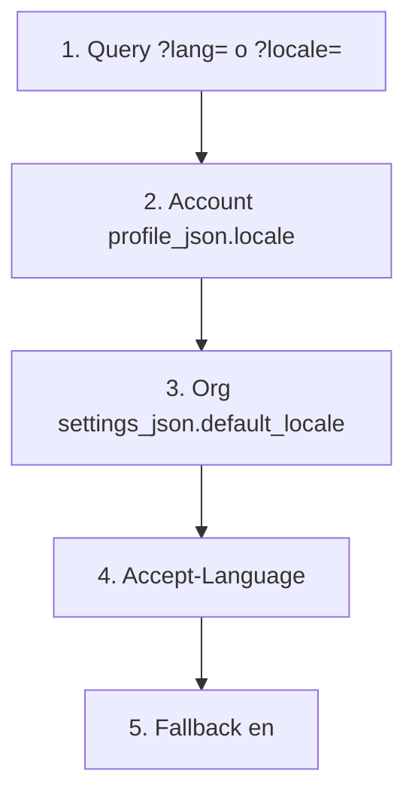

import { EnvUrls } from "/snippets/env-urls.jsx";

<EnvUrls lang="es" />

Las superficies humanas de la plataforma (páginas hospedadas, PDF,
**encabezados** CSV) resuelven un locale `en`, `es` o `zh`. El **default es
inglés**. Las respuestas JSON de la API y los webhooks siguen en inglés
pase lo que pase con el locale (labels, códigos de error y `message`).

<Note>
`locale` en la cuenta es la preferencia humana. Nunca traduce el contrato
JSON. Si necesitas un PDF en español, manda `?lang=es` o fija el locale de
la cuenta — el body de `GET /v1/payouts/{id}` sigue en inglés.
</Note>

## Cadena de resolución

Las llamadas autenticadas (`resolveRequestLocale`) recorren esta lista y
se detienen en el primer valor **válido**. Un `?lang=` / `?locale=`
inválido se **ignora** (nunca `400`) y gana el siguiente paso.



Las páginas públicas (checkout, tracker, comprobantes, status, página
hosted de tarjetas) insertan un paso extra **entre** el query y la cuenta:
la cookie del pagador `cbpay_pay_locale` (ver [Cookies](#dos-cookies)).

Workers, mails de comprobante y PDF generados sin request usan el locale
de la cuenta, luego el default de la org, luego inglés.

## Fijar el locale de la cuenta

`GET /v1/me` expone `locale` (`en` | `es` | `zh`). Un valor ausente o
inválido se devuelve como `en`.

`PATCH /v1/me` acepta `locale` (string). Sigue editable después de aprobar
KYC/KYB — a diferencia de `display_name`, `tax_id` y `country`.

| Body | Efecto |
|---|---|
| omitido | No toca el locale del perfil |
| `""` (vacío) | Se guarda `en` |
| `en` / `es` / `zh` (o variantes `en-US`, `es-CL`, `zh-CN`) | Se normaliza y se guarda |
| cualquier otra cosa | `400 invalid_locale` — `"locale must be en, es or zh"` |

```bash
curl -X PATCH "https://api.qbank.cl/platform/v1/me" \
  -H "Authorization: Bearer <token>" \
  -H "Content-Type: application/json" \
  -d '{"locale": "es"}'
```

```json
{
  "id": "9b1deb4d-3b7d-4bad-9bdd-2b0d7b3dcb6d",
  "org_id": "1c9e7a2b-5f6d-4e3a-8c1b-2a9d8e7f6a5b",
  "type": "person",
  "status": "active",
  "kyc_status": "approved",
  "email": "ana@example.com",
  "display_name": "Ana Perez",
  "tax_id": "12345678-9",
  "phone": "+56987654321",
  "country": "CL",
  "locale": "es",
  "created_at": "2026-07-07T12:00:00Z",
  "updated_at": "2026-08-17T15:00:00Z"
}
```

El registro (`POST /v1/auth/register`) y las cuentas creadas por admin
estampan el locale al nacer: `locale` explícito del body >
`Accept-Language` > `default_locale` de la org > inglés. Un `locale` no
vacío inválido en el registro es el mismo `400 invalid_locale`.

## Cuentas existentes vs cuentas nuevas

Una migración one-shot de deploy
(`db/platform/092_account_locale_es_preconfig.sql`) pone `locale=es` en
las cuentas que **aún no** tenían locale. **No** es un endpoint. Tras ese
deploy:

- Las cuentas **existentes** quedan en español hasta que el titular haga
  PATCH de `locale`.
- Las cuentas **nuevas** nacen en inglés salvo body, `Accept-Language` o
  default de la org.

## Default de la organización

Los platform admins fijan `default_locale` con
`PUT /v1/admin/orgs/{orgID}/settings` (`key: default_locale`, valor
`"en"`, `"es"` o `"zh"`). `""` borra el override y la org cae a inglés.
Un valor inválido responde `400 invalid_value` (no `invalid_locale`). La
organización `cbpay` no lleva este setting — sus cuentas usan el resto de
la cadena.

## Páginas públicas, checkout y tracker

Las páginas hospedadas honran, en orden: `?lang=` / `?locale=` → cookie
`cbpay_pay_locale` → (si hay sesión) locale de la cuenta → default de la
org → `Accept-Language` → `en`. El HTML sale con `<html lang="...">`.

Un query inválido nunca es `400`: se ignora y sigue la cadena.

Los PDF de comprobante y cartola aceptan `?lang=en|es|zh` (default
**inglés**). El nombre de archivo sigue el locale: `statement_…` /
`receipt_…` (en), `cartola_…` / `comprobante_…` (es), `对账单_…` /
`收据_…` (zh).

Las respuestas HTTP humanas estampan `Content-Language` y
`Vary: Accept-Language`.

## Dos cookies

| Cookie | Quién la setea | Quién la lee |
|---|---|---|
| `cbpay_pay_locale` | La plataforma, en páginas públicas del pagador (`SetPayerLocaleCookie`: `Secure`, `SameSite=Lax`, `HttpOnly=false`, 30 días, `Path=/`) | El backend, **solo** en páginas públicas / checkout / pagador |
| `cbpay_lang` | El front SSR del portal (ya existía) | Solo el front. **El backend jamás la lee** |

No envíes una cookie `cb_locale` — no forma parte de esta API.

## Exports CSV

Las descargas CSV de plataforma (movimientos, payouts, payins,
transferencias, revenue, audit log, resultados de lote Qscore,
investigaciones de tarjetas, export del firewall) localizan las
**etiquetas de la fila de encabezado** al locale del caller. Las celdas
siguen crudas (IDs, montos, códigos de estado). El CSV de gastos no
cambia en este release.

Ejemplo de encabezado de lote Qscore en inglés (el default):

```csv
Document ID,Subject type,Status,Score,Band,Verify code,Report ID,Error code
12.345.678-5,person,ready,715,B,Q3f5c9f2d7d214b8c9a2d2d5f6a1b8c01a1b2c3d4e5f60718293a,3f5c9f2d-7d21-4b8c-9a2d-2d5f6a1b8c01,
```

## Fuera de alcance

Las notificaciones de Telegram, la página de **challenge** 3-D Secure del
emisor y los scripts de derecha a izquierda no los localiza esta cadena.

## Errores

| HTTP | `error` | Cuándo | Qué hacer |
|---|---|---|---|
| 400 | `invalid_locale` | `PATCH /v1/me` o el registro envió un locale no vacío fuera de `en`/`es`/`zh` | Envía `en`, `es` o `zh` (string vacío guarda inglés) |
| 400 | `invalid_value` | El setting de org `default_locale` no es `en`/`es`/`zh` ni `""` | Solo platform-admin; ver [errores](/es/errores) |
| 400 | `invalid_language` | El `lang` de un **informe PDF** (AML / verificación) no es `en`/`es`/`zh` | Código distinto — idioma del informe, no locale de cuenta |

Catálogo completo: [Errores](/es/errores). Campos del perfil: [Tu perfil](/es/guias/perfil).

## FAQ

<AccordionGroup>
<Accordion title="¿Por qué mi cuenta existente quedó en español tras este release?">
Las cuentas que ya existían se pre-configuraron `locale=es` con la
migración one-shot de deploy. Las cuentas nuevas defaultan a inglés.
Cambia el locale con `PATCH /v1/me`.
</Accordion>
<Accordion title="¿Cambiar el locale traduce el JSON de la API?">
No. Bodies JSON y webhooks siguen en inglés. El locale aplica a HTML
hospedado, PDF, **encabezados** CSV y documentos humanos similares.
</Accordion>
<Accordion title="¿Por qué un ?lang=es-MX inválido no devolvió 400?">
El locale del query es best-effort. Los valores no soportados se ignoran
y gana el siguiente paso de la cadena. Solo `PATCH /v1/me` / registro
persisten un locale y rechazan basura con `invalid_locale`.
</Accordion>
<Accordion title="¿Qué cookie debe setear mi checkout?">
La cookie del pagador es `cbpay_pay_locale`. La cookie del portal
`cbpay_lang` es solo del front y no afecta a la API.
</Accordion>
</AccordionGroup>
