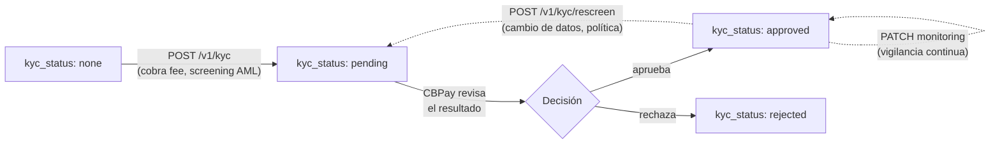

CBPay integra la verificación de identidad como servicio — **KYC** para
personas y **KYB** para empresas — con screening AML incluido: envías la
identidad de la cuenta y recibes el resultado del análisis. El estado de
verificación de la cuenta
(`kyc_status`) lo resuelve CBPay tras revisar el resultado.



<Note>
Si CBPay configuró una comisión de compliance, se debita **antes** de
la llamada (verás `compliance_fee` en la respuesta) y se **reembolsa
automáticamente** si el screening falla. Con comisión 0 el servicio es
gratuito para ti.
</Note>

## Enviar el screening

Un solo endpoint para persona y empresa; el tipo se detecta del payload:

<CodeGroup>

```bash Persona (KYC)
curl -X POST https://api.qbank.cl/platform/v1/kyc \
  -H "Authorization: Bearer <token>" \
  -H "Content-Type: application/json" \
  -d '{
    "customer": {
      "person": {
        "full_name": "Ana Pérez Rojas",
        "date_of_birth": "1990-04-12",
        "personal_identification": [
          { "type": "national_id", "issuing_country": "CL", "number": "12.345.678-5" }
        ]
      },
      "email": "ana@ejemplo.com",
      "country": "CL"
    },
    "monitor": false
  }'
```

```bash Empresa (KYB)
curl -X POST https://api.qbank.cl/platform/v1/kyc \
  -H "Authorization: Bearer <token>" \
  -H "Content-Type: application/json" \
  -d '{
    "customer": {
      "company": {
        "legal_name": "Comercial Andina SpA",
        "tax_id": "76.543.210-8"
      },
      "email": "legal@andina.cl",
      "country": "CL"
    },
    "monitor": true
  }'
```

```bash Mínimo (autocompletado)
curl -X POST https://api.qbank.cl/platform/v1/kyc \
  -H "Authorization: Bearer <token>" \
  -H "Content-Type: application/json" \
  -d '{ "customer": {}, "monitor": false }'
```

</CodeGroup>

Si omites `person`/`company`, se completa con los datos de tu cuenta (el
tipo persona/empresa se toma del tipo de la cuenta).

## Envía toda la identidad que tengas (recomendado)

Los ejemplos de arriba son el mínimo. El objeto `customer` acepta **muchos
más campos, todos opcionales**, y se reenvían íntegros al motor de
screening: **mientras más datos de identidad envíes, más preciso es el
análisis** — la fecha de nacimiento, los países y los documentos fuertes
descartan homónimos y reducen falsos positivos, así que conviene mandar
todo lo que tengas del cliente.

Campos de identidad que afinan el matching:

| Campo (persona) | Qué es |
|---|---|
| `full_name` — o `first_name` / `middle_name` / `last_name` | Nombre completo o por partes |
| `date_of_birth` | `"YYYY-MM-DD"` u objeto `{ "year": 1990, "month": 4, "day": 12 }` |
| `nationality` / `nationalities` | Nacionalidad(es), ISO-3166 |
| `country_of_birth` | País de nacimiento |
| `residential_information[]` | Domicilios, cada uno con `country_of_residence` |
| `personal_identification[]` | Documentos fuertes: `{ "type", "issuing_country", "number" }` (cédula, pasaporte, RUT…) |
| `alias` / `aliases` | Otros nombres conocidos |

| Campo (empresa) | Qué es |
|---|---|
| `legal_name` | Razón social |
| `alias[]` | Nombres comerciales / de fantasía |
| `tax_id` / `registration_number` | Identificadores tributarios/mercantiles |
| `registration_authority_identification` | Número ante el registro mercantil |
| `place_of_registration` / `country_of_incorporation` | País de registro/constitución |
| `incorporation_date` | Fecha de constitución |
| `address[]` | Domicilios, cada uno con `country` |

Ejemplo de KYC de persona con identidad completa:

```bash
curl -X POST https://api.qbank.cl/platform/v1/kyc \
  -H "Authorization: Bearer <token>" \
  -H "Content-Type: application/json" \
  -d '{
    "customer": {
      "person": {
        "full_name": "Ana Pérez Rojas",
        "date_of_birth": "1990-04-12",
        "nationality": "CL",
        "country_of_birth": "CL",
        "residential_information": [
          { "country_of_residence": "CL" }
        ],
        "personal_identification": [
          { "type": "national_id", "issuing_country": "CL", "number": "12.345.678-5" },
          { "type": "passport", "issuing_country": "CL", "number": "P0123456" }
        ]
      },
      "email": "ana@ejemplo.com",
      "country": "CL"
    },
    "monitor": false
  }'
```

Y de KYB de empresa:

```bash
curl -X POST https://api.qbank.cl/platform/v1/kyc \
  -H "Authorization: Bearer <token>" \
  -H "Content-Type: application/json" \
  -d '{
    "customer": {
      "company": {
        "legal_name": "Comercial Andina SpA",
        "alias": ["Andina Market"],
        "tax_id": "76.543.210-8",
        "registration_authority_identification": "76543210",
        "place_of_registration": "CL",
        "incorporation_date": "2015-08-01",
        "address": [{ "country": "CL" }]
      },
      "email": "legal@andina.cl",
      "country": "CL"
    },
    "monitor": true
  }'
```

<Note>
Una consulta con **exactamente los mismos datos de identidad** reutiliza el
screening anterior (no se cobra uno nuevo). Agregar o cambiar campos de
identidad (nombre, fecha, país, documento, alias) hace la búsqueda más
específica y ejecuta — y cobra — un screening nuevo. Los campos cosméticos
(email, teléfono, dirección textual) no cambian el matching.
</Note>

Respuesta `201` — persona y empresa devuelven la misma forma; cambia
`compliance_service` (`compliance_person` vs `compliance_company`, cada uno
con su comisión):

<CodeGroup>

```json Persona
{
  "customer_id": "cus_8f2e1a…",
  "status": "screened",
  "risk_level": "low",
  "screening_result": "no_match",
  "kyc_status": "pending",
  "compliance_service": "compliance_person",
  "compliance_fee": "0.500000"
}
```

```json Empresa
{
  "customer_id": "cus_5b7c33…",
  "status": "screened",
  "risk_level": "medium",
  "screening_result": "potential_match",
  "kyc_status": "pending",
  "compliance_service": "compliance_company",
  "compliance_fee": "1.000000"
}
```

</CodeGroup>

Tu cuenta queda con `kyc_status: pending` hasta que CBPay apruebe o rechace
la verificación.

## Rescreening

Re-ejecuta el análisis de la misma identidad (por ejemplo, ante un cambio de
datos o por política periódica). No lleva body — usa el `customer_id` de tu
screening anterior:

```bash
curl -X POST https://api.qbank.cl/platform/v1/kyc/rescreen \
  -H "Authorization: Bearer <token>"
```

Respuesta `200` (cobra `compliance_rescreen`, si está configurada):

```json
{
  "customer_id": "cus_8f2e1a…",
  "status": "screened",
  "risk_level": "low",
  "screening_result": "no_match",
  "compliance_service": "compliance_rescreen",
  "compliance_fee": "0.250000"
}
```

Requiere haber enviado un KYC/KYB antes; si no, `409 no_kyc`.

## Monitoreo continuo

Activa (o desactiva) la vigilancia permanente de la identidad — cambios en
listas, PEP, prensa adversa:

<CodeGroup>

```bash Activar (cobra compliance_monitoring)
curl -X PATCH https://api.qbank.cl/platform/v1/kyc/monitoring \
  -H "Authorization: Bearer <token>" \
  -H "Content-Type: application/json" \
  -d '{ "enabled": true }'
```

```bash Desactivar (siempre gratis)
curl -X PATCH https://api.qbank.cl/platform/v1/kyc/monitoring \
  -H "Authorization: Bearer <token>" \
  -H "Content-Type: application/json" \
  -d '{ "enabled": false }'
```

</CodeGroup>

Respuesta `200`:

```json
{
  "customer_id": "cus_8f2e1a…",
  "monitoring": true,
  "compliance_service": "compliance_monitoring",
  "compliance_fee": "0.100000"
}
```

Al desactivar, `compliance_fee` vuelve `"0.000000"` — desactivar es
siempre gratis.

## Errores

| HTTP | `error` | Causa |
|---|---|---|
| 402 | `insufficient_funds` | Saldo insuficiente para la comisión de compliance |
| 409 | `no_kyc` | Rescreen/monitoreo sin un KYC/KYB previo |
| 502 | `compliance_unavailable` | Servicio temporalmente no disponible (la comisión se reembolsó) |
