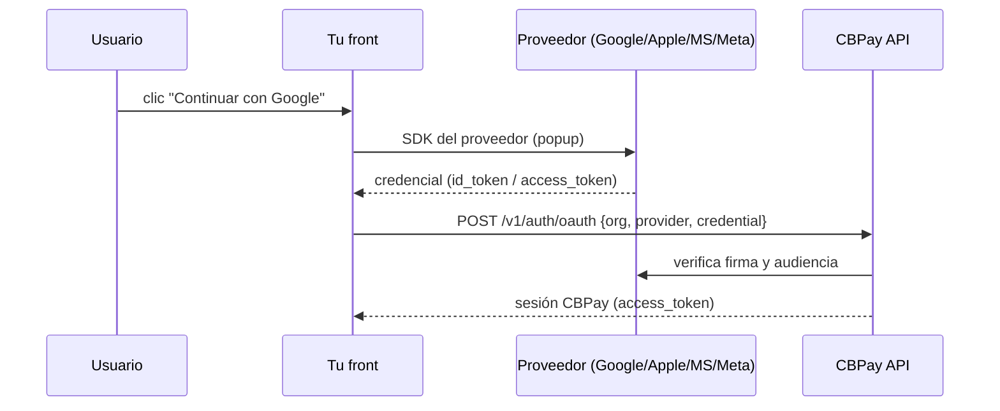
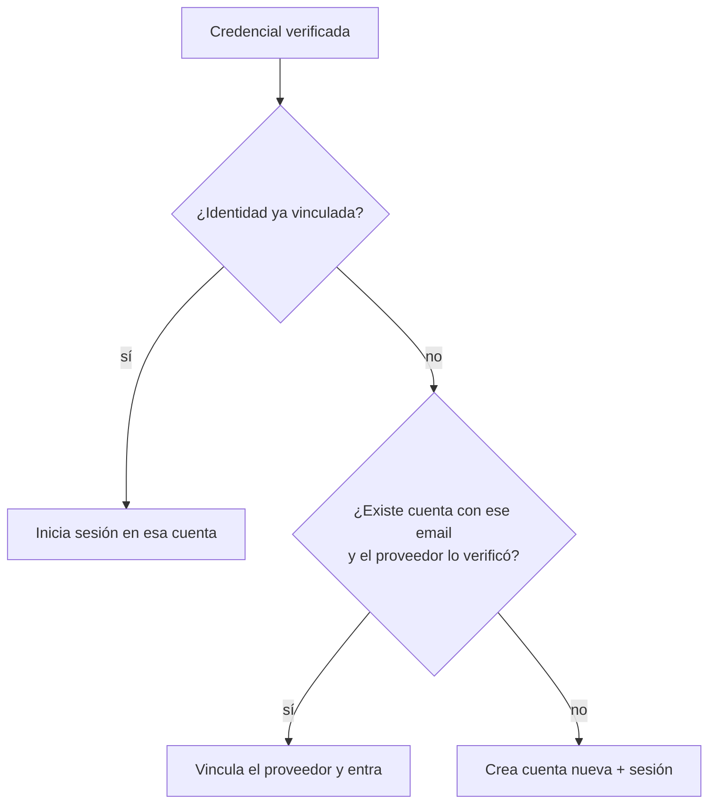

import { EnvUrls } from "/snippets/env-urls.jsx";

<EnvUrls lang="es" />

Tus usuarios pueden registrarse e iniciar sesión con **Google, Apple,
Microsoft o Facebook** — sin crear ni recordar contraseñas. CBPay usa el
modelo **token exchange**: el botón "Continuar con…" vive en tu front, el
usuario aprueba en el proveedor, tu front recibe una credencial y te la pasa
a la API; CBPay la **verifica criptográficamente** y te devuelve la sesión.



<Note>
El login social lo habilita tu operador (organización) y **cada
organización usa sus propias apps** de Google/Apple/Microsoft/Meta, así el
usuario ve TU marca en la pantalla de consentimiento. Consulta qué
proveedores están activos con `GET /v1/auth/oauth/providers`.
</Note>

## 1. Descubre los proveedores habilitados

Para pintar los botones correctos, tu front pregunta qué proveedores están
activos y con qué `client_id`:

```bash
curl "https://api.qbank.cl/platform/v1/auth/oauth/providers?org=cbpay"
```

```json
{
  "providers": [
    { "provider": "google", "client_id": "1234567890-abc.apps.googleusercontent.com" },
    { "provider": "apple", "client_id": "com.tuempresa.cbpay.web" }
  ]
}
```

Es un endpoint público (no requiere token): el `client_id` no es secreto.

## 2. Obtén la credencial en tu front

Cada proveedor entrega una credencial con su propio SDK. Ejemplos mínimos:

<Tabs>
<Tab title="Google">

Con [Google Identity Services](https://developers.google.com/identity/gsi/web):

```html
<script src="https://accounts.google.com/gsi/client" async></script>
<div id="g_id_onload"
     data-client_id="TU_CLIENT_ID"
     data-callback="onGoogle"></div>
<div class="g_id_signin"></div>
<script>
function onGoogle(response) {
  // response.credential es el id_token (JWT) que envías a CBPay
  fetch("https://api.qbank.cl/platform/v1/auth/oauth", {
    method: "POST",
    headers: { "Content-Type": "application/json" },
    body: JSON.stringify({
      org: "cbpay", provider: "google", credential: response.credential
    })
  });
}
</script>
```

</Tab>
<Tab title="Apple">

Con [Sign in with Apple JS](https://developer.apple.com/documentation/sign_in_with_apple/sign_in_with_apple_js):
el objeto de respuesta trae `authorization.id_token`, que es lo que envías
como `credential`.

```js
const data = await AppleID.auth.signIn();
await fetch("https://api.qbank.cl/platform/v1/auth/oauth", {
  method: "POST",
  headers: { "Content-Type": "application/json" },
  body: JSON.stringify({
    org: "cbpay", provider: "apple", credential: data.authorization.id_token
  })
});
```

Apple entrega el nombre del usuario **solo la primera vez**; guárdalo en tu
front si lo necesitas. El email puede ser un alias de relay privado
(`...@privaterelay.appleid.com`) — es válido y estable.

</Tab>
<Tab title="Microsoft">

Con [MSAL.js](https://learn.microsoft.com/entra/identity-platform/msal-overview):
tras `loginPopup`, el `idToken` del resultado es la credencial.

```js
const result = await msalInstance.loginPopup({ scopes: ["openid", "email", "profile"] });
await fetch("https://api.qbank.cl/platform/v1/auth/oauth", {
  method: "POST",
  headers: { "Content-Type": "application/json" },
  body: JSON.stringify({
    org: "cbpay", provider: "microsoft", credential: result.idToken
  })
});
```

</Tab>
<Tab title="Meta (Facebook)">

Con el [Facebook Login SDK](https://developers.facebook.com/docs/facebook-login/web):
Facebook no es OIDC, así que envías el **access_token** de la sesión.

```js
FB.login(function(response) {
  if (response.authResponse) {
    fetch("https://api.qbank.cl/platform/v1/auth/oauth", {
      method: "POST",
      headers: { "Content-Type": "application/json" },
      body: JSON.stringify({
        org: "cbpay", provider: "facebook",
        credential: response.authResponse.accessToken
      })
    });
  }
}, { scope: "email" });
```

</Tab>
</Tabs>

## 3. Intercambia la credencial por una sesión

```bash
curl -X POST https://api.qbank.cl/platform/v1/auth/oauth \
  -H "Content-Type: application/json" \
  -d '{
    "org": "cbpay",
    "provider": "google",
    "credential": "eyJhbGciOiJSUzI1Ni…",
    "type": "person"
  }'
```

**Usuario nuevo** → se crea la cuenta y devuelve `201`:

```json
{
  "account": { "id": "9b1deb4d-…", "type": "person", "email": "ana@gmail.com", "display_name": "Ana" },
  "access_token": "eyJhbGciOiJIUzI1Ni…",
  "expires_at": "2026-07-09T21:00:00Z",
  "created": true
}
```

**Usuario que ya existe** → inicia sesión y devuelve `200` con
`access_token`, `account_id` y `role` (igual que el login por contraseña).

El campo `type` (`person` | `company`, default `person`) solo se usa al
crear la cuenta; se ignora si ya existe.

### Cómo se decide crear vs. entrar



## 4. Login social y 2FA

Si la cuenta tiene **OTP activo en el login**
([seguridad y 2FA](/es/seguridad-2fa)), el login social respeta ese segundo
paso: en vez de la sesión, `POST /v1/auth/oauth` devuelve
`otp_required: true` + `pending_token`, y completas con
`POST /v1/auth/login/otp` igual que en el login por contraseña.

## 5. Vincular y desvincular proveedores

Un usuario en sesión puede administrar sus métodos de acceso:

```bash
# Ver proveedores vinculados
curl https://api.qbank.cl/platform/v1/me/identities \
  -H "Authorization: Bearer <token>"

# Vincular otro proveedor (con una credencial fresca de ese proveedor)
curl -X POST https://api.qbank.cl/platform/v1/me/identities \
  -H "Authorization: Bearer <token>" \
  -H "Content-Type: application/json" \
  -d '{ "provider": "apple", "credential": "eyJhbGci…" }'

# Desvincular
curl -X DELETE https://api.qbank.cl/platform/v1/me/identities/apple \
  -H "Authorization: Bearer <token>"
```

No puedes desvincular tu **único** método de acceso: si la cuenta no tiene
contraseña y ese proveedor es el único vinculado, la API responde
`409 last_login_method` (primero define una contraseña o vincula otro
proveedor).

## Errores

| HTTP | `error` | Qué significa |
|---|---|---|
| 400 | `invalid_provider` | Proveedor fuera de `google/apple/microsoft/facebook` |
| 400 | `provider_not_configured` | Tu organización no tiene ese proveedor habilitado |
| 401 | `invalid_credential` | La credencial es inválida, expiró o es de otra app |
| 409 | `email_conflict` | Ya existe una cuenta con ese email; entra con tu método actual y vincula el proveedor desde la sesión |
| 409 | `identity_taken` | Ese proveedor ya está vinculado a otra cuenta |
| 409 | `last_login_method` | No puedes desvincular tu único método de acceso |

## FAQ

<AccordionGroup>
  <Accordion title="¿Necesito manejar redirects u OAuth callbacks?">
    No. El flujo de consentimiento ocurre en tu front con el SDK del
    proveedor; a CBPay solo le mandas la credencial resultante. No hay
    páginas de callback ni estado en el servidor.
  </Accordion>
  <Accordion title="¿Un usuario puede tener contraseña Y login social?">
    Sí. Puede registrarse con email/contraseña y luego vincular Google, o
    al revés. Todos los métodos apuntan a la misma cuenta mientras el email
    coincida y esté verificado.
  </Accordion>
  <Accordion title="¿Qué pasa si el proveedor no entrega email verificado?">
    No se vincula automáticamente por email (evita que alguien reclame el
    email de otro). Se crea una cuenta independiente ligada a esa identidad;
    el usuario puede añadir email/contraseña después.
  </Accordion>
  <Accordion title="¿La credencial del proveedor sirve como token de CBPay?">
    No. La credencial del proveedor solo se usa una vez para verificarte;
    todas las llamadas siguientes usan el `access_token` de CBPay.
  </Accordion>
</AccordionGroup>
