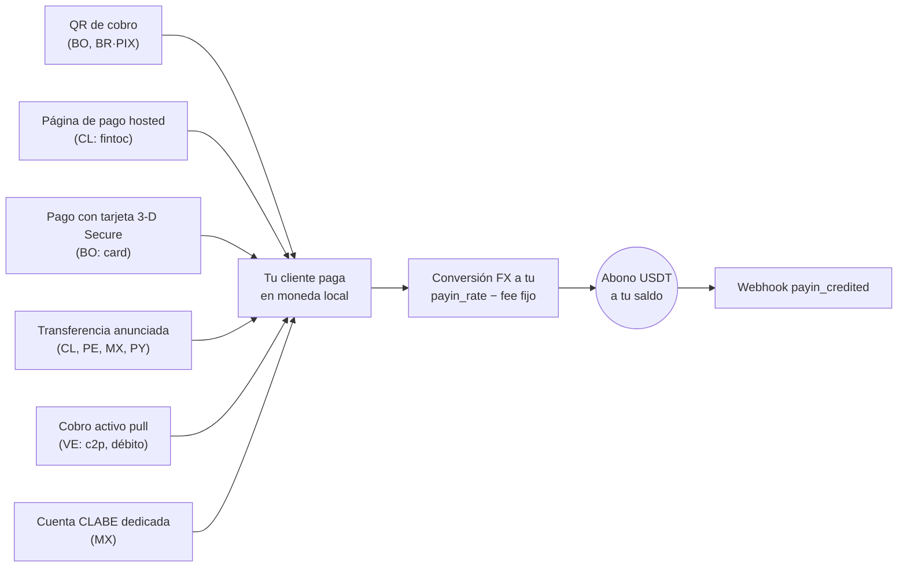
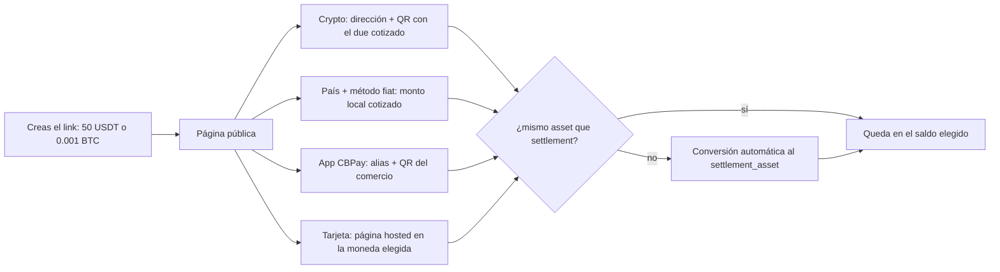

Un payin es un cobro fiat: tu cliente paga en moneda local y tu cuenta
recibe el abono en USDT automáticamente, convertido a **tu tasa de payin**
(`payin_rate` en `GET /v1/rates`) menos la comisión fija de payin si tu
cuenta la tiene configurada.

Sea cual sea la modalidad, todos los caminos terminan igual — abono
automático + webhook:



## 1. Descubre los corredores disponibles

Los países, monedas y modalidades disponibles los define CBPay.
Consúltalos siempre por catálogo:

```bash
curl https://api.qbank.cl/platform/v1/payins/methods \
  -H "Authorization: Bearer <token>"
```

```json
{
  "items": [
    { "country": "BO", "currency": "BOB", "method": "qr", "delivery": "push" },
    { "country": "VE", "currency": "VES", "method": "c2p", "delivery": "push+polling" },
    { "country": "MX", "currency": "MXN", "method": "bank_transfer", "delivery": "push" }
  ],
  "meta": { "retrieved": 3 }
}
```

`delivery` indica cómo se confirma el pago del lado de CBPay (notificación
del banco, sondeo o ambos) — no cambia nada en tu integración: tú siempre
recibes el webhook `payin_credited`.

Corredores y modalidades de cobro:

| País | Moneda | Modalidades |
|---|---|---|
| Chile | CLP | Página de pago hosted (`fintoc`), transferencia anunciada |
| Perú | PEN | Transferencia anunciada |
| México | MXN | Cuenta CLABE dedicada, transferencia anunciada |
| Venezuela | VES | Cobro activo `c2p` y `debito_inmediato` (pull) |
| Bolivia | BOB / USD | QR de cobro, página de pago con tarjeta (`card`) |
| Paraguay | PYG | Transferencia anunciada |
| Brasil | BRL | QR PIX dinámico |

La disponibilidad puede variar; el catálogo (`GET /v1/payins/methods`) es
siempre la fuente de verdad. En todos los casos el abono llega igual: se
convierte a USDT a tu `payin_rate` del momento y se acredita neto de la
comisión fija de payin.

## 2. Elige la modalidad y crea el cobro

Cada país tiene su propia modalidad de cobro. El request y la respuesta
real de cada una:

<Tabs>
<Tab title="Chile">

**Página de pago hosted (`fintoc`)** — recomendado: recibes una
`payment_url`; el pagador la abre y transfiere desde **cualquier banco o
billetera chilena** (Banco Estado, Santander, Mach, Tenpo, Mercado
Pago…). El pago se detecta y valida automáticamente — sin referencias
manuales.

```bash
curl -X POST https://api.qbank.cl/platform/v1/payins \
  -H "Authorization: Bearer <token>" \
  -H "Content-Type: application/json" \
  -d '{
    "country": "CL",
    "currency": "CLP",
    "method": "fintoc",
    "amount": "150000",
    "description": "Recarga pedido 8841",
    "idempotency_key": "topup-8841"
  }'
```

Respuesta `201`:

```json
{
  "payin_id": "7a2b…",
  "status": "pending",
  "reference": "7a2b…",
  "payment_url": "https://pay.fintoc.com/plink_K2zwNNSxPyx8w3GZ",
  "expires_at": "2026-07-08T18:48:25Z",
  "note": "share the payment_url with the payer; the deposit is credited automatically once the transfer is detected"
}
```

Comparte la `payment_url` con el pagador (link, redirección o WebView).
Cuando el pago se confirma, tu cuenta se acredita en USDT y recibes el
webhook `payin_credited`. El monto CLP debe ser entero (el peso chileno no
usa decimales) y la sesión de pago vence en 24 horas por defecto. Un retry
con la misma `idempotency_key` devuelve el mismo payin y la misma URL —
nunca abre una segunda sesión de pago.

**Transferencia anunciada** (alternativa manual): anuncias el depósito
entrante y compartes la referencia con quien transfiere.

```bash
curl -X POST https://api.qbank.cl/platform/v1/payins \
  -H "Authorization: Bearer <token>" \
  -H "Content-Type: application/json" \
  -d '{
    "country": "CL",
    "currency": "CLP",
    "method": "bank_transfer",
    "amount": "500000"
  }'
```

Respuesta `201`:

```json
{
  "payin_id": "4f81…",
  "status": "pending",
  "reference": "CBJ6T3W9M2K5",
  "note": "include the reference in the transfer description so the deposit is credited automatically"
}
```

Cuando la transferencia llega, se matchea por la referencia en la glosa (o
por monto+moneda como respaldo) y tu cuenta se acredita automáticamente.

</Tab>
<Tab title="Perú">

**Transferencia anunciada**, igual que Chile pero en soles:

```bash
curl -X POST https://api.qbank.cl/platform/v1/payins \
  -H "Authorization: Bearer <token>" \
  -H "Content-Type: application/json" \
  -d '{
    "country": "PE",
    "currency": "PEN",
    "method": "bank_transfer",
    "amount": "1800.00"
  }'
```

Respuesta `201`:

```json
{
  "payin_id": "6d20…",
  "status": "pending",
  "reference": "CBK7M2Q9X4T3",
  "note": "include the reference in the transfer description so the deposit is credited automatically"
}
```

La `reference` es un **código corto de 12 caracteres alfanuméricos** (cabe
en cualquier concepto bancario) y debe viajar en la descripción de la
transferencia para el match automático; como respaldo también se matchea
por monto+moneda.

</Tab>
<Tab title="México">

**Cuenta CLABE dedicada** (recomendado): creas una CLABE fija vinculada a
tu cuenta — todo SPEI que llegue a ella se acredita automáticamente, sin
referencias:

```bash
curl -X POST https://api.qbank.cl/platform/v1/payins/deposit-accounts \
  -H "Authorization: Bearer <token>" \
  -H "Content-Type: application/json" \
  -d '{ "country": "MX", "currency": "MXN" }'
```

Respuesta `201`:

```json
{
  "instrument_id": "a1d4…",
  "account_id": "…",
  "country": "MX",
  "currency": "MXN",
  "method": "bank_transfer",
  "instrument": "734180000151000006",
  "status": "active"
}
```

`instrument` es la CLABE que compartes con tus pagadores. La creación es
gratis; cada depósito paga la comisión de payin normal. Lista tus cuentas
con `GET /v1/payins/deposit-accounts`.

También puedes usar la **transferencia anunciada** puntual
(`POST /v1/payins` con `method: "bank_transfer"`, `country: "MX"`).

</Tab>
<Tab title="Venezuela">

**Cobro activo (pull)**: cobras directamente al pagador con su
autorización. El resultado es **síncrono** — si el cobro se aprueba, el
abono se acredita en la misma llamada.

Para `debito_inmediato`, primero solicita el OTP (gratis):

```bash
curl -X POST https://api.qbank.cl/platform/v1/payins/collect/otp \
  -H "Authorization: Bearer <token>" \
  -H "Content-Type: application/json" \
  -d '{
    "method": "debito_inmediato",
    "amount": "1200.00",
    "payer_document": "V12345678",
    "payer_phone": "04141234567",
    "payer_bank": "0102",
    "payer_account": "01020123456789012345"
  }'
```

```json
{
  "method": "debito_inmediato",
  "result": { "status": "sent", "otp_reference": "OTP-5521" }
}
```

Luego ejecuta el cobro:

<CodeGroup>

```bash c2p (teléfono + cédula + OTP del pagador)
curl -X POST https://api.qbank.cl/platform/v1/payins/collect \
  -H "Authorization: Bearer <token>" \
  -H "Content-Type: application/json" \
  -d '{
    "method": "c2p",
    "amount": "1200.00",
    "description": "Cobro pedido 5512",
    "payer_document": "V12345678",
    "payer_phone": "04141234567",
    "payer_bank": "0102",
    "otp": "12345678",
    "idempotency_key": "cobro-5512"
  }'
```

```bash debito_inmediato (cuenta + OTP solicitado antes)
curl -X POST https://api.qbank.cl/platform/v1/payins/collect \
  -H "Authorization: Bearer <token>" \
  -H "Content-Type: application/json" \
  -d '{
    "method": "debito_inmediato",
    "amount": "1200.00",
    "description": "Cobro pedido 5512",
    "payer_document": "V12345678",
    "payer_account": "01020123456789012345",
    "payer_bank": "0102",
    "payer_account_type": "CNTA",
    "otp": "87654321",
    "otp_reference": "OTP-5521",
    "idempotency_key": "cobro-5512"
  }'
```

<Note>
El cobro activo ejecuta un débito real contra el pagador, así que
`idempotency_key` es **obligatoria** (body o header `Idempotency-Key`): un
reintento con la misma clave devuelve el resultado original con
`idempotency_hit` y nunca vuelve a cobrar.
</Note>

</CodeGroup>

Respuesta `200` (cobro aprobado y acreditado):

```json
{
  "payin_id": "7b3c…",
  "kind": "collect",
  "method": "c2p",
  "status": "credited",
  "local_amount": "1200.00",
  "fx_rate": "36.50",
  "usdt_gross": "32.876712",
  "fee": "0.300000",
  "usdt_credited": "32.576712",
  "paid": true,
  "provider_reference": "…"
}
```

Si el pagador rechaza o falla la autorización, `paid` es `false`, el payin
queda `failed` y no se cobra nada. La causa exacta del rechazo queda
persistida en el payin y se expone en el objeto `failure` (en la respuesta
síncrona, en `GET /v1/payins/{payin_id}` y en el replay idempotente):

```json
{
  "payin_id": "7b3c…",
  "kind": "collect",
  "method": "c2p",
  "status": "failed",
  "paid": false,
  "failure": {
    "source": "provider",
    "code": "provider_rejected",
    "message": "Documento de identidad del receptor errado"
  }
}
```

- `source` indica dónde se originó el rechazo (`provider` = el banco del
  pagador rechazó; `core` = la validación previa al cobro).
- `code` y `message` traen el motivo concreto (OTP inválida o expirada,
  documento errado, fondos insuficientes del pagador, etc.), útil para
  mostrarle al pagador qué corregir antes de reintentar con una clave
  de idempotencia nueva.

</Tab>
<Tab title="Bolivia">

**QR de cobro** (estándar interoperable local): generas el QR y tu cliente
lo escanea con su app bancaria.

```bash
curl -X POST https://api.qbank.cl/platform/v1/payins \
  -H "Authorization: Bearer <token>" \
  -H "Content-Type: application/json" \
  -d '{
    "country": "BO",
    "currency": "BOB",
    "method": "qr",
    "amount": "700.00",
    "description": "Recarga app",
    "expires_in": 3600
  }'
```

Respuesta `201`:

```json
{
  "payin_id": "9c2a…",
  "status": "pending",
  "charge": {
    "charge_id": "…",
    "qr_image": "<base64>",
    "qr_image_url": "https://cdn.cbpayapp.com/public/payin-qr/<charge_id>.png",
    "qr_payload": "<contenido del QR>",
    "our_reference": "482915073",
    "status": "pending"
  }
}
```

Muestra el QR a tu cliente — `qr_image_url` es una URL pública de CDN lista
para un `` (prefiérela por sobre el base64 `qr_image`); cuando paga, tu
cuenta se acredita automáticamente. También funciona en USD
(`currency: "USD"`).

**Página de pago con tarjeta (`card`)**: recibes una `payment_url` de un
checkout hosted con 3-D Secure — el pagador ingresa su tarjeta en una página
segura con la marca de tu organización y, si su banco lo exige, completa el
desafío de autenticación ahí mismo. Los datos de la tarjeta nunca pasan por
tu sistema ni por tu integración.

```bash
curl -X POST https://api.qbank.cl/platform/v1/payins \
  -H "Authorization: Bearer <token>" \
  -H "Content-Type: application/json" \
  -d '{
    "country": "BO",
    "currency": "BOB",
    "method": "card",
    "amount": "700.00",
    "description": "Recarga app",
    "customer": { "email": "pagador@ejemplo.com", "first_name": "Ana", "last_name": "Rojas" },
    "success_url": "https://tu-app.com/pago/ok",
    "failure_url": "https://tu-app.com/pago/error",
    "idempotency_key": "recarga-7719"
  }'
```

Respuesta `201`:

```json
{
  "payin_id": "b41c…",
  "status": "pending",
  "reference": "b41c…",
  "payment_url": "https://api.qbank.cl/pay/cards/9f3XkT…",
  "expires_at": "2026-07-16T18:30:00Z",
  "note": "share the payment_url with the payer; the balance is credited automatically once the card payment is approved"
}
```

Comparte la `payment_url` (link, redirección o WebView). Detalles del flujo:

- `customer` es un prefill **opcional** de los datos de facturación
  (`email`, `first_name`, `last_name`, `address`, `city`, `country` —
  texto plano, máx 120 caracteres por campo); el pagador puede
  completarlos/corregirlos en la página.
- `success_url` / `failure_url` (opcionales, https públicas) redirigen al
  pagador al terminar; sin ellas la página muestra el resultado final.
- `expires_at` (opcional, RFC3339, mínimo 15 minutos) acorta la vigencia de
  la sesión; el default es 24 horas. Si vence sin pago, el payin pasa a
  `expired` y recibes el webhook `payin_expired`.
- El pagador tiene un número limitado de intentos; un rechazo del emisor le
  permite reintentar con otra tarjeta dentro de la misma sesión.
- La aprobación es en línea: al aprobarse el cargo tu cuenta se acredita en
  USDT a tu `payin_rate` y recibes `payin_credited` — igual que cualquier
  otra modalidad.
- Un retry con la misma `idempotency_key` devuelve el mismo payin y la misma
  `payment_url`; nunca abre una segunda sesión de pago.
- Funciona también en USD (`currency: "USD"`).

</Tab>
<Tab title="Paraguay">

**Transferencia anunciada** en guaraníes: anuncias el depósito, tu pagador
transfiere (SIPAP interbancaria o transferencia interna del banco receptor)
con la referencia en el concepto, y el abono se detecta automáticamente.

```bash
curl -X POST https://api.qbank.cl/platform/v1/payins \
  -H "Authorization: Bearer <token>" \
  -H "Content-Type: application/json" \
  -d '{
    "country": "PY",
    "currency": "PYG",
    "method": "bank_transfer",
    "amount": "596000"
  }'
```

Respuesta `201`:

```json
{
  "payin_id": "8f41…",
  "status": "pending",
  "reference": "CBW4N8R2T6P9",
  "note": "include the reference in the transfer description so the deposit is credited automatically"
}
```

<Note>
Los guaraníes no usan decimales: anuncia el monto **entero exacto** que
transferirá tu pagador (ej. `"596000"`). La `reference` es un código corto
de 12 caracteres alfanuméricos — diseñado para el concepto SIPAP, que
acepta **máximo 20 caracteres sin caracteres especiales** — y ponerla en
el concepto asegura el match automático; como respaldo también se matchea
por monto+moneda.
</Note>

</Tab>
<Tab title="Brasil">

**QR PIX dinámico**: el mismo endpoint genera un QR PIX con el monto
embebido.

```bash
curl -X POST https://api.qbank.cl/platform/v1/payins \
  -H "Authorization: Bearer <token>" \
  -H "Content-Type: application/json" \
  -d '{
    "country": "BR",
    "currency": "BRL",
    "method": "qr",
    "amount": "120.00",
    "description": "Pedido 7719",
    "expires_in": 1800
  }'
```

En la respuesta, `charge.qr_payload` es el código **"copia e cola"** de
PIX, para que el pagador pueda pegarlo en su app bancaria si no escanea la
imagen (`charge.qr_image` base64 o `charge.qr_image_url`, la URL pública de
CDN). El QR expira según `expires_in` (default 1
hora); el pago se acredita automáticamente al confirmarse en el rail
(conciliación continua — consulta puntual con `GET /v1/payins/{charge_id}`).

<Note>
En Brasil el cobro es únicamente por QR PIX dinámico (un QR = un pago, con
monto exacto embebido). La transferencia anunciada llegará más adelante.
</Note>

</Tab>
</Tabs>

## Link de cobro universal (`checkout`)

Crea un **link de cobro universal**: un solo `POST /v1/payins` con
`method: "checkout"` devuelve una URL pública brandeada donde el pagador
elige cómo pagar. El cobro se denomina en el **saldo virtual que tú
elijas** (`settlement_asset`: `USDT`, `USDC`, `BTC` o `GOLD`, default
`USDT`) y todo pago se convierte **automáticamente** a ese saldo al
acreditarse — salvo que te paguen en el mismo asset, ahí no hay
conversión.

La página organiza el pago en **cuatro pestañas**:

- **CBPay** — pago directo con la app: el alias y el QR del comercio;
  quien escanea con la app paga al instante por transferencia interna,
  en cualquiera de los 4 saldos.
- **Crypto** — las monedas disponibles agrupadas por red (hoy USDT en
  TRON y Ethereum, USDC en Ethereum y BTC; redes nuevas aparecen solas
  al habilitarse), cada una con una dirección de depósito exclusiva de
  ese cobro y **QR escaneable** por wallets externas (Trust Wallet,
  MetaMask, Binance y similares).
- **Fiat** — el pagador elige su país entre **todos los que tienen
  corredor de payin vivo** y ve los métodos disponibles (QR,
  transferencia bancaria, pago hosted) con el monto local cotizado al
  momento.
- **Tarjeta** — pago con tarjeta de crédito o débito en una página
  segura, listado **por moneda de cargo** (hoy BOB y USD; monedas de
  adquirentes futuros aparecen solas). Cada moneda es una opción de pago
  independiente con su propio monto cotizado.



```bash
curl -X POST https://api.qbank.cl/platform/v1/payins \
  -H "Authorization: Bearer <token>" \
  -H "Content-Type: application/json" \
  -d '{
    "method": "checkout",
    "amount": "50",
    "settlement_asset": "USDT",
    "description": "Pedido 8841",
    "country": "CL",
    "success_url": "https://tu-app.com/pago/ok",
    "failure_url": "https://tu-app.com/pago/error",
    "expires_in": 86400,
    "idempotency_key": "orden-8841"
  }'
```

- `amount` se denomina **en el `settlement_asset`**: `"50"` con `USDT` son
  50 USDT; `"0.001"` con `BTC` son 0.001 BTC; `"2"` con `GOLD` son 2
  gramos de oro. No envíes `currency` — es el contrato viejo y responde
  `400` (el cobro ya no se ata a una moneda local).
- `country` es **opcional** y solo preselecciona el país en la página; el
  pagador puede cambiarlo.
- `GOLD` no tiene riel de pago propio: el cobro se alcanza siempre por
  conversión automática desde lo que pague el cliente.

Respuesta `201`:

```json
{
  "payin_id": "d0135ed5-8e9c-4f8b-a522-8ec100470426",
  "kind": "checkout",
  "status": "pending",
  "settlement_asset": "USDT",
  "asset_amount": "50",
  "country": "CL",
  "description": "Pedido 8841",
  "reference": "CB68JZCT46QE",
  "checkout_url": "https://api.qbank.cl/platform/pay/fc4981b8e7c7…",
  "expires_at": "2026-07-17T17:57:44Z",
  "receipt_url": "https://api.qbank.cl/platform/v1/payins/d0135ed5-…/receipt"
}
```

Comparte la `checkout_url` (link, correo, WhatsApp, QR impreso). La página
no exige login, lleva el branding de tu organización y se actualiza sola:
cuando el pago se confirma por cualquiera de los métodos, muestra "pagado"
y redirige a tu `success_url` si la configuraste.

### Cómo paga cada rail

- **Fiat multi-país**: el pagador elige país y método; el monto local se
  cotiza al momento (meta → USD → moneda local con tu `payin_rate` del
  corredor, redondeado hacia arriba) y queda **congelado** al elegir el
  método. El abono acredita con la conversión y comisiones normales de
  payin y después se convierte al `settlement_asset`. Un pago anunciado
  MENOR a la cotización congelada se acredita igual (la plata es real)
  pero **no** marca el link como pagado. Si un país ofrece el mismo
  método en **varias monedas** (ej. Bolivia con QR en BOB y en USD), la
  página lista cada moneda como opción independiente. En transferencias
  bancarias en México el link genera una **CLABE dedicada y exclusiva de
  ese cobro**: el pagador transfiere el monto exacto **sin poner
  referencia** — el abono se detecta y liquida automático porque la
  cuenta identifica al link. Si la cuenta dedicada no puede emitirse en
  ese momento, la página degrada al camino clásico (cuenta general del
  comercio + referencia obligatoria en la glosa).
- **Cobros pull (Venezuela)**: `c2p` y `debito_inmediato` cobran directo
  en la cuenta del pagador. La página le pide banco, documento, teléfono
  (C2P) o cuenta (débito inmediato) y la clave OTP — generada en su app
  bancaria para C2P, o enviada a demanda para débito inmediato (botón
  "Solicitar clave"). El monto SIEMPRE es el congelado en la cotización;
  si el rail confirma síncrono, el link queda pagado al instante. Un
  rechazo no mata el link: el pagador corrige los datos o elige otro
  método.
- **Tarjeta (multi-moneda)**: la pestaña lista cada moneda de cargo
  disponible con su monto cotizado; al elegir una se abre la página de
  pago hosted en esa moneda. Cada moneda es una materialización
  independiente (puedes cotizar en BOB y en USD sobre el mismo link; paga
  la primera que complete).
- **Crypto (wallet por cobro)**: al elegir una moneda se genera una
  dirección exclusiva con su `qr_payload` y `qr_png_base64` — el QR lleva
  SIEMPRE la dirección cruda (BTC bech32, TRON base58, ETH hex) para máxima
  compatibilidad con wallets y exchanges (Binance y similares rechazan
  URIs BIP-21/EIP-681); el monto exacto se muestra al lado con botón
  copiar. Si el asset pagado difiere del `settlement_asset`,
  el due cotizado **ya incluye la conversión** (la cubre el pagador; tú
  recibes tu meta exacta). Los pagos parciales se acumulan y la página
  muestra cuánto falta. Cotizaciones con BTC/GOLD se refrescan cada 15
  minutos.
- **App CBPay**: el QR del comercio embebe el link
  (`cbpay:pay?to=…&checkout=…`). La app paga por transferencia interna en
  cualquiera de los 4 saldos: mismo asset ⇒ meta exacta; distinto ⇒ due
  con la conversión incluida. El monto se valida server-side contra una
  cotización fresca — si no cubre el cobro responde `422
  checkout_amount_mismatch` con el monto vigente. Integradores: `POST
  /v1/transfers` acepta el campo opcional `checkout_token` (o el QR
  extendido en `to_qr_token`); el destino se fuerza a la cuenta del link.

### Conversión automática al saldo elegido

Todo abono en un asset distinto al `settlement_asset` se convierte con el
motor de conversiones de tu cuenta (mismos spreads y límites que
`POST /v1/swaps`). El estado agregado viaja en `conversion_status`:

| `conversion_status` | Significado |
|---|---|
| _(ausente)_ | No hubo conversión (te pagaron en el mismo asset) |
| `done` | Todas las conversiones del link quedaron ejecutadas |
| `pending_retry` | Una conversión falló temporalmente (precio no disponible o límite); los fondos quedan en el asset recibido y se reintenta automático |

### Endpoints públicos del link (sin auth, rate-limited)

- `GET {checkout_url}/state` — estado del link: `status`, `paid_method`,
  `settlement_asset`, `asset_amount`, materializaciones fiat congeladas
  (`fiat_methods`), progreso crypto (`crypto` con `due`/`received`) y
  `conversion_status`.
- `GET {checkout_url}/quote` — cotizaciones ANTES de elegir: `countries`
  (catálogo por país; cada país lista sus corredores en `options[]` —
  una fila por método+moneda, con `collect: true` en los métodos pull),
  `cards` (opciones de tarjeta por país y moneda con su `local_amount`),
  `crypto` (due indicativo por par) y `cbpay` (alias + dues por asset).
  Con `?country=XX` agrega `country_quote` con el monto local por opción
  de ese país.
- `POST {checkout_url}/methods/{method}` — materializa la opción elegida.
  Métodos fiat exigen `?country=XX`; si el país ofrece el método en más
  de una moneda (tarjetas, QR BOB/USD en Bolivia) exige además
  `&currency=YYY`; crypto usa `crypto:<chain>:<asset>` (ej.
  `crypto:tron:usdt`) sin país. Los métodos pull devuelven el formulario
  del pagador (`banks[]`, `requires_otp_request`) con la cotización
  congelada. Re-POST de la misma combinación devuelve la MISMA
  materialización.
- `POST {checkout_url}/collect/otp` — solicita la clave OTP de un cobro
  pull cuando el rail la envía a demanda (`requires_otp_request: true`,
  ej. débito inmediato VE). Devuelve el `otp_reference` que acompaña al
  cobro final. Rate limit estricto (cada llamada es un SMS/push real).
- `POST {checkout_url}/collect` — ejecuta el cobro pull con los datos del
  pagador (banco, documento, teléfono o cuenta, OTP). El monto siempre es
  el congelado; si el rail confirma síncrono responde `paid: true` y el
  link queda liquidado en la misma llamada.

Útil si prefieres renderizar tu propia página de pago sobre el mismo
link.

### Reglas del link

- **Un link = un cobro**: el primer método que completa el pago gana; un
  pago posterior por otro rail no se acredita (elegir un método NO bloquea
  los demás mientras nadie pague).
- `expires_in` acepta de 600 a 604800 segundos (10 minutos a 7 días;
  default 24 horas). Al vencer sin pago el payin pasa a `expired` y
  recibes el webhook `payin_expired`.
- El retry con la misma `idempotency_key` devuelve el **mismo link** (la
  URL no cambia); jamás se abre un segundo cobro.
- El `settlement_asset` debe estar habilitado para tu organización; si
  está apagado la creación responde `422 settlement_asset_disabled`.

Cuando el cobro se paga recibes el `payin_credited` con `settled_via`
(ej. `crypto:tron:usdt`, `qr`, `cbpay`), `settlement_asset` y
`asset_amount`; los pagos crypto agregan `crypto_amount` y los pagos con
la app CBPay agregan `transfer_id`, `asset` y `amount`.

En `GET /v1/payins` y `GET /v1/payins/{payin_id}` los payins de checkout
llevan siempre su denominación — `settlement_asset` + `asset_amount` — en
todo estado (pendiente, vencido y abonado); `currency`/`local_amount`
quedan vacíos hasta que se usa un método de pago local. Un cobro
liquidado en crypto o vía la app CBPay expone su `usdt_credited` sin
`fx_rate` (no aplica cotización FX).

Errores propios del link (los ve quien abre la página):

| HTTP | `error` | Significado |
|---|---|---|
| 404 | `not_found` | Token inválido o link inexistente |
| 400 | `country_required` | Método fiat sin `?country=XX` |
| 400 | `currency_required` | El país ofrece el método en varias monedas; falta `?currency=YYY` |
| 409 | `already_paid` | El link ya se pagó por otro método |
| 410 | `checkout_expired` | El link venció sin pago |
| 422 | `method_unavailable` | Ese método no está disponible para este link o país |
| 422 | `country_unavailable` | Ese país no tiene métodos de pago disponibles |
| 422 | `checkout_amount_mismatch` | La transferencia CBPay no cubre el monto vigente del cobro |
| 422 | `collect_otp_failed` | El rail rechazó el envío de la clave OTP (revisar los datos) |
| 422 | `collect_rejected` | El rail rechazó el cobro pull (OTP inválida o datos incorrectos); el link sigue pendiente |
| 429 | `too_many_attempts` | Rate limit por IP de la página pública |
| 503 | `pricing_unavailable` | Cotización temporalmente no disponible; reintentar en un momento |

## Tarjetas guardadas y cobros recurrentes (tarjeta)

El método `card` soporta **credencial almacenada** (mandato COF de las
marcas): tu pagador guarda su tarjeta con consentimiento explícito en el
primer pago y después puedes ofrecerle pagar sin re-digitar el número — o
cobrarle tú suscripciones y cargos no programados sin que esté presente.
El número de tarjeta **jamás existe** en tu integración ni en la
plataforma: solo se guarda una referencia opaca del procesador más los
datos de display (marca, últimos 4 dígitos, expiración).

<Steps>
<Step title="Semilla: ofrece guardar la tarjeta en el primer pago">

Crea el payin `card` con `save_card: true` y tu referencia del pagador:

```bash
curl -X POST https://api.qbank.cl/platform/v1/payins \
  -H "Authorization: Bearer <token>" \
  -H "Content-Type: application/json" \
  -d '{
    "country": "BO",
    "currency": "BOB",
    "method": "card",
    "amount": "700.00",
    "save_card": true,
    "payer_reference": "cliente-1042",
    "idempotency_key": "recarga-7720"
  }'
```

La página hosted muestra el checkbox **"Guardar esta tarjeta para futuros
pagos"**. La credencial se crea SOLO si el pagador lo marca y el pago
3-D Secure se aprueba. Al acreditarse recibes el webhook `card_stored` y
la tarjeta aparece en tu listado.

</Step>
<Step title="Lista las tarjetas del pagador">

```bash
curl "https://api.qbank.cl/platform/v1/stored-cards?from=2026-07-01&to=2026-07-20&payer_reference=cliente-1042" \
  -H "Authorization: Bearer <token>"
```

```json
{
  "page": 1,
  "page_size": 50,
  "stored_cards": [{
    "stored_card_id": "5f0f2c9e-…",
    "payer_reference": "cliente-1042",
    "country": "BO",
    "currency": "BOB",
    "brand": "visa",
    "last4": "2701",
    "expiry_month": "12",
    "expiry_year": "2028",
    "status": "active",
    "created_at": "2026-07-20T18:00:00Z"
  }]
}
```

</Step>
<Step title="Pago con tarjeta guardada (el pagador presente)">

Crea el payin `card` con `stored_card_id`: la página salta la captura del
número, muestra la tarjeta guardada (`VISA •••• 2701`) y el 3-D Secure
corre igual — el pagador solo confirma con su banco.

```bash
curl -X POST https://api.qbank.cl/platform/v1/payins \
  -H "Authorization: Bearer <token>" \
  -H "Content-Type: application/json" \
  -d '{
    "country": "BO",
    "currency": "BOB",
    "method": "card",
    "amount": "350.00",
    "stored_card_id": "5f0f2c9e-…",
    "idempotency_key": "recarga-7721"
  }'
```

</Step>
<Step title="Cobro recurrente / no programado (sin el pagador)">

Cobra la tarjeta directamente — suscripciones (`recurring: true`) o cargos
no programados acordados con tu cliente:

```bash
curl -X POST https://api.qbank.cl/platform/v1/stored-cards/5f0f2c9e-…/charges \
  -H "Authorization: Bearer <token>" \
  -H "Content-Type: application/json" \
  -d '{
    "amount": "45.00",
    "description": "Suscripción mensual",
    "recurring": true,
    "idempotency_key": "sub-2026-07-cliente1042"
  }'
```

Respuesta `201` — el cobro aprobado acredita tu saldo automáticamente
(webhook `payin_credited`, mismo camino que cualquier payin de tarjeta):

```json
{
  "payin_id": "3c5b002c-…",
  "status": "pending",
  "reference": "3c5b002c-…",
  "transaction_id": "7846012604…",
  "note": "charge approved; the balance is credited automatically (payin_credited webhook)"
}
```

Un cobro declinado por el emisor responde `422` con el payin en `failed` y
`failure_reason`. Un retry con la misma `idempotency_key` devuelve el payin
original y **jamás cobra dos veces**.

</Step>
</Steps>

Para revocar una tarjeta guardada (a pedido del pagador o por sospecha):
`DELETE /v1/stored-cards/{stored_card_id}` — los cobros dejan de funcionar
al instante y recibes `stored_card_revoked` (`422 stored_card_revoked` si
intentas cobrarla después).

<Warning>
Los cobros sin el pagador presente viajan **sin 3-D Secure** por definición
del mandato: el riesgo de contracargo es tuyo. Cobra solo lo acordado
explícitamente con tu cliente — la plataforma persiste la evidencia del
consentimiento de la semilla (checkbox, IP y timestamp) para disputas.
</Warning>

### Suscripciones (cobros recurrentes agendados)

Si en vez de cobrar tú manualmente cada mes quieres que **la plataforma
lleve el calendario**, crea una suscripción sobre la tarjeta guardada: el
primer período se cobra al crearla (salvo `start_at` futuro) y los
siguientes se disparan solos según el `interval`.

```bash
curl -X POST https://api.qbank.cl/platform/v1/subscriptions \
  -H "Authorization: Bearer <token>" \
  -H "Content-Type: application/json" \
  -d '{
    "stored_card_id": "5f0f2c9e-…",
    "amount": "45.00",
    "interval": "monthly",
    "description": "Plan mensual",
    "idempotency_key": "plan-cliente1042-mensual"
  }'
```

Respuesta `201` (el `first_charge` aparece cuando se cobró el primer
período al crear):

```json
{
  "subscription_id": "7a1c9e2d-…",
  "stored_card_id": "5f0f2c9e-…",
  "amount": "45.00",
  "currency": "BOB",
  "interval": "monthly",
  "status": "active",
  "period": 1,
  "next_charge_at": "2026-08-20T18:00:00Z",
  "first_charge": { "outcome": "approved", "payin_id": "3c5b002c-…" }
}
```

- `interval`: `daily`, `weekly`, `monthly` o `yearly`. El día del mes se
  conserva y se ajusta al último día en meses cortos (un plan del 31 cobra
  el 28/29 de febrero y vuelve al 31 en marzo).
- `start_at` (opcional, RFC3339 futuro): difiere el primer cobro (trial /
  fecha de inicio); sin él, cobra al crear.
- **Dunning**: si el emisor declina, la plataforma reintenta cada 24 h
  hasta 3 veces; agotados, la suscripción pasa a `past_due` y recibes el
  webhook `subscription_status_changed`. `resume` la reactiva con un
  intento fresco.
- Cada cobro exitoso acredita tu saldo como cualquier payin de tarjeta
  (webhook `payin_credited`, con `subscription_id` para enlazarlo al plan).

Gestión del ciclo de vida:

```bash
# Pausar (deja de cobrar; reanudar NO recupera períodos perdidos)
curl -X POST https://api.qbank.cl/platform/v1/subscriptions/7a1c9e2d-…/pause -H "Authorization: Bearer <token>"
# Reanudar
curl -X POST https://api.qbank.cl/platform/v1/subscriptions/7a1c9e2d-…/resume -H "Authorization: Bearer <token>"
# Cancelar (terminal)
curl -X POST https://api.qbank.cl/platform/v1/subscriptions/7a1c9e2d-…/cancel -H "Authorization: Bearer <token>"
# Listar / consultar
curl "https://api.qbank.cl/platform/v1/subscriptions?from=2026-07-01&to=2026-07-31&status=active" -H "Authorization: Bearer <token>"
```

Revocar la tarjeta guardada (`DELETE /v1/stored-cards/{id}`) cancela
automáticamente sus suscripciones (`cancel_reason: card_revoked`).

## 3. Recibe el abono

Cuando el pago llega (por cualquiera de las modalidades), tu cuenta se
acredita automáticamente y se emite el webhook `payin_credited`:

```json
{
  "payin_id": "9c2a…",
  "account_id": "…",
  "country": "BO",
  "currency": "BOB",
  "local_amount": "700.00",
  "fx_rate": "6.91",
  "usdt_credited": "100.302460",
  "fee": "1.000000"
}
```

`fx_rate` es tu `payin_rate` del momento del abono — la conversión se hace
exactamente a esa tasa: `usdt_gross = 700.00 / 6.91`.

El objeto payin queda con el detalle completo:

```bash
curl https://api.qbank.cl/platform/v1/payins/9c2a… \
  -H "Authorization: Bearer <token>"
```

```json
{
  "payin_id": "9c2a…",
  "kind": "qr",
  "status": "credited",
  "local_amount": "700.00",
  "fx_rate": "6.91",
  "usdt_gross": "101.302460",
  "fee": "1.000000",
  "usdt_credited": "100.302460"
}
```

## Estados

| Estado | Significado |
|---|---|
| `pending` | Cargo creado, esperando el pago |
| `credited` | Pago recibido y abonado en USDT |
| `unassigned` | Depósito recibido sin match automático (lo asigna el administrador) |
| `expired` | El cargo venció sin pago |
| `failed` | El cobro falló |

<Info>
Los depósitos que llegan por transferencia directa sin referencia clara
quedan `unassigned` hasta que el equipo de CBPay los asigna a una cuenta.
Al asignarse, se acreditan con la tasa y comisiones de la cuenta destino.
</Info>

<Note>
Cuando un cobro activo (QR o checkout) muere sin pago, el payin pasa de
`pending` a `expired` (o `failed`) automáticamente y recibes el webhook
[`payin_expired`](/es/webhooks). No se mueve dinero: si quieres reintentar
el cobro, crea un payin nuevo.
</Note>

## Consulta e historial

```bash
# Un payin
curl https://api.qbank.cl/platform/v1/payins/9c2a… \
  -H "Authorization: Bearer <token>"

# Historial con filtros
curl "https://api.qbank.cl/platform/v1/payins?from=2026-07-01&to=2026-07-08&status=credited&country=BO&page_size=50" \
  -H "Authorization: Bearer <token>"
```

`from`/`to` van en `YYYY-MM-DD` (UTC); fecha inválida responde
`400 invalid_range`.

## Errores frecuentes

| HTTP | `error` | Qué hacer |
|---|---|---|
| 400 | `invalid_request` | Revisa `method` (qr, bank_transfer, fintoc, card; collect va en su endpoint) |
| 400 | `idempotency_key_required` | El collect exige clave de idempotencia (débito real al pagador) |
| 403 | `service_disabled` | Payins no está habilitado para tu cuenta — ver [servicios](/es/conceptos/servicios) |
| 422 | `core_rejected` | El procesador rechazó el cargo; revisa el mensaje |
| 502 | `core_unavailable` | No se pudo crear el cargo; reintenta la creación (no se cobró nada) |
