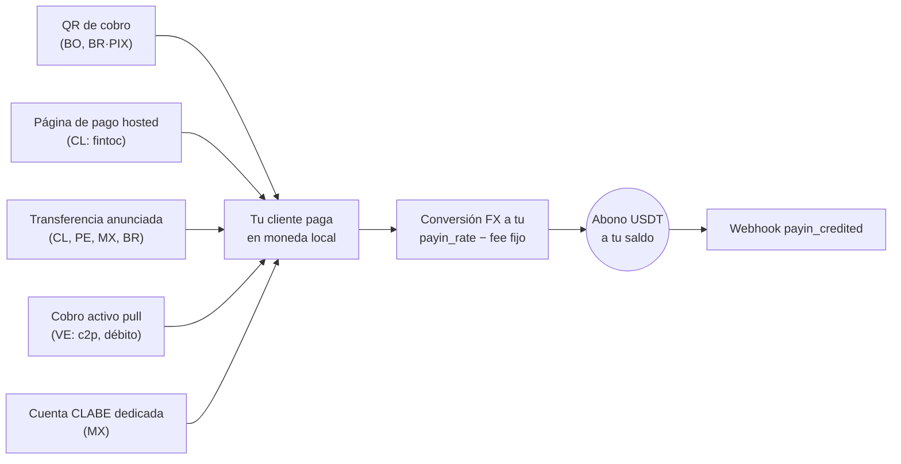

Un payin es un cobro fiat: tu cliente paga en moneda local y tu cuenta
recibe el abono en USDT automáticamente, convertido a **tu tasa de payin**
(`payin_rate` en `GET /v1/rates`) menos la comisión fija de payin si tu
cuenta la tiene configurada.

Sea cual sea la modalidad, todos los caminos terminan igual — abono
automático + webhook:



## 1. Descubre los corredores disponibles

Los países, monedas y modalidades disponibles los define CBPay.
Consúltalos siempre por catálogo:

```bash
curl https://api.qbank.cl/platform/v1/payins/methods \
  -H "Authorization: Bearer <token>"
```

```json
{
  "items": [
    { "country": "BO", "currency": "BOB", "method": "qr", "delivery": "push" },
    { "country": "VE", "currency": "VES", "method": "c2p", "delivery": "push+polling" },
    { "country": "MX", "currency": "MXN", "method": "bank_transfer", "delivery": "push" }
  ],
  "meta": { "retrieved": 3 }
}
```

`delivery` indica cómo se confirma el pago del lado de CBPay (notificación
del banco, sondeo o ambos) — no cambia nada en tu integración: tú siempre
recibes el webhook `payin_credited`.

Corredores y modalidades de cobro:

| País | Moneda | Modalidades |
|---|---|---|
| Chile | CLP | Página de pago hosted (`fintoc`), transferencia anunciada |
| Perú | PEN | Transferencia anunciada |
| México | MXN | Cuenta CLABE dedicada, transferencia anunciada |
| Venezuela | VES | Cobro activo `c2p` y `debito_inmediato` (pull) |
| Bolivia | BOB / USD | QR de cobro |
| Brasil | BRL | QR PIX dinámico, transferencia anunciada |

La disponibilidad puede variar; el catálogo (`GET /v1/payins/methods`) es
siempre la fuente de verdad. En todos los casos el abono llega igual: se
convierte a USDT a tu `payin_rate` del momento y se acredita neto de la
comisión fija de payin.

## 2. Elige la modalidad y crea el cobro

Cada país tiene su propia modalidad (QR, página de pago, transferencia
anunciada, CLABE dedicada o cobro pull). La referencia completa con
request y response reales de los 6 países está en su propia página:

<Card title="Referencia por país" icon="earth-americas" href="/es/guias/payins-por-pais">
  Chile, Perú, México, Venezuela, Bolivia y Brasil — cada modalidad de
  cobro con su request completo y la respuesta que recibes.
</Card>

Un ejemplo para dimensionar (Bolivia, QR de cobro):

```bash
curl -X POST https://api.qbank.cl/platform/v1/payins \
  -H "Authorization: Bearer <token>" \
  -H "Content-Type: application/json" \
  -d '{
    "country": "BO",
    "currency": "BOB",
    "method": "qr",
    "amount": "700.00",
    "description": "Recarga app",
    "expires_in": 3600
  }'
```

```json
{
  "payin_id": "9c2a…",
  "status": "pending",
  "charge": {
    "charge_id": "…",
    "qr_image": "<base64>",
    "qr_payload": "<contenido del QR>",
    "our_reference": "482915073",
    "status": "pending"
  }
}
```

## 3. Recibe el abono

Cuando el pago llega (por cualquiera de las modalidades), tu cuenta se
acredita automáticamente y se emite el webhook `payin_credited`:

```json
{
  "payin_id": "9c2a…",
  "account_id": "…",
  "country": "BO",
  "currency": "BOB",
  "local_amount": "700.00",
  "fx_rate": "6.91",
  "usdt_credited": "100.302460",
  "fee": "1.000000"
}
```

`fx_rate` es tu `payin_rate` del momento del abono — la conversión se hace
exactamente a esa tasa: `usdt_gross = 700.00 / 6.91`.

El objeto payin queda con el detalle completo:

```bash
curl https://api.qbank.cl/platform/v1/payins/9c2a… \
  -H "Authorization: Bearer <token>"
```

```json
{
  "payin_id": "9c2a…",
  "kind": "qr",
  "status": "credited",
  "local_amount": "700.00",
  "fx_rate": "6.91",
  "usdt_gross": "101.302460",
  "fee": "1.000000",
  "usdt_credited": "100.302460"
}
```

## Estados

| Estado | Significado |
|---|---|
| `pending` | Cargo creado, esperando el pago |
| `credited` | Pago recibido y abonado en USDT |
| `unassigned` | Depósito recibido sin match automático (lo asigna el administrador) |
| `expired` | El cargo venció sin pago |
| `failed` | El cobro falló |

<Info>
Los depósitos que llegan por transferencia directa sin referencia clara
quedan `unassigned` hasta que el equipo de CBPay los asigna a una cuenta.
Al asignarse, se acreditan con la tasa y comisiones de la cuenta destino.
</Info>

## Consulta e historial

```bash
# Un payin
curl https://api.qbank.cl/platform/v1/payins/9c2a… \
  -H "Authorization: Bearer <token>"

# Historial con filtros
curl "https://api.qbank.cl/platform/v1/payins?from=2026-07-01&to=2026-07-08&status=credited&page_size=50" \
  -H "Authorization: Bearer <token>"
```

`from`/`to` van en `YYYY-MM-DD` (UTC); fecha inválida responde
`400 invalid_range`.

## Errores frecuentes

| HTTP | `error` | Qué hacer |
|---|---|---|
| 400 | `invalid_request` | Revisa `method` (qr, bank_transfer, fintoc; collect va en su endpoint) |
| 400 | `idempotency_key_required` | El collect exige clave de idempotencia (débito real al pagador) |
| 403 | `service_disabled` | Payins no está habilitado para tu cuenta — ver [servicios](/es/conceptos/servicios) |
| 422 | `core_rejected` | El procesador rechazó el cargo; revisa el mensaje |
| 502 | `core_unavailable` | No se pudo crear el cargo; reintenta la creación (no se cobró nada) |
