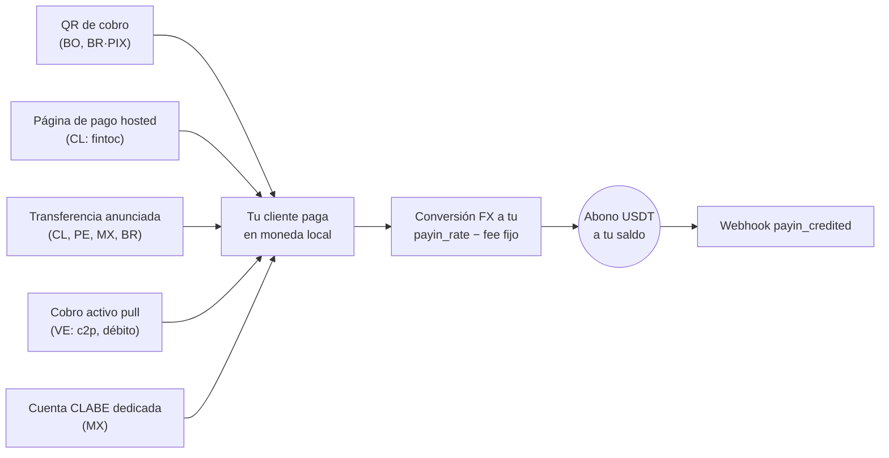

Un payin es un cobro fiat: tu cliente paga en moneda local y tu cuenta
recibe el abono en USDT automáticamente, convertido a **tu tasa de payin**
(`payin_rate` en `GET /v1/rates`) menos la comisión fija de payin si tu
cuenta la tiene configurada.

Sea cual sea la modalidad, todos los caminos terminan igual — abono
automático + webhook:



## 1. Descubre los corredores disponibles

Los países, monedas y modalidades disponibles los define CBPay.
Consúltalos siempre por catálogo:

```bash
curl https://api.qbank.cl/platform/v1/payins/methods \
  -H "Authorization: Bearer <token>"
```

```json
{
  "items": [
    { "country": "BO", "currency": "BOB", "method": "qr", "delivery": "push" },
    { "country": "VE", "currency": "VES", "method": "c2p", "delivery": "push+polling" },
    { "country": "MX", "currency": "MXN", "method": "bank_transfer", "delivery": "push" }
  ],
  "meta": { "retrieved": 3 }
}
```

`delivery` indica cómo se confirma el pago del lado de CBPay (notificación
del banco, sondeo o ambos) — no cambia nada en tu integración: tú siempre
recibes el webhook `payin_credited`.

Corredores y modalidades de cobro:

| País | Moneda | Modalidades |
|---|---|---|
| Chile | CLP | Página de pago hosted (`fintoc`), transferencia anunciada |
| Perú | PEN | Transferencia anunciada |
| México | MXN | Cuenta CLABE dedicada, transferencia anunciada |
| Venezuela | VES | Cobro activo `c2p` y `debito_inmediato` (pull) |
| Bolivia | BOB / USD | QR de cobro |
| Brasil | BRL | QR PIX dinámico, transferencia anunciada |

La disponibilidad puede variar; el catálogo (`GET /v1/payins/methods`) es
siempre la fuente de verdad. En todos los casos el abono llega igual: se
convierte a USDT a tu `payin_rate` del momento y se acredita neto de la
comisión fija de payin.

## 2. Elige la modalidad y crea el cobro

Cada país tiene su propia modalidad de cobro. El request y la respuesta
real de cada una:

<Tabs>
<Tab title="Chile">

**Página de pago hosted (`fintoc`)** — recomendado: recibes una
`payment_url`; el pagador la abre y transfiere desde **cualquier banco o
billetera chilena** (Banco Estado, Santander, Mach, Tenpo, Mercado
Pago…). El pago se detecta y valida automáticamente — sin referencias
manuales.

```bash
curl -X POST https://api.qbank.cl/platform/v1/payins \
  -H "Authorization: Bearer <token>" \
  -H "Content-Type: application/json" \
  -d '{
    "country": "CL",
    "currency": "CLP",
    "method": "fintoc",
    "amount": "150000",
    "description": "Recarga pedido 8841",
    "idempotency_key": "topup-8841"
  }'
```

Respuesta `201`:

```json
{
  "payin_id": "7a2b…",
  "status": "pending",
  "reference": "7a2b…",
  "payment_url": "https://pay.fintoc.com/plink_K2zwNNSxPyx8w3GZ",
  "expires_at": "2026-07-08T18:48:25Z",
  "note": "share the payment_url with the payer; the deposit is credited automatically once the transfer is detected"
}
```

Comparte la `payment_url` con el pagador (link, redirección o WebView).
Cuando el pago se confirma, tu cuenta se acredita en USDT y recibes el
webhook `payin_credited`. El monto CLP debe ser entero (el peso chileno no
usa decimales) y la sesión de pago vence en 24 horas por defecto. Un retry
con la misma `idempotency_key` devuelve el mismo payin y la misma URL —
nunca abre una segunda sesión de pago.

**Transferencia anunciada** (alternativa manual): anuncias el depósito
entrante y compartes la referencia con quien transfiere.

```bash
curl -X POST https://api.qbank.cl/platform/v1/payins \
  -H "Authorization: Bearer <token>" \
  -H "Content-Type: application/json" \
  -d '{
    "country": "CL",
    "currency": "CLP",
    "method": "bank_transfer",
    "amount": "500000"
  }'
```

Respuesta `201`:

```json
{
  "payin_id": "4f81…",
  "status": "pending",
  "reference": "4f81…",
  "note": "include the reference in the transfer description so the deposit is credited automatically"
}
```

Cuando la transferencia llega, se matchea por la referencia en la glosa (o
por monto+moneda como respaldo) y tu cuenta se acredita automáticamente.

</Tab>
<Tab title="Perú">

**Transferencia anunciada**, igual que Chile pero en soles:

```bash
curl -X POST https://api.qbank.cl/platform/v1/payins \
  -H "Authorization: Bearer <token>" \
  -H "Content-Type: application/json" \
  -d '{
    "country": "PE",
    "currency": "PEN",
    "method": "bank_transfer",
    "amount": "1800.00"
  }'
```

Respuesta `201`:

```json
{
  "payin_id": "6d20…",
  "status": "pending",
  "reference": "6d20…",
  "note": "include the reference in the transfer description so the deposit is credited automatically"
}
```

La `reference` debe viajar en la descripción de la transferencia para el
match automático; como respaldo también se matchea por monto+moneda.

</Tab>
<Tab title="México">

**Cuenta CLABE dedicada** (recomendado): creas una CLABE fija vinculada a
tu cuenta — todo SPEI que llegue a ella se acredita automáticamente, sin
referencias:

```bash
curl -X POST https://api.qbank.cl/platform/v1/payins/deposit-accounts \
  -H "Authorization: Bearer <token>" \
  -H "Content-Type: application/json" \
  -d '{ "country": "MX", "currency": "MXN" }'
```

Respuesta `201`:

```json
{
  "instrument_id": "a1d4…",
  "account_id": "…",
  "country": "MX",
  "currency": "MXN",
  "method": "bank_transfer",
  "instrument": "734180000151000006",
  "status": "active"
}
```

`instrument` es la CLABE que compartes con tus pagadores. La creación es
gratis; cada depósito paga la comisión de payin normal. Lista tus cuentas
con `GET /v1/payins/deposit-accounts`.

También puedes usar la **transferencia anunciada** puntual
(`POST /v1/payins` con `method: "bank_transfer"`, `country: "MX"`).

</Tab>
<Tab title="Venezuela">

**Cobro activo (pull)**: cobras directamente al pagador con su
autorización. El resultado es **síncrono** — si el cobro se aprueba, el
abono se acredita en la misma llamada.

Para `debito_inmediato`, primero solicita el OTP (gratis):

```bash
curl -X POST https://api.qbank.cl/platform/v1/payins/collect/otp \
  -H "Authorization: Bearer <token>" \
  -H "Content-Type: application/json" \
  -d '{
    "method": "debito_inmediato",
    "amount": "1200.00",
    "payer_document": "V12345678",
    "payer_phone": "04141234567",
    "payer_bank": "0102",
    "payer_account": "01020123456789012345"
  }'
```

```json
{
  "method": "debito_inmediato",
  "result": { "status": "sent", "otp_reference": "OTP-5521" }
}
```

Luego ejecuta el cobro:

<CodeGroup>

```bash c2p (teléfono + cédula + OTP del pagador)
curl -X POST https://api.qbank.cl/platform/v1/payins/collect \
  -H "Authorization: Bearer <token>" \
  -H "Content-Type: application/json" \
  -d '{
    "method": "c2p",
    "amount": "1200.00",
    "description": "Cobro pedido 5512",
    "payer_document": "V12345678",
    "payer_phone": "04141234567",
    "payer_bank": "0102",
    "otp": "12345678",
    "idempotency_key": "cobro-5512"
  }'
```

```bash debito_inmediato (cuenta + OTP solicitado antes)
curl -X POST https://api.qbank.cl/platform/v1/payins/collect \
  -H "Authorization: Bearer <token>" \
  -H "Content-Type: application/json" \
  -d '{
    "method": "debito_inmediato",
    "amount": "1200.00",
    "description": "Cobro pedido 5512",
    "payer_document": "V12345678",
    "payer_account": "01020123456789012345",
    "payer_bank": "0102",
    "payer_account_type": "CNTA",
    "otp": "87654321",
    "otp_reference": "OTP-5521",
    "idempotency_key": "cobro-5512"
  }'
```

<Note>
El cobro activo ejecuta un débito real contra el pagador, así que
`idempotency_key` es **obligatoria** (body o header `Idempotency-Key`): un
reintento con la misma clave devuelve el resultado original con
`idempotency_hit` y nunca vuelve a cobrar.
</Note>

</CodeGroup>

Respuesta `200` (cobro aprobado y acreditado):

```json
{
  "payin_id": "7b3c…",
  "kind": "collect",
  "method": "c2p",
  "status": "credited",
  "local_amount": "1200.00",
  "fx_rate": "36.50",
  "usdt_gross": "32.876712",
  "fee": "0.300000",
  "usdt_credited": "32.576712",
  "paid": true,
  "provider_reference": "…"
}
```

Si el pagador rechaza o falla la autorización, `paid` es `false`, el payin
queda `failed` y no se cobra nada.

</Tab>
<Tab title="Bolivia">

**QR de cobro** (estándar interoperable local): generas el QR y tu cliente
lo escanea con su app bancaria.

```bash
curl -X POST https://api.qbank.cl/platform/v1/payins \
  -H "Authorization: Bearer <token>" \
  -H "Content-Type: application/json" \
  -d '{
    "country": "BO",
    "currency": "BOB",
    "method": "qr",
    "amount": "700.00",
    "description": "Recarga app",
    "expires_in": 3600
  }'
```

Respuesta `201`:

```json
{
  "payin_id": "9c2a…",
  "status": "pending",
  "charge": {
    "charge_id": "…",
    "qr_image": "<base64>",
    "qr_payload": "<contenido del QR>",
    "our_reference": "482915073",
    "status": "pending"
  }
}
```

Muestra `qr_image` a tu cliente; cuando paga, tu cuenta se acredita
automáticamente. También funciona en USD (`currency: "USD"`).

</Tab>
<Tab title="Brasil">

**QR PIX dinámico**: el mismo endpoint genera un QR PIX con el monto
embebido.

```bash
curl -X POST https://api.qbank.cl/platform/v1/payins \
  -H "Authorization: Bearer <token>" \
  -H "Content-Type: application/json" \
  -d '{
    "country": "BR",
    "currency": "BRL",
    "method": "qr",
    "amount": "120.00",
    "description": "Pedido 7719",
    "expires_in": 1800
  }'
```

En la respuesta, `charge.qr_payload` es el código **"copia e cola"** de
PIX, para que el pagador pueda pegarlo en su app bancaria si no escanea la
imagen (`charge.qr_image`).

También puedes usar la **transferencia anunciada** compartiendo la
referencia en la descripción del PIX:

```bash
curl -X POST https://api.qbank.cl/platform/v1/payins \
  -H "Authorization: Bearer <token>" \
  -H "Content-Type: application/json" \
  -d '{
    "country": "BR",
    "currency": "BRL",
    "method": "bank_transfer",
    "amount": "350.00"
  }'
```

Respuesta `201`:

```json
{
  "payin_id": "b1a7…",
  "status": "pending",
  "reference": "b1a7…",
  "note": "include the reference in the transfer description so the deposit is credited automatically"
}
```

</Tab>
</Tabs>

## 3. Recibe el abono

Cuando el pago llega (por cualquiera de las modalidades), tu cuenta se
acredita automáticamente y se emite el webhook `payin_credited`:

```json
{
  "payin_id": "9c2a…",
  "account_id": "…",
  "country": "BO",
  "currency": "BOB",
  "local_amount": "700.00",
  "fx_rate": "6.91",
  "usdt_credited": "100.302460",
  "fee": "1.000000"
}
```

`fx_rate` es tu `payin_rate` del momento del abono — la conversión se hace
exactamente a esa tasa: `usdt_gross = 700.00 / 6.91`.

El objeto payin queda con el detalle completo:

```bash
curl https://api.qbank.cl/platform/v1/payins/9c2a… \
  -H "Authorization: Bearer <token>"
```

```json
{
  "payin_id": "9c2a…",
  "kind": "qr",
  "status": "credited",
  "local_amount": "700.00",
  "fx_rate": "6.91",
  "usdt_gross": "101.302460",
  "fee": "1.000000",
  "usdt_credited": "100.302460"
}
```

## Estados

| Estado | Significado |
|---|---|
| `pending` | Cargo creado, esperando el pago |
| `credited` | Pago recibido y abonado en USDT |
| `unassigned` | Depósito recibido sin match automático (lo asigna el administrador) |
| `expired` | El cargo venció sin pago |
| `failed` | El cobro falló |

<Info>
Los depósitos que llegan por transferencia directa sin referencia clara
quedan `unassigned` hasta que el equipo de CBPay los asigna a una cuenta.
Al asignarse, se acreditan con la tasa y comisiones de la cuenta destino.
</Info>

## Consulta e historial

```bash
# Un payin
curl https://api.qbank.cl/platform/v1/payins/9c2a… \
  -H "Authorization: Bearer <token>"

# Historial con filtros
curl "https://api.qbank.cl/platform/v1/payins?from=2026-07-01&to=2026-07-08&status=credited&page_size=50" \
  -H "Authorization: Bearer <token>"
```

`from`/`to` van en `YYYY-MM-DD` (UTC); fecha inválida responde
`400 invalid_range`.

## Errores frecuentes

| HTTP | `error` | Qué hacer |
|---|---|---|
| 400 | `invalid_request` | Revisa `method` (qr, bank_transfer, fintoc; collect va en su endpoint) |
| 400 | `idempotency_key_required` | El collect exige clave de idempotencia (débito real al pagador) |
| 403 | `service_disabled` | Payins no está habilitado para tu cuenta — ver [servicios](/es/conceptos/servicios) |
| 422 | `core_rejected` | El procesador rechazó el cargo; revisa el mensaje |
| 502 | `core_unavailable` | No se pudo crear el cargo; reintenta la creación (no se cobró nada) |
