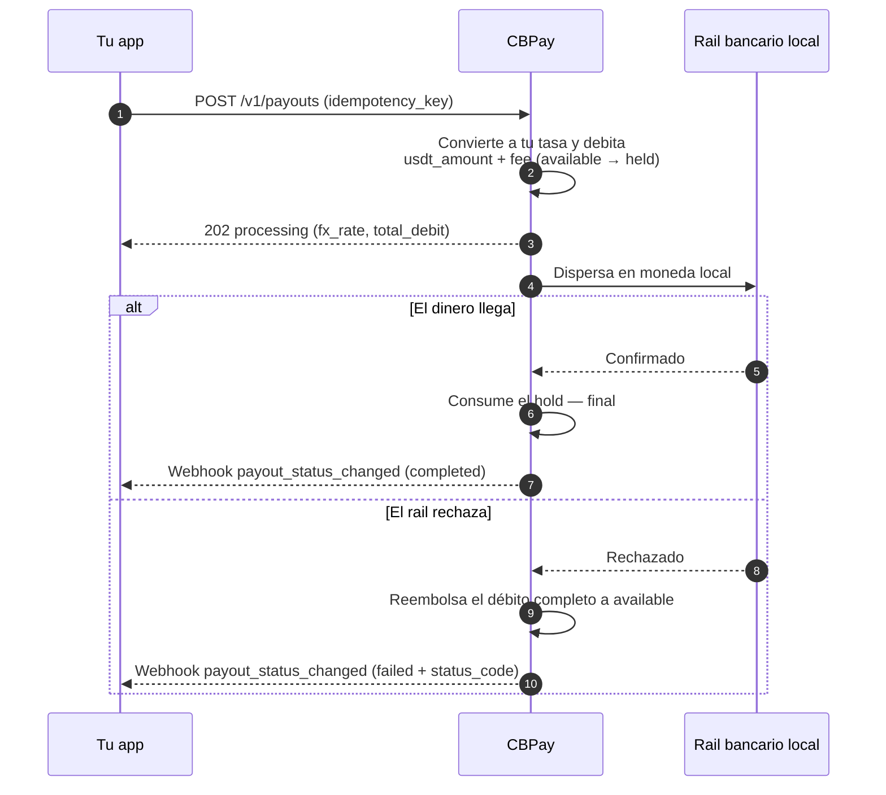
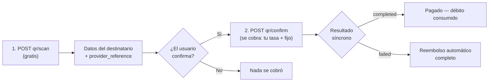

Un payout envía dinero en moneda local a una cuenta bancaria del país
destino. El monto se convierte de moneda local a USDT con **la tasa de tu
cuenta** (la de `GET /v1/rates`) y se debita `usdt_amount + fee` (el fijo,
si está configurado) de tu saldo.

Así se ve el ciclo completo, incluido qué pasa con tu saldo en cada paso:



## 1. Descubre los corredores disponibles

Los países, monedas y métodos disponibles los define CBPay.
Consúltalos siempre por catálogo:

```bash
curl https://api.qbank.cl/platform/v1/payouts/methods \
  -H "Authorization: Bearer <token>"
```

```json
{
  "items": [
    { "country": "CL", "currency": "CLP", "method": "bank_transfer" },
    { "country": "PE", "currency": "PEN", "method": "bank_transfer" },
    { "country": "PE", "currency": "PEN", "method": "yape" },
    { "country": "BO", "currency": "BOB", "method": "qr" }
  ],
  "meta": { "retrieved": 4 }
}
```

Corredores y métodos disponibles:

| País | Moneda | Métodos |
|---|---|---|
| Chile | CLP | `bank_transfer` |
| Perú | PEN | `bank_transfer`, `yape` |
| México | MXN | `bank_transfer` (SPEI: CLABE o tarjeta de débito) |
| Venezuela | VES | `bank_transfer`, `pago_movil` |
| Bolivia | BOB / USD | `bank_transfer`, `qr` (ver [Payout QR](#payout-qr)) |
| Brasil | BRL | `pix` (por llave), `qr` (ver [Payout QR](#payout-qr)) |
| Paraguay | PYG | `bank_transfer` |

La disponibilidad puede variar; el catálogo (`GET /v1/payouts/methods`) es
siempre la fuente de verdad. Si un país tiene un solo método, `method` es
opcional. Todos los métodos se cobran igual: tu tasa + fijo.

Para transferencias bancarias necesitas además el catálogo de bancos (de
ahí sale el `bank_code` del beneficiario):

```bash
curl "https://api.qbank.cl/platform/v1/payouts/banks?country=CL" \
  -H "Authorization: Bearer <token>"
```

```json
{
  "items": [
    { "code": "001", "name": "Banco de Chile" },
    { "code": "012", "name": "Banco del Estado de Chile" },
    { "code": "016", "name": "Banco de Crédito e Inversiones" }
  ],
  "meta": { "retrieved": 3 }
}
```

## 2. Crea el payout

```bash
curl -X POST https://api.qbank.cl/platform/v1/payouts \
  -H "Authorization: Bearer <token>" \
  -H "Content-Type: application/json" \
  -d '{
    "country": "MX",
    "currency": "MXN",
    "method": "bank_transfer",
    "amount": "1500.00",
    "beneficiary": {
      "name": "María López",
      "account_type": "clabe",
      "account_number": "012180001234567895"
    },
    "description": "Pago factura 8841",
    "idempotency_key": "factura-8841"
  }'
```

<Warning>
`beneficiary` es un objeto de pares clave/valor cuyos campos requeridos
dependen del corredor (RUT y banco en Chile, CLABE en México, CCI en Perú,
llave PIX en Brasil, etc.). El catálogo de métodos documenta los campos de
cada uno.
</Warning>

Respuesta `202 Accepted`:

```json
{
  "payout_id": "0d4f…",
  "account_id": "…",
  "idempotency_key": "factura-8841",
  "country": "MX",
  "currency": "MXN",
  "method": "bank_transfer",
  "local_amount": "1500.00",
  "fx_rate": "17.50",
  "usdt_amount": "85.714286",
  "fee": "0.300000",
  "total_debit": "86.014286",
  "status": "processing",
  "created_at": "2026-07-06T20:00:00Z"
}
```

En ese momento tu saldo ya refleja el débito: `total_debit` pasó de
`available` a `held`.

## 3. Recibe el estado final

Suscríbete al evento `payout_status_changed` ([webhooks](/es/webhooks)):

```json
{
  "payout_id": "0d4f…",
  "account_id": "…",
  "country": "MX",
  "currency": "MXN",
  "local_amount": "1500.00",
  "usdt_amount": "85.714286",
  "total_debit": "86.014286",
  "status": "completed",
  "status_code": ""
}
```

- **`completed`**: el dinero llegó; el hold se consume.
- **`failed`**: se reembolsa el débito completo automáticamente
  (`payout_refund` en tu ledger).

También puedes consultar en cualquier momento:

```bash
curl https://api.qbank.cl/platform/v1/payouts/0d4f… \
  -H "Authorization: Bearer <token>"
```

### Estados del payout

| Estado | Significado | ¿Tu saldo? |
|---|---|---|
| `processing` | Aceptado y en ejecución en el rail local | Débito retenido en `held` |
| `completed` | El dinero llegó al beneficiario | Hold consumido — final |
| `failed` | El corredor lo rechazó o falló | **Reembolso automático completo** (monto + comisión) |

## Consulta e historial

Cada payout se puede leer individualmente y el listado acepta filtros:

```bash
# Un payout
curl https://api.qbank.cl/platform/v1/payouts/0d4f… \
  -H "Authorization: Bearer <token>"

# Historial con filtros: fechas, estado y paginación
curl "https://api.qbank.cl/platform/v1/payouts?from=2026-07-01&to=2026-07-08&status=failed&page=1&page_size=50" \
  -H "Authorization: Bearer <token>"
```

```json
{
  "page": 1,
  "page_size": 50,
  "payouts": [
    {
      "payout_id": "0d4f…",
      "country": "MX",
      "currency": "MXN",
      "method": "bank_transfer",
      "local_amount": "1500.00",
      "fx_rate": "17.50",
      "usdt_amount": "85.714286",
      "fee": "0.300000",
      "total_debit": "86.014286",
      "status": "failed",
      "status_code": "core_rejected",
      "status_message": "beneficiary account does not exist",
      "created_at": "2026-07-06T20:00:00Z"
    }
  ]
}
```

`from`/`to` van en `YYYY-MM-DD` (UTC, ambos inclusive); una fecha inválida
responde `400 invalid_range`.

## Ejemplos por país

Cada corredor con su `beneficiary` exacto, el request completo y la
respuesta real. Las tasas (`fx_rate`) son ilustrativas — siempre aplican
las de tu cuenta en `GET /v1/rates`; el débito es `usdt_amount + fee`
(fijo, si está configurado; aquí `0.30`).

### Campos del beneficiary por corredor

| País | Método | Campos del `beneficiary` |
|---|---|---|
| CL | `bank_transfer` | `name`, `tax_id` (RUT), `bank_code`, `account_type`, `account_number` |
| PE | `bank_transfer` | `name`, `account_number` (CCI de 20 dígitos) |
| PE | `yape` | `name`, `phone` (`51XXXXXXXXX`) |
| MX | `bank_transfer` | `name`, `account_type` (`clabe`/`debit_card`), `account_number` (+ `bank_code` si es tarjeta) |
| VE | `pago_movil` | `phone`, `bank_code` (SUDEBAN), `document_value` |
| VE | `bank_transfer` | `name`, `account_number` (20 dígitos), `document_value` |
| BO | `bank_transfer` | `name`, `tax_id`, `bank_code`, `account_number` |
| BR | `pix` | `name`, `tax_id`, `pix_key_type`, `pix_key` |
| PY | `bank_transfer` | `name` (≤35), `tax_id`, `bank_code`, `account_number` |


<Tabs>
<Tab title="Chile">

Transferencia bancaria en CLP. Requiere RUT, banco y cuenta:

```bash
curl -X POST https://api.qbank.cl/platform/v1/payouts \
  -H "Authorization: Bearer <token>" \
  -H "Content-Type: application/json" \
  -d '{
    "country": "CL",
    "currency": "CLP",
    "method": "bank_transfer",
    "amount": "100000",
    "beneficiary": {
      "name": "Pedro Soto Fuentes",
      "tax_id": "12.345.678-5",
      "bank_code": "012",
      "account_type": "checking",
      "account_number": "123456789"
    },
    "description": "Pago proveedor",
    "idempotency_key": "cl-prov-0091"
  }'
```

```json
{
  "payout_id": "b3e1…",
  "country": "CL",
  "currency": "CLP",
  "method": "bank_transfer",
  "local_amount": "100000",
  "fx_rate": "925.69",
  "usdt_amount": "108.027528",
  "fee": "0.300000",
  "total_debit": "108.327528",
  "status": "processing"
}
```

El catálogo de bancos (`GET /v1/payouts/banks?country=CL`) da los
`bank_code` vigentes.

</Tab>
<Tab title="Perú">

Dos métodos: transferencia bancaria (CCI interbancario) y **Yape** (al
número de teléfono).

<CodeGroup>

```bash bank_transfer (CCI)
curl -X POST https://api.qbank.cl/platform/v1/payouts \
  -H "Authorization: Bearer <token>" \
  -H "Content-Type: application/json" \
  -d '{
    "country": "PE",
    "currency": "PEN",
    "method": "bank_transfer",
    "amount": "1000.00",
    "beneficiary": {
      "name": "Rosa Álvarez Díaz",
      "account_number": "00219300123456789012"
    },
    "idempotency_key": "pe-cci-3310"
  }'
```

```bash yape (teléfono)
curl -X POST https://api.qbank.cl/platform/v1/payouts \
  -H "Authorization: Bearer <token>" \
  -H "Content-Type: application/json" \
  -d '{
    "country": "PE",
    "currency": "PEN",
    "method": "yape",
    "amount": "150.00",
    "beneficiary": {
      "name": "Luis Ramos Vega",
      "phone": "51987654321"
    },
    "idempotency_key": "pe-yape-8874"
  }'
```

</CodeGroup>

```json
{
  "payout_id": "c7a2…",
  "country": "PE",
  "currency": "PEN",
  "method": "yape",
  "local_amount": "150.00",
  "fx_rate": "3.40",
  "usdt_amount": "44.117648",
  "fee": "0.300000",
  "total_debit": "44.417648",
  "status": "completed"
}
```

En `yape` el teléfono va en formato `51XXXXXXXXX` (11 dígitos con código de
país). El resultado suele ser síncrono.

</Tab>
<Tab title="México">

SPEI en MXN, a CLABE (18 dígitos) o a tarjeta de débito:

<CodeGroup>

```bash CLABE
curl -X POST https://api.qbank.cl/platform/v1/payouts \
  -H "Authorization: Bearer <token>" \
  -H "Content-Type: application/json" \
  -d '{
    "country": "MX",
    "currency": "MXN",
    "method": "bank_transfer",
    "amount": "1500.00",
    "beneficiary": {
      "name": "María López",
      "account_type": "clabe",
      "account_number": "012180001234567895"
    },
    "idempotency_key": "mx-clabe-8841"
  }'
```

```bash Tarjeta de débito
curl -X POST https://api.qbank.cl/platform/v1/payouts \
  -H "Authorization: Bearer <token>" \
  -H "Content-Type: application/json" \
  -d '{
    "country": "MX",
    "currency": "MXN",
    "method": "bank_transfer",
    "amount": "800.00",
    "beneficiary": {
      "name": "Jorge Herrera",
      "account_type": "debit_card",
      "account_number": "4152313412341234",
      "bank_code": "40012"
    },
    "idempotency_key": "mx-card-1102"
  }'
```

</CodeGroup>

```json
{
  "payout_id": "0d4f…",
  "country": "MX",
  "currency": "MXN",
  "method": "bank_transfer",
  "local_amount": "1500.00",
  "fx_rate": "17.50",
  "usdt_amount": "85.714286",
  "fee": "0.300000",
  "total_debit": "86.014286",
  "status": "processing"
}
```

Con CLABE el banco destino se deriva de los primeros dígitos; con tarjeta
es obligatorio `bank_code`.

</Tab>
<Tab title="Venezuela">

Dos métodos: **Pago Móvil** (teléfono + banco + cédula) y transferencia
bancaria (cuenta de 20 dígitos):

<CodeGroup>

```bash pago_movil
curl -X POST https://api.qbank.cl/platform/v1/payouts \
  -H "Authorization: Bearer <token>" \
  -H "Content-Type: application/json" \
  -d '{
    "country": "VE",
    "currency": "VES",
    "method": "pago_movil",
    "amount": "2000.00",
    "beneficiary": {
      "phone": "04141234567",
      "bank_code": "0102",
      "document_value": "V12345678"
    },
    "idempotency_key": "ve-pm-5567"
  }'
```

```bash bank_transfer
curl -X POST https://api.qbank.cl/platform/v1/payouts \
  -H "Authorization: Bearer <token>" \
  -H "Content-Type: application/json" \
  -d '{
    "country": "VE",
    "currency": "VES",
    "method": "bank_transfer",
    "amount": "5000.00",
    "beneficiary": {
      "name": "Carmen Delgado",
      "account_number": "01020123456789012345",
      "document_value": "V87654321"
    },
    "idempotency_key": "ve-bank-7810"
  }'
```

</CodeGroup>

```json
{
  "payout_id": "e9b4…",
  "country": "VE",
  "currency": "VES",
  "method": "pago_movil",
  "local_amount": "2000.00",
  "fx_rate": "666.00",
  "usdt_amount": "3.003004",
  "fee": "0.300000",
  "total_debit": "3.303004",
  "status": "completed"
}
```

`bank_code` usa códigos SUDEBAN; en `bank_transfer` puede derivarse de los
primeros 4 dígitos de la cuenta.

</Tab>
<Tab title="Bolivia">

Transferencia ACH en BOB o USD (además del
[payout QR](#payout-qr)):

```bash
curl -X POST https://api.qbank.cl/platform/v1/payouts \
  -H "Authorization: Bearer <token>" \
  -H "Content-Type: application/json" \
  -d '{
    "country": "BO",
    "currency": "BOB",
    "method": "bank_transfer",
    "amount": "1382.00",
    "beneficiary": {
      "name": "Juan Quispe Mamani",
      "tax_id": "4567890",
      "bank_code": "1016",
      "account_number": "1234567890"
    },
    "idempotency_key": "bo-ach-2204"
  }'
```

```json
{
  "payout_id": "f2c8…",
  "country": "BO",
  "currency": "BOB",
  "method": "bank_transfer",
  "local_amount": "1382.00",
  "fx_rate": "6.91",
  "usdt_amount": "200.000000",
  "fee": "0.300000",
  "total_debit": "200.300000",
  "status": "processing"
}
```

Para USD envía `currency: "USD"` con la misma estructura.

</Tab>
<Tab title="Brasil">

PIX por llave (además del
[QR PIX](#payout-qr)):

```bash
curl -X POST https://api.qbank.cl/platform/v1/payouts \
  -H "Authorization: Bearer <token>" \
  -H "Content-Type: application/json" \
  -d '{
    "country": "BR",
    "currency": "BRL",
    "method": "pix",
    "amount": "350.00",
    "beneficiary": {
      "name": "João da Silva",
      "tax_id": "123.456.789-09",
      "pix_key_type": "cpf",
      "pix_key": "12345678909"
    },
    "idempotency_key": "br-pix-3321"
  }'
```

```json
{
  "payout_id": "a6d1…",
  "country": "BR",
  "currency": "BRL",
  "method": "pix",
  "local_amount": "350.00",
  "fx_rate": "5.13",
  "usdt_amount": "68.226121",
  "fee": "0.300000",
  "total_debit": "68.526121",
  "status": "processing"
}
```

`pix_key_type`: `cpf`, `cnpj`, `phone`, `email` o `evp` (llave aleatoria).

</Tab>
<Tab title="Paraguay">

Transferencia bancaria en PYG:

```bash
curl -X POST https://api.qbank.cl/platform/v1/payouts \
  -H "Authorization: Bearer <token>" \
  -H "Content-Type: application/json" \
  -d '{
    "country": "PY",
    "currency": "PYG",
    "method": "bank_transfer",
    "amount": "500000",
    "beneficiary": {
      "name": "Sofía Benítez",
      "tax_id": "4123456",
      "bank_code": "0011",
      "account_number": "600123456"
    },
    "idempotency_key": "py-bank-9917"
  }'
```

```json
{
  "payout_id": "d4e7…",
  "country": "PY",
  "currency": "PYG",
  "method": "bank_transfer",
  "local_amount": "500000",
  "fx_rate": "6055.76",
  "usdt_amount": "82.566020",
  "fee": "0.300000",
  "total_debit": "82.866020",
  "status": "processing"
}
```

`name` acepta hasta 35 caracteres en este corredor.

</Tab>
</Tabs>

## Payout QR

En Bolivia (QR interoperable local) y Brasil (QR PIX) también puedes
**pagar a un QR de cobro** en dos pasos: escanear y confirmar. El escaneo
es **gratis**; solo se cobra al confirmar, igual que un payout normal (tu
tasa + fijo). Si no envías `country`/`currency`, se asume Bolivia (BOB);
para Brasil envía `country: "BR"` y `currency: "BRL"`.



### 1. Escanea el QR (gratis)

```bash
curl -X POST https://api.qbank.cl/platform/v1/payouts/qr/scan \
  -H "Authorization: Bearer <token>" \
  -H "Content-Type: application/json" \
  -d '{
    "qr_payload": "<contenido del QR>",
    "currency": "BOB"
  }'
```

Devuelve los datos del destinatario para que el usuario confirme a quién le
paga:

```json
{
  "scan_id": "…",
  "provider_reference": "…",
  "beneficiary_name": "Juan Quispe",
  "destination_account": "…",
  "amount": "700.00",
  "currency": "BOB",
  "glosa": "",
  "status": "…"
}
```

### 2. Confirma el pago (se cobra aquí)

```bash
curl -X POST https://api.qbank.cl/platform/v1/payouts/qr/confirm \
  -H "Authorization: Bearer <token>" \
  -H "Content-Type: application/json" \
  -d '{
    "provider_reference": "<del scan>",
    "amount": "700.00",
    "currency": "BOB",
    "description": "Pago QR almuerzo",
    "idempotency_key": "qr-2026-07-07-a"
  }'
```

- Se debita `usdt_amount + fijo` a **tu tasa**, igual que un
  `bank_transfer`.
- El resultado es **síncrono**: la respuesta ya trae el estado final
  (`completed` o `failed` con reembolso automático) — sin esperas.
- Un mismo QR escaneado solo puede pagarse una vez; reintentos con la misma
  `idempotency_key` devuelven el payout original.
- En Brasil, `qr_payload` acepta el contenido del QR o el código
  "copia e cola" de PIX; el mismo flujo cubre QR estáticos y dinámicos.

## Errores frecuentes

| HTTP | `error` | Qué hacer |
|---|---|---|
| 400 | `idempotency_key_required` | Envía la clave en body o header |
| 400 | `beneficiary_required` | Incluye el objeto `beneficiary` |
| 402 | `insufficient_funds` | Fondea la cuenta; el payout no se creó |
| 403 | `account_blocked` | La cuenta no está activa; contacta al equipo de CBPay |
| 403 | `service_disabled` | Payouts no está habilitado para tu cuenta — ver [servicios](/es/conceptos/servicios) |
| 422 | `currency_not_supported` | No hay tasa FX para esa moneda |
| 422 | (payout con `status: failed`) | El corredor rechazó los datos; el débito ya fue reembolsado — corrige `beneficiary` y reintenta con clave nueva |

## Rechazo inmediato vs fallo posterior

Si el procesador rechaza el payout al crearlo, recibes `422` con el objeto
en `status: failed` y el reembolso ya aplicado. Si falla después (por
ejemplo, cuenta destino inexistente detectada por el banco), te llega el
webhook con `status: failed` y el reembolso automático en ese momento.

### Cómo leer `status_code` en un payout fallido

| `status_code` | Significado | Acción |
|---|---|---|
| `core_rejected` | El procesador rechazó la operación al crearla (datos del beneficiario inválidos, corredor no disponible) | Lee `status_message`, corrige y crea un payout nuevo con clave nueva |
| *otro código* | Rechazo posterior del riel bancario (p. ej. cuenta destino cerrada) | Igual: corrige los datos y crea una operación nueva |
| *(vacío)* | Fallo genérico del corredor | Revisa `status_message`; si no es claro, contacta soporte con el `payout_id` |

En todos los casos el reembolso ya está aplicado — verifícalo con la
entrada `payout_refund` en
[movimientos](/es/conceptos/movimientos-y-conciliacion).

<Note>
Un payout en `processing` no se puede cancelar por API: el rail ya lo tiene.
Espera el estado final por webhook o `GET` — llega siempre, con reembolso
automático si falla.
</Note>
