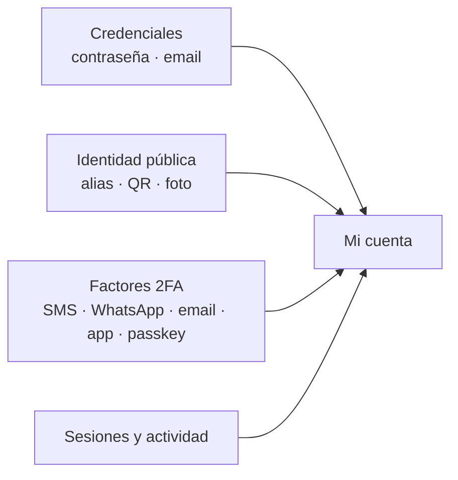

Todo lo que un usuario final gestiona sobre **su propia cuenta**: credenciales
(contraseña y email), su identidad pública para recibir dinero (alias, QR y
foto), los factores de doble autenticación (2FA) y el control de sus sesiones
y actividad de seguridad. Todo vive bajo `/v1/me/*` y `/v1/auth/*`, y requiere
una **sesión de usuario** (JWT); las API keys no aplican.



## Datos del perfil e identidad verificada

`PATCH /v1/me` actualiza los datos del perfil (`display_name`, `tax_id`,
`phone`, `country`). Pero con la verificación de identidad (KYC/KYB)
**aprobada**, el nombre, el tax ID y el país se **rellenan automáticamente
desde la identidad verificada** — lo que confirmó la verificación, no lo
autodeclarado — y quedan **inmutables** por este endpoint:

```json
{
  "error": "identity_locked",
  "message": "display_name, tax_id and country come from your approved identity verification and cannot be changed here; contact support to update your verified identity"
}
```

Para corregir un dato verificado (un cambio de razón social, por ejemplo)
contacta al soporte de tu plataforma: requiere una nueva verificación o un
override operativo de un administrador. `phone` sigue editable en todo
momento con su propio flujo de verificación (OTP al número anterior cuando
la política lo exige).

## Contraseña

<Steps>
<Step title="Cambiarla (con sesión)">
`POST /v1/me/password` con `current_password` y `new_password`. Si tu cuenta
se creó por login social y aún no tiene contraseña, dejas `current_password`
vacío para fijar la primera. Al cambiarla se **revocan todas las demás
sesiones** y la respuesta trae una sesión nueva.

```bash
curl -X POST https://api.qbank.cl/platform/v1/me/password \
  -H "Authorization: Bearer $TOKEN" \
  -d '{"current_password":"clave-vieja","new_password":"mi-nueva-clave-fuerte"}'
```
</Step>
<Step title="Recuperarla (sin sesión)">
`POST /v1/auth/password/forgot` con `org` y `email`. **Siempre** responde 200
con el mismo cuerpo, exista o no la cuenta (no filtra si el email está
registrado). El código llega al email; con `channel:"sms"` llega al teléfono
verificado.

```bash
curl -X POST https://api.qbank.cl/platform/v1/auth/password/forgot \
  -d '{"org":"cbpay","email":"taylor@example.com"}'
```

Luego `POST /v1/auth/password/reset` con `code` y `new_password`. Revoca todas
las sesiones.
</Step>
</Steps>

## Email de login

El email se puede cambiar, pero **siempre se verifica el email nuevo**: el
código llega a la dirección nueva y solo al confirmarlo se aplica el cambio.
Esto evita que alguien apunte el login a un buzón que no controla.

<Steps>
<Step title="Iniciar el cambio">
`POST /v1/me/email/change` con `new_email`. Si la política 2FA lo exige, envía
también el header `X-OTP-Token` de la acción `email_change`.
</Step>
<Step title="Confirmar con el código">
`POST /v1/me/email/confirm` con el `code` recibido en el email nuevo. Se avisa
al email anterior del cambio.
</Step>
</Steps>

<Note>
Cambiar tu email **no rompe** tus inicios de sesión sociales ya vinculados
(Google, Apple, etc.): se identifican por el proveedor, no por el email.
</Note>

## Alias y QR para recibir

Cada cuenta tiene dos identificadores públicos **permanentes** para que te
envíen dinero entre cuentas CBPay:

- **Alias** — lo eliges una sola vez con `PUT /v1/me/alias` (4-20 caracteres
  `a-z 0-9 . _ -`, sin palabras reservadas). No se puede cambiar.
- **QR de perfil** — `GET /v1/me/qr` devuelve el `qr_token`, el payload
  `cbpay:pay?to=<token>` y un PNG listo para mostrar. Solo sirve para
  **recibir**, por eso no cambia nunca.

Quien te va a enviar puede confirmar tu identidad antes con
`GET /v1/resolve?alias=taylor.code` (o `?qr=<token>`), que devuelve tu nombre,
tipo y avatar. Y las transferencias aceptan el destino directo:

```bash
curl -X POST https://api.qbank.cl/platform/v1/transfers \
  -H "Authorization: Bearer $TOKEN" \
  -d '{"to_alias":"taylor.code","amount":"10.00","idempotency_key":"t-001"}'
```

`to_qr_token` funciona igual (acepta el token o el payload `cbpay:pay?to=…`).

## Foto de perfil

`PUT /v1/me/avatar` con los bytes de la imagen (JPEG, PNG o WebP, máx 512 KB;
el tipo se detecta del contenido). `DELETE /v1/me/avatar` la quita y
`GET /v1/avatars/{accountID}` la sirve para las vistas previas.

La respuesta trae `avatar_url`: cuando la imagen queda publicada en el CDN
público es una **URL absoluta que carga sin autenticación** (ideal para el
front — úsala directo en un ``); `GET /v1/avatars/{accountID}` responde
en ese caso con un `302` hacia la misma URL.

```json
{
  "status": "avatar_updated",
  "content_type": "image/png",
  "size_bytes": 20481,
  "avatar_url": "https://cdn.cbpayapp.com/public/avatars/1fa63bd1-…/9b1deb4d-…"
}
```

## Doble autenticación (2FA)

CBPay protege acciones sensibles con un código de un solo uso. Tú eliges, por
acción, si se exige y por **qué canal**:

| Canal | Cómo llega el código | Notas |
|---|---|---|
| `sms` / `whatsapp` | Mensaje al teléfono | Sujeto a disponibilidad del canal |
| `email` | Correo al email verificado | Requiere el email verificado |
| `totp` | App autenticadora (Google Authenticator, Authy) | Inmune a SIM swap; no envía nada |

Con `GET /v1/otp/preferences` ves tu política efectiva (y qué exige tu
organización, que es el **piso**: puedes endurecer, no bajar de ahí). Con
`PUT /v1/otp/preferences` la ajustas. **Relajar** tu 2FA (desactivar una acción
o bajar de canal) pide primero verificar tu factor actual.

<Warning>
Activar el 2FA del **login** por `sms` o `whatsapp` exige tu teléfono ya
**verificado** (completa antes cualquier desafío OTP por SMS/WhatsApp:
`POST /v1/otp/challenges` + verify). Si el número no está verificado la API
responde `409 phone_verification_required` — así un número mal escrito no te
deja fuera de tu cuenta.
</Warning>

### App autenticadora (TOTP)

<Steps>
<Step title="Enrolar">
`POST /v1/me/totp/enroll` devuelve el `otpauth://` y un QR. Escanéalo en tu app.
</Step>
<Step title="Confirmar">
`POST /v1/me/totp/confirm` con el primer código. Te entrega **10 códigos de
respaldo** de un solo uso — guárdalos, se muestran una sola vez.
</Step>
</Steps>

Regenera los códigos con `POST /v1/me/totp/recovery-codes` o quita la app con
`DELETE /v1/me/totp` (ambos piden un código vigente).

### Passkeys

Los **passkeys** te dejan entrar sin contraseña usando la biometría del
dispositivo (Face ID, Touch ID, Windows Hello, o una llave de seguridad).

<Steps>
<Step title="Registrar">
`POST /v1/me/passkeys/register/begin` → pasa `options.publicKey` a
`navigator.credentials.create()` → `POST /v1/me/passkeys/register/finish` con
el resultado y un nombre ("MacBook de Taylor").
</Step>
<Step title="Iniciar sesión">
`POST /v1/auth/passkey/login/begin` con `org` → `navigator.credentials.get()`
→ `POST /v1/auth/passkey/login/finish`. Como el passkey ya son dos factores
(dispositivo + biometría), este login no pide un segundo código.
</Step>
</Steps>

Lista y quita tus passkeys con `GET`/`DELETE /v1/me/passkeys`. No puedes quitar
tu **único** método de acceso.

<Note>
Los passkeys y el registro de passkeys dependen de que tu organización tenga
configurado su dominio; si no, responden `passkeys_unavailable`.
</Note>

## Sesiones y actividad

- `GET /v1/me/sessions` lista tus sesiones activas (dispositivo, IP, método de
  login, cuál es la actual). `DELETE /v1/me/sessions/{id}` cierra una;
  `POST /v1/me/sessions/revoke-all` cierra todas menos la actual.
- `GET /v1/me/security/events?from=&to=` es el historial de seguridad de tu
  cuenta: logins, cambios de contraseña o email, factores agregados o
  quitados.

Además, CBPay te **avisa por email** cuando cambia tu contraseña o email o se
agrega/quita un factor — tu red de seguridad ante un acceso no autorizado.

## Errores frecuentes

| Código | HTTP | Qué hacer |
|---|---|---|
| `invalid_password` | 403 | La contraseña actual no coincide |
| `alias_already_set` | 409 | El alias ya se fijó; es permanente |
| `alias_taken` | 409 | Ese alias ya está en uso; elige otro |
| `email_in_use` | 409 | Otro login ya usa ese email |
| `no_pending_email` | 409 | No hay cambio de email pendiente; inícialo de nuevo |
| `policy_locked_by_org` | 403 | Tu organización exige esa acción/canal; no se puede relajar |
| `totp_enrollment_required` | 409 | Enrola la app antes de exigir el canal `totp` |
| `phone_verification_required` | 409 | Verifica tu teléfono (desafío OTP) antes de activar el 2FA de login por SMS/WhatsApp |
| `last_login_method` | 409 | No puedes quitar tu único método de acceso |
| `passkeys_unavailable` | 503 | Tu organización no tiene passkeys configuradas |
| `image_too_large` / `unsupported_image` | 413 / 415 | Avatar máx 512 KB, JPEG/PNG/WebP |

<AccordionGroup>
<Accordion title="¿Puedo cambiar mi alias o mi QR más adelante?">
No. Ambos son permanentes por diseño: son tu identidad estable para recibir
dinero. El QR solo permite recibir, así que compartirlo no es un riesgo.
</Accordion>
<Accordion title="Perdí el teléfono con mi app autenticadora">
Usa uno de tus **códigos de respaldo** (los que recibiste al confirmar TOTP)
en cualquier verificación o login. Si no los tienes, recupera el acceso con
otro factor (passkey o contraseña + otro canal) y regenera todo.
</Accordion>
<Accordion title="¿Cambiar el email me desconecta de Google/Apple?">
No. Los inicios de sesión sociales se identifican por el proveedor, no por el
email, así que siguen funcionando.
</Accordion>
</AccordionGroup>
