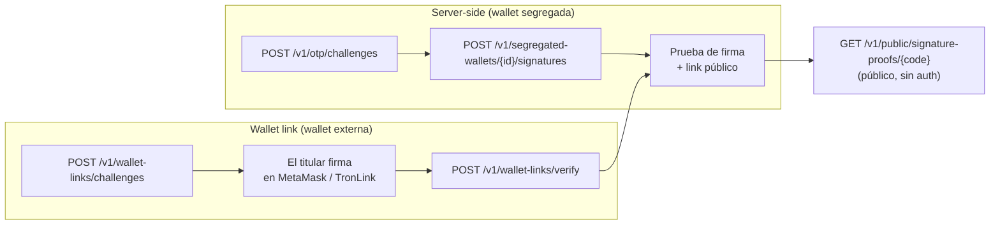

import { EnvUrls } from "/snippets/env-urls.jsx";

<EnvUrls lang="es" />

Una **prueba de firma** es evidencia criptográfica de que una wallet pertenece
a tu cuenta, **sin mover fondos y sin una transacción on-chain**. CBPay
construye un **sobre anti-phishing** estructurado y legible (título, propósito,
wallet, nonce y ventana de validez), la wallet lo firma con
**EIP-191** (Ethereum) o **TIP-191** (TRON), y cualquiera puede verificar el
resultado en un **link público** — sin autenticación.

Dos formas de producir una prueba:

| Flujo | Quién firma | Úsalo cuando |
|---|---|---|
| **Server-side** | CBPay firma con tu **wallet segregada** (custodia `cbpay`) | La wallet está custodiada por CBPay y necesitas una atestación on demand |
| **Wallet link** | El titular firma en **su propia wallet** (MetaMask, TronLink…) | Necesitas probar la titularidad de una wallet **externa** que no custodias |

<Note>
Toda prueba expira **10 minutos** después de emitida (`expires_at`). Una
prueba atestigua un momento en el tiempo; si una contraparte necesita una
fresca, crea una nueva firma.
</Note>



## El sobre anti-phishing

CBPay jamás firma un mensaje libre. Ambos flujos construyen el mismo sobre
estructurado, así quien firma siempre ve **qué** se atestigua, **qué** wallet
firma y **hasta cuándo** es válido:

```text
CBPay Signature Proof
Domain: https://api.qbank.cl/platform
Purpose: wallet_ownership
Wallet: 0x71C7656EC7ab88b098defB751B7401B5f6d8976F
Nonce: 9f2c4a7d1e5b48c0a3f69d2e7b1c4a58
Issued: 2026-08-20T14:03:22Z
Expires: 2026-08-20T14:13:22Z
Statement: I control this wallet
```

El propósito `wallet_link` agrega una línea `Account:` con tu id de cuenta
enmascarado. Una firma cuyo sobre está expirado, aún no es válido o está
ligado a otra wallet se rechaza.

## 1. Firma server-side (wallet segregada)

Firma con una [wallet segregada](/es/guias/wallets-segregadas) custodiada por
CBPay (`custody: cbpay`). Como este flujo produce una firma con una llave
custodiada, exige **KYC aprobado** y un desafío **OTP**.

<Steps>
  <Step title="Crea el desafío OTP">
    Pide un código de un solo uso para la acción `sign_message` y verifícalo
    para obtener un `X-OTP-Token` (ver [OTP](/es/seguridad-2fa)).
  </Step>
  <Step title="Solicita la firma">

```bash
curl -X POST https://api.qbank.cl/platform/v1/segregated-wallets/b7e3f1a2-4c5d-4e6f-8a9b-0c1d2e3f4a5b/signatures \
  -H "Authorization: Bearer <token>" \
  -H "X-OTP-Token: <otp-token>" \
  -H "Content-Type: application/json" \
  -d '{
    "purpose": "wallet_ownership",
    "statement": "I control this wallet"
  }'
```

`purpose` es `wallet_ownership` o `treasury_attestation`. `statement` es una
línea de texto libre opcional (máx. **140** runas) embebida en el sobre.

```json 201
{
  "proof_id": "c41d8f2e-9a3b-4c7d-ae1f-5b6c8d0e2f4a",
  "wallet_id": "b7e3f1a2-4c5d-4e6f-8a9b-0c1d2e3f4a5b",
  "chain": "eth",
  "address": "0x71C7656EC7ab88b098defB751B7401B5f6d8976F",
  "purpose": "wallet_ownership",
  "statement": "I control this wallet",
  "envelope": "CBPay Signature Proof\nDomain: https://api.qbank.cl/platform\nPurpose: wallet_ownership\nWallet: 0x71C7656EC7ab88b098defB751B7401B5f6d8976F\nNonce: 9f2c4a7d1e5b48c0a3f69d2e7b1c4a58\nIssued: 2026-08-20T14:03:22Z\nExpires: 2026-08-20T14:13:22Z\nStatement: I control this wallet",
  "message_hash": "4a5b6c7d8e9f0a1b2c3d4e5f6a7b8c9d0e1f2a3b4c5d6e7f8a9b0c1d2e3f4a5b",
  "signature": "9f2c4a7d1e5b48c0a3f69d2e7b1c4a589f2c4a7d1e5b48c0a3f69d2e7b1c4a589f2c4a7d1e5b48c0a3f69d2e7b1c4a589f2c4a7d1e5b48c0a3f69d2e7b1c1b",
  "proof_code": "G9f2c4a7d1e5b48c0a3f69d2e7b1c4a58c41d8f2e9a3b4c7dae",
  "verify_url": "https://api.qbank.cl/platform/v1/public/signature-proofs/G9f2c4a7d1e5b48c0a3f69d2e7b1c4a58c41d8f2e9a3b4c7dae",
  "status": "signed",
  "issued_at": "2026-08-20T14:03:22Z",
  "signed_at": "2026-08-20T14:03:22Z",
  "expires_at": "2026-08-20T14:13:22Z"
}
```

  </Step>
  <Step title="Comparte el link público">
    Envía `verify_url` a la contraparte. Lo abre sin credenciales y ve la
    prueba, su estado y la firma.
  </Step>
</Steps>

Cada firma también gatilla un **email de seguridad** al titular de la cuenta y
un webhook `wallet_signature_created`.

### Listar, detalle y revocar

```bash
# Lista de pruebas de la wallet
curl "https://api.qbank.cl/platform/v1/segregated-wallets/b7e3f1a2-4c5d-4e6f-8a9b-0c1d2e3f4a5b/signatures?page=1&page_size=50" \
  -H "Authorization: Bearer <token>"

# Todas las pruebas de la cuenta (paginado, filtros from/to)
curl "https://api.qbank.cl/platform/v1/signature-proofs?from=2026-08-01&to=2026-08-20" \
  -H "Authorization: Bearer <token>"

# Detalle
curl "https://api.qbank.cl/platform/v1/signature-proofs/c41d8f2e-9a3b-4c7d-ae1f-5b6c8d0e2f4a" \
  -H "Authorization: Bearer <token>"

# Revocar (el link público sigue funcionando y muestra status revoked)
curl -X POST "https://api.qbank.cl/platform/v1/signature-proofs/c41d8f2e-9a3b-4c7d-ae1f-5b6c8d0e2f4a/revoke" \
  -H "Authorization: Bearer <token>"
```

## 2. Vincular una wallet externa (MetaMask / TronLink)

Para probar la titularidad de una wallet cuyas llaves tienes **tú** (no
custodiada por CBPay), completa un challenge firmado:

<Steps>
  <Step title="Crea el challenge">

```bash
curl -X POST https://api.qbank.cl/platform/v1/wallet-links/challenges \
  -H "Authorization: Bearer <token>" \
  -H "Content-Type: application/json" \
  -d '{ "chain": "eth", "address": "0x71C7656EC7ab88b098defB751B7401B5f6d8976F" }'
```

```json 201
{
  "link_id": "d52e9c41-7b3a-4e8f-b2d6-1a9c5e7f3b8d",
  "chain": "eth",
  "address": "0x71C7656EC7ab88b098defB751B7401B5f6d8976F",
  "nonce": "9f2c4a7d1e5b48c0a3f69d2e7b1c4a58",
  "envelope": "CBPay Signature Proof\nDomain: https://api.qbank.cl/platform\nPurpose: wallet_link\nWallet: 0x71C7656EC7ab88b098defB751B7401B5f6d8976F\nAccount: ae8c…\nNonce: 9f2c4a7d1e5b48c0a3f69d2e7b1c4a58\nIssued: 2026-08-20T14:03:22Z\nExpires: 2026-08-20T14:13:22Z",
  "status": "pending",
  "expires_at": "2026-08-20T14:13:22Z"
}
```

  </Step>
  <Step title="Firma el sobre en la wallet">
    Muestra el texto de `envelope` al titular y pídele firmarlo **exactamente
    como se muestra** con la wallet de `address` (MetaMask `personal_sign`
    para `eth`, TronLink para `tron`). El challenge expira en **10 minutos**.
  </Step>
  <Step title="Envía la firma">

```bash
curl -X POST https://api.qbank.cl/platform/v1/wallet-links/verify \
  -H "Authorization: Bearer <token>" \
  -H "Content-Type: application/json" \
  -d '{
    "link_id": "d52e9c41-7b3a-4e8f-b2d6-1a9c5e7f3b8d",
    "signature": "9f2c4a7d1e5b48c0a3f69d2e7b1c4a589f2c4a7d1e5b48c0a3f69d2e7b1c4a589f2c4a7d1e5b48c0a3f69d2e7b1c4a589f2c4a7d1e5b48c0a3f69d2e7b1c1b"
  }'
```

```json 200
{
  "link_id": "d52e9c41-7b3a-4e8f-b2d6-1a9c5e7f3b8d",
  "chain": "eth",
  "address": "0x71C7656EC7ab88b098defB751B7401B5f6d8976F",
  "status": "linked",
  "linked_at": "2026-08-20T14:05:10Z",
  "proof_id": "c41d8f2e-9a3b-4c7d-ae1f-5b6c8d0e2f4a",
  "verify_url": "https://api.qbank.cl/platform/v1/public/signature-proofs/G9f2c4a7d1e5b48c0a3f69d2e7b1c4a58c41d8f2e9a3b4c7dae"
}
```

  </Step>
</Steps>

Una verificación exitosa crea una prueba de firma (`purpose: wallet_link`) y
dispara el webhook `wallet_linked`. Listar y revocar vínculos:

```bash
curl "https://api.qbank.cl/platform/v1/wallet-links" -H "Authorization: Bearer <token>"
curl -X DELETE "https://api.qbank.cl/platform/v1/wallet-links/d52e9c41-7b3a-4e8f-b2d6-1a9c5e7f3b8d" -H "Authorization: Bearer <token>"
```

## 3. Verificación pública

Cualquiera con el link puede verificar una prueba — sin cuenta, sin token:

```bash
curl "https://api.qbank.cl/platform/v1/public/signature-proofs/G9f2c4a7d1e5b48c0a3f69d2e7b1c4a58c41d8f2e9a3b4c7dae"
```

```json 200
{
  "proof_code": "G9f2c4a7d1e5b48c0a3f69d2e7b1c4a58c41d8f2e9a3b4c7dae",
  "status": "signed",
  "valid": true,
  "chain": "eth",
  "address": "0x71C7656EC7ab88b098defB751B7401B5f6d8976F",
  "purpose": "wallet_ownership",
  "statement": "I control this wallet",
  "issued_at": "2026-08-20T14:03:22Z",
  "signed_at": "2026-08-20T14:03:22Z",
  "expires_at": "2026-08-20T14:13:22Z",
  "message_hash": "4a5b6c7d8e9f0a1b2c3d4e5f6a7b8c9d0e1f2a3b4c5d6e7f8a9b0c1d2e3f4a5b",
  "signature": "9f2c4a7d1e5b48c0a3f69d2e7b1c4a589f2c4a7d1e5b48c0a3f69d2e7b1c4a589f2c4a7d1e5b48c0a3f69d2e7b1c4a589f2c4a7d1e5b48c0a3f69d2e7b1c1b",
  "verified_live": true
}
```

`valid` es `true` solo cuando la prueba está firmada, no revocada, no expirada
y la firma sigue calzando con el sobre (`verified_live` re-chequea la
criptografía en cada llamada). Un código desconocido o mal formado devuelve
`404 not_found`.

## Estados

| Estado | Significado | ¿Terminal? |
|---|---|---|
| `pending` | Challenge creado, esperando la firma del titular (solo wallet link) | No — expira en 10 min |
| `signed` | Prueba firmada y válida | No — puede revocarse o expirar |
| `revoked` | La cuenta revocó la prueba | Sí |
| `expired` | La ventana de 10 minutos venció | Sí |

## Errores

| HTTP | Código | Solución |
|---|---|---|
| 400 | `invalid_json` / `invalid_payload` | Body mal formado; revisa el JSON |
| 400 | `invalid_purpose` | Usa `wallet_ownership` o `treasury_attestation` |
| 400 | `invalid_statement` | El statement supera 280 caracteres |
| 400 | `unsupported_chain` | La chain debe ser `eth` o `tron` |
| 400 | `invalid_address` | La dirección no calza el formato de la chain |
| 403 | `verification_required` | La cuenta necesita KYC aprobado |
| 403 | `otp_required` / `otp_invalid` | Crea y verifica un desafío OTP, envía `X-OTP-Token` |
| 404 | `not_found` | Id de wallet/link/prueba equivocado, o código de prueba desconocido |
| 409 | `custody_transferred` | La wallet fue exportada; ya no firma server-side |
| 409 | `challenge_consumed` | El challenge ya fue usado; crea uno nuevo |
| 409 | `proof_not_signable` | La prueba no está en un estado firmable |
| 410 | `challenge_expired` | La ventana de 10 minutos del challenge venció; crea uno nuevo |
| 422 | `sign_rejected` | El statement no cabe en el sobre (máx. 140 runas) |
| 422 | `signature_mismatch` | La firma no calza con la dirección/el sobre |
| 429 | `too_many_attempts` | Rate limit de la verificación pública; espera y reintenta |
| 502 | `signer_unavailable` / `verification_failed` | Falla transitoria de firma/verificación; reintenta |

## Webhooks

Suscríbete a estos eventos (ver [Webhooks](/es/webhooks)):

```json wallet_signature_created
{
  "proof_id": "c41d8f2e-9a3b-4c7d-ae1f-5b6c8d0e2f4a",
  "account_id": "ae8c5f21-3b7d-4a9e-c6f2-8d1b4e6a9c3f",
  "wallet_id": "b7e3f1a2-4c5d-4e6f-8a9b-0c1d2e3f4a5b",
  "chain": "eth",
  "address": "0x71C7656EC7ab88b098defB751B7401B5f6d8976F",
  "purpose": "wallet_ownership",
  "proof_code": "G9f2c4a7d1e5b48c0a3f69d2e7b1c4a58c41d8f2e9a3b4c7dae",
  "verify_url": "https://api.qbank.cl/platform/v1/public/signature-proofs/G9f2c4a7d1e5b48c0a3f69d2e7b1c4a58c41d8f2e9a3b4c7dae"
}
```

```json wallet_linked
{
  "link_id": "d52e9c41-7b3a-4e8f-b2d6-1a9c5e7f3b8d",
  "account_id": "ae8c5f21-3b7d-4a9e-c6f2-8d1b4e6a9c3f",
  "chain": "eth",
  "address": "0x71C7656EC7ab88b098defB751B7401B5f6d8976F",
  "proof_id": "c41d8f2e-9a3b-4c7d-ae1f-5b6c8d0e2f4a"
}
```

## FAQ

<AccordionGroup>
  <Accordion title="¿Una prueba de firma mueve fondos o cuesta gas?">
    No. Firmar un mensaje es puramente criptográfico: sin transacción
    on-chain, sin fee de red, sin cambio de saldo.
  </Accordion>
  <Accordion title="¿Cuánto tiempo es válida una prueba?">
    10 minutos desde `issued_at`. Después el link público muestra la prueba
    como expirada. Crea una nueva firma cuando se necesite una atestación
    fresca.
  </Accordion>
  <Accordion title="¿Puedo revocar una prueba?">
    Sí — `POST /v1/signature-proofs/{proofID}/revoke`. El link público sigue
    funcionando y reporta `status: revoked`, así las verificaciones pasadas
    siguen siendo auditables.
  </Accordion>
  <Accordion title="¿Qué wallets pueden firmar en el flujo wallet-link?">
    Cualquier wallet que soporte `personal_sign` en Ethereum (EIP-191) o
    firma de mensajes en TRON (TIP-191) — MetaMask, TronLink y wallets
    compatibles.
  </Accordion>
  <Accordion title="¿Por qué se rechazó mi statement?">
    El sobre acepta hasta 140 runas de statement. Requests sobre 280
    caracteres fallan con `invalid_statement`; entre 141 y 280 el sobre los
    rechaza con `sign_rejected`.
  </Accordion>
</AccordionGroup>
