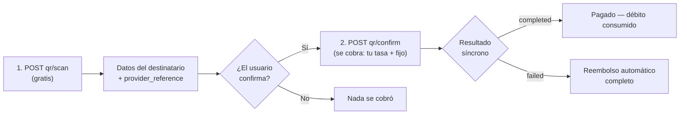

import { EnvUrls } from "/snippets/env-urls.jsx";

<EnvUrls lang="es" />

En Bolivia (QR interoperable local) y en Brasil (**QR PIX**, incluido el
código "copia e cola") también puedes **pagar a un QR de cobro** en dos
pasos: escanear y confirmar. El escaneo es **gratis**; solo se cobra al
confirmar, igual que un payout normal (tu tasa + fijo). Si no envías
`country`/`currency`, se asume Bolivia (BOB); para Brasil envía
`country: "BR"` y `currency: "BRL"`.



## 1. Escanea el QR (gratis)

<Tabs>
<Tab title="Bolivia">

```bash
curl -X POST https://api.qbank.cl/platform/v1/payouts/qr/scan \
  -H "Authorization: Bearer <token>" \
  -H "Content-Type: application/json" \
  -d '{
    "qr_payload": "<contenido del QR>",
    "currency": "BOB"
  }'
```

Devuelve los datos del destinatario para que el usuario confirme a quién le
paga:

```json
{
  "scan_id": "…",
  "provider_reference": "…",
  "beneficiary_name": "Juan Quispe",
  "destination_account": "…",
  "amount": "700.00",
  "currency": "BOB",
  "glosa": "",
  "status": "…"
}
```

</Tab>
<Tab title="Brasil (QR PIX)">

`qr_payload` acepta el contenido crudo del QR PIX (BR Code EMV) **o el
código "copia e cola"** — son el mismo string:

```bash
curl -X POST https://api.qbank.cl/platform/v1/payouts/qr/scan \
  -H "Authorization: Bearer <token>" \
  -H "Content-Type: application/json" \
  -d '{
    "country": "BR",
    "currency": "BRL",
    "qr_payload": "00020126360014br.gov.bcb.pix0114+5511998765432520400005303986540575.005802BR5913LOJA DA MARIA6009SAO PAULO62110507PED423163040BF9"
  }'
```

El escaneo decodifica el BR Code localmente (valida su checksum) y
devuelve la llave PIX de destino, el nombre del comercio y el monto si el
QR lo trae fijo:

```json
{
  "scan_id": "PIXSCAN-…",
  "provider_reference": "<el mismo payload EMV>",
  "beneficiary_name": "LOJA DA MARIA",
  "destination_account": "+5511998765432",
  "amount": "75.00",
  "currency": "BRL",
  "glosa": "",
  "status": "scanned"
}
```

- `amount` vacío = QR de **monto abierto**: tú decides cuánto pagar en el
  confirm. Con monto fijo, el confirm debe enviar exactamente ese monto.
- Se soportan QR PIX **estáticos** (los impresos/reutilizables, con la
  llave embebida). Un QR **dinámico** (payload con URL del PSP en vez de
  llave) responde `400` con el mensaje
  `dynamic pix qr codes are not supported yet` —   pídele al beneficiario su
  llave PIX y usa el método [`pix`](/es/guias/payouts#ejemplos-por-pais).
- Un payload alterado o incompleto responde `400` (checksum CRC inválido).

</Tab>
</Tabs>

## 2. Confirma el pago (se cobra aquí)

<Tabs>
<Tab title="Bolivia">

```bash
curl -X POST https://api.qbank.cl/platform/v1/payouts/qr/confirm \
  -H "Authorization: Bearer <token>" \
  -H "Content-Type: application/json" \
  -d '{
    "provider_reference": "<del scan>",
    "amount": "700.00",
    "currency": "BOB",
    "description": "Pago QR almuerzo",
    "idempotency_key": "qr-2026-07-07-a"
  }'
```

</Tab>
<Tab title="Brasil (QR PIX)">

```bash
curl -X POST https://api.qbank.cl/platform/v1/payouts/qr/confirm \
  -H "Authorization: Bearer <token>" \
  -H "Content-Type: application/json" \
  -d '{
    "country": "BR",
    "currency": "BRL",
    "provider_reference": "<del scan>",
    "amount": "75.00",
    "description": "Pedido 4231",
    "idempotency_key": "qr-br-2026-07-16-a"
  }'
```

- `amount` siempre es obligatorio: si el QR trae monto fijo debe coincidir
  exacto — si no, recibes `422` con el payout en `status: failed`
  (`status_message: "amount mismatch: the qr requires exactly 75.00 BRL"`)
  y el **reembolso ya aplicado**; corrige el monto y reintenta con clave
  nueva. Si es de monto abierto, el que envíes es el que se paga.
- Un QR PIX **estático es reutilizable por diseño** (el QR impreso de un
  comercio se paga muchas veces): puedes pagarlo de nuevo con una
  `idempotency_key` distinta. Un intento fallido **no inutiliza el QR**.
- El pago sale por el mismo riel PIX del método `pix` (24/7); el `txid`
  del QR viaja con el pago para que el comercio concilie automático.

</Tab>
</Tabs>

- Se debita `usdt_amount + fijo` a **tu tasa**, igual que un
  `bank_transfer`.
- El resultado es **síncrono**: la respuesta ya trae el estado final
  (`completed` o `failed` con reembolso automático) — sin esperas.
- Reintentos con la misma `idempotency_key` devuelven el payout original.
  En Bolivia la referencia del scan es de un solo uso (un QR escaneado solo
  puede pagarse una vez); en Brasil el QR PIX estático es reutilizable y
  cada pago lleva su propia clave.
