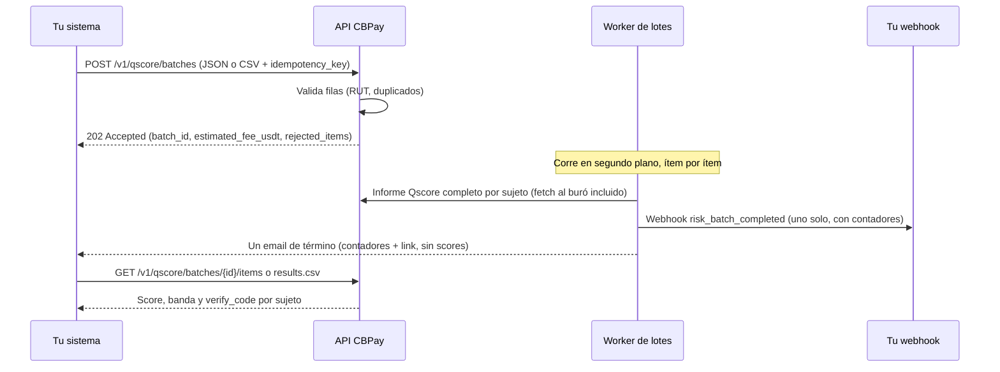

import { EnvUrls } from "/snippets/env-urls.jsx";

<EnvUrls lang="es" />

El scoring por lote es la modalidad de alto volumen de [Qscore](/es/guias/qscore): en vez de pedir un informe crediticio a la vez, envías un **lote** de sujetos (RUTs chilenos hoy) y CBPay genera un informe Qscore completo para cada uno de forma **asíncrona**. Cuando el lote termina recibes **un** webhook y **un** email con los contadores — nunca una notificación por sujeto.

Úsalo para re-puntuar una cartera existente (refresco mensual de tus deudores), para una barrida única de due diligence sobre una lista de proveedores, o para completar scores tras incorporar una cartera nueva. Para consultas puntuales de un solo sujeto, sigue usando el [informe individual](/es/guias/qscore).

## Cómo funciona



<Note>
  El lote se acepta de inmediato (`202`) y lo procesa un worker en segundo plano. Cada ítem pasa por **el mismo pipeline del informe individual** — incluido el fetch on-demand al buró — así que un score de lote es idéntico al que obtendrías uno por uno, con el mismo modelo determinista (1–999, bandas A–E, `SC` cuando el sujeto no tiene datos).
</Note>

## Paso a paso

<Steps>
  <Step title="Crea el lote">
    Envía `POST /v1/qscore/batches` con los sujetos como array JSON **o** como texto CSV (`subjects_csv`). Toda petición necesita un `idempotency_key`: un replay con la misma clave devuelve el lote original con `idempotency_hit: true` y jamás duplica el lote ni sus cobros.

    Las filas inválidas se **rechazan al crear** y se reportan en `rejected_items` — el lote solo procesa las válidas. Un `doc_id` que no pasa el dígito verificador del país produce `invalid_doc_id`; el mismo `doc_id` dos veces dentro del lote produce `duplicate_in_batch` (reportado con su forma normalizada). Un `subject_type` no reconocido **no** es un error: la fila se acepta y el tipo se infiere como se describe abajo.

    <Tabs>
      <Tab title="JSON">
        ```bash
        curl -X POST https://api.qbank.cl/platform/v1/qscore/batches \
          -H "Authorization: Bearer pk_live_..." \
          -H "Content-Type: application/json" \
          -d '{
            "country": "CL",
            "purpose": "credit_evaluation",
            "lang": "es",
            "subjects": [
              {"doc_id": "12.345.678-5"},
              {"doc_id": "15.678.234-3"},
              {"doc_id": "11.222.333-9"},
              {"doc_id": "76.543.210-3", "subject_type": "company"},
              {"doc_id": "12.345.678-9"},
              {"doc_id": "12.345.678-5"}
            ],
            "idempotency_key": "cartera-2026-08-refresh-01"
          }'
        ```

        ```json
        {
          "batch_id": "b7f2c1a4-3e5d-4f8a-9c2b-1d0e6a8f4c5d",
          "status": "pending",
          "purpose": "credit_evaluation",
          "country": "CL",
          "lang": "es",
          "total_items": 4,
          "processed_items": 0,
          "succeeded_items": 0,
          "failed_items": 0,
          "estimated_fee_usdt": "14.50",
          "created_at": "2026-08-09T14:32:10Z",
          "rejected_count": 2,
          "rejected_items": [
            {
              "line": 5,
              "doc_id": "12.345.678-9",
              "error_code": "invalid_doc_id",
              "error": "doc_id is not valid for CL"
            },
            {
              "line": 6,
              "doc_id": "12345678-5",
              "error_code": "duplicate_in_batch",
              "error": "doc_id appears more than once in the batch"
            }
          ]
        }
        ```

        La estimación de arriba asume una comisión configurada de `4.00` USDT por informe de persona y `2.50` USDT por informe de empresa: 3 × 4.00 + 1 × 2.50 = **14.50**. Tu estimación refleja las comisiones configuradas en tu cuenta.
      </Tab>
      <Tab title="CSV">
        ```bash
        curl -X POST https://api.qbank.cl/platform/v1/qscore/batches \
          -H "Authorization: Bearer pk_live_..." \
          -H "Content-Type: application/json" \
          -d '{
            "country": "CL",
            "purpose": "supplier_onboarding",
            "lang": "es",
            "subjects_csv": "doc_id,subject_type\n12.345.678-5,person\n76.543.210-3,company\n96.123.450-6,company",
            "idempotency_key": "proveedores-2026-08-01"
          }'
        ```

        El payload CSV es un **campo string dentro del body JSON** (no es un upload de archivo): una fila de encabezado `doc_id[,subject_type]` seguida de un sujeto por línea, hasta 5 MB.

        ```json
        {
          "batch_id": "c8a3d2b5-4f6e-5a9b-8d3c-2e1f7b9a5d6e",
          "status": "pending",
          "purpose": "supplier_onboarding",
          "country": "CL",
          "lang": "es",
          "total_items": 3,
          "processed_items": 0,
          "succeeded_items": 0,
          "failed_items": 0,
          "estimated_fee_usdt": "9.00",
          "created_at": "2026-08-09T15:04:44Z",
          "rejected_count": 0,
          "rejected_items": []
        }
        ```
      </Tab>
    </Tabs>

    | Campo | Tipo | Reglas |
    |---|---|---|
    | `country` | string | Requerido. `CL` hoy. |
    | `purpose` | string | Requerido. Lista cerrada (Ley 20.575): `credit_evaluation`, `tenant_screening`, `hiring`, `supplier_onboarding`, `other`. `self_access` **no está permitido** en lotes — el informe del propio titular es gratis vía [my-report](/es/guias/qscore). |
    | `lang` | string | `en` (default), `es` o `zh` — idioma de los PDF generados. |
    | `subjects` | array | 1–5.000 ítems: `{doc_id, subject_type?}`. Excluyente con `subjects_csv`. |
    | `subjects_csv` | string | Texto CSV con encabezado `doc_id[,subject_type]`, hasta 5 MB. Excluyente con `subjects`. |
    | `subject_type` | string | Opcional por fila: `person` o `company`. Si se omite **o no se reconoce** para `CL`, se infiere de la serie del RUT (primer dígito 5–9 → `company`; cualquier otro → `person`). |
    | `idempotency_key` | string | **Requerida.** Única por lote; el replay nunca duplica. |

    Un replay idempotente devuelve `200` (no `202`) con el lote original e `idempotency_hit: true`; el detalle `rejected_items` / `rejected_count` solo se incluye en la respuesta de creación original.
  </Step>

  <Step title="Espera la señal de término">
    El worker procesa los ítems uno a uno. **No** necesitas hacer polling: cuando el lote llega a un estado final recibes exactamente **un** webhook `risk_batch_completed` y **un** email de término con los contadores y un link a tu cuenta.

    Los informes dentro de un lote nunca emiten el webhook individual `risk_report_ready` ni emails por informe — **el lote es la señal**. Si igual quieres hacer polling, `GET /v1/qscore/batches/{id}` devuelve los contadores en vivo (`processed_items`, `succeeded_items`, `failed_items`).

    ```bash
    curl "https://api.qbank.cl/platform/v1/qscore/batches/b7f2c1a4-3e5d-4f8a-9c2b-1d0e6a8f4c5d" \
      -H "Authorization: Bearer pk_live_..."
    ```

    ```json
    {
      "batch_id": "b7f2c1a4-3e5d-4f8a-9c2b-1d0e6a8f4c5d",
      "status": "completed_with_errors",
      "purpose": "credit_evaluation",
      "country": "CL",
      "lang": "es",
      "total_items": 4,
      "processed_items": 4,
      "succeeded_items": 3,
      "failed_items": 1,
      "estimated_fee_usdt": "14.50",
      "created_at": "2026-08-09T14:32:10Z",
      "started_at": "2026-08-09T14:34:02Z",
      "completed_at": "2026-08-09T14:41:37Z"
    }
    ```
  </Step>

  <Step title="Lee los resultados">
    Los resultados por ítem están disponibles como JSON (paginado) o como export CSV listo para Excel.

    ```bash
    curl "https://api.qbank.cl/platform/v1/qscore/batches/b7f2c1a4-3e5d-4f8a-9c2b-1d0e6a8f4c5d/items?status=ready&page=1&page_size=50" \
      -H "Authorization: Bearer pk_live_..."
    ```

    ```json
    {
      "items": [
        {
          "item_id": "e1f0a9b8-7c6d-4e5f-8a9b-0c1d2e3f4a5b",
          "report_id": "3f5c9f2d-7d21-4b8c-9a2d-2d5f6a1b8c01",
          "doc_id": "12.345.678-5",
          "subject_type": "person",
          "status": "ready",
          "score": 715,
          "band": "B",
          "created_at": "2026-08-09T14:32:10Z",
          "completed_at": "2026-08-09T14:34:52Z"
        },
        {
          "item_id": "f2a1b0c9-8d7e-4f6a-9b0c-1d2e3f4a5b6c",
          "report_id": "7c9a1f3d-2e44-4b8a-9d51-0a1b2c3d4e5f",
          "doc_id": "15.678.234-3",
          "subject_type": "person",
          "status": "ready",
          "score": 430,
          "band": "D",
          "created_at": "2026-08-09T14:32:10Z",
          "completed_at": "2026-08-09T14:35:41Z"
        },
        {
          "item_id": "a3b2c1d0-9e8f-4a7b-8c1d-2e3f4a5b6c7d",
          "report_id": "9d0e1f2a-3b4c-4d5e-8f6a-7b8c9d0e1f2a",
          "doc_id": "76.543.210-3",
          "subject_type": "company",
          "status": "ready",
          "score": 604,
          "band": "C",
          "created_at": "2026-08-09T14:32:10Z",
          "completed_at": "2026-08-09T14:36:22Z"
        }
      ],
      "meta": {"page": 1, "page_size": 50, "total": 3}
    }
    ```

    En un ítem fallido, `score` es `null` y la fila trae `error_code` / `error_message`:

    ```json
    {
      "item_id": "b4c3d2e1-0f9a-4b8c-9d2e-3f4a5b6c7d8e",
      "doc_id": "11.222.333-9",
      "subject_type": "person",
      "status": "failed",
      "score": null,
      "error_code": "generation_failed",
      "error_message": "the report could not be generated; the fee was refunded",
      "created_at": "2026-08-09T14:32:10Z",
      "completed_at": "2026-08-09T14:37:05Z"
    }
    ```

    El export CSV (`GET /v1/qscore/batches/{id}/results.csv`) entrega todas las filas con BOM UTF-8 para que Excel lo abra bien, e incluye el `verify_code` público de cada informe. Cada celda está sanitizada contra inyección de fórmulas CSV. Puedes descargarlo **en cualquier momento**, incluso con el lote aún `processing` — las filas de ítems aún `pending` llevan los campos score/band/verify_code vacíos.

    ```bash
    curl -OJ "https://api.qbank.cl/platform/v1/qscore/batches/b7f2c1a4-3e5d-4f8a-9c2b-1d0e6a8f4c5d/results.csv" \
      -H "Authorization: Bearer pk_live_..."
    ```

    ```csv
    doc_id,subject_type,status,score,band,verify_code,report_id,error_code
    12.345.678-5,person,ready,715,B,Q3f5c9f2d7d214b8c9a2d2d5f6a1b8c01a1b2c3d4e5f60718293a,3f5c9f2d-7d21-4b8c-9a2d-2d5f6a1b8c01,
    15.678.234-3,person,ready,430,D,Q7c9a1f3d2e444b8a9d510a1b2c3d4e5fb2c3d4e5f60718293a4b5,7c9a1f3d-2e44-4b8a-9d51-0a1b2c3d4e5f,
    76.543.210-3,company,ready,604,C,Q9d0e1f2a3b4c4d5e8f6a7b8c9d0e1f2ac3d4e5f60718293a4b5c6,9d0e1f2a-3b4c-4d5e-8f6a-7b8c9d0e1f2a,
    11.222.333-9,person,failed,,,,,generation_failed
    ```

    Los encabezados CSV visibles siguen el locale de la cuenta; el ejemplo de arriba muestra las claves crudas de las celdas.

    Cada `report_id` es un informe individual completo: puedes descargar su PDF con el endpoint estándar de [descarga de informes](/es/guias/qscore), y cualquiera puede verificar su autenticidad en `https://business.cbpayapp.com/verify/qscore/{verify_code}`.
  </Step>
</Steps>

## Lista y busca tus lotes

`GET /v1/qscore/batches` devuelve tu historial paginado, con filtros `from` / `to` (`YYYY-MM-DD`, zona horaria de tu organización, ambos inclusivos):

```bash
curl "https://api.qbank.cl/platform/v1/qscore/batches?from=2026-08-01&to=2026-08-09&page=1&page_size=50" \
  -H "Authorization: Bearer pk_live_..."
```

```json
{
  "items": [
    {
      "batch_id": "b7f2c1a4-3e5d-4f8a-9c2b-1d0e6a8f4c5d",
      "account_id": "7c2f1b9e-3d4a-4e5f-9a1b-2c3d4e5f6a7b",
      "status": "completed_with_errors",
      "purpose": "credit_evaluation",
      "country": "CL",
      "lang": "es",
      "total_items": 4,
      "processed_items": 4,
      "succeeded_items": 3,
      "failed_items": 1,
      "estimated_fee_usdt": "14.50",
      "created_at": "2026-08-09T14:32:10Z",
      "started_at": "2026-08-09T14:34:02Z",
      "completed_at": "2026-08-09T14:41:37Z"
    }
  ],
  "meta": {"page": 1, "page_size": 50, "total": 1}
}
```

## Estados del lote y del ítem

**Lote** (`GET /v1/qscore/batches/{id}`):

| Estado | Significado | ¿Terminal? |
|---|---|---|
| `pending` | Aceptado, esperando al worker | No |
| `processing` | El worker está generando informes ítem por ítem | No |
| `completed` | Todos los ítems terminaron bien | Sí |
| `completed_with_errors` | Terminó, pero al menos un ítem falló (los fallidos fueron reembolsados) | Sí |
| `failed` | El lote mismo falló (infraestructura) — revisa `error_code` / `error_message` | Sí |

**Ítem** (`GET /v1/qscore/batches/{id}/items`):

| Estado | Significado |
|---|---|
| `pending` | En cola, aún no procesado |
| `ready` | Informe generado — `score`, `band` y `report_id` están seteados |
| `failed` | Falla terminal para este sujeto — el fee del ítem fue **reembolsado automáticamente** |

## Cobros

Cada ítem cobra el fee standalone configurado en tu cuenta (`risk_report_person` o `risk_report_company`) cuando el worker lo procesa. El `estimated_fee_usdt` de la respuesta de creación es la estimación upfront de los ítems válidos.

- **Cobros idempotentes**: cada ítem se cobra con una referencia de billing determinista derivada del lote y del ítem, así que un reinicio del worker jamás cobra dos veces un ítem.
- **Reembolsos automáticos**: un ítem que termina `failed` recibe el reembolso de su fee en la misma corrida. Solo pagas por los informes efectivamente generados.
- Los cobros y reembolsos aparecen en tu [cartola](/es/guias/cartola) como cualquier otro fee Qscore.

## Errores

| HTTP | Código | Qué hacer |
|---|---|---|
| 400 | `invalid_payload` | El body no es JSON válido, falta `country`, enviaste `subjects` y `subjects_csv` a la vez (envía exactamente uno), el CSV supera 5 MB o no trae filas |
| 400 | `purpose_required` / `invalid_purpose` | Envía un `purpose` de la lista cerrada; `self_access` no está permitido en lotes |
| 400 | `idempotency_key_required` | Toda creación de lote necesita un `idempotency_key` |
| 400 | `invalid_range` | En los listados, `from`/`to` deben ser fechas `YYYY-MM-DD` válidas |
| 400 | `no_valid_items` | Todas las filas fueron rechazadas (`invalid_doc_id` / `duplicate_in_batch`) y **no se creó ningún lote** — valida el archivo localmente (cada `doc_id` debe pasar el dígito verificador del país y ser único) y reenvía con una clave de idempotencia **nueva** |
| 400 | `too_many_items` | Un lote acepta a lo más 5.000 sujetos — parte la cartera en varios lotes, cada uno con su propia clave de idempotencia |
| 401 | `unauthorized` | API key faltante o inválida |
| 403 | `verification_required` | Tu cuenta aún no completa la verificación de identidad requerida para operar |
| 403 | `service_disabled` | El producto `risk` no está habilitado en tu cuenta — contacta al admin de tu organización |
| 404 | `not_found` | El lote no existe o pertenece a otra cuenta |

## Webhook: `risk_batch_completed`

Exactamente **un** webhook por lote, entregado a las suscripciones de la cuenta dueña cuando el lote llega a un estado final. Suscríbete con el event type `risk_batch_completed` (ver [webhooks](/es/webhooks)). El body es el objeto plano de abajo y el event type viaja en el header `X-Webhook-Event`:

```http
POST https://tu-servidor.example/webhooks/cbpay
X-Webhook-Event: risk_batch_completed
Content-Type: application/json
```

```json
{
  "batch_id": "b7f2c1a4-3e5d-4f8a-9c2b-1d0e6a8f4c5d",
  "status": "completed_with_errors",
  "total_items": 4,
  "succeeded_items": 3,
  "failed_items": 1,
  "country": "CL",
  "purpose": "credit_evaluation"
}
```

<Warning>
  El webhook trae **solo contadores** — nunca scores ni documentos. Obtén los resultados con `GET /v1/qscore/batches/{id}/items` o el export CSV. El email de término sigue la misma regla de minimización de datos: contadores y un link, nada más.
</Warning>

## Preguntas frecuentes

<AccordionGroup>
  <Accordion title="¿Cuánto tarda un lote?">
    Depende del tamaño y de qué tan fresca esté la data del buró para cada sujeto. Cada ítem es un informe completo (incluido el fetch on-demand al buró), así que estima unos segundos por ítem; un lote de 1.000 sujetos típicamente termina en menos de una hora. No necesitas esperar en línea — el webhook te avisa cuando termina.
  </Accordion>
  <Accordion title="¿Los scores del lote difieren de los del informe individual?">
    No. El worker corre exactamente el mismo pipeline del informe individual, con la misma versión determinista del modelo. Puntuar al mismo sujeto individualmente o dentro de un lote da el mismo resultado en el mismo momento.
  </Accordion>
  <Accordion title="¿Qué pasa si mi cartera tiene más de 5.000 sujetos?">
    Pártela en varios lotes de hasta 5.000 cada uno, con un `idempotency_key` distinto por lote. Los lotes se procesan de forma independiente y cada uno envía su propio webhook de término.
  </Accordion>
  <Accordion title="¿Puedo mezclar personas y empresas en un mismo lote?">
    Sí. Declara `subject_type` por fila o deja que la API lo infiera de la serie del RUT chileno. Cada ítem se cobra con el fee que corresponde a su tipo.
  </Accordion>
  <Accordion title="¿Qué pasa si el worker se cae a mitad del lote?">
    El procesamiento es crash-safe: el worker retoma el lote donde quedó, y la referencia de billing determinista garantiza que un ítem jamás se cobra dos veces.
  </Accordion>
  <Accordion title="¿Puedo cancelar un lote en curso?">
    En esta versión no. Un lote que ya está `processing` corre hasta el final; los ítems que fallan se reembolsan automáticamente.
  </Accordion>
  <Accordion title="¿Quién puede ver mis lotes?">
    Solo tu cuenta — cualquier otra recibe `404 not_found`. Los lotes jamás son visibles entre organizaciones. Los informes individuales que genera un lote son informes Qscore estándar, así que aparecen en los mismos lugares que cualquier otro informe (incluida la vista org-admin de informes de tu organización).
  </Accordion>
</AccordionGroup>
