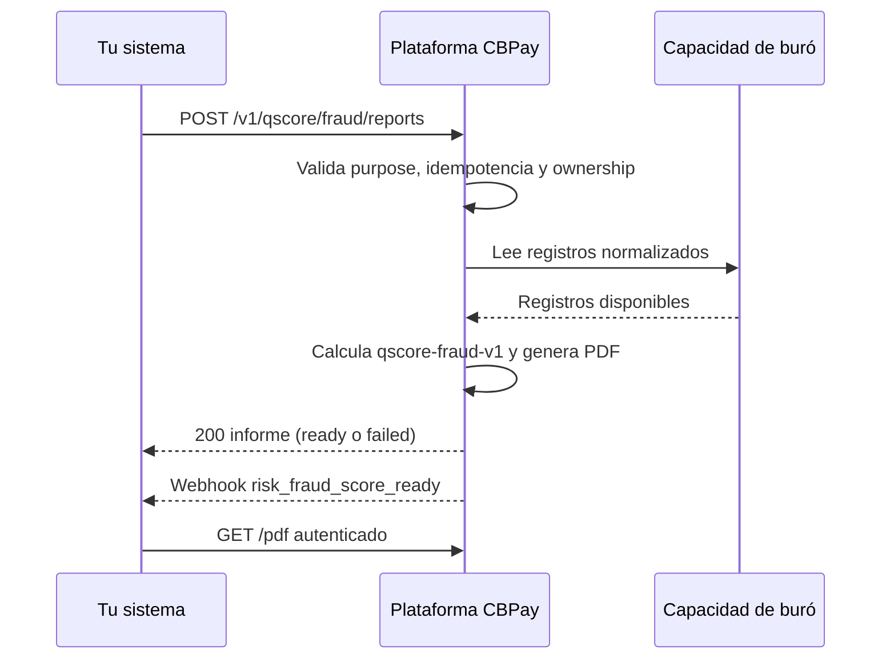

import { EnvUrls } from "/snippets/env-urls.jsx";

<EnvUrls lang="es" />

Fraude e identidad es un producto separado del informe de crédito. Devuelve
un **score de riesgo de fraude**: un valor más alto significa mayor riesgo
observado. Combina velocidad de consultas, señales verificadas de la
plataforma, consistencia de contacto, evidencia de dispositivo/IP compartido
y cobertura de buró disponible. No es un score crediticio.

<Note>
El producto exige el service flag `risk` y cobra el servicio fijo
`risk_fraud_score`. Si falla la generación, el cargo se reembolsa
automáticamente. El PDF y las señales detalladas nunca viajan por email.
</Note>

## Flujo



## Crear un informe

`POST /v1/qscore/fraud/reports` es autenticado y exige una cuenta verificada.
La clave puede ir en el body o en el header `Idempotency-Key`.

| Campo | Obligatorio | Descripción |
|---|---:|---|
| `country` | sí | País ISO 3166-1 alpha-2 del documento. |
| `doc_id` | sí | Documento del sujeto; el RUT chileno se normaliza y valida. |
| `subject_type` | no | `person` o `company`; se infiere si es posible. |
| `purpose` | sí | `fraud_prevention`, `identity_verification`, `onboarding` u `other`. |
| `lang` | no | `en`, `es` o `zh`; default `en`. |
| `idempotency_key` | sí | Clave única de esta compra. |

```bash Crear informe de fraude
curl -X POST "https://api.qbank.cl/platform/v1/qscore/fraud/reports" \
  -H "Authorization: Bearer pk_live_..." \
  -H "Content-Type: application/json" \
  -H "Idempotency-Key: fraud-check-2026-09-06-001" \
  -d '{"country":"CL","doc_id":"76.123.456-0","subject_type":"company","purpose":"identity_verification","lang":"es"}'
```

```json 200 OK
{
  "report_id": "9f1c2d3e-4a5b-4c6d-8e7f-0a1b2c3d4e5f",
  "kind": "qscore_fraud",
  "subject_id": "3fa85f64-5717-4562-b3fc-2c963f66afa6",
  "country": "CL",
  "doc_id": "76123456-0",
  "subject_type": "company",
  "purpose": "identity_verification",
  "status": "ready",
  "model_version": "qscore-fraud-v1",
  "lang": "es",
  "score": 280,
  "band": "B",
  "reason_codes": [{"code":"NEW_SUBJECT","direction":"negative","weight":"high"}],
  "verify_code": "F9f1c2d3e4a5b6c7d8e9f00112233445566778899aabbccddeeff0011223344",
  "verify_url": "https://business.cbpayapp.com/verify/qscore-fraud/F9f1c2d3e4a5b6c7d8e9f00112233445566778899aabbccddeeff0011223344",
  "pdf_url": "/v1/qscore/fraud/reports/9f1c2d3e-4a5b-4c6d-8e7f-0a1b2c3d4e5f/pdf",
  "created_at": "2026-09-06T15:04:12Z"
}
```

Repetir la misma clave devuelve el informe original con
`"idempotency_hit": true`; no cobra ni genera otro informe.

## Consultar y descargar

`GET /v1/qscore/fraud/reports` exige `from` y `to` (`YYYY-MM-DD`, timezone de
la organización, inclusivos), acepta `status` y pagina con `page`/
`page_size` (default 50, máximo 200). `GET .../{report_id}` devuelve sus
metadatos, razones y links. Un ID inválido o fuera de ownership responde
`404 not_found`.

`GET /v1/qscore/fraud/reports/{report_id}/pdf` descarga el PDF autenticado
como `qxrisk_fraud_<report_id>.pdf`. Solo existe cuando el estado es `ready`.

```bash Listar informes listos
curl "https://api.qbank.cl/platform/v1/qscore/fraud/reports?from=2026-09-01&to=2026-09-30&status=ready&page=1&page_size=50" \
  -H "Authorization: Bearer pk_live_..."
```

```json 200 OK
{"items":[{"report_id":"9f1c2d3e-4a5b-4c6d-8e7f-0a1b2c3d4e5f","kind":"qscore_fraud","country":"CL","doc_id":"76123456-0","purpose":"identity_verification","status":"ready","score":280,"band":"B","created_at":"2026-09-06T15:04:12Z"}],"meta":{"page":1,"page_size":50,"total":1}}
```

## Score, bandas y estados

El modelo es `qscore-fraud-v1`, de 1 a 999. A diferencia del crédito, aquí
un score alto es peor.

| Banda | Score | Lectura |
|---|---:|---|
| `A` | 1–199 | Menor riesgo observado |
| `B` | 200–399 | Riesgo bajo a moderado |
| `C` | 400–599 | Riesgo moderado |
| `D` | 600–799 | Riesgo alto |
| `E` | 800–999 | Riesgo muy alto |

Los reason codes implementados son `NEW_SUBJECT`, `VELOCITY`,
`CONTACT_MISMATCH`, `SHARED_DEVICE_IP` y `THIN_FILE`.

| Estado | Significado | Acción |
|---|---|---|
| `pending` | Registro creado mientras genera | Consultar el detalle |
| `ready` | Score, razones, código y PDF disponibles | Leer o descargar |
| `failed` | Falló la generación y se reembolsó | Leer `error_code` y reintentar con otra clave |

## Webhook, email y verificación pública

El webhook firmado `risk_fraud_score_ready` llega a la cuenta:

```json risk_fraud_score_ready
{"report_id":"9f1c2d3e-4a5b-4c6d-8e7f-0a1b2c3d4e5f","kind":"qscore_fraud","subject_id":"3fa85f64-5717-4562-b3fc-2c963f66afa6","country":"CL","doc_id":"76••••••-0","score":280,"band":"B","status":"ready"}
```

El email es best-effort y brandeado. Solo contiene una referencia corta, el
documento consultado y acceso a la cuenta: no incluye PDF, score, banda ni
señales.

`GET /verify/qscore-fraud/{code}` no requiere auth. Un código válido devuelve:

```json 200 OK
{"valid":true,"type":"qscore_fraud","status":"ready","date":"2026-09-06","issued_by":"CBPay"}
```

Un código inválido responde `404` con `valid:false` y nunca revela PII,
score ni señales. El endpoint está limitado por IP.

## Errores

| HTTP | Código | Solución |
|---:|---|---|
| 400 | `invalid_doc_id` | Corrige el documento para el país |
| 400 | `invalid_purpose` | Usa uno de los cuatro propósitos cerrados |
| 400 | `invalid_subject_type` | Envía `person` o `company` |
| 400 | `idempotency_key_required` | Envía el campo o el header |
| 403 | `verification_required` | Completa KYC/KYB |
| 403 | `service_disabled` | Habilita `risk` para la cuenta |
| 404 | `not_found` | Revisa el ID o espera que el PDF esté listo |
| 429 | `too_many_attempts` | Reduce la frecuencia de verificaciones públicas |
| 502 | `generation_failed` | El cargo fue reembolsado; reintenta con clave nueva |

## FAQ

<AccordionGroup>
  <Accordion title="¿Es un score de crédito?">
    No. Es un score separado de fraude e identidad: un valor alto significa
    mayor riesgo observado.
  </Accordion>
  <Accordion title="¿Existe un endpoint score-only?">
    No. El producto siempre crea el informe completo, PDF y código verificable.
  </Accordion>
  <Accordion title="¿Un retry cobra dos veces?">
    No si reutilizas la misma clave de idempotencia.
  </Accordion>
</AccordionGroup>
