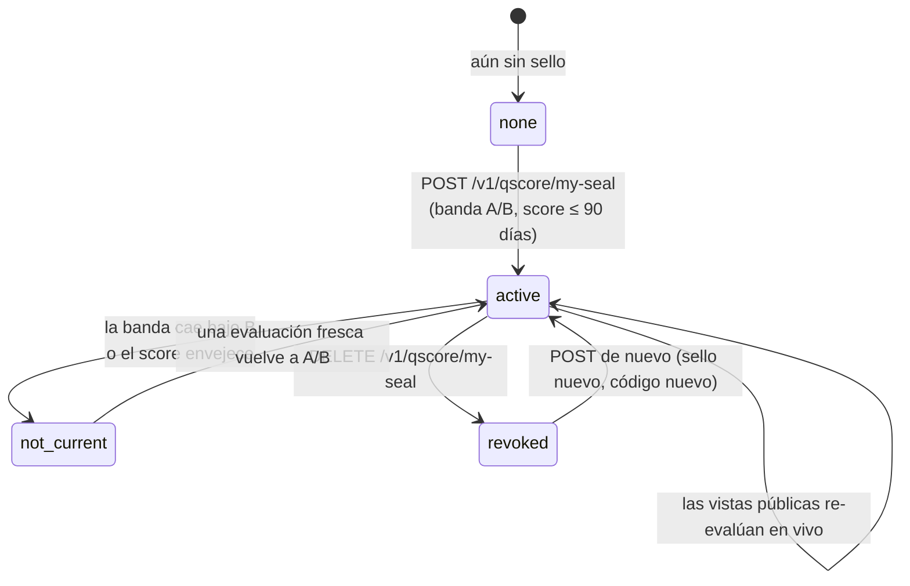

import { EnvUrls } from "/snippets/env-urls.jsx";

<EnvUrls lang="es" />

El **sello Qscore** es un badge público y verificable que una empresa con buen comportamiento crediticio puede mostrar en su sitio web, cotizaciones y correos: una página pública de verificación más un badge SVG embebible que muestra la banda Qscore **vigente** de la empresa (A o B).

Es gratis, self-service y radicalmente honesto por diseño: el badge se evalúa **en vivo** en cada vista. Si el score cae bajo la banda B o envejece (sin evaluación en los últimos 90 días), la superficie pública deja de mostrar la banda por sí sola — nunca tienes que acordarte de bajarlo, y jamás puedes exhibir una banda que ya no tienes.

## Cuándo usarlo

- Eres una **cuenta empresa** con KYB aprobado y una banda Qscore **A o B** (score ≥ 650), evaluada dentro de los últimos 90 días — desde cualquier informe, propio o comprado por un tercero.
- Quieres demostrar solvencia crediticia a clientes, proveedores o partners con un link que pueden verificar solos, en vez de mandar PDFs.
- Quieres que la prueba **expire por sí sola** cuando deja de ser cierta.

<Note>
El sello está disponible **solo para empresas**. Las cuentas persona ya tienen códigos de verificación pública por informe en cada informe Qscore que generan (ver la [guía de Qscore](/es/guias/qscore)).
</Note>

## Cómo funciona



- **La activación** crea un sello con un código público firmado criptográficamente. Activar dos veces es seguro: la segunda llamada devuelve el sello existente (`idempotency_hit: true`).
- **Cada vista pública re-evalúa la elegibilidad en vivo**: la página y el badge muestran la banda solo si el sello está activo **y** el sujeto todavía califica en ese momento.
- **La revocación es tuya**: `DELETE` retira el sello de forma permanente (ese código responderá "revocado" para siempre). Puedes activar un sello nuevo después — con un código nuevo.

## Paso 1 — Activa tu sello

Requiere sesión de cuenta (cuenta empresa con KYB aprobado). Sin body y sin clave de idempotencia: la activación es naturalmente idempotente por sujeto.

```bash
curl -X POST https://api.qbank.cl/platform/v1/qscore/my-seal \
  -H "Authorization: Bearer $SESSION_TOKEN"
```

`201 Created` — el sello queda activo:

```json
{
  "seal": {
    "seal_id": "c8f3e2a1-9b4d-4c7e-8a1f-2e5d6b7c8a91",
    "subject_id": "3e9b7c41-2f68-4a1d-8c5e-9a0d4b6f8e21",
    "status": "active",
    "created_at": "2026-08-09T14:22:10Z",
    "verify_code": "Sc8f3e2a19b4d4c7e8a1f2e5d6b7c8a91a1b2c3d4e5f60718",
    "verify_url": "https://api.qbank.cl/platform/verify/qscore/seal/Sc8f3e2a19b4d4c7e8a1f2e5d6b7c8a91a1b2c3d4e5f60718",
    "badge_url": "https://api.qbank.cl/platform/verify/qscore/seal/Sc8f3e2a19b4d4c7e8a1f2e5d6b7c8a91a1b2c3d4e5f60718/badge.svg"
  },
  "subject_id": "3e9b7c41-2f68-4a1d-8c5e-9a0d4b6f8e21",
  "eligibility": {
    "eligible": true,
    "band": "A",
    "score": 831,
    "evaluated_at": "2026-08-07T16:45:31Z"
  }
}
```

Llamar `POST` de nuevo con el sello activo devuelve `200 OK` con el **mismo** sello y `"idempotency_hit": true` — los reintentos jamás crean duplicados. La cuenta recibe un email brandeado al activar el sello (y otro al revocarlo).

## Paso 2 — Consulta el estado y la elegibilidad

```bash
curl https://api.qbank.cl/platform/v1/qscore/my-seal \
  -H "Authorization: Bearer $SESSION_TOKEN"
```

`200 OK`:

```json
{
  "subject_id": "3e9b7c41-2f68-4a1d-8c5e-9a0d4b6f8e21",
  "seal": {
    "seal_id": "c8f3e2a1-9b4d-4c7e-8a1f-2e5d6b7c8a91",
    "subject_id": "3e9b7c41-2f68-4a1d-8c5e-9a0d4b6f8e21",
    "status": "active",
    "created_at": "2026-08-09T14:22:10Z",
    "verify_code": "Sc8f3e2a19b4d4c7e8a1f2e5d6b7c8a91a1b2c3d4e5f60718",
    "verify_url": "https://api.qbank.cl/platform/verify/qscore/seal/Sc8f3e2a19b4d4c7e8a1f2e5d6b7c8a91a1b2c3d4e5f60718",
    "badge_url": "https://api.qbank.cl/platform/verify/qscore/seal/Sc8f3e2a19b4d4c7e8a1f2e5d6b7c8a91a1b2c3d4e5f60718/badge.svg"
  },
  "eligibility": {
    "eligible": true,
    "band": "A",
    "score": 831,
    "evaluated_at": "2026-08-07T16:45:31Z"
  }
}
```

El bloque `eligibility` siempre está **en vivo** — úsalo para saber si podrías activar (o seguir exhibiendo) el sello antes de hacer nada:

| `reason` (cuando `eligible: false`) | Significado |
|---|---|
| `no_score` | Aún no existe una evaluación Qscore — genera primero tu informe propio (`POST /v1/qscore/my-report`) |
| `band_too_low` | La banda actual es C, D o E — solo A y B califican |
| `score_stale` | La última evaluación tiene más de 90 días — genera un informe fresco |
| `companies_only` | Las cuentas persona no tienen sello (200 con `seal: null`) |

Un sello revocado sigue apareciendo en la respuesta con `status: "revoked"` y `revoked_at`, y **sin** `verify_code`/`verify_url`/`badge_url`.

## Paso 3 — Publícalo

Comparte el `verify_url` directo, o embebe el badge en tu sitio. El badge es un SVG plano servido sin credenciales:

```html
<a href="https://api.qbank.cl/platform/verify/qscore/seal/Sc8f3e2a19b4d4c7e8a1f2e5d6b7c8a91a1b2c3d4e5f60718" target="_blank" rel="noopener">
  
</a>
```

- El badge mide **180×64**, fondo oscuro, con la letra de la banda (A o B) mientras el sello esté vigente.
- Si el sello deja de estar vigente, la misma URL renderiza un **badge gris "NO VIGENTE"** — jamás muestra una banda envejecida ni rompe visualmente tu página.
- `Cache-Control: public, max-age=300`: los visores pueden cachear la imagen hasta 5 minutos.
- La URL del badge responde `404` (vacío) solo para códigos inválidos o alterados.

## Paso 4 — Revócalo (opcional)

Retira el sello en cualquier momento. La revocación es **permanente para ese código**: la página pública mostrará "sello revocado" para siempre, y el badge queda gris. Puedes activar un sello nuevo después con un código fresco.

```bash
curl -X DELETE https://api.qbank.cl/platform/v1/qscore/my-seal \
  -H "Authorization: Bearer $SESSION_TOKEN"
```

`200 OK`:

```json
{
  "seal": {
    "seal_id": "c8f3e2a1-9b4d-4c7e-8a1f-2e5d6b7c8a91",
    "subject_id": "3e9b7c41-2f68-4a1d-8c5e-9a0d4b6f8e21",
    "status": "revoked",
    "created_at": "2026-08-09T14:22:10Z",
    "revoked_at": "2026-08-09T18:03:44Z"
  }
}
```

## Qué ven los verificadores (público, sin credenciales)

Cualquiera con el link puede comprobar el sello — JSON para máquinas, página HTML brandeada para navegadores (`Accept: text/html`):

```bash
curl https://api.qbank.cl/platform/verify/qscore/seal/Sc8f3e2a19b4d4c7e8a1f2e5d6b7c8a91a1b2c3d4e5f60718
```

Sello vigente — `200 OK`:

```json
{
  "valid": true,
  "type": "qscore_seal",
  "seal_status": "active",
  "band": "A",
  "evaluated_at": "2026-08-07",
  "company_name": "Comercial Andes SpA",
  "doc_id": "76.543.210-3",
  "country": "CL"
}
```

Sello revocado — `200 OK`:

```json
{
  "valid": false,
  "seal_status": "revoked",
  "revoked_at": "2026-08-09"
}
```

Sello que dejó de ser elegible (banda caída o score envejecido) — `200 OK`:

```json
{
  "valid": false,
  "seal_status": "not_current"
}
```

Código inválido o alterado — `404`:

```json
{
  "valid": false,
  "seal_status": "not_current"
}
```

<Warning>
**Anti-oráculo por diseño.** Cuando un sello no está vigente, la superficie pública solo dice `not_current` — jamás revela la banda a la que cayó la empresa, el score, ni el motivo (envejecido vs. caído). El score numérico nunca aparece en ninguna superficie pública: solo la banda, solo mientras se la merece.
</Warning>

Los endpoints públicos tienen rate limit por IP (`429 too_many_attempts`).

## Estados del sello

| Estado | Dónde se ve | Superficie pública |
|---|---|---|
| `active` | API autenticada, mientras la elegibilidad se mantiene | Banda A/B + nombre de empresa, documento y país |
| `not_current` | Solo superficies públicas (el sello está activo pero ya no es elegible) | Badge gris, `valid: false`, sin banda ni motivo |
| `revoked` | En todas partes | Página "revocado" con la fecha; badge gris |

## Errores

| HTTP | `error` | Solución |
|---|---|---|
| 400 | `invalid_tax_id` | El identificador fiscal verificado de la cuenta no es válido para su país — contacta a soporte para corregir tus datos verificados |
| 401 | `unauthorized` | Inicia sesión con una cuenta empresa |
| 403 | `kyc_required` | Completa primero la verificación de identidad (KYB) |
| 404 | `no_active_seal` | Llamaste `DELETE` sin un sello activo — no hay nada que revocar |
| 409 | `no_tax_id` | La cuenta verificada no tiene identificador fiscal registrado — completa primero tus datos verificados |
| 409 | `identity_mismatch` | El identificador fiscal de la cuenta no calza con el documento de identidad verificado — contacta a soporte |
| 409 | `seal_companies_only` | La cuenta es una persona; el sello es solo para empresas |
| 409 | `seal_not_eligible` | La banda no es A/B o la evaluación tiene más de 90 días — revisa el `eligibility.reason` en vivo con `GET`, genera un informe fresco y reintenta |
| 429 | `too_many_attempts` | La verificación pública tiene rate limit por IP — espera un momento y reintenta |

Mira el [catálogo de errores](/es/errores) completo.

## Webhooks y comisiones

El sello **no emite webhooks** ni **cobra comisión** — es una superficie self-service sobre tus propios datos verificados, como el informe crediticio propio. Los cambios de estado se avisan por email brandeado a la cuenta (activación y revocación).

## Preguntas frecuentes

<AccordionGroup>
  <Accordion title="¿El sello cuesta algo?">
    No. Activar, exhibir y revocar el sello es gratis. Las evaluaciones Qscore detrás siguen las reglas normales (tu informe propio es gratis cada 30 días).
  </Accordion>
  <Accordion title="¿Qué informe me hace elegible?">
    Cualquiera: tu propio informe self o uno que un tercero haya comprado sobre tu empresa. El sello siempre lee el **último** score registrado, sea cual sea su origen.
  </Accordion>
  <Accordion title="¿Qué pasa si mi score cae después de publicar el badge?">
    El badge y la página se ponen grises / `not_current` solos en la próxima vista — evaluados en vivo, con a lo sumo 5 minutos de caché. Cuando una evaluación fresca te devuelva a la banda A/B, el sello vuelve a mostrar la banda sin que hagas nada (mientras no lo hayas revocado).
  </Accordion>
  <Accordion title="¿Puedo revocar y volver a activar?">
    Sí. La revocación es permanente para el código revocado (siempre responderá "revocado"), pero puedes activar un sello nuevo en cualquier momento, con código y URLs nuevos.
  </Accordion>
  <Accordion title="¿Una cuenta persona puede tener sello?">
    No — el sello es para empresas. Los informes persona llevan su propio código de verificación pública impreso en cada informe (ver la [guía de Qscore](/es/guias/qscore)).
  </Accordion>
  <Accordion title="¿Los verificadores pueden ver mi score numérico?">
    Nunca. La página pública y el JSON muestran solo la banda (A o B), el nombre de la empresa, el documento y el país, y la fecha de evaluación — solo mientras el sello está vigente.
  </Accordion>
</AccordionGroup>
