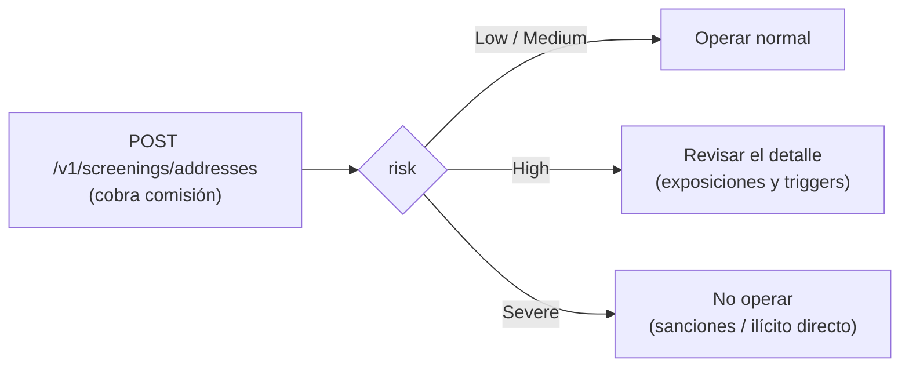

El **screening de wallets** evalúa una dirección blockchain contra
inteligencia on-chain global y devuelve su nivel de riesgo: si pertenece a
una entidad sancionada, si recibió fondos de origen ilícito (ransomware,
darknet, robos) y a qué categorías está expuesta. Úsalo antes de enviar
fondos a una dirección de un tercero, al recibir una wallet nueva de un
cliente, o como parte de tu propio programa de compliance.

Es el complemento on-chain del [AML screening](/es/guias/aml) (que evalúa
identidades de personas/empresas): aquí lo que se evalúa es la **dirección**.



<Note>
La comisión del servicio `address_screening` (fija, por scan) se debita al
ejecutar y se **reembolsa automáticamente** si el screening falla. Con
comisión 0 el servicio es gratuito para ti. Requiere tener tu propia
[verificación de identidad aprobada](/es/guias/kyc#tu-propia-verificacion-onboarding)
y el servicio `screenings` habilitado en tu cuenta.
</Note>

## Ejecutar un screening

La evaluación es **agnóstica a la red**: la misma dirección se evalúa sobre
todas las blockchains soportadas a la vez. El campo `chain` es opcional y
solo etiqueta tu registro. Como el scan cobra comisión, la
`idempotency_key` es **obligatoria** — reintentar con la misma clave jamás
cobra dos veces.

<Steps>
<Step title="Envía la dirección">

```bash
curl -X POST https://api.qbank.cl/platform/v1/screenings/addresses \
  -H "Authorization: Bearer <token>" \
  -H "Content-Type: application/json" \
  -d '{
    "address": "TN2BBWc9EF8MMB6i1c4HZHXAssTEXstMDo",
    "chain": "tron",
    "idempotency_key": "scan-cliente-742-1"
  }'
```

</Step>
<Step title="Lee el nivel de riesgo">

Respuesta `201` — una dirección limpia:

```json
{
  "screening_id": "5f0b1c9a-2f3e-4a7b-9c1d-8e6f5a4b3c2d",
  "address": "TN2BBWc9EF8MMB6i1c4HZHXAssTEXstMDo",
  "chain": "tron",
  "risk": "Low",
  "screening_fee": "0.500000",
  "fee_asset": "USDT",
  "idempotency_key": "scan-cliente-742-1",
  "created_at": "2026-07-12T14:30:00Z",
  "assessment": {
    "address": "TN2BBWc9EF8MMB6i1c4HZHXAssTEXstMDo",
    "risk": "Low",
    "address_identifications": [],
    "exposures": [
      { "category": "exchange", "value_usd": "1250.75" }
    ],
    "triggers": []
  }
}
```

Y una dirección sancionada:

```json
{
  "screening_id": "7a2c4e6f-8b1d-4c3a-9e5f-1a2b3c4d5e6f",
  "address": "0x098B716B8Aaf21512996dC57EB0615e2383E2f96",
  "chain": "eth",
  "risk": "Severe",
  "risk_reason": "Identified as Sanctioned Entity",
  "screening_fee": "0.500000",
  "fee_asset": "USDT",
  "idempotency_key": "scan-sospechosa-9",
  "created_at": "2026-07-12T14:31:00Z",
  "assessment": {
    "address": "0x098B716B8Aaf21512996dC57EB0615e2383E2f96",
    "risk": "Severe",
    "risk_reason": "Identified as Sanctioned Entity",
    "cluster_name": "OFAC SDN Ronin Bridge Exploiter",
    "cluster_category": "sanctioned entity",
    "address_identifications": [
      {
        "name": "SANCTIONS: OFAC SDN Ronin Bridge Exploiter",
        "category": "sanctioned entity",
        "description": "This specific address 0x098b716b8aaf21512996dc57eb0615e2383e2f96 within this cluster has been identified as belonging to a sanctioned entity."
      }
    ],
    "exposures": [],
    "triggers": []
  }
}
```

</Step>
<Step title="Decide según el riesgo">

Aplica tu política sobre `risk` (tabla de niveles abajo). El objeto
`assessment` trae la evidencia completa para tu expediente: identificaciones
puntuales, exposición en USD por categoría y las reglas de riesgo gatilladas.

</Step>
</Steps>

Reintentar con la misma `idempotency_key` devuelve el screening original
con `idempotency_hit: true` y **no cobra de nuevo**:

```json
{
  "screening_id": "5f0b1c9a-2f3e-4a7b-9c1d-8e6f5a4b3c2d",
  "address": "TN2BBWc9EF8MMB6i1c4HZHXAssTEXstMDo",
  "risk": "Low",
  "screening_fee": "0.500000",
  "fee_asset": "USDT",
  "idempotency_key": "scan-cliente-742-1",
  "created_at": "2026-07-12T14:30:00Z",
  "idempotency_hit": true
}
```

## Consultar el historial

Todo screening queda guardado. El listado exige `from`/`to` y soporta
paginación y filtro por riesgo:

```bash
curl "https://api.qbank.cl/platform/v1/screenings/addresses?from=2026-07-01&to=2026-07-12&risk=severe&page=1&page_size=50" \
  -H "Authorization: Bearer <token>"
```

```json
{
  "page": 1,
  "page_size": 50,
  "screenings": [
    {
      "screening_id": "7a2c4e6f-8b1d-4c3a-9e5f-1a2b3c4d5e6f",
      "address": "0x098B716B8Aaf21512996dC57EB0615e2383E2f96",
      "chain": "eth",
      "risk": "Severe",
      "risk_reason": "Identified as Sanctioned Entity",
      "screening_fee": "0.500000",
      "fee_asset": "USDT",
      "idempotency_key": "scan-sospechosa-9",
      "created_at": "2026-07-12T14:31:00Z"
    }
  ]
}
```

Y el detalle por id (incluye el `assessment` completo):

```bash
curl https://api.qbank.cl/platform/v1/screenings/addresses/7a2c4e6f-8b1d-4c3a-9e5f-1a2b3c4d5e6f \
  -H "Authorization: Bearer <token>"
```

## Niveles de riesgo

| `risk` | Qué significa | Qué hacer |
|---|---|---|
| `Low` | Sin señales de riesgo relevantes | Operar normal |
| `Medium` | Exposición menor a categorías de riesgo | Operar; considerar registro interno |
| `High` | Exposición significativa a fondos ilícitos | Revisar `exposures`/`triggers` antes de operar |
| `Severe` | Entidad sancionada o ilícito directo | **No operar** con la dirección |

Los niveles son **finales** (el screening es una foto al momento de la
consulta): si necesitas re-evaluar la misma dirección más adelante, ejecuta
un scan nuevo con otra `idempotency_key`.

## Protección automática (sin costo)

Además del screening a demanda, la plataforma **protege tus operaciones
crypto automáticamente y gratis**:

- **Retiros on-chain**: la dirección de destino se evalúa antes de firmar.
  Si es de riesgo severo, el retiro se rechaza y el monto retenido se
  **reembolsa completo** a tu saldo (verás el retiro `failed` con
  `core_rejected` y su webhook `crypto_withdrawal_status_changed`).
- **Depósitos entrantes**: el remitente de cada depósito se evalúa antes de
  acreditar. Un remitente de riesgo severo deja el depósito **retenido en
  revisión de compliance** (webhook `crypto_deposit_held`); uno de riesgo
  alto se acredita normal con una alerta informativa
  (webhook `crypto_deposit_alert`).

<Warning>
Un depósito retenido NO está perdido: el equipo de compliance de tu
operador lo revisa y decide liberarlo (se acredita con su comisión normal
de funding) o rechazarlo. Si recibes un `crypto_deposit_held`, contacta a
tu operador con el `tx_id`.
</Warning>

## Webhooks

| Evento | Cuándo |
|---|---|
| `crypto_deposit_held` | Un depósito entrante quedó retenido por riesgo del remitente |
| `crypto_deposit_alert` | Un depósito se acreditó pero el remitente presenta riesgo alto (informativo) |

```json crypto_deposit_held
{
  "account_id": "ae8c…",
  "hold_id": "c1d2e3f4-…",
  "chain": "tron",
  "asset": "usdt",
  "tx_id": "8a5b3c…",
  "risk": "Severe",
  "status": "held"
}
```

Suscríbete igual que al resto de eventos (ver [Webhooks](/es/webhooks)).

## Errores

| HTTP | `error` | Causa | Solución |
|---|---|---|---|
| 400 | `idempotency_key_required` | Falta la clave de idempotencia | Envía `idempotency_key` en el body o el header `Idempotency-Key` |
| 400 | `invalid_payload` | Falta `address` o es demasiado larga | Revisa el campo `address` |
| 400 | `invalid_range` | `from`/`to` faltantes o inválidos en el listado | Usa `YYYY-MM-DD` en ambos |
| 402 | `insufficient_funds` | Saldo insuficiente para la comisión | Fondea la cuenta y reintenta con la MISMA clave |
| 403 | `verification_required` | Tu cuenta aún no aprobó su verificación | Completa tu [onboarding](/es/guias/kyc#tu-propia-verificacion-onboarding) |
| 403 | `service_disabled` | El servicio `screenings` está deshabilitado para tu cuenta | Contacta a tu operador |
| 404 | `not_found` | El `screening_id` no existe o no es tuyo | Verifica el id |
| 422 | `invalid_address` | La dirección no pudo evaluarse (formato) | Revisa el formato de la dirección |
| 502 | `screening_unavailable` | Servicio temporalmente no disponible (la comisión se reembolsó) | Reintenta más tarde con la MISMA clave |

## Preguntas frecuentes

<AccordionGroup>
<Accordion title="¿Necesito indicar la red (chain) de la dirección?">
No. La evaluación cubre todas las redes soportadas a la vez: una dirección
ETH se evalúa con toda su actividad on-chain conocida. `chain` es solo una
etiqueta opcional para tu propio registro.
</Accordion>
<Accordion title="¿Puedo scanear direcciones que no son mías ni de mis clientes?">
Sí. El producto acepta cualquier dirección blockchain — es exactamente el
caso de uso de evaluar a un tercero antes de operar con él. Cada scan cobra
su comisión.
</Accordion>
<Accordion title="¿El resultado caduca?">
El screening es una foto al momento de la consulta y queda guardado como
evidencia con su fecha. El riesgo de una dirección puede cambiar (nuevas
sanciones, nueva actividad): para decisiones sensibles re-evalúa con un
scan fresco.
</Accordion>
<Accordion title="¿Los scans de la protección automática me los cobran?">
No. El screening automático de retiros y depósitos es parte del programa de
compliance de la plataforma y no tiene costo. Solo el scan a demanda
(`POST /v1/screenings/addresses`) cobra la comisión `address_screening`.
</Accordion>
<Accordion title="¿Qué pasa si el servicio de screening está caído cuando retiro?">
Por seguridad, los retiros no se firman sin poder evaluar el destino: el
retiro queda rechazado con reembolso completo y puedes reintentar más
tarde. Los depósitos entrantes NO se retienen por una caída del servicio —
se acreditan normal.
</Accordion>
</AccordionGroup>
