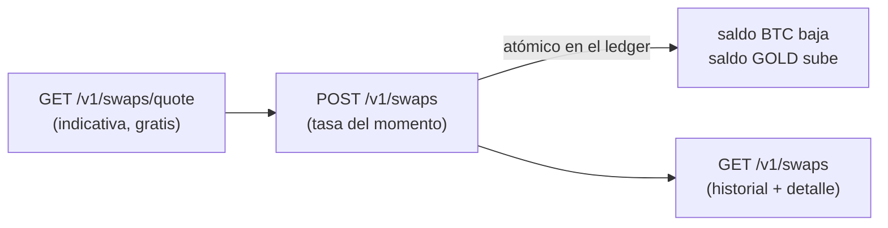

import { EnvUrls } from "/snippets/env-urls.jsx";

<EnvUrls lang="es" />

Los **swaps** convierten saldo entre tus cuatro monedas — `USDT`, `USDC`,
`BTC` y `GOLD` — de forma **síncrona e instantánea**, sin que la plata salga
de tu cuenta. Cualquier par funciona (también `BTC` ↔ `GOLD` directo). La
tasa que ves en la cotización es la tasa a la que se ejecuta: **no hay
comisiones aparte** — cotizado = recibido.



## 1. Cotiza (opcional, gratis)

```bash
curl "https://api.qbank.cl/platform/v1/swaps/quote?from_asset=USDT&to_asset=BTC&amount=1000" \
  -H "Authorization: Bearer <token>"
```

```json
{
  "from_asset": "USDT",
  "to_asset": "BTC",
  "from_amount": "1000.000000",
  "to_amount": "0.01568419",
  "rate": "0.00001568",
  "indicative": true
}
```

La cotización es **indicativa**: el swap se ejecuta a la tasa del momento
del `POST` (los precios de BTC y GOLD se mueven). Para pares entre
stablecoins (`USDT` ↔ `USDC`) la tasa es estable.

## 2. Ejecuta el swap

<CodeGroup>

```bash USDT → BTC
curl -X POST https://api.qbank.cl/platform/v1/swaps \
  -H "Authorization: Bearer <token>" \
  -H "Content-Type: application/json" \
  -d '{
    "from_asset": "USDT",
    "to_asset": "BTC",
    "amount": "1000",
    "idempotency_key": "swap-2026-07-10-a"
  }'
```

```bash BTC → GOLD (directo)
curl -X POST https://api.qbank.cl/platform/v1/swaps \
  -H "Authorization: Bearer <token>" \
  -H "Content-Type: application/json" \
  -d '{
    "from_asset": "BTC",
    "to_asset": "GOLD",
    "amount": "0.01",
    "idempotency_key": "swap-2026-07-10-b"
  }'
```

```bash USDT → USDC
curl -X POST https://api.qbank.cl/platform/v1/swaps \
  -H "Authorization: Bearer <token>" \
  -H "Content-Type: application/json" \
  -d '{
    "from_asset": "USDT",
    "to_asset": "USDC",
    "amount": "500",
    "idempotency_key": "swap-2026-07-10-c"
  }'
```

</CodeGroup>

`amount` va en la moneda de **origen** (`from_asset`), con hasta sus
decimales (6 para USDT/USDC/GOLD, 8 para BTC).

Respuesta `201` — el swap es síncrono, tu saldo cambia al instante:

```json
{
  "swap_id": "8a1b2c3d-4e5f-6a7b-8c9d-0e1f2a3b4c5d",
  "account_id": "9b1deb4d-3b7d-4bad-9bdd-2b0d7b3dcb6d",
  "from_asset": "USDT",
  "to_asset": "BTC",
  "from_amount": "1000.000000",
  "to_amount": "0.01568419",
  "rate": "0.00001568",
  "status": "completed",
  "idempotency_key": "swap-2026-07-10-a",
  "created_at": "2026-07-10T15:00:00Z"
}
```

Replay con la misma `idempotency_key` → `200` con el swap original y
`idempotency_hit: true` — **jamás se re-ejecuta**.

## 3. Consulta e historial

```bash
# Historial con paginación, fechas y filtro por moneda (matchea ambas puntas)
curl "https://api.qbank.cl/platform/v1/swaps?from=2026-07-01&to=2026-07-10&asset=BTC&page=1&page_size=50" \
  -H "Authorization: Bearer <token>"

# Detalle
curl https://api.qbank.cl/platform/v1/swaps/{swap_id} \
  -H "Authorization: Bearer <token>"
```

En tu historial de movimientos (`GET /v1/movements`) y en la
[cartola](/es/guias/cartola) el swap aparece como `swap_out` en la moneda
de origen y `swap_in` en la de destino, cada uno cuadrando en su sección.

## Reglas y límites

- **Misma cuenta**: la plata nunca sale de tu cuenta — solo cambia de
  moneda. Por eso no pide OTP.
- **Cualquier par** entre `USDT`, `USDC`, `BTC` y `GOLD` (origen ≠ destino).
- **Tasa de ejecución del momento**: para BTC y GOLD se usa el precio de
  ejecución en vivo; si el precio no está disponible o está desactualizado,
  el swap se rechaza con `503 pricing_unavailable` (nunca se ejecuta con un
  precio viejo).
- **Límites para monedas volátiles** (BTC/GOLD, compartidos con payouts y
  compras con tarjeta): tope por operación y tope de volumen por cuenta en
  24 h móviles (`GET /v1/settlement` muestra los tuyos). USDT ↔ USDC no
  tiene límite.
- Requiere tu [verificación de identidad](/es/guias/kyc) aprobada y el
  servicio `swaps` habilitado.

## Errores

| HTTP | `error` | Causa | Solución |
|---|---|---|---|
| 400 | `invalid_asset` | Moneda fuera de USDT/USDC/BTC/GOLD | Revisa `from_asset`/`to_asset` |
| 400 | `invalid_pair` | Origen y destino son la misma moneda | Elige monedas distintas |
| 400 | `invalid_amount` | Monto inválido o demasiados decimales | Respeta los decimales de la moneda origen |
| 400 | `amount_too_small` | El monto no alcanza ni la unidad mínima del destino | Sube el monto |
| 400 | `swap_asset_disabled` | Una de las monedas está deshabilitada para tu organización | Contacta a tu operador |
| 400 | `idempotency_key_required` | Falta la clave de idempotencia | Envíala en el body o header |
| 402 | `insufficient_funds` | Saldo insuficiente en la moneda origen | Fondea o baja el monto |
| 403 | `verification_required` / `service_disabled` | Cuenta sin verificar o servicio apagado | Completa tu onboarding / contacta a tu operador |
| 422 | `settlement_limit_exceeded` | El swap supera el tope por operación de monedas volátiles | Divide la operación |
| 422 | `settlement_daily_limit_exceeded` | Superaste tu volumen 24 h en monedas volátiles | Reintenta más tarde |
| 503 | `pricing_unavailable` | Precio de ejecución no disponible o viejo | Reintenta en unos minutos |

## Preguntas frecuentes

<AccordionGroup>
<Accordion title="¿Por qué la tasa del swap difiere del precio de mercado que veo en otros lados?">
La tasa cotizada es la tasa **de ejecución** de tu cuenta: incluye el costo
de proveer la conversión instantánea y garantizada (liquidez inmediata, sin
slippage, sin salir de tu cuenta). Es la misma filosofía de las tasas de
payouts y payins: lo cotizado es exactamente lo que recibes, sin comisiones
sorpresa después.
</Accordion>
<Accordion title="¿La cotización del quote está garantizada?">
No — es indicativa. BTC y GOLD se mueven, así que la ejecución usa el
precio del momento del POST. Entre stablecoins (USDT ↔ USDC) la diferencia
es imperceptible. Si necesitas certeza absoluta del monto recibido, revisa
el `to_amount` de la respuesta del swap (esa es la cifra final, ya
acreditada).
</Accordion>
<Accordion title="¿Puedo deshacer un swap?">
No hay "deshacer": un swap ejecutado es final (tu saldo ya cambió). Puedes
hacer el swap inverso cuando quieras, a la tasa vigente de ese momento.
</Accordion>
<Accordion title="¿Por qué mi swap BTC→GOLD fue rechazado por límite si era mi primer swap del día?">
Los límites de monedas volátiles son compartidos entre swaps, payouts
pagados desde BTC/GOLD y compras con tarjeta desde BTC/GOLD — todos suman
al mismo volumen de 24 h móviles de tu cuenta. Consulta tus topes en
`GET /v1/settlement`.
</Accordion>
<Accordion title="¿Qué gano teniendo saldo en GOLD o BTC?">
GOLD representa gramos de oro fino y BTC bitcoin: exposición al precio del
activo sin salir del ecosistema. Puedes pagar payouts, comisiones y compras
con tarjeta directo desde esos saldos (settlement multi-asset), y volver a
USDT/USDC cuando quieras con un swap.
</Accordion>
</AccordionGroup>
