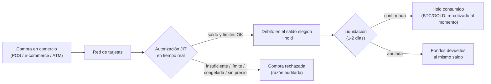

import { EnvUrls } from "/snippets/env-urls.jsx";

<EnvUrls lang="es" />

Las tarjetas CBPay gastan **Just-In-Time del saldo central de la cuenta**:
no hay que prefondearlas ni moverles saldo. Cada tarjeta elige desde qué
saldo gasta (`spending_asset`: **USDT, USDC, BTC o GOLD**). USDT/USDC van
1:1 con el USD; BTC y GOLD se convierten **al precio del momento de cada
evento**. Cada compra se autoriza en tiempo real contra el saldo disponible
de ese asset y los límites propios de la tarjeta, y el débito queda de
inmediato en el historial de movimientos.



## Cuántas tarjetas puedes tener

| Tipo de cuenta | Virtuales | Físicas | ¿Para terceros? |
|---|---|---|---|
| Persona | **1** | **1** | No |
| Empresa | **Ilimitadas** | **Ilimitadas** | Sí: personas designadas (ej. empleados) |

Cada tarjeta gasta del **saldo central de la cuenta en el asset que tenga
configurado** (`spending_asset`, USDT por defecto). El control fino es por
límites de gasto de cada tarjeta (por transacción, diario, mensual), que
siempre se miden en **USD** y puedes cambiar en cualquier momento.

## Elegir el saldo de gasto (USDT, USDC, BTC o GOLD)

Define `spending_asset` al crear la tarjeta o cámbialo después con `PATCH`.
Solo afecta compras futuras: las autorizaciones en vuelo conservan el asset
con el que se debitaron (y su anulación devuelve ese mismo asset).

```bash
curl -X PATCH https://api.qbank.cl/platform/v1/cards/{card_id} \
  -H "Authorization: Bearer <token>" \
  -H "Content-Type: application/json" \
  -d '{ "spending_asset": "BTC" }'
```

**USDT y USDC** valen 1 USD, así que la conversión es exacta 1:1 y sin
comisión de cambio: una compra de 25.00 USD debita 25.000000 del asset
elegido.

**BTC y GOLD** se convierten con el precio efectivo del momento de cada
evento (el mismo precio de settlement que ves en `GET /v1/rates`, bloque
`settlement`):

- **Autorización**: se reserva el equivalente de la compra en tu asset
  **más un pequeño colchón** (no es un cobro: cubre la variación del precio
  hasta la liquidación y se devuelve al capturar). Si el precio de
  ejecución no está disponible en ese momento, la compra se **declina**
  (`pricing_unavailable`) — nunca se convierte con un precio no confiable.
- **Liquidación (captura)**: el monto final se re-convierte al precio del
  momento de la captura; el sobrante del colchón vuelve a tu saldo (o se
  debita la diferencia si el precio se movió más que el colchón).
- **Anulación de una autorización**: se devuelve el monto EXACTO reservado,
  sin conversión.
- **Devoluciones y ajustes posteriores a la captura**: se re-convierten al
  precio del momento del evento. Entre la compra y la devolución el precio
  puede variar — recibes el equivalente en tu asset al precio de ese
  momento, no la cantidad original.
- Las compras BTC/GOLD comparten los **límites de assets volátiles** de tu
  cuenta (por operación y volumen 24 h, visibles en `GET /v1/settlement`).

| Error / rechazo | Dónde | Causa | Solución |
|---|---|---|---|
| `spending_asset_unavailable` | 400 en PATCH / rechazo de compra | El asset no existe o no está habilitado para compras | Usa `USDT`, `USDC`, `BTC` o `GOLD` |
| `settlement_asset_disabled` | 400 en PATCH | Tu operador deshabilitó ese asset | Consulta `GET /v1/settlement` (`enabled_assets`) |
| `pricing_unavailable` | Rechazo de compra (BTC/GOLD) | Precio de ejecución no disponible al autorizar | Reintenta la compra; si persiste, cambia a USDT/USDC |
| `settlement_limit_exceeded` | Rechazo de compra (BTC/GOLD) | La compra excede el límite por operación de assets volátiles | Compra menor o gasta desde USDT/USDC |
| `settlement_daily_limit_exceeded` | Rechazo de compra (BTC/GOLD) | Se alcanzó el volumen 24 h de assets volátiles de la cuenta | Espera o gasta desde USDT/USDC |

<Note>
Si el saldo del asset elegido no alcanza, la compra se rechaza con
`insufficient_funds` — no hay fallback automático a otro saldo.
</Note>

<Warning>
Con BTC/GOLD tu saldo queda expuesto a la variación del precio entre los
eventos de una compra (autorización, captura, devolución). Cada conversión
usa el precio efectivo del momento — CBPay nunca re-cotiza montos hacia
atrás ni te descuenta "por si acaso": el colchón de la autorización se
devuelve siempre al liquidar.
</Warning>

## Costos (configurados por tu operador, pueden ser 0)

| Servicio | Cuándo se cobra |
|---|---|
| `card_creation_virtual` | Al emitir una tarjeta virtual |
| `card_creation_physical` | Al emitir una tarjeta física |
| `card_purchase_virtual` | **Por cada compra** con tarjeta virtual (percent + fijo sobre el monto USD) |
| `card_purchase_physical` | **Por cada compra** con tarjeta física (percent + fijo sobre el monto USD) |
| `card_monthly` | Mensualidad por tarjeta activa (si no hay saldo, la tarjeta se congela — sin deuda) |
| `card_cancellation` | Al cancelar una tarjeta |

Los montos exactos se consultan en `GET /v1/rates` (campo `fees`). Todo
cargo de emisión se **reembolsa automáticamente** si la emisión falla.

### Comisión por compra (ciclo de vida)

La comisión por transacción sigue el mismo ciclo que la compra:

- **Autorización**: el fee estimado se reserva **dentro del hold** junto al
  monto de la compra, en el mismo `spending_asset` de la tarjeta (el % se
  aplica sobre el monto USD de la compra; en BTC/GOLD se convierte con el
  mismo precio del evento).
- **Liquidación**: el fee se **recalcula** con la configuración vigente en
  ese momento y se cobra el definitivo (`card_fee` en tus movimientos); la
  diferencia contra el estimado se libera o se cobra junto al ajuste del
  colchón.
- **Reversas y ajustes a la baja**: el fee se **devuelve prorrateado** a la
  fracción de la compra devuelta (`card_fee_refund`).

Si tu operador cambia el porcentaje entre la autorización y la liquidación,
se cobra el fee de la liquidación — mismo criterio que el precio BTC/GOLD
por evento. Las compras rechazadas (`declined`) **no cobran fee**.

## Crear una tarjeta

El flujo depende de si tu cuenta es **persona** o **empresa** — elige tu
pestaña. La regla común: el **titular (cardholder) se verifica UNA sola vez
por cuenta**, en la primera emisión; las siguientes tarjetas lo reutilizan
sin pedir datos. La `idempotency_key` es obligatoria siempre (un retry con
la misma clave devuelve la tarjeta original y nunca cobra dos veces).

<Tabs>
<Tab title="Cuenta persona">

Una cuenta persona emite tarjetas **para sí misma** (máximo 1 virtual +
1 física).

**Tu primera tarjeta** crea y verifica tu titular en el emisor. Como tu
cuenta ya aprobó su [verificación de identidad](/es/guias/kyc), tus datos y
documentos se **completan solos desde tu verificación** — solo agregas los
campos propios del emisor (`occupation`, `salary_usd`); cualquier campo que
envíes explícito gana sobre el autofill:

```bash
curl -X POST https://api.qbank.cl/platform/v1/cards \
  -H "Authorization: Bearer <token>" \
  -H "Content-Type: application/json" \
  -d '{
    "physical": false,
    "idempotency_key": "card-v-1",
    "cardholder": {
      "occupation": "52201",
      "salary_usd": 1800
    }
  }'
```

`occupation` es un **código del catálogo**
([ver abajo](#ocupacion-y-giro-codigos-de-catalogo)) y `salary_usd` va en
dólares enteros. Si tu verificación se hizo por wizard sin algún dato o
documento que el emisor exige, agrégalo explícito al `cardholder`
(`first_name`, `email`, `address`, `id_front_url`…, mismo formato de
siempre).

**Tu segunda tarjeta** (por ejemplo la física) ya no pide ningún dato —
tu titular quedó verificado:

```bash
curl -X POST https://api.qbank.cl/platform/v1/cards \
  -H "Authorization: Bearer <token>" \
  -H "Content-Type: application/json" \
  -d '{ "physical": true, "idempotency_key": "card-f-1" }'
```

Si intentas una tercera del mismo tipo: `409 card_limit_reached` (cancela
la existente primero).

</Tab>
<Tab title="Cuenta empresa">

Una cuenta empresa emite **tarjetas ilimitadas**, en dos modalidades:

**A. Para la empresa misma** (tarjetas corporativas). La primera emisión
crea el titular empresa con los datos societarios; las siguientes no piden
nada:

<CodeGroup>

```bash Primera tarjeta (crea el titular empresa)
curl -X POST https://api.qbank.cl/platform/v1/cards \
  -H "Authorization: Bearer <token>" \
  -H "Content-Type: application/json" \
  -d '{
    "physical": false,
    "idempotency_key": "card-corp-1",
    "cardholder": {
      "kind_of_business": "J63",
      "legal_representation": "Carlos Soto, Gerente General",
      "email": "finanzas@andina.cl",
      "certificate_of_good_standing_url": "https://files.example.com/kyb/vigencia.pdf",
      "business_license_url": "https://files.example.com/kyb/patente.pdf",
      "register_shareholder_url": "https://files.example.com/kyb/socios.pdf",
      "id_shareholders_url": "https://files.example.com/kyb/ids-socios.pdf",
      "address_verification_shareholders_url": "https://files.example.com/kyb/domicilios.pdf",
      "address": {
        "line1": "Av. Apoquindo 4500",
        "city": "Santiago",
        "region": "RM",
        "postal_code": "7550000",
        "country": "CL"
      }
    }
  }'
```

```bash Siguientes tarjetas (sin datos, con límites)
curl -X POST https://api.qbank.cl/platform/v1/cards \
  -H "Authorization: Bearer <token>" \
  -H "Content-Type: application/json" \
  -d '{
    "physical": true,
    "idempotency_key": "card-f-ops-1",
    "limits": { "per_transaction": "500.00", "monthly": "5000.00" }
  }'
```

</CodeGroup>

**B. Para una persona designada** (ej. un empleado): agrega
`cardholder.kind: "person"` con el `verification_id` del [KYC
**aprobado**](/es/guias/kyc) de ESA persona — su identidad y documentos
salen de la verificación; tú solo agregas los campos del emisor:

```bash
curl -X POST https://api.qbank.cl/platform/v1/cards \
  -H "Authorization: Bearer <token>" \
  -H "Content-Type: application/json" \
  -d '{
    "physical": false,
    "idempotency_key": "card-emp-77",
    "limits": { "monthly": "1500.00" },
    "cardholder": {
      "kind": "person",
      "verification_id": "c3d4e5f6-a7b8-4c9d-0e1f-2a3b4c5d6e7f",
      "occupation": "52201",
      "salary_usd": 1800
    }
  }'
```

- Sin `verification_id` (o con una verificación no aprobada):
  `422 verification_required` / `422 verification_not_approved`. La
  verificación debe ser KYC (persona); una KYB responde
  `422 verification_kind_mismatch`.
- Los campos explícitos del `cardholder` ganan sobre el autofill (útil si
  el emisor exige un documento que la verificación no tiene).
- El nombre impreso usa `first_name` + `last_name` (máximo 22 caracteres
  combinados) y la respuesta llega con `cardholder_kind: "person"` y el
  `verification_id` usado.

</Tab>
</Tabs>

Respuesta (misma forma en todos los casos):

```json
{
  "card_id": "3c2b1a09-8d7e-6f5a-4b3c-2d1e0f9a8b7c",
  "account_id": "9b1deb4d-3b7d-4bad-9bdd-2b0d7b3dcb6d",
  "physical": false,
  "cardholder_kind": "account",
  "status": "active",
  "spending_asset": "USDT",
  "limits": { "monthly": "5000.000000" },
  "created_at": "2026-07-08T12:00:00Z",
  "updated_at": "2026-07-08T12:00:00Z",
  "creation_fee": "3.000000"
}
```

<Note>
**Revisión de solicitudes.** Si tu organización activó la revisión de solicitudes de tarjetas, `POST /v1/cards` puede responder **`202 Accepted`** con `{"status":"in_review","kind":"card_application","review_id":"…"}` en vez de `201` — la tarjeta se emite solo cuando compliance aprueba la revisión. El fee de creación se cobra al retener la solicitud y **se reembolsa automáticamente si se rechaza**. Sigue el resultado con el webhook `txn_review_status_changed` o en [Revisiones de operaciones](/es/guias/revisiones-operaciones).
</Note>

Puedes fijar el saldo de gasto desde el inicio agregando
`"spending_asset": "USDC"` al body de creación (USDT si no lo mandas).

<Warning>
Los documentos **se validan de verdad** por el emisor: las URLs deben
apuntar a documentos legítimos y accesibles. Si faltan o son
insuficientes, la emisión falla (`422 core_rejected` o
`409 cardholder_kyc_pending`), **el fee se reembolsa automáticamente** y
puedes reintentar corrigiendo los datos.
</Warning>

<Note>
¿Persona o empresa? Las diferencias entre ambos tipos de cuenta en TODOS
los productos están resumidas en
[personas y empresas](/es/conceptos/personas-y-empresas).
</Note>

### Ocupación y giro (códigos de catálogo)

Al designar una **persona**, `occupation` debe ser un **código** del catálogo
oficial (no texto libre); para una **empresa**, `kind_of_business` también.
Consulta y busca los códigos en:

```bash
# Ocupaciones (personas) — filtra con ?q=
curl "https://api.qbank.cl/platform/v1/cards/catalog/occupations?q=director" \
  -H "Authorization: Bearer <token>"

# Giros / actividad económica (empresas)
curl "https://api.qbank.cl/platform/v1/cards/catalog/business-activities?q=informát" \
  -H "Authorization: Bearer <token>"
```

Cada item trae `{ "code": "...", "label": "..." }`. Usa el `code` en
`occupation` / `kind_of_business`. Si mandas un valor fuera de catálogo, la
API responde `400 invalid_occupation` o `400 invalid_kind_of_business` antes
de llegar al emisor. El `salary_usd` va en **dólares** (entero).


## Tarjetas físicas: activación

Una tarjeta física nace en `pending_activation` y viaja **inactiva** por
seguridad. Cuando el titular la tiene en mano:

```bash
curl -X POST https://api.qbank.cl/platform/v1/cards/{card_id}/activate \
  -H "Authorization: Bearer <token>"
```

## Ver PAN y CVV (datos sensibles)

Solo la **cuenta dueña** puede revelarlos (nunca el org admin). La respuesta
es de una sola pasada: muéstrala al titular y descártala.

```bash
curl -X POST https://api.qbank.cl/platform/v1/cards/{card_id}/reveal \
  -H "Authorization: Bearer <token>"
```

```json
{
  "card_id": "3c2b1a09-8d7e-6f5a-4b3c-2d1e0f9a8b7c",
  "pan": "5339880000001234",
  "cvv": "123",
  "exp_date": "202907",
  "note": "sensitive data: display once, never store"
}
```

<Warning>
**Nunca almacenes ni loguees el PAN/CVV.** CBPay tampoco lo persiste: la
respuesta viene directo del emisor (estándar PCI).
</Warning>

## Límites y congelar/descongelar

```bash Actualizar límites
curl -X PATCH https://api.qbank.cl/platform/v1/cards/{card_id} \
  -H "Authorization: Bearer <token>" \
  -H "Content-Type: application/json" \
  -d '{ "limits": { "per_transaction": "200.00", "daily": "0" } }'
```

`"0"` elimina un límite. Para congelar (rechaza toda compra al instante):

```bash Congelar
curl -X PATCH https://api.qbank.cl/platform/v1/cards/{card_id} \
  -H "Authorization: Bearer <token>" \
  -H "Content-Type: application/json" \
  -d '{ "frozen": true }'
```

## Transacciones y su ciclo de vida

```bash
curl "https://api.qbank.cl/platform/v1/cards/{card_id}/transactions?from=2026-07-01&to=2026-07-08&page=1&page_size=50" \
  -H "Authorization: Bearer <token>"
```

```json
{
  "page": 1,
  "page_size": 50,
  "transactions": [
    {
      "transaction_id": "7a1b2c3d-4e5f-6071-8293-a4b5c6d7e8f9",
      "card_id": "3c2b1a09-8d7e-6f5a-4b3c-2d1e0f9a8b7c",
      "kind": "purchase",
      "merchant": "MERPAGO*SUPERMERCADO",
      "mcc": "5411",
      "amount_usd": "25.00",
      "amount_usdt": "25.000000",
      "spend_asset": "USDC",
      "spend_amount": "25.000000",
      "fee_asset": "USDC",
      "fee_amount": "0.300000",
      "status": "settled",
      "decline_reason": "",
      "auth_number": "123456",
      "created_at": "2026-07-09T15:04:05Z",
      "updated_at": "2026-07-10T09:00:00Z"
    }
  ]
}
```

`spend_asset` / `spend_amount` indican desde qué saldo se debitó realmente
la compra y cuánto en ese asset (`amount_usd` / `amount_usdt` siguen siendo
el valor USD de referencia). En BTC/GOLD, `spend_amount` de una transacción
autorizada incluye el colchón de reserva; al liquidar queda el monto final.

`fee_asset` / `fee_amount` son el asset y el monto de la comisión por compra
(definitivo una vez `settled`; estimado mientras `authorized`).
`fee_refunded_amount` aparece cuando hubo devolución por reversas y ajustes
a la baja. Cuando tu operador no configura comisión por compra, los campos
`fee_*` **no se incluyen** en la transacción — el comportamiento histórico
no cambia.

| Estado | Significado |
|---|---|
| `authorized` | Compra aprobada en tiempo real: el monto salió del disponible del saldo elegido y quedó en hold |
| `settled` | Confirmada en la liquidación de la red (el hold se consume; BTC/GOLD re-cotizado al momento de la captura) |
| `reversed` | Anulada: los fondos volvieron al mismo saldo (monto exacto si no se liquidó; re-convertido al precio del momento si ya se había liquidado) |
| `declined` | Rechazada, con la razón: `insufficient_funds`, `card_limit_exceeded`, `card_frozen`, `account_blocked`, `spending_asset_unavailable`, `spending_asset_disabled`, `pricing_unavailable`, `settlement_limit_exceeded`, `settlement_daily_limit_exceeded` |

Si la liquidación llega por un monto distinto al autorizado (propinas,
conversión del comercio), el ajuste se aplica automáticamente: positivo
debita la diferencia, negativo la devuelve.

## Cancelar una tarjeta

Irreversible. Cobra `card_cancellation` si está configurado.

```bash
curl -X POST https://api.qbank.cl/platform/v1/cards/{card_id}/cancel \
  -H "Authorization: Bearer <token>"
```

## Webhooks

| Evento | Cuándo |
|---|---|
| `card_transaction` | Compra autorizada, anulada o ajustada |
| `card_status_changed` | La tarjeta cambió de estado (incluye congelamiento automático por mensualidad impaga) |

Suscríbete igual que al resto de eventos (ver [Webhooks](/es/webhooks)).

## Preguntas frecuentes

<AccordionGroup>
<Accordion title="¿Tengo que prefondear las tarjetas?">
No. Las tarjetas no tienen saldo propio: cada compra se autoriza en tiempo
real contra el saldo de la cuenta (en el asset de gasto de la tarjeta). Si
hay saldo y la compra respeta los límites, se aprueba.
</Accordion>
<Accordion title="¿Qué pasa si varias tarjetas de mi empresa compran a la vez?">
Todas gastan de los saldos centrales de la cuenta. Cada autorización debita
de forma atómica: nunca se aprueba más que el saldo disponible del asset,
sin importar cuántas tarjetas operen en paralelo.
</Accordion>
<Accordion title="¿En qué moneda se debita?">
Las compras se procesan en USD y se debitan del saldo que la tarjeta tenga
configurado (`spending_asset`). USDT/USDC van 1:1 con el dólar, sin
comisión de conversión; BTC y GOLD se convierten con el precio efectivo del
momento de cada evento (el mismo del bloque `settlement` de
`GET /v1/rates`).
</Accordion>
<Accordion title="¿Puedo tener tarjetas gastando de saldos distintos?">
Sí: `spending_asset` es por tarjeta. Una empresa puede tener, por ejemplo,
tarjetas corporativas gastando USDT, las de empleados gastando USDC y una
personal gastando BTC. El cambio con `PATCH` aplica solo a compras futuras.
</Accordion>
<Accordion title="¿Qué es el colchón que veo reservado en compras BTC/GOLD?">
La liquidación de una compra llega 1-2 días después de la autorización, y
el precio de BTC/oro puede moverse entre medio. Por eso la autorización
reserva el equivalente de la compra más un pequeño porcentaje. No es un
cobro: al liquidar, la compra se re-convierte al precio de ese momento y
todo lo reservado de más vuelve a tu saldo automáticamente.
</Accordion>
<Accordion title="¿Qué pasa si el precio de BTC/oro no está disponible cuando compro?">
La compra se declina (`pricing_unavailable`) — CBPay nunca convierte tu
saldo con un precio no confiable. Es una condición transitoria (feed de
precios degradado): reintenta en unos minutos o cambia la tarjeta a
USDT/USDC. Los eventos que no se pueden rechazar (la liquidación de una
compra ya aprobada, una devolución) nunca se bloquean: se procesan con el
último precio conocido más un margen prudencial, auditado en el movimiento.
</Accordion>
<Accordion title="Me devolvieron una compra pagada con BTC, ¿por qué recibí una cantidad distinta?">
Las devoluciones se convierten al precio del momento de la devolución, no
al de la compra: recibes el equivalente en tu asset del monto USD devuelto.
Si BTC subió desde la compra, recibes menos BTC (mismo valor USD); si bajó,
más. Tu saldo BTC/GOLD siempre está expuesto al precio — es la naturaleza
de gastar desde un asset volátil.
</Accordion>
<Accordion title="¿Qué pasa si no hay saldo para la mensualidad?">
La tarjeta se congela automáticamente (evento `card_status_changed` con
`reason: monthly_fee_unpaid`). No se genera deuda; al regularizar el saldo,
pide descongelarla con `PATCH { "frozen": false }`.
</Accordion>
<Accordion title="¿Puedo emitir una tarjeta para alguien que no es de mi empresa?">
Las cuentas empresa pueden emitir para cualquier persona designada. Esa
persona debe tener su [verificación KYC aprobada](/es/guias/kyc) — pasas su
`verification_id` en el `cardholder` y sus datos y documentos se completan
solos. La tarjeta gasta siempre del saldo de la cuenta empresa que la
emitió.
</Accordion>
<Accordion title="¿Por qué el fee de una compra cambió entre la autorización y la liquidación?">
La comisión por compra se calcula dos veces: estimada al autorizar (va en
el hold) y definitiva al liquidar, con la configuración vigente en ese
momento — igual que el precio BTC/GOLD, que se cotiza por evento. Si tu
operador cambió el porcentaje entre ambos eventos, se cobra el valor de la
liquidación y la diferencia se ajusta automáticamente contra lo reservado.
Las devoluciones siempre reintegran el fee prorrateado sobre lo
efectivamente cobrado, nunca re-cotizan.
</Accordion>
</AccordionGroup>
El catálogo general de errores vive en [Errores](/es/errores).
