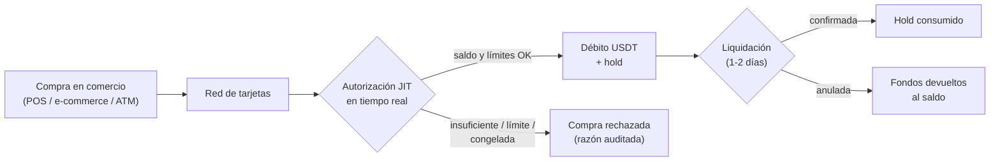

Las tarjetas CBPay gastan **Just-In-Time del saldo USDT central de la
cuenta**: no hay que prefondearlas ni moverles saldo. Cada compra se autoriza
en tiempo real contra el saldo disponible y los límites propios de la
tarjeta, y el débito queda de inmediato en el historial de movimientos.



## Cuántas tarjetas puedes tener

| Tipo de cuenta | Virtuales | Físicas | ¿Para terceros? |
|---|---|---|---|
| Persona | **1** | **1** | No |
| Empresa | **Ilimitadas** | **Ilimitadas** | Sí: personas designadas (ej. empleados) |

Todas las tarjetas de una cuenta gastan del **mismo saldo USDT**. El control
fino es por límites de gasto de cada tarjeta (por transacción, diario,
mensual), que puedes cambiar en cualquier momento.

## Costos (configurados por tu operador, pueden ser 0)

| Servicio | Cuándo se cobra |
|---|---|
| `card_creation_virtual` | Al emitir una tarjeta virtual |
| `card_creation_physical` | Al emitir una tarjeta física |
| `card_monthly` | Mensualidad por tarjeta activa (si no hay saldo, la tarjeta se congela — sin deuda) |
| `card_cancellation` | Al cancelar una tarjeta |

Los montos exactos se consultan en `GET /v1/rates` (campo `fees`). Todo
cargo de emisión se **reembolsa automáticamente** si la emisión falla.

## Crear una tarjeta

El flujo depende de si tu cuenta es **persona** o **empresa** — elige tu
pestaña. La regla común: el **titular (cardholder) se verifica UNA sola vez
por cuenta**, en la primera emisión; las siguientes tarjetas lo reutilizan
sin pedir datos. La `idempotency_key` es obligatoria siempre (un retry con
la misma clave devuelve la tarjeta original y nunca cobra dos veces).

<Tabs>
<Tab title="Cuenta persona">

Una cuenta persona emite tarjetas **para sí misma** (máximo 1 virtual +
1 física).

**Tu primera tarjeta** crea y verifica tu titular en el emisor, así que
lleva tus datos completos y documentos de identidad por URL:

```bash
curl -X POST https://api.qbank.cl/platform/v1/cards \
  -H "Authorization: Bearer <token>" \
  -H "Content-Type: application/json" \
  -d '{
    "physical": false,
    "idempotency_key": "card-v-1",
    "cardholder": {
      "first_name": "Ana",
      "last_name": "Perez",
      "email": "ana@ejemplo.com",
      "phone": "+56912345678",
      "occupation": "52201",
      "salary_usd": 1800,
      "id_front_url": "https://files.example.com/kyc/ap-front.jpg",
      "id_back_url": "https://files.example.com/kyc/ap-back.jpg",
      "residence_proof_url": "https://files.example.com/kyc/ap-address.pdf",
      "address": {
        "line1": "Av. Providencia 123",
        "city": "Santiago",
        "region": "RM",
        "postal_code": "7500000",
        "country": "CL"
      }
    }
  }'
```

`occupation` es un **código del catálogo**
([ver abajo](#ocupacion-y-giro-codigos-de-catalogo)) y `salary_usd` va en
dólares enteros.

**Tu segunda tarjeta** (por ejemplo la física) ya no pide ningún dato —
tu titular quedó verificado:

```bash
curl -X POST https://api.qbank.cl/platform/v1/cards \
  -H "Authorization: Bearer <token>" \
  -H "Content-Type: application/json" \
  -d '{ "physical": true, "idempotency_key": "card-f-1" }'
```

Si intentas una tercera del mismo tipo: `409 card_limit_reached` (cancela
la existente primero).

</Tab>
<Tab title="Cuenta empresa">

Una cuenta empresa emite **tarjetas ilimitadas**, en dos modalidades:

**A. Para la empresa misma** (tarjetas corporativas). La primera emisión
crea el titular empresa con los datos societarios; las siguientes no piden
nada:

<CodeGroup>

```bash Primera tarjeta (crea el titular empresa)
curl -X POST https://api.qbank.cl/platform/v1/cards \
  -H "Authorization: Bearer <token>" \
  -H "Content-Type: application/json" \
  -d '{
    "physical": false,
    "idempotency_key": "card-corp-1",
    "cardholder": {
      "kind_of_business": "J63",
      "legal_representation": "Carlos Soto, Gerente General",
      "email": "finanzas@andina.cl",
      "certificate_of_good_standing_url": "https://files.example.com/kyb/vigencia.pdf",
      "business_license_url": "https://files.example.com/kyb/patente.pdf",
      "register_shareholder_url": "https://files.example.com/kyb/socios.pdf",
      "id_shareholders_url": "https://files.example.com/kyb/ids-socios.pdf",
      "address_verification_shareholders_url": "https://files.example.com/kyb/domicilios.pdf",
      "address": {
        "line1": "Av. Apoquindo 4500",
        "city": "Santiago",
        "region": "RM",
        "postal_code": "7550000",
        "country": "CL"
      }
    }
  }'
```

```bash Siguientes tarjetas (sin datos, con límites)
curl -X POST https://api.qbank.cl/platform/v1/cards \
  -H "Authorization: Bearer <token>" \
  -H "Content-Type: application/json" \
  -d '{
    "physical": true,
    "idempotency_key": "card-f-ops-1",
    "limits": { "per_transaction": "500.00", "monthly": "5000.00" }
  }'
```

</CodeGroup>

**B. Para una persona designada** (ej. un empleado): agrega
`cardholder.kind: "person"` con los datos completos de ESA persona — cada
designación es un titular nuevo, así que sus datos y documentos van
**siempre**, en cada tarjeta para una persona distinta:

```bash
curl -X POST https://api.qbank.cl/platform/v1/cards \
  -H "Authorization: Bearer <token>" \
  -H "Content-Type: application/json" \
  -d '{
    "physical": false,
    "idempotency_key": "card-emp-77",
    "limits": { "monthly": "1500.00" },
    "cardholder": {
      "kind": "person",
      "first_name": "Maria",
      "last_name": "Perez",
      "email": "maria@empresa.com",
      "occupation": "52201",
      "salary_usd": 1800,
      "id_front_url": "https://files.example.com/kyc/mp-front.jpg",
      "id_back_url": "https://files.example.com/kyc/mp-back.jpg",
      "residence_proof_url": "https://files.example.com/kyc/mp-address.pdf",
      "address": {
        "line1": "Av. Providencia 123",
        "city": "Santiago",
        "region": "RM",
        "postal_code": "7500000",
        "country": "CL"
      }
    }
  }'
```

El nombre impreso usa `first_name` + `last_name` (máximo 22 caracteres
combinados) y la respuesta llega con `cardholder_kind: "person"`.

</Tab>
</Tabs>

Respuesta (misma forma en todos los casos):

```json
{
  "card_id": "3c2b1a09-8d7e-6f5a-4b3c-2d1e0f9a8b7c",
  "account_id": "9b1deb4d-3b7d-4bad-9bdd-2b0d7b3dcb6d",
  "physical": false,
  "cardholder_kind": "account",
  "status": "active",
  "limits": { "monthly": "5000.000000" },
  "created_at": "2026-07-08T12:00:00Z",
  "updated_at": "2026-07-08T12:00:00Z",
  "creation_fee": "3.000000"
}
```

<Warning>
Los documentos **se validan de verdad** por el emisor: las URLs deben
apuntar a documentos legítimos y accesibles. Si faltan o son
insuficientes, la emisión falla (`422 core_rejected` o
`409 cardholder_kyc_pending`), **el fee se reembolsa automáticamente** y
puedes reintentar corrigiendo los datos.
</Warning>

<Note>
¿Persona o empresa? Las diferencias entre ambos tipos de cuenta en TODOS
los productos están resumidas en
[personas y empresas](/es/conceptos/personas-y-empresas).
</Note>

### Ocupación y giro (códigos de catálogo)

Al designar una **persona**, `occupation` debe ser un **código** del catálogo
oficial (no texto libre); para una **empresa**, `kind_of_business` también.
Consulta y busca los códigos en:

```bash
# Ocupaciones (personas) — filtra con ?q=
curl "https://api.qbank.cl/platform/v1/cards/catalog/occupations?q=director" \
  -H "Authorization: Bearer <token>"

# Giros / actividad económica (empresas)
curl "https://api.qbank.cl/platform/v1/cards/catalog/business-activities?q=informát" \
  -H "Authorization: Bearer <token>"
```

Cada item trae `{ "code": "...", "label": "..." }`. Usa el `code` en
`occupation` / `kind_of_business`. Si mandas un valor fuera de catálogo, la
API responde `400 invalid_occupation` o `400 invalid_kind_of_business` antes
de llegar al emisor. El `salary_usd` va en **dólares** (entero).


## Tarjetas físicas: activación

Una tarjeta física nace en `pending_activation` y viaja **inactiva** por
seguridad. Cuando el titular la tiene en mano:

```bash
curl -X POST https://api.qbank.cl/platform/v1/cards/{card_id}/activate \
  -H "Authorization: Bearer <token>"
```

## Ver PAN y CVV (datos sensibles)

Solo la **cuenta dueña** puede revelarlos (nunca el org admin). La respuesta
es de una sola pasada: muéstrala al titular y descártala.

```bash
curl -X POST https://api.qbank.cl/platform/v1/cards/{card_id}/reveal \
  -H "Authorization: Bearer <token>"
```

```json
{
  "card_id": "3c2b1a09-8d7e-6f5a-4b3c-2d1e0f9a8b7c",
  "pan": "5339880000001234",
  "cvv": "123",
  "exp_date": "202907",
  "note": "sensitive data: display once, never store"
}
```

<Warning>
**Nunca almacenes ni loguees el PAN/CVV.** CBPay tampoco lo persiste: la
respuesta viene directo del emisor (estándar PCI).
</Warning>

## Límites y congelar/descongelar

```bash Actualizar límites
curl -X PATCH https://api.qbank.cl/platform/v1/cards/{card_id} \
  -H "Authorization: Bearer <token>" \
  -H "Content-Type: application/json" \
  -d '{ "limits": { "per_transaction": "200.00", "daily": "0" } }'
```

`"0"` elimina un límite. Para congelar (rechaza toda compra al instante):

```bash Congelar
curl -X PATCH https://api.qbank.cl/platform/v1/cards/{card_id} \
  -H "Authorization: Bearer <token>" \
  -H "Content-Type: application/json" \
  -d '{ "frozen": true }'
```

## Transacciones y su ciclo de vida

```bash
curl "https://api.qbank.cl/platform/v1/cards/{card_id}/transactions?from=2026-07-01&to=2026-07-08&page=1&page_size=50" \
  -H "Authorization: Bearer <token>"
```

| Estado | Significado |
|---|---|
| `authorized` | Compra aprobada en tiempo real: el monto salió del disponible y quedó en hold |
| `settled` | Confirmada en la liquidación de la red (el hold se consume) |
| `reversed` | Anulada: los fondos volvieron completos al saldo |
| `declined` | Rechazada, con la razón: `insufficient_funds`, `card_limit_exceeded`, `card_frozen`, `account_blocked` |

Si la liquidación llega por un monto distinto al autorizado (propinas,
conversión del comercio), el ajuste se aplica automáticamente: positivo
debita la diferencia, negativo la devuelve.

## Cancelar una tarjeta

Irreversible. Cobra `card_cancellation` si está configurado.

```bash
curl -X POST https://api.qbank.cl/platform/v1/cards/{card_id}/cancel \
  -H "Authorization: Bearer <token>"
```

## Webhooks

| Evento | Cuándo |
|---|---|
| `card_transaction` | Compra autorizada, anulada o ajustada |
| `card_status_changed` | La tarjeta cambió de estado (incluye congelamiento automático por mensualidad impaga) |

Suscríbete igual que al resto de eventos (ver [Webhooks](/es/webhooks)).

## Preguntas frecuentes

<AccordionGroup>
<Accordion title="¿Tengo que prefondear las tarjetas?">
No. Las tarjetas no tienen saldo propio: cada compra se autoriza en tiempo
real contra el saldo USDT de la cuenta. Si hay saldo y la compra respeta los
límites, se aprueba.
</Accordion>
<Accordion title="¿Qué pasa si varias tarjetas de mi empresa compran a la vez?">
Todas gastan del mismo saldo central. Cada autorización debita de forma
atómica: nunca se aprueba más que el saldo disponible, sin importar cuántas
tarjetas operen en paralelo.
</Accordion>
<Accordion title="¿En qué moneda se debita?">
Las compras se procesan en USD y se debitan 1:1 en USDT (1 USD = 1 USDT),
con precisión de 6 decimales.
</Accordion>
<Accordion title="¿Qué pasa si no hay saldo para la mensualidad?">
La tarjeta se congela automáticamente (evento `card_status_changed` con
`reason: monthly_fee_unpaid`). No se genera deuda; al regularizar el saldo,
pide descongelarla con `PATCH { "frozen": false }`.
</Accordion>
<Accordion title="¿Puedo emitir una tarjeta para alguien que no es de mi empresa?">
Las cuentas empresa pueden emitir para cualquier persona designada pasando
sus datos y documentos de identidad. La tarjeta gasta siempre del saldo de la
cuenta empresa que la emitió.
</Accordion>
</AccordionGroup>
