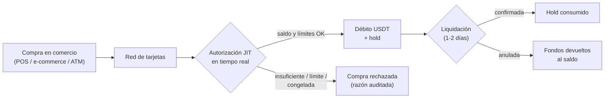

Las tarjetas CBPay gastan **Just-In-Time del saldo USDT central de la
cuenta**: no hay que prefondearlas ni moverles saldo. Cada compra se autoriza
en tiempo real contra el saldo disponible y los límites propios de la
tarjeta, y el débito queda de inmediato en el historial de movimientos.



## Cuántas tarjetas puedes tener

| Tipo de cuenta | Virtuales | Físicas | ¿Para terceros? |
|---|---|---|---|
| Persona | **1** | **1** | No |
| Empresa | **Ilimitadas** | **Ilimitadas** | Sí: personas designadas (ej. empleados) |

Todas las tarjetas de una cuenta gastan del **mismo saldo USDT**. El control
fino es por límites de gasto de cada tarjeta (por transacción, diario,
mensual), que puedes cambiar en cualquier momento.

## Costos (configurados por tu operador, pueden ser 0)

| Servicio | Cuándo se cobra |
|---|---|
| `card_creation_virtual` | Al emitir una tarjeta virtual |
| `card_creation_physical` | Al emitir una tarjeta física |
| `card_monthly` | Mensualidad por tarjeta activa (si no hay saldo, la tarjeta se congela — sin deuda) |
| `card_cancellation` | Al cancelar una tarjeta |

Los montos exactos se consultan en `GET /v1/fees`. Todo cargo de emisión se
**reembolsa automáticamente** si la emisión falla.

## Crear una tarjeta

La clave de idempotencia es obligatoria: un retry con la misma clave devuelve
la tarjeta original y nunca cobra dos veces.

<CodeGroup>

```bash Persona — virtual
curl -X POST https://api.qbank.cl/platform/v1/cards \
  -H "Authorization: Bearer <token>" \
  -H "Content-Type: application/json" \
  -d '{ "physical": false, "idempotency_key": "card-v-1" }'
```

```bash Empresa — física con límites
curl -X POST https://api.qbank.cl/platform/v1/cards \
  -H "Authorization: Bearer <token>" \
  -H "Content-Type: application/json" \
  -d '{
    "physical": true,
    "idempotency_key": "card-f-ops-1",
    "limits": { "per_transaction": "500.00", "monthly": "5000.00" }
  }'
```

```bash Empresa — para un empleado
curl -X POST https://api.qbank.cl/platform/v1/cards \
  -H "Authorization: Bearer <token>" \
  -H "Content-Type: application/json" \
  -d '{
    "physical": false,
    "idempotency_key": "card-emp-77",
    "limits": { "monthly": "1500.00" },
    "cardholder": {
      "kind": "person",
      "first_name": "Maria",
      "last_name": "Perez",
      "email": "maria@empresa.com",
      "occupation": "Sales",
      "salary_usd": 1800,
      "id_front_url": "https://files.example.com/kyc/mp-front.jpg",
      "id_back_url": "https://files.example.com/kyc/mp-back.jpg",
      "residence_proof_url": "https://files.example.com/kyc/mp-address.pdf",
      "address": {
        "line1": "Av. Providencia 123",
        "city": "Santiago",
        "region": "RM",
        "postal_code": "7500000",
        "country": "CL"
      }
    }
  }'
```

</CodeGroup>

Respuesta:

```json
{
  "card_id": "3c2b1a09-8d7e-6f5a-4b3c-2d1e0f9a8b7c",
  "account_id": "9b1deb4d-3b7d-4bad-9bdd-2b0d7b3dcb6d",
  "physical": false,
  "cardholder_kind": "account",
  "status": "active",
  "limits": { "monthly": "5000.000000" },
  "created_at": "2026-07-08T12:00:00Z",
  "updated_at": "2026-07-08T12:00:00Z",
  "creation_fee": "3.000000"
}
```

<Note>
Al emitir para una **persona designada** (empresas), los documentos de
identidad son obligatorios (`id_front_url`, `id_back_url`,
`residence_proof_url`): el titular queda verificado de inmediato y la
tarjeta se emite en la misma llamada. El nombre impreso usa `first_name` +
`last_name` (máximo 22 caracteres combinados).
</Note>

## Tarjetas físicas: activación

Una tarjeta física nace en `pending_activation` y viaja **inactiva** por
seguridad. Cuando el titular la tiene en mano:

```bash
curl -X POST https://api.qbank.cl/platform/v1/cards/{card_id}/activate \
  -H "Authorization: Bearer <token>"
```

## Ver PAN y CVV (datos sensibles)

Solo la **cuenta dueña** puede revelarlos (nunca el org admin). La respuesta
es de una sola pasada: muéstrala al titular y descártala.

```bash
curl -X POST https://api.qbank.cl/platform/v1/cards/{card_id}/reveal \
  -H "Authorization: Bearer <token>"
```

```json
{
  "card_id": "3c2b1a09-8d7e-6f5a-4b3c-2d1e0f9a8b7c",
  "pan": "5339880000001234",
  "cvv": "123",
  "exp_date": "202907",
  "note": "sensitive data: display once, never store"
}
```

<Warning>
**Nunca almacenes ni loguees el PAN/CVV.** CBPay tampoco lo persiste: la
respuesta viene directo del emisor (estándar PCI).
</Warning>

## Límites y congelar/descongelar

```bash Actualizar límites
curl -X PATCH https://api.qbank.cl/platform/v1/cards/{card_id} \
  -H "Authorization: Bearer <token>" \
  -H "Content-Type: application/json" \
  -d '{ "limits": { "per_transaction": "200.00", "daily": "0" } }'
```

`"0"` elimina un límite. Para congelar (rechaza toda compra al instante):

```bash Congelar
curl -X PATCH https://api.qbank.cl/platform/v1/cards/{card_id} \
  -H "Authorization: Bearer <token>" \
  -H "Content-Type: application/json" \
  -d '{ "frozen": true }'
```

## Transacciones y su ciclo de vida

```bash
curl "https://api.qbank.cl/platform/v1/cards/{card_id}/transactions?page=1&page_size=50" \
  -H "Authorization: Bearer <token>"
```

| Estado | Significado |
|---|---|
| `authorized` | Compra aprobada en tiempo real: el monto salió del disponible y quedó en hold |
| `settled` | Confirmada en la liquidación de la red (el hold se consume) |
| `reversed` | Anulada: los fondos volvieron completos al saldo |
| `declined` | Rechazada, con la razón: `insufficient_funds`, `card_limit_exceeded`, `card_frozen`, `account_blocked` |

Si la liquidación llega por un monto distinto al autorizado (propinas,
conversión del comercio), el ajuste se aplica automáticamente: positivo
debita la diferencia, negativo la devuelve.

## Cancelar una tarjeta

Irreversible. Cobra `card_cancellation` si está configurado.

```bash
curl -X POST https://api.qbank.cl/platform/v1/cards/{card_id}/cancel \
  -H "Authorization: Bearer <token>"
```

## Webhooks

| Evento | Cuándo |
|---|---|
| `card_transaction` | Compra autorizada, anulada o ajustada |
| `card_status_changed` | La tarjeta cambió de estado (incluye congelamiento automático por mensualidad impaga) |

Suscríbete igual que al resto de eventos (ver [Webhooks](/es/webhooks)).

## Preguntas frecuentes

<AccordionGroup>
<Accordion title="¿Tengo que prefondear las tarjetas?">
No. Las tarjetas no tienen saldo propio: cada compra se autoriza en tiempo
real contra el saldo USDT de la cuenta. Si hay saldo y la compra respeta los
límites, se aprueba.
</Accordion>
<Accordion title="¿Qué pasa si varias tarjetas de mi empresa compran a la vez?">
Todas gastan del mismo saldo central. Cada autorización debita de forma
atómica: nunca se aprueba más que el saldo disponible, sin importar cuántas
tarjetas operen en paralelo.
</Accordion>
<Accordion title="¿En qué moneda se debita?">
Las compras se procesan en USD y se debitan 1:1 en USDT (1 USD = 1 USDT),
con precisión de 6 decimales.
</Accordion>
<Accordion title="¿Qué pasa si no hay saldo para la mensualidad?">
La tarjeta se congela automáticamente (evento `card_status_changed` con
`reason: monthly_fee_unpaid`). No se genera deuda; al regularizar el saldo,
pide descongelarla con `PATCH { "frozen": false }`.
</Accordion>
<Accordion title="¿Puedo emitir una tarjeta para alguien que no es de mi empresa?">
Las cuentas empresa pueden emitir para cualquier persona designada pasando
sus datos y documentos de identidad. La tarjeta gasta siempre del saldo de la
cuenta empresa que la emitió.
</Accordion>
</AccordionGroup>
