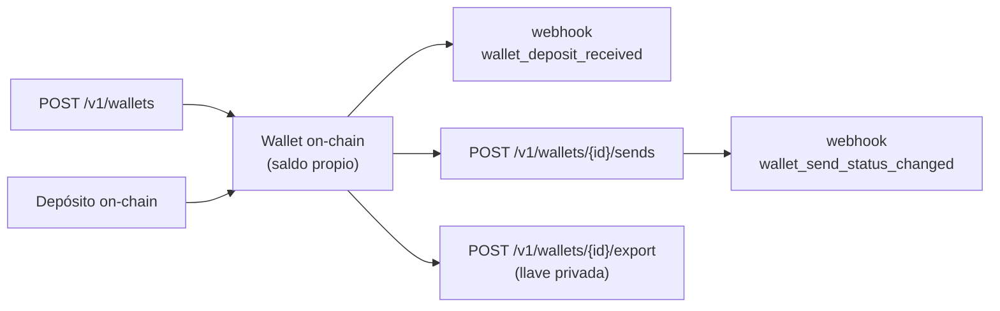

Las **wallets segregadas** son wallets on-chain **propias** de tu cuenta
empresa: su saldo **es** el saldo on-chain de la dirección, no un saldo
virtual en el ledger de CBPay. Puedes crear cuantas quieras, recibir y
**enviar crypto directamente desde cada wallet**, **importar** wallets
externas con su llave privada y **exportar** la llave cuando quieras
(custodia compartida). Son ideales para segregar fondos por cliente, por
proyecto o por unidad de negocio, con control total de las llaves.

<Note>
Solo cuentas **empresa**. Una cuenta persona recibe `403 company_required`.
</Note>

<Warning>
No las confundas con el producto [crypto](/es/guias/crypto): ahí los
depósitos **acreditan tu saldo USDT/USDC del ledger** y los retiros salen de
una hot wallet. En las wallets segregadas el saldo **vive on-chain en la
wallet** y los envíos salen **de esa misma wallet**. El **gas** (TRX en TRON,
ETH en Ethereum) corre por tu cuenta: cada wallet debe tener gas para poder
enviar.
</Warning>



## Pares soportados

| Chain | Asset | Gas de red |
|---|---|---|
| `tron` | `usdt` | TRX |
| `eth` | `usdt` | ETH |
| `eth` | `usdc` | ETH |

El `eth` nativo puede enviarse desde cualquier wallet de una chain `eth`
(es el gas de la red).

## 1. Crea una wallet

<CodeGroup>

```bash TRON USDT
curl -X POST https://api.qbank.cl/platform/v1/wallets \
  -H "Authorization: Bearer <token>" \
  -H "Content-Type: application/json" \
  -H "Idempotency-Key: wallet-cliente-001" \
  -d '{ "chain": "tron", "asset": "usdt", "label": "Cliente Acme" }'
```

```bash ETH USDC
curl -X POST https://api.qbank.cl/platform/v1/wallets \
  -H "Authorization: Bearer <token>" \
  -H "Content-Type: application/json" \
  -H "Idempotency-Key: wallet-proyecto-x" \
  -d '{ "chain": "eth", "asset": "usdc", "label": "Proyecto X" }'
```

</CodeGroup>

Respuesta `201`:

```json
{
  "wallet_id": "b7e3a1c2-9f4d-4a8b-8c1e-2d3f4a5b6c7d",
  "chain": "tron",
  "asset": "USDT",
  "address": "TRmSZRaMAqLEevAdGwo3R43bRBXamWR5bd",
  "label": "Cliente Acme",
  "origin": "created",
  "custody": "cbpay",
  "exported": false,
  "created_at": "2026-07-11T12:00:00Z"
}
```

El campo `custody` refleja el régimen de custodia de la llave:

| `custody` | Significado |
|---|---|
| `cbpay` | Creada por la plataforma y llave nunca exportada: solo tus operaciones vía API pueden mover el saldo |
| `client` | Importada, o cuya llave fue exportada: también puedes firmar por fuera de la plataforma |

Con custodia `client` la plataforma sincroniza la actividad on-chain
completa de la wallet — incluidos los movimientos firmados por fuera — y
los marca como externos, para que tu registro y tu cartola sigan completos.

Con custodia `cbpay` la contabilidad de la wallet es **garantizada**: la
cartola muestra su cuadratura de vida completa (`lifetime_in` −
`lifetime_out` = `computed_balance`) y el detalle de cada envío
(`GET /v1/wallets/{walletID}/sends/{sendID}`) incluye `funding_sources`:
la atribución FIFO de qué depósitos fondearon ese envío, con `tx_id`,
dirección de origen y monto por tramo.

La `Idempotency-Key` (o `idempotency_key` en el body) hace el reintento
seguro: una repetición devuelve la MISMA wallet con `idempotency_hit: true`
y **jamás** crea una segunda. Crear una wallet puede cobrar el fee
`wallet_creation` (fijo; 0 = gratis, el default).

## 2. Importa una wallet externa

Trae una wallet que ya controlas entregando su llave privada. La llave
**viaja cifrada en tránsito hacia el custodio y jamás se guarda ni se
registra en la plataforma**.

```bash
curl -X POST https://api.qbank.cl/platform/v1/wallets/import \
  -H "Authorization: Bearer <token>" \
  -H "Content-Type: application/json" \
  -H "X-OTP-Token: <token-otp>" \
  -d '{
    "chain": "tron",
    "asset": "usdt",
    "private_key_hex": "<64 hex>",
    "label": "Wallet migrada",
    "idempotency_key": "import-001"
  }'
```

Respuesta `201` con el mismo shape que crear (`origin: "imported"`). Cobra
el fee `wallet_import`.

<Warning>
Importar y exportar manejan material de llave privada: **exigen una sesión
de usuario con 2FA** (no se permiten API keys) y OTP. Si el par
chain/dirección ya existe, el core responde `core_rejected`.
</Warning>

## 3. Consulta saldo, depósitos y transacciones

El balance viene **en vivo de la blockchain** e incluye el gas de la red
(así ves si a la wallet le falta TRX/ETH para enviar).

```bash
# Saldo on-chain en vivo (incluye gas)
curl https://api.qbank.cl/platform/v1/wallets/{walletID}/balance \
  -H "Authorization: Bearer <token>"

# Depósitos recibidos (con paginación y fechas)
curl "https://api.qbank.cl/platform/v1/wallets/{walletID}/deposits?from=2026-07-01&to=2026-07-11&page=1&page_size=50" \
  -H "Authorization: Bearer <token>"

# Actividad on-chain completa (depósitos + envíos)
curl "https://api.qbank.cl/platform/v1/wallets/{walletID}/transactions?from=2026-07-01&to=2026-07-11" \
  -H "Authorization: Bearer <token>"
```

Cuando llega un depósito confirmado, CBPay emite el webhook
[`wallet_deposit_received`](/es/webhooks) — **sin tocar tu ledger**, porque
el saldo ya está en la wallet.

## 4. Envía crypto desde la wallet

El envío sale **de la wallet misma** (dirección de origen real), firmado por
el custodio. `idempotency_key` es obligatoria.

<CodeGroup>

```bash Por monto
curl -X POST https://api.qbank.cl/platform/v1/wallets/{walletID}/sends \
  -H "Authorization: Bearer <token>" \
  -H "Content-Type: application/json" \
  -H "X-OTP-Token: <token-otp>" \
  -d '{
    "asset": "usdt",
    "to_address": "TXYZ...destino",
    "amount": "25.50",
    "idempotency_key": "send-2026-07-11-a"
  }'
```

```bash Por unidades mínimas
curl -X POST https://api.qbank.cl/platform/v1/wallets/{walletID}/sends \
  -H "Authorization: Bearer <token>" \
  -H "Content-Type: application/json" \
  -H "X-OTP-Token: <token-otp>" \
  -d '{
    "asset": "usdt",
    "to_address": "TXYZ...destino",
    "amount_raw": "25500000",
    "idempotency_key": "send-2026-07-11-b"
  }'
```

</CodeGroup>

Respuesta `202` (el envío es asíncrono; el estado final llega por webhook):

```json
{
  "send_id": "9c8b7a6d-5e4f-3a2b-1c0d-9e8f7a6b5c4d",
  "wallet_id": "b7e3a1c2-9f4d-4a8b-8c1e-2d3f4a5b6c7d",
  "chain": "tron",
  "asset": "USDT",
  "to_address": "TXYZ...destino",
  "amount_raw": "25500000",
  "fee": "0.000000",
  "fee_asset": "USDT",
  "status": "processing",
  "tx_id": "b1946ac92492d2347c6235b4d2611184...",
  "idempotency_key": "send-2026-07-11-a",
  "created_at": "2026-07-11T12:05:00Z"
}
```

Antes de enviar, CBPay verifica que la wallet tenga **gas** suficiente; si no,
responde `422 insufficient_gas` con el mínimo requerido — sin cobrar nada.
El envío puede cobrar el fee `wallet_send` (del saldo de settlement de tu
cuenta en el ledger; **la plata on-chain de la wallet no se toca**), que se
reembolsa si el envío es rechazado por el custodio.

Replay con la misma `idempotency_key` → `200` con el envío original y
`idempotency_hit: true` — **jamás se re-envía**. Ante una falla ambigua
(timeout/red) el envío queda `pending`: reintenta con la **misma** clave; el
dedupe garantiza que no se duplique.

Consulta el historial:

```bash
curl "https://api.qbank.cl/platform/v1/wallets/{walletID}/sends?from=2026-07-01&to=2026-07-11" \
  -H "Authorization: Bearer <token>"

curl https://api.qbank.cl/platform/v1/wallets/{walletID}/sends/{sendID} \
  -H "Authorization: Bearer <token>"
```

## 5. Exporta la llave privada

Recupera la llave privada de la wallet. Es **custodia compartida**: tras
exportar, la wallet **sigue 100% operativa** en CBPay (puede recibir y
enviar), pero tú también controlas los fondos con la llave.

```bash
curl -X POST https://api.qbank.cl/platform/v1/wallets/{walletID}/export \
  -H "Authorization: Bearer <token>" \
  -H "X-OTP-Token: <token-otp>" \
  -H "Content-Type: application/json" \
  -d '{ "reason": "Migración de custodia a billetera fría del cliente" }'
```

Respuesta `200`:

```json
{
  "wallet": {
    "wallet_id": "b7e3a1c2-9f4d-4a8b-8c1e-2d3f4a5b6c7d",
    "chain": "tron",
    "asset": "USDT",
    "address": "TRmSZRaMAqLEevAdGwo3R43bRBXamWR5bd",
    "exported": true,
    "exported_at": "2026-07-11T12:10:00Z"
  },
  "private_key_hex": "<64 hex>",
  "export": {
    "custody": "shared",
    "warning": "anyone holding this private key controls the wallet funds; the wallet remains operational in the platform"
  }
}
```

<Warning>
Es la operación más sensible del producto. Exige **sesión de usuario con
2FA** (no API keys), **cuenta verificada**, y un `reason` de al menos 20
caracteres que queda en la auditoría. Cada export dispara el webhook
`wallet_key_exported` a tu organización. Cobra el fee `wallet_export`.
Quien tenga la llave privada controla los fondos: guárdala de forma segura.
</Warning>

## 6. Auto-forward (reenvío automático)

Reenvía automáticamente a una dirección tuya todo lo que llegue a la wallet
(útil para consolidar en frío). Como redirige fondos futuros, exige
verificación y OTP.

```bash
# Consultar la regla actual
curl https://api.qbank.cl/platform/v1/wallets/{walletID}/auto-forward \
  -H "Authorization: Bearer <token>"

# Activar / actualizar
curl -X POST https://api.qbank.cl/platform/v1/wallets/{walletID}/auto-forward \
  -H "Authorization: Bearer <token>" \
  -H "X-OTP-Token: <token-otp>" \
  -H "Content-Type: application/json" \
  -d '{ "linked_address": "TColdWallet...destino", "enabled": true }'

# Desactivar
curl -X POST https://api.qbank.cl/platform/v1/wallets/{walletID}/auto-forward \
  -H "Authorization: Bearer <token>" \
  -H "X-OTP-Token: <token-otp>" \
  -H "Content-Type: application/json" \
  -d '{ "enabled": false }'
```

## Estados de un envío

| `status` | Tipo | Qué significa / qué hacer |
|---|---|---|
| `processing` | Transitorio | Transmitido on-chain; espera la confirmación por webhook |
| `pending` | Transitorio | Falla ambigua del dispatch; reintenta con la **misma** `idempotency_key` |
| `completed` | Final | Confirmado on-chain |
| `failed` | Final | Rechazado; no movió fondos |

## Errores propios

| HTTP | `error` | Solución |
|---|---|---|
| 403 | `company_required` | Las wallets segregadas son solo para cuentas empresa |
| 403 | `human_session_required` | Import y export exigen sesión de usuario con 2FA (no API keys) |
| 403 | `verification_required` | Completa el onboarding de tu cuenta ([verificación](/es/guias/kyc)) |
| 403 | `service_disabled` | El servicio `wallets` no está habilitado; contacta a tu operador |
| 400 | `idempotency_key_required` | Envía `idempotency_key` (body o header `Idempotency-Key`) |
| 400 | `invalid_asset` / `invalid_chain` | Revisa el par chain/asset soportado |
| 422 | `insufficient_gas` | La wallet no tiene gas (TRX/ETH) para el fee de red; fondéala y reintenta |
| 409 | `idempotency_conflict` | Otra request con la misma clave sigue en curso; reintenta con la misma clave |
| 503 | `export_unavailable` | El export de llaves no está habilitado en este entorno |

## Webhooks asociados

| Evento | Cuándo |
|---|---|
| `wallet_deposit_received` | Llegó un depósito on-chain a una wallet segregada (no toca el ledger) |
| `wallet_send_status_changed` | Un envío desde la wallet cambió de estado |
| `wallet_key_exported` | Se exportó la llave privada de una wallet (alerta de seguridad) |
| `wallet_external_movement` | El sync detectó un movimiento on-chain que no pasó por la plataforma (esperable en custodia `client`) |
| `wallet_key_compromise_suspected` | **Alarma crítica**: salió plata de una wallet con custodia `cbpay` sin pasar por la plataforma — trata la llave como comprometida y contacta soporte de inmediato |

Los payloads de ejemplo están en la [página de webhooks](/es/webhooks).

## Preguntas frecuentes

<AccordionGroup>
<Accordion title="¿En qué se diferencian de las wallets del producto crypto?">
En el producto [crypto](/es/guias/crypto), los depósitos acreditan tu saldo
virtual USDT/USDC del ledger y los retiros salen de una hot wallet — CBPay
custodia y consolida los fondos. En las wallets segregadas el saldo vive
on-chain en cada wallet, los envíos salen de esa misma dirección, y puedes
exportar la llave. Nada de su saldo pasa por el ledger ni se consolida a
tesorería.
</Accordion>
<Accordion title="¿Por qué mi envío falló con insufficient_gas?">
Enviar on-chain requiere gas EN la wallet (TRX en TRON, ETH en Ethereum). A
diferencia del producto crypto, aquí el gas corre por tu cuenta. Fondea la
dirección de la wallet con un poco de la moneda nativa y reintenta. El
`GET .../balance` te muestra el gas disponible y el mínimo requerido.
</Accordion>
<Accordion title="¿La wallet deja de funcionar después de exportar la llave?">
No. Es custodia compartida: la wallet sigue operativa en CBPay (recibe y
envía normalmente) y queda marcada `exported`. Simplemente ahora tú también
tienes la llave, así que resguárdala bien.
</Accordion>
<Accordion title="¿Tesorería puede mover el saldo de mis wallets segregadas?">
Nunca. Estas wallets se crean exentas del barrido de tesorería: su saldo
on-chain es exclusivamente tuyo. Solo se mueve cuando tú envías o cuando
configuras auto-forward.
</Accordion>
<Accordion title="¿Cuántas wallets puedo crear?">
Sin límite. Es lo típico para segregar por cliente, proyecto o unidad de
negocio. Cada wallet puede llevar un `label` para distinguirlas.
</Accordion>
</AccordionGroup>
