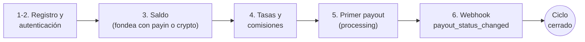

Este es el camino completo de una primera integración: registro → saldo →
tasas → payout → webhook. Al terminar habrás cerrado el ciclo entero:



Antes de empezar, los datos que vas a necesitar en todos lados:

| Dato | Valor |
|---|---|
| **URL base** | `https://api.qbank.cl/platform` |
| **Autenticación** | Header `Authorization: Bearer <token>` (o `X-API-Key`) |
| **Slug de organización** | `cbpay` (para registro y login) |
| **Monedas del saldo** | 4 saldos independientes: USDT (operativa), USDC, BTC y GOLD — montos siempre como string (`"52.618258"`) |
| **Ambiente** | Producción directa — no hay sandbox; prueba con montos pequeños |

<Info>
Si CBPay ya te creó la cuenta y te entregó una API key `pk_...`, salta
directo al paso 3. ¿Dudas típicas? Están respondidas en las
[preguntas frecuentes](/es/faq).
</Info>

<Steps>

<Step title="Regístrate">

Crea tu cuenta (persona o empresa — mismo endpoint, cambia `type`):

<CodeGroup>

```bash Persona
curl -X POST https://api.qbank.cl/platform/v1/auth/register \
  -H "Content-Type: application/json" \
  -d '{
    "org": "cbpay",
    "type": "person",
    "email": "ana@ejemplo.com",
    "password": "una-clave-segura",
    "display_name": "Ana Pérez",
    "country": "CL"
  }'
```

```bash Empresa
curl -X POST https://api.qbank.cl/platform/v1/auth/register \
  -H "Content-Type: application/json" \
  -d '{
    "org": "cbpay",
    "type": "company",
    "email": "legal@andina.cl",
    "password": "una-clave-segura",
    "display_name": "Comercial Andina SpA",
    "tax_id": "76.543.210-8",
    "country": "CL"
  }'
```

</CodeGroup>

La respuesta incluye tu `access_token` (sesión de 24 horas):

```json
{
  "account": { "id": "…", "type": "person", "kyc_status": "none", "…": "…" },
  "access_token": "eyJhbGciOiJIUzI1NiIs…",
  "expires_at": "2026-07-08T00:00:00Z"
}
```

</Step>

<Step title="Autentícate en cada llamada">

Envía el token en el header `Authorization`:

```bash
curl https://api.qbank.cl/platform/v1/me \
  -H "Authorization: Bearer <access_token>"
```

Para integraciones servidor-a-servidor, emite una **API key permanente** con
`POST /v1/api-keys` — se muestra una sola vez. Más detalles en
[autenticación](/es/autenticacion).

</Step>

<Step title="Consulta tu saldo">

```bash
curl https://api.qbank.cl/platform/v1/balances \
  -H "Authorization: Bearer <token>"
```

```json
{
  "account_id": "…",
  "balances": [
    { "asset": "USDT", "available": "0.000000", "held": "0.000000" },
    { "asset": "USDC", "available": "0.000000", "held": "0.000000" },
    { "asset": "BTC", "available": "0.00000000", "held": "0.00000000" },
    { "asset": "GOLD", "available": "0.000000", "held": "0.000000" }
  ]
}
```

Para operar necesitas fondos: crea un [payin](/es/guias/payins) o deposita
USDT on-chain con [crypto funding](/es/guias/crypto).

</Step>

<Step title="Revisa tasas y comisiones">

Antes de un payout, consulta la tasa FX vigente y tus comisiones efectivas:

```bash
curl https://api.qbank.cl/platform/v1/rates \
  -H "Authorization: Bearer <token>"
```

```json
{
  "base": "USD",
  "rates": {
    "chile": { "currency": "CLP", "rate": "950.25" },
    "mexico": { "currency": "MXN", "rate": "17.50" },
    "bolivia": { "currency": "BOB", "rate": "6.91" }
  },
  "fees": [
    { "service": "payout", "country": "CL", "percent": "0", "fixed": "0.50" }
  ],
  "updated_at": "2026-07-07T12:00:00Z"
}
```

Las tasas ya incluyen tu margen FX, así que puedes estimar el costo antes
de crear: `usdt_amount ≈ monto_local / rate` (redondeo hacia arriba) y
`total_debit = usdt_amount + fijo`.

</Step>

<Step title="Crea tu primer payout">

```bash
curl -X POST https://api.qbank.cl/platform/v1/payouts \
  -H "Authorization: Bearer <token>" \
  -H "Content-Type: application/json" \
  -d '{
    "country": "CL",
    "currency": "CLP",
    "method": "bank_transfer",
    "amount": "50000",
    "beneficiary": {
      "name": "Juan Soto",
      "rut": "12345678-9",
      "bank_code": "012",
      "account_type": "checking",
      "account_number": "001122334455"
    },
    "description": "Pago proveedor",
    "idempotency_key": "mi-pago-0001"
  }'
```

Respuesta `202 Accepted` — el payout queda `processing` y el estado final
llega por [webhook](/es/webhooks) (`payout_status_changed`):

```json
{
  "payout_id": "…",
  "status": "processing",
  "local_amount": "50000",
  "fx_rate": "950.25",
  "usdt_amount": "52.618258",
  "fee": "0.500000",
  "total_debit": "53.118258"
}
```

<Warning>
Los campos de `beneficiary` dependen del país y método. Consulta
`GET /v1/payouts/methods` y `GET /v1/payouts/banks?country=CL` para conocer
los requisitos de cada corredor — la referencia completa está en
los [ejemplos por país de la guía de payouts](/es/guias/payouts#ejemplos-por-pais).
</Warning>

</Step>

<Step title="Cierra el ciclo: suscríbete al webhook">

El estado final del payout llega por push. Suscribe tu endpoint HTTPS (en
desarrollo usa un [túnel](/es/entorno-y-pruebas#probar-webhooks-en-desarrollo-local)):

```bash
curl -X POST https://api.qbank.cl/platform/v1/webhooks/subscriptions \
  -H "Authorization: Bearer <token>" \
  -H "Content-Type: application/json" \
  -d '{
    "event_type": "payout_status_changed",
    "callback_url": "https://tuapp.com/webhooks/cbpay",
    "secret": "un-secreto-largo-y-aleatorio"
  }'
```

Minutos después recibirás el cierre del payout del paso 5:

```json
{
  "payout_id": "…",
  "status": "completed",
  "local_amount": "50000",
  "usdt_amount": "52.618258",
  "total_debit": "53.118258",
  "status_code": ""
}
```

Verifica **siempre** la firma HMAC de la entrega
(`X-Webhook-Signature`) — receta con código en [webhooks](/es/webhooks).
Si el payout hubiera fallado, `status: failed` llega con el reembolso
completo ya aplicado.

</Step>

</Steps>

## ¿Y ahora?

<CardGroup cols={2}>
  <Card title="Flujos de integración" icon="route" href="/es/flujos">
    Fondear, dispersar, cobrar, conciliar y banking — los cinco flujos E2E
    con diagramas.
  </Card>
  <Card title="Modelo de dinero" icon="coins" href="/es/conceptos/modelo-de-dinero">
    Débitos, holds, reembolsos y el ledger inmutable.
  </Card>
  <Card title="Ambiente y pruebas" icon="flask" href="/es/entorno-y-pruebas">
    Cómo probar seguro y el checklist de go-live.
  </Card>
  <Card title="Preguntas frecuentes" icon="circle-question" href="/es/faq">
    Las dudas reales de integradores, respondidas — y la API Reference
    completa vive en su propia pestaña, con playground interactivo.
  </Card>
</CardGroup>
