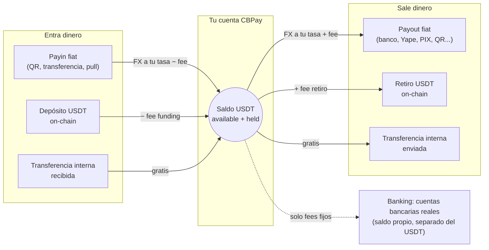

CBPay es una plataforma de pagos multi-moneda para Latinoamérica. Cada
cuenta mantiene **cuatro saldos virtuales independientes** — `USDT` (la
moneda operativa), `USDC`, `BTC` y `GOLD` (gramos de oro) — y opera sobre
ellos:

<CardGroup cols={2}>
  <Card title="Payouts fiat" icon="money-bill-transfer" href="/es/guias/payouts">
    Dispersa dinero a cuentas bancarias locales en Chile, Perú, México,
    Venezuela, Bolivia, Brasil, Paraguay, Ecuador y Argentina — incluido
    pagar QRs PIX escaneados.
  </Card>
  <Card title="Payins fiat" icon="qrcode" href="/es/guias/payins">
    Cobra en moneda local (QR, transferencias, cuentas dedicadas, cobros
    pull) y recibe el abono automáticamente.
  </Card>
  <Card title="Checkout" icon="cart-shopping" href="/es/guias/checkout">
    Un link de pago universal: tu pagador elige su país, método o crypto
    en una página hosted y tú liquidas en el asset que elijas.
  </Card>
  <Card title="Tarjetas y suscripciones" icon="credit-card" href="/es/guias/tarjetas">
    Emite tarjetas que gastan de cualquier saldo en tiempo real, acepta
    pagos con tarjeta, [guarda tarjetas y agenda cobros
    recurrentes](/es/guias/stored-cards-subscriptions).
  </Card>
  <Card title="QR POS" icon="store" href="/es/guias/qr-pos">
    Registra merchants verificados y genera cobros QR crypto con monto
    para puntos de venta físicos.
  </Card>
  <Card title="Crypto on-chain" icon="link" href="/es/guias/crypto">
    Fondea y retira USDT/USDC por TRON y Ethereum, y BTC nativo por
    Bitcoin — toda cuenta nace con sus wallets de depósito.
  </Card>
  <Card title="Swaps" icon="arrows-rotate" href="/es/guias/swaps">
    Convierte entre tus saldos USDT, USDC, BTC y GOLD a la tasa de tu
    cuenta, al instante.
  </Card>
  <Card title="Transferencias internas" icon="arrows-left-right" href="/es/guias/transferencias">
    Mueve saldo a cualquier otra cuenta CBPay — por ID, alias, QR o
    teléfono verificado — al instante y sin comisión.
  </Card>
  <Card title="Banking" icon="building-columns" href="/es/guias/banking">
    Cuentas bancarias reales a tu nombre: recibe, mantén y envía dinero
    por rieles internacionales (SEPA, SWIFT, ACH), incluidas cuentas de
    terceros.
  </Card>
  <Card title="Wallets segregadas" icon="wallet" href="/es/guias/wallets-segregadas">
    Wallets on-chain dedicadas con saldo propio, aisladas del ledger —
    créalas, impórtalas y expórtalas.
  </Card>
  <Card title="KYC/KYB y compliance" icon="user-check" href="/es/guias/kyc">
    Verificación de personas y empresas, más
    [screening AML](/es/guias/aml) standalone y
    [screening de direcciones crypto](/es/guias/screenings).
  </Card>
  <Card title="Cartola y analytics" icon="file-invoice" href="/es/guias/cartola">
    Estado de cuenta completo por período (JSON, PDF, Excel) con
    cuadratura garantizada, [comprobantes](/es/guias/comprobantes) por
    operación y un [resumen analytics](/es/guias/analytics) listo para
    graficar.
  </Card>
</CardGroup>

Todos los eventos llegan a tus **webhooks firmados**
([guía](/es/webhooks)).

## Cómo funciona

La operación fiat gira alrededor del saldo USDT — el dinero entra por un
lado, se convierte, y sale por el otro. Los saldos USDC, BTC y GOLD se
mueven con [swaps](/es/guias/swaps), depósitos y retiros on-chain,
transferencias internas, settlement de payouts (`settlement_asset`) y
conversión automática de payins (`default_payin_asset`):

1. CBPay te da acceso: registro con email/contraseña
   o una API key directa.
2. Fondeas tu cuenta: con un payin fiat o un depósito USDT on-chain.
3. Operas: payouts, transferencias, retiros — todo se debita y acredita
   sobre tu saldo USDT con conversión FX al momento.
4. Te enteras de todo: cada movimiento queda en un historial inmutable
   (`GET /v1/movements`) y los eventos llegan a tus webhooks.

## URLs base y ambientes

CBPay corre dos ambientes totalmente aislados con exactamente la misma API:

| Ambiente | URL base | API keys | Dinero |
|---|---|---|---|
| **Test** | `https://cryptobank.qbank.cl/platform` | `pk_test_...` | Simulado — cada riel lo sirve un simulador determinista |
| **Live** | `https://api.qbank.cl/platform` | `pk_...` | Real e irreversible |

Todas las rutas de esta documentación son relativas a esas URLs base.
Construye primero contra **test** y pasa a live cambiando la URL y la key —
detalles, valores mágicos y checklist de salida a producción en
[entorno y pruebas](/es/entorno-y-pruebas).

<Note>
Los montos son siempre **strings decimales** (ej. `"10.500000"`), nunca
números flotantes. Cada moneda usa su precisión: 6 decimales para
`USDT`/`USDC`/`GOLD` y 8 para `BTC`.
</Note>

## Siguientes pasos

<Steps>
  <Step title="Crea tu cuenta y token">
    Sigue el [inicio rápido](/es/inicio-rapido) para registrarte y hacer tu
    primera llamada.
  </Step>
  <Step title="Entiende el modelo de dinero">
    Lee [modelo de dinero](/es/conceptos/modelo-de-dinero) y
    [comisiones](/es/conceptos/comisiones).
  </Step>
  <Step title="Integra tu primer producto">
    Empieza por [payouts](/es/guias/payouts) o [payins](/es/guias/payins).
  </Step>
</Steps>
