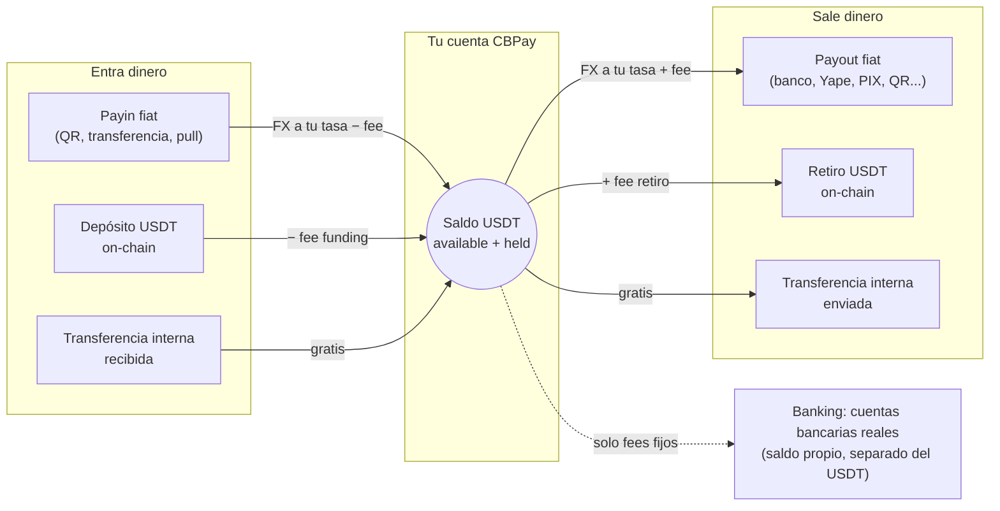

CBPay es una plataforma de pagos multi-moneda para Latinoamérica. Cada cuenta
mantiene un saldo virtual en **USDT** y opera sobre él:

<CardGroup cols={2}>
  <Card title="Payouts fiat" icon="money-bill-transfer" href="/es/guias/payouts">
    Dispersa dinero a cuentas bancarias locales en Chile, Perú, México,
    Venezuela, Bolivia, Brasil y Paraguay, debitado de tu saldo USDT.
  </Card>
  <Card title="Payins fiat" icon="qrcode" href="/es/guias/payins">
    Cobra en moneda local (QR, transferencias, página de pago y cobro
    pull) y recibe el abono automáticamente en USDT.
  </Card>
  <Card title="Transferencias internas" icon="arrows-left-right" href="/es/guias/transferencias">
    Mueve saldo a cualquier otra cuenta CBPay, al instante y sin
    comisión.
  </Card>
  <Card title="Crypto on-chain" icon="link" href="/es/guias/crypto">
    Fondea con USDT por TRON o Ethereum y retira on-chain a cualquier
    dirección.
  </Card>
  <Card title="Tarjetas" icon="credit-card" href="/es/guias/tarjetas">
    Emite tarjetas virtuales y físicas que gastan directo del saldo USDT
    de la cuenta, con autorización en tiempo real.
  </Card>
  <Card title="Banking" icon="building-columns" href="/es/guias/banking">
    Cuentas bancarias reales a tu nombre: recibe, mantén y envía dinero
    por rieles internacionales (SEPA, SWIFT, ACH).
  </Card>
  <Card title="KYC/KYB" icon="user-check" href="/es/guias/kyc">
    Verificación de personas y empresas con screening AML, rescreening y
    monitoreo continuo.
  </Card>
  <Card title="Cartola" icon="file-invoice" href="/es/guias/cartola">
    Estado de cuenta completo por período en JSON, PDF o Excel, con
    cuadratura contable garantizada.
  </Card>
</CardGroup>

Todos los eventos llegan a tus **webhooks firmados**
([guía](/es/webhooks)).

## Cómo funciona

Todo gira alrededor de un único saldo USDT por cuenta — el dinero entra
por un lado, se convierte, y sale por el otro:



1. CBPay te da acceso: registro con email/contraseña
   o una API key directa.
2. Fondeas tu cuenta: con un payin fiat o un depósito USDT on-chain.
3. Operas: payouts, transferencias, retiros — todo se debita y acredita
   sobre tu saldo USDT con conversión FX al momento.
4. Te enteras de todo: cada movimiento queda en un historial inmutable
   (`GET /v1/movements`) y los eventos llegan a tus webhooks.

## URL base

```
https://api.qbank.cl/platform
```

Todas las rutas de esta documentación son relativas a esa URL base.

<Note>
Los montos son siempre **strings decimales** (ej. `"10.500000"`), nunca
números flotantes. Los saldos usan 6 decimales (precisión USDT).
</Note>

## Siguientes pasos

<Steps>
  <Step title="Crea tu cuenta y token">
    Sigue el [inicio rápido](/es/inicio-rapido) para registrarte y hacer tu
    primera llamada.
  </Step>
  <Step title="Entiende el modelo de dinero">
    Lee [modelo de dinero](/es/conceptos/modelo-de-dinero) y
    [comisiones](/es/conceptos/comisiones).
  </Step>
  <Step title="Integra tu primer producto">
    Empieza por [payouts](/es/guias/payouts) o [payins](/es/guias/payins).
  </Step>
</Steps>
