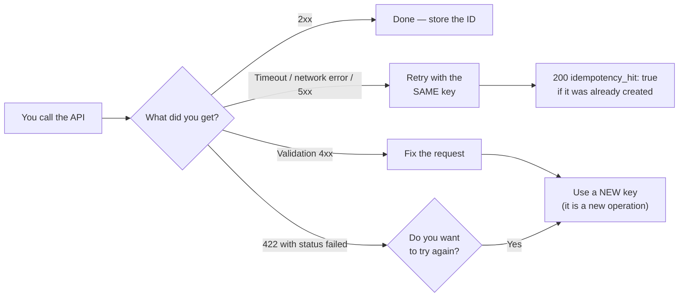

Every money-moving operation requires an **idempotency key**. The
complete table:

| Endpoint | Key | Why |
|---|---|---|
| `POST /v1/payouts` | **Required** | Debits your balance and disperses |
| `POST /v1/payouts/qr/confirm` | **Required** | Debits and pays the QR (the `scan` is free and does not need one) |
| `POST /v1/payins/collect` | **Required** | Executes a real debit against the payer |
| `POST /v1/transfers` | **Required** | Moves balance between accounts |
| `POST /v1/crypto/withdrawals` | **Required** | Debits and broadcasts on-chain |
| `POST /v1/banking/operations` | **Required** | Sends a bank payment (the `prepare` is free and does not need one) |
| `POST /v1/cards` | **Required** | May charge the issuance fee |
| `POST /v1/payins` with `method: "fintoc"` | Optional, **recommended** | A retry with the same key returns the same payment session (never opens a second one) |
| `POST /v1/payins` (qr / bank_transfer) | Not applicable | The charge moves no money until someone pays; an unpaid duplicate simply expires |

## How to send it

Two equivalent ways (if you send both, the body wins):

```bash Body
curl -X POST …/v1/payouts \
  -d '{ "idempotency_key": "payroll-2026-07-001", … }'
```

```bash Header
curl -X POST …/v1/payouts \
  -H "Idempotency-Key: payroll-2026-07-001" \
  -d '{ … }'
```

Omitting it returns `400 idempotency_key_required`.

## What happens on retry

The key is unique per **source account**. If you repeat a call with the same
key:

- No new operation is created and no money moves again.
- You receive `200 OK` (instead of `201`/`202`) with the original object
  plus `idempotency_hit: true`.

```json
{
  "payout_id": "same-as-the-first-time",
  "status": "processing",
  "idempotency_hit": true
}
```

## Which key do I retry with?

The full decision rule, so you never have to guess:



## Recommendations

- Use an identifier from **your** system (order ID, payroll ID, etc.), not a
  timestamp or a UUID regenerated on every retry.
- Persist the key before calling the API; that way you can retry after a
  timeout with a no-duplication guarantee.
- On network errors or `5xx`, **retry with the same key**. On validation
  `4xx`, fix the request and use a new key.
