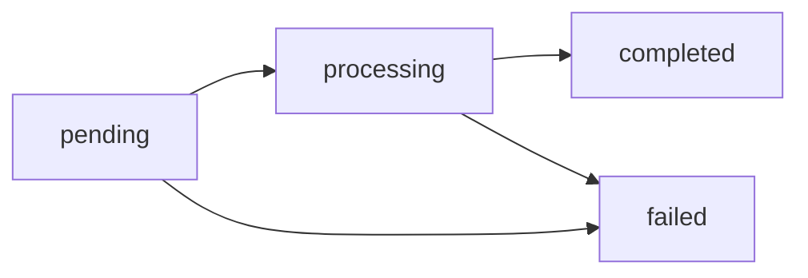

## Four independent virtual balances

Every account holds **four virtual balances, one per currency**. They are
fully independent: they never mix and are never converted automatically.

| Currency | What it is | Decimals | How it is funded |
|---|---|---|---|
| `USDT` | USD stablecoin — **the operating currency** | 6 | Fiat payins, on-chain deposits (TRON/Ethereum), transfers |
| `USDC` | USD stablecoin | 6 | On-chain deposits (Ethereum), transfers |
| `BTC` | Bitcoin | 8 (satoshis) | Operator credits and internal transfers |
| `GOLD` | **Grams of fine gold** backed by a custodian | 6 | Operator credits and internal transfers |

`GET /v1/balances` always returns all four (zeros if you have not used that
currency yet), as **decimal strings**:

```json
{
  "account_id": "…",
  "balances": [
    { "asset": "USDT", "available": "125.430000", "held": "10.000000" },
    { "asset": "USDC", "available": "50.000000", "held": "0.000000" },
    { "asset": "BTC", "available": "0.00060000", "held": "0.00000000" },
    { "asset": "GOLD", "available": "12.500000", "held": "0.000000" }
  ]
}
```

> **Note**
Internally each amount is stored as an integer in its currency's minimal
unit (micro-USDT, satoshis, micro-grams) and computed with exact rational
arithmetic. There are no floats and no accumulated rounding errors.
**USDT is the operating currency**: payouts, fiat payins and service fees
are always priced in USDT. But the **payment** can come from any of the
four balances — see [Choose which balance pays](#choose-which-balance-pays).
Payins credit in USDT and, if you configure `default_payin_asset`, the net
amount auto-converts into the balance you choose — see
[Choose which balance receives your payins](#choose-which-balance-receives-your-payins).
The other balances are also funded via
[internal transfers](https://docs.cbpayapp.com/en/guides/transfers) (always between balances of the
same currency), on-chain deposits (USDC and BTC) or credits from your
operator (GOLD).

## Choose which balance pays

**Payouts** and **service fees** (KYC, wallet creation, banking) can be
debited from any of your four balances. The pricing pipeline does not
change: the operation is quoted in USDT as always, and at the end the total
translates to the chosen asset at the **effective settlement price** of the
moment.

- **Per-account default**: `PUT /v1/settlement` with
  `{"default_settlement_asset": "BTC"}`. From then on, every payout and
  service fee comes out of the BTC balance (if it covers the amount; there
  are no cascades into other balances).
- **Per-operation override**: send `settlement_asset` in
  `POST /v1/payouts` (or in the QR confirm) to pay that single operation
  from another balance without touching the default.

```bash
# Set BTC as the default paying balance
curl -X PUT "https://api.qbank.cl/platform/v1/settlement" \
  -H "Authorization: Bearer <token>" -H "Content-Type: application/json" \
  -d '{"default_settlement_asset": "BTC"}'
```

Multi-asset settlement rules:

| Rule | Detail |
|---|---|
| Execution price | BTC and GOLD use an on-chain execution feed (not the reference price). If the feed is stale or unavailable, the operation returns `503 pricing_unavailable` — it never executes on a doubtful price. |
| Debit, hold and refund | All three live in the chosen asset. If the payout fails, the **exact** `settlement_amount` is refunded — never re-quoted. |
| Idempotency | Replaying with the same key returns the original amount; the price is never recomputed. |
| Per-operation limit | Volatile assets (BTC/GOLD) have a per-operation limit (USDT equivalent, visible in `GET /v1/settlement`); exceeding it returns `422 settlement_limit_exceeded`. |
| Per-account daily limit | Volatile assets also have a rolling 24h volume cap (`volatile_daily_limit_usdt` in `GET /v1/settlement`); exceeding it returns `422 settlement_daily_limit_exceeded`. Settle in USDT/USDC or retry later. |
| USDT | Remains the default path and changes nothing for anyone who never touches this setting. |

The `settlement` block of `GET /v1/rates` shows the effective per-asset
price (spread included) so you can estimate before operating, and the
payout response records `settlement_asset`, `settlement_amount` and
`settlement_rate` for auditability.

## Choose which balance receives your payins

By default **payins** (QR, bank transfer, collect, card) credit the USDT
balance. If you would rather hold another asset, configure
`default_payin_asset`: the credit still lands in USDT (pricing, FX spread
and fees untouched) and the **net credited amount** auto-converts into
your asset through the swap engine **at the real price, with no extra
spread** — the payin already paid its fee and rate; the automatic
conversion never charges twice. The same limits as a regular swap apply.

```bash
# Credit my payins in USDC
curl -X PUT "https://api.qbank.cl/platform/v1/settlement" \
  -H "Authorization: Bearer <token>" -H "Content-Type: application/json" \
  -d '{"default_payin_asset": "USDC"}'
```

| Rule | Detail |
|---|---|
| Post-credit conversion | The payin credits in USDT and the conversion runs right after, as a swap (you will see `swap_out`/`swap_in` in your statement). |
| Price and limits | The conversion executes **at the real price, with no swap spread** (no double cost: the payin already paid its fee and rate). The per-operation/24h limits of volatile assets (BTC/GOLD) apply. |
| If the conversion fails | The payin stays credited in USDT with `conversion_status: pending_retry` and the system retries automatically — funds are never lost or double-converted. |
| Checkout and POS | Each link keeps the `settlement_asset` chosen at creation; this setting never re-converts them. A link created **without** `settlement_asset` uses your `default_payin_asset`. |
| Surfaces | `GET /v1/payins`, the detail and the `payin_credited` webhook expose `settlement_asset` and `conversion_status` when a conversion applies. |

## `available` and `held`

Each balance has its own two counters:

| Field | Meaning |
|---|---|
| `available` | Balance available to operate |
| `held` | Reserved by in-flight operations (pending payouts and withdrawals) |

When you create a payout or withdrawal, the debit (`amount + fee`) leaves
`available` and sits in `held` until the operation reaches a final state:

- **`completed`** → the hold is consumed; the money left.
- **`failed`** → the full debit (amount + fee) is refunded to `available`.

## FX conversion (fiat ↔ USDT)

Fiat operations convert to USDT at **your account's rates** at execution
time (the same ones returned by `GET /v1/rates`, USD base): `rate` for
payouts and `payin_rate` for payins. Conversion rounds **up** on debits and
**down** on credits, with at most 1 micro-USDT of difference.

Example — a 50,000 CLP payout at a 950.25 rate:

```
usdt_amount = ceil(50000 / 950.25 × 10^6) / 10^6 = 52.618258 USDT
total_debit = usdt_amount + fee
```

Example — a 50,000 CLP payin at a 955.10 `payin_rate`:

```
usdt_gross    = floor(50000 / 955.10 × 10^6) / 10^6 = 52.350539 USDT
usdt_credited = usdt_gross − fee
```

The rate used is recorded on the object (`fx_rate`) for auditability.

## Reference and settlement prices

`GET /v1/rates` includes an `asset_prices` block with the **USD reference
price** of each currency (BTC per unit, GOLD per gram; USDT and USDC are 1
by convention) to value your balances on screen, plus a `settlement` block
with the **effective price** your balance would be valued at if you pay an
operation from that asset (spread included):

```json
{
  "asset_prices": {
    "USDT": { "currency": "USD", "unit": "usdt", "price": "1" },
    "USDC": { "currency": "USD", "unit": "usdc", "price": "1" },
    "BTC": { "currency": "USD", "unit": "btc", "price": "109853.24",
             "updated_at": "2026-07-07T11:59:41Z",
             "settlement_grade": true },
    "GOLD": { "currency": "USD", "unit": "gram", "price": "107.5341",
              "updated_at": "2026-07-07T09:12:05Z",
              "settlement_grade": true }
  },
  "settlement": {
    "default_asset": "USDT",
    "assets": [
      { "asset": "USDT", "available": true, "settlement_rate": "1" },
      { "asset": "USDC", "available": true, "settlement_rate": "0.99900000" },
      { "asset": "BTC", "available": true, "settlement_rate": "109029.34070000" },
      { "asset": "GOLD", "available": true, "settlement_rate": "106.99642950" }
    ]
  }
}
```

`settlement_grade: true` means the price is fresh enough to execute
operations; if it drops to `false`, payments from that asset answer
`503 pricing_unavailable` until the price recovers.

## Immutable ledger

Every movement produces an immutable entry with the resulting balance
(`balance_after`) **in the movement's currency**. Your full history lives
at `GET /v1/movements` (filter by currency with `?asset=`):

| `type` | What it represents |
|---|---|
| `payin_credit` | Credit from a fiat collection |
| `payout_debit` / `payout_refund` | Payout debit / refund on failure |
| `transfer_in` / `transfer_out` | Internal transfer received / sent |
| `funding` | On-chain deposit credited (USDT or USDC, each on its own balance) |
| `withdrawal_debit` / `withdrawal_refund` | On-chain withdrawal / refund on failure |
| `compliance_fee` / `compliance_refund` | KYC/KYB service charge / refund |
| `wallet_creation_fee` / `wallet_creation_refund` | Wallet creation charge / refund |
| `adjustment` | Manual adjustment by CBPay (audited) |

```bash
curl "https://api.qbank.cl/platform/v1/movements?type=payout_debit&from=2026-07-01&to=2026-07-07&page_size=20" \
  -H "Authorization: Bearer <token>"

# Only the GOLD balance movements
curl "https://api.qbank.cl/platform/v1/movements?asset=GOLD&from=2026-07-01&to=2026-07-07" \
  -H "Authorization: Bearer <token>"
```

Every list endpoint (`/v1/movements`, `/v1/payouts`, `/v1/payins`,
`/v1/crypto/transactions`, `/v1/banking/operations`) accepts pagination
(`page`, `page_size` up to 200) and `from`/`to` date filters
(YYYY-MM-DD, organization timezone, inclusive).

## Operation states

Payouts and crypto withdrawals follow the same lifecycle:



Final states (`completed`/`failed`) arrive via [webhook](https://docs.cbpayapp.com/en/webhooks); no
polling required.
