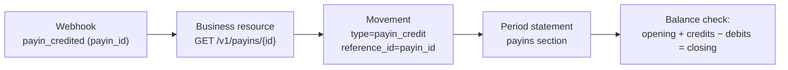

Every time your balance changes, CBPay writes an **immutable entry** in
the ledger with the resulting balance. `GET /v1/movements` is your source
of truth for reconciliation: nothing moves money without leaving an entry.

## Querying movements

```bash
curl "https://api.qbank.cl/platform/v1/movements?from=2026-07-01&to=2026-07-08&page_size=100" \
  -H "Authorization: Bearer <token>"
```

```json
{
  "account_id": "9b1deb4d-3b7d-4bad-9bdd-2b0d7b3dcb6d",
  "page": 1,
  "page_size": 100,
  "movements": [
    {
      "id": "a3f1…",
      "asset": "USDT",
      "amount": "-101.602460",
      "type": "payout_debit",
      "reference_type": "payout",
      "reference_id": "8e2a…",
      "description": "Payout 700.00 BOB",
      "balance_after": "3898.397540",
      "created_at": "2026-07-07T15:22:10Z"
    }
  ]
}
```

Filters: `from`/`to` (`YYYY-MM-DD`, organization timezone), `type`, `asset`, `page`,
`page_size` (max 200). Every entry carries `reference_type` +
`reference_id`: the business resource that originated it.

### Export to CSV / Excel

Add `format=csv` or `format=xlsx` to download the same rows as an
accounting-ready file (up to 10,000 rows per download). Also available on
the `payouts`, `payins` and `transfers` listings. CSV **headers** follow
the account locale; cell values stay raw:

```bash
curl -o movements.xlsx "https://api.qbank.cl/platform/v1/movements?from=2026-07-01&to=2026-07-13&format=xlsx" \
  -H "Authorization: Bearer <token>"
```

The payouts export (`GET /v1/payouts?format=csv`) includes a
`bank_reference` column — right after `status_code` — with the transaction
id assigned by the destination bank, populated once the payout is
`completed`.

## Complete type catalog

| `type` | Sign | Origin (`reference_type`) |
|---|---|---|
| `payin_credit` | + | Fiat collection credited (`payin`) |
| `payout_debit` / `payout_refund` | − / + | Payout created / refund on failure (`payout`) |
| `transfer_in` / `transfer_out` | + / − | Internal transfer received / sent (`transfer`) |
| `funding` | + | On-chain USDT deposit credited (`deposit`) |
| `withdrawal_debit` / `withdrawal_refund` | − / + | On-chain withdrawal / refund on failure (`withdrawal`) |
| `card_debit` / `card_refund` | − / + | Card purchase / reversal (`card_transaction`) |
| `card_fee` / `card_fee_refund` | − / + | Card fee (issuance, monthly, cancellation) |
| `compliance_fee` / `compliance_refund` | − / + | KYC screening charge / refund on failure |
| `wallet_creation_fee` / `wallet_creation_refund` | − / + | Wallet creation fee |
| `banking_fee` / `banking_fee_refund` | − / + | Banking operation fee |
| `adjustment` | ± | Audited manual adjustment by the administrator |

> **Note**
Banking balances live in your bank accounts (not in the USDT ledger): only
their **fees** appear here. Transactional fees for payouts/payins/
withdrawals have no entry of their own — they travel inside their
operation's amount (`total_debit`, `usdt_credited`).
## Reconciliation in three layers

Your integration has three views of the same money. They map like this:

| Layer | What it is | Join key |
|---|---|---|
| **Webhooks** | Push notification of each event | `payout_id` / `payin_id` / `transfer_id` / `withdrawal_id` |
| **Movements** | Immutable accounting entry with `balance_after` | `reference_id` = the same resource id |
| **Statement** | Period snapshot (JSON/PDF/Excel) with guaranteed balance | Per-product sections with the same ids |



### Daily reconciliation recipe

### Download the day's movements

`GET /v1/movements?from=YESTERDAY&to=YESTERDAY` paginating to the end.
### Cross against your internal records

Your `idempotency_key` derived from your internal id lets you join
each of your operations with its CBPay `reference_id`.
### Verify balance continuity

Sort by date: each entry's `balance_after` must be the previous one ±
`amount`. Any gap means you are missing an entry (not a ledger error —
it is immutable).
### Close the period with the statement

The [statement](https://docs.cbpayapp.com/en/guides/statement) guarantees the accounting
identity `opening + credits − debits = closing` and serves as your
formal backup (PDF/Excel).
## Movements vs statement: when to use which?

- **`GET /v1/movements`** — programmatic, paginated, live: for your
  automatic reconciliation and your history UI.
- **Statement** — period snapshot with totals, per-product/country/currency
  breakdowns and guaranteed balance: for accounting closes, audits and
  sharing with your finance team.

Both read the same ledger: they will never disagree.
