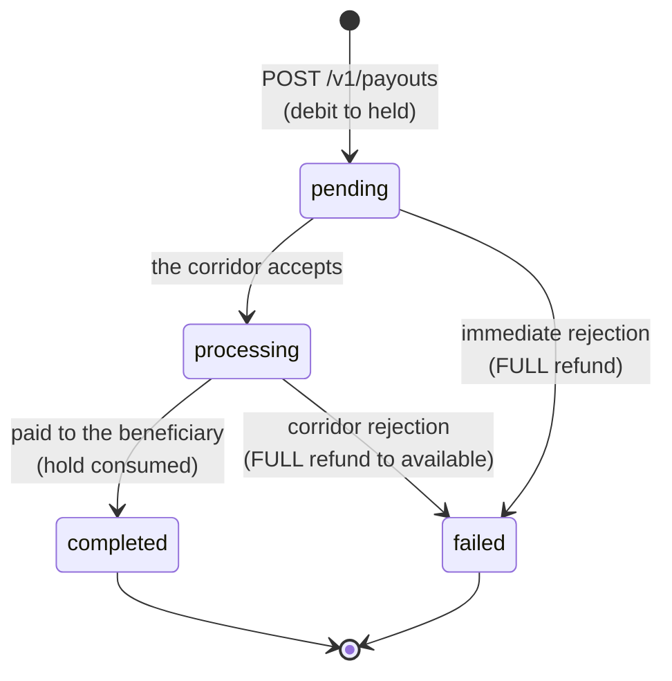

Every CBPay operation follows an explicit lifecycle. This page gathers
**all statuses of all products** in one place, with the golden rule: never
assume success until you see a **final state**.

## Unified table

| Product | Statuses | Final | Webhook event |
|---|---|---|---|
| Payout | `pending` → `processing` → `completed` / `failed` | `completed`, `failed` | `payout_status_changed` |
| Payin | `pending` → `credited` / `expired` / `failed` (+ `unassigned`) | `credited`, `expired`, `failed` | `payin_credited` |
| Transfer | `completed` (synchronous) | `completed` | `transfer_received` (to the receiver) |
| Crypto deposit | detection → `credited` on network confirmation | `credited` | `crypto_deposit_credited` |
| Crypto withdrawal | `pending` → `processing` → `completed` / `failed` | `completed`, `failed` | `crypto_withdrawal_status_changed` |
| Banking (payment) | per rail: `pending` → `processing` → `completed` / `failed` | `completed`, `failed` | `banking_operation_status_changed` |
| Card | `pending_activation` → `active` ⇄ `frozen` → `cancelled` | `cancelled` | `card_status_changed` |
| Account KYC | `none` → `pending` → `approved` / `rejected` | `approved`, `rejected` | — (query `GET /v1/me`) |

## Payouts: the cycle with money on hold

- The full debit (`total_debit`) leaves `available` and sits in `held`
  while the operation is in flight.
- `failed` **always refunds the full debit** (amount + fee) to
  `available`, automatically.
- A `processing` payout cannot be cancelled through the API: wait for the
  final state (webhook or `GET /v1/payouts/{id}`).

### `status_code` catalog on failed payouts

When a payout fails, `status_code` and `status_message` explain the cause
in neutral terms:

| `status_code` | Meaning | What to do |
|---|---|---|
| `core_rejected` | The processor rejected the operation at creation (invalid beneficiary data, non-existent destination account, corridor unavailable) | Read `status_message`, fix the data and create a new payout (new key) |
| *corridor code* | Later rejection by the banking rail (e.g. closed account) | Same: fix and retry as a new operation |
| *(empty)* with `failed` | Generic failure reported by the corridor | Check `status_message`; if unclear, contact support with the `payout_id` |

The refund already happened in every case: verify it in
`GET /v1/movements` (a `payout_refund` entry).

## Payins: collection statuses

- `pending` — the charge exists and awaits payment. QRs and payment pages
  expire (`expired` if nobody pays).
- `credited` — payment received, converted at your `payin_rate` and
  credited. With a card settlement delay configured, the payin reaches
  `credited` at payment confirmation but the **balance** lands later:
  while `settle_at` is in the future the response carries
  `settlement_pending: true` and `settled_at: null` (see
  [Card payin settlement delay](https://docs.cbpayapp.com/en/concepts/fees#card-payin-settlement-delay)).
- `unassigned` — a deposit arrived that could not be matched to any
  account; the administrator routes it manually and it is then credited
  with the destination account's rate and fees.
- `failed` — the collection failed (e.g. a collect declined by the payer).
  No money moved.

## Crypto withdrawals: on-chain confirmation

A withdrawal reaches `completed` when the transaction confirms on the
network. Typical times: **TRON ~1 minute** (19 confirmations), **Ethereum
a few minutes** depending on congestion. The `tx_id` comes in the response
and the webhook so you can verify it on the explorer.

If the withdrawal fails before broadcasting, the full debit is refunded
(a `withdrawal_refund` entry).

## Cards

- `pending_activation` — a physical card was issued and ships inactive; it
  activates with `POST /v1/cards/{id}/activate`.
- `active` — authorizes purchases in real time against the card's spending
  asset balance (`spending_asset`: USDT, USDC, BTC or GOLD).
- `frozen` — frozen (manually or for an unpaid monthly fee); purchases are
  declined with `unfunded_card_frozen`. It unfreezes by settling the
  pending charge.
- `cancelled` — final; cannot be reverted.

## Cross-cutting rules

#### When do I trust a status?
Final state via webhook **or** via the resource's `GET` — both are
equivalent sources of truth. The webhook is push (recommended); the `GET`
is your fallback if a webhook is lost.
#### What do I do on a timeout while creating an operation?
Do NOT retry with a new key. Repeat the same request with the **same**
`idempotency_key` (it returns the original with `idempotency_hit: true`)
or query the resource listing. Details in
[idempotency](https://docs.cbpayapp.com/en/concepts/idempotency).
#### Can a status go backwards?
No. Lifecycles are monotonic: `completed` and `failed` are definitive, and
an operation never returns to a previous state.
#### Where do I see each status's effect on my balance?
In `GET /v1/movements`: every transition with an economic effect leaves an
immutable entry (`payout_debit`, `payout_refund`, `payin_credit`…). See
[movements and reconciliation](https://docs.cbpayapp.com/en/concepts/movements-reconciliation).
