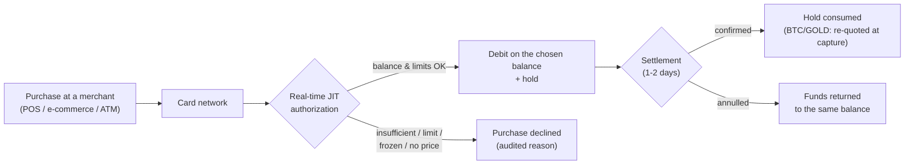

> **Environments:** Test `https://cryptobank.qbank.cl/platform` (`pk_test_...`) - Live `https://api.qbank.cl/platform` (`pk_...`).

CBPay cards spend **Just-In-Time from the account's central balance**: no
prefunding, no moving balance around. Each card picks which balance it
spends from (`spending_asset`: **USDT, USDC, BTC or GOLD**). USDT/USDC are
1:1 with the USD; BTC and GOLD convert **at the price of the moment of each
event**. Every purchase is authorized in real time against that asset's
available balance and the card's own limits, and the debit shows up
immediately in the movement history.



## How many cards you can hold

| Account type | Virtual | Physical | For third parties? |
|---|---|---|---|
| Person | **1** | **1** | No |
| Company | **Unlimited** | **Unlimited** | Yes: designated persons (e.g. employees) |

Each card spends from the **account's central balance in its configured
asset** (`spending_asset`, USDT by default). Fine-grained control is
per-card spending limits (per transaction, daily, monthly), always measured
in **USD**, which you can change at any time.

## Choosing the spending balance (USDT, USDC, BTC or GOLD)

Set `spending_asset` when creating the card or change it later with `PATCH`.
It only affects future purchases: in-flight authorizations keep the asset
they were debited in (and their reversal returns that same asset).

```bash
curl -X PATCH https://api.qbank.cl/platform/v1/cards/{card_id} \
  -H "Authorization: Bearer <token>" \
  -H "Content-Type: application/json" \
  -d '{ "spending_asset": "BTC" }'
```

**USDT and USDC** are both worth 1 USD, so the conversion is exact 1:1 with
no exchange fee: a 25.00 USD purchase debits 25.000000 of the chosen asset.

**BTC and GOLD** convert at the effective price of the moment of each event
(the same settlement price you see in `GET /v1/rates`, `settlement` block):

- **Authorization**: the purchase's equivalent in your asset is reserved
  **plus a small cushion** (not a charge: it covers price drift until
  clearing and is returned at capture). If the execution price is not
  available at that moment, the purchase is **declined**
  (`pricing_unavailable`) — your balance is never converted with an
  untrustworthy price.
- **Settlement (capture)**: the final amount is re-converted at the price
  of the capture moment; the cushion's excess returns to your balance (or
  the difference is debited if the price moved beyond the cushion).
- **Reversal of an authorization**: the EXACT reserved amount is returned,
  with no conversion.
- **Refunds and adjustments after capture**: re-converted at the price of
  the moment of the event. The price may move between the purchase and the
  refund — you receive the equivalent in your asset at that moment's
  price, not the original quantity.
- BTC/GOLD purchases share your account's **volatile-asset limits** (per
  operation and 24h volume, visible in `GET /v1/settlement`).

| Error / decline | Where | Cause | Solution |
|---|---|---|---|
| `spending_asset_unavailable` | 400 on PATCH / purchase decline | The asset does not exist or is not enabled for purchases | Use `USDT`, `USDC`, `BTC` or `GOLD` |
| `settlement_asset_disabled` | 400 on PATCH | Your operator disabled that asset | Check `GET /v1/settlement` (`enabled_assets`) |
| `pricing_unavailable` | Purchase decline (BTC/GOLD) | Execution price unavailable at authorization | Retry the purchase; if it persists, switch to USDT/USDC |
| `settlement_limit_exceeded` | Purchase decline (BTC/GOLD) | The purchase exceeds the per-operation limit for volatile assets | Smaller purchase, or spend from USDT/USDC |
| `settlement_daily_limit_exceeded` | Purchase decline (BTC/GOLD) | The account reached its 24h volatile-asset volume | Wait, or spend from USDT/USDC |

> **Note**
If the chosen asset's balance is short, the purchase is declined with
`insufficient_funds` — there is no automatic fallback to another balance.
> **Important**
With BTC/GOLD your balance is exposed to price moves between a purchase's
events (authorization, capture, refund). Every conversion uses the
effective price of its moment — CBPay never re-quotes amounts backwards nor
deducts "just in case": the authorization cushion is always returned at
settlement.
## Costs (configured by your operator, can be 0)

| Service | When it is billed |
|---|---|
| `card_creation_virtual` | When issuing a virtual card |
| `card_creation_physical` | When issuing a physical card |
| `card_purchase_virtual` | **Per purchase** with a virtual card (percent + fixed over the USD amount) |
| `card_purchase_physical` | **Per purchase** with a physical card (percent + fixed over the USD amount) |
| `card_monthly` | Monthly fee per active card (with no balance, the card is frozen — no debt) |
| `card_cancellation` | When cancelling a card |

Exact amounts come from `GET /v1/rates` (`fees` field). Every issuance charge is
**automatically refunded** if issuance fails.

### Per-purchase fee (lifecycle)

The per-transaction fee follows the same lifecycle as the purchase:

- **Authorization**: the estimated fee is reserved **inside the hold**
  together with the purchase amount, in the card's `spending_asset` (the
  percent applies over the purchase's USD amount; in BTC/GOLD it converts
  with the same event price).
- **Settlement**: the fee is **recalculated** with the configuration in
  force at that moment and the definitive one is charged (`card_fee` in
  your movements); the difference against the estimate is released or
  charged together with the cushion adjustment.
- **Reversals and downward adjustments**: the fee is **prorated back** to
  the refunded fraction of the purchase (`card_fee_refund`).

If your operator changes the percent between authorization and settlement,
the settlement fee is charged — the same criterion as the BTC/GOLD price
per event. Declined purchases **charge no fee**.

## Create a card

The flow depends on whether your account is a **person** or a **company** —
pick your tab. The common rule: the **cardholder is verified ONCE per
account**, on the first issuance; subsequent cards reuse it with no data.
The `idempotency_key` is always required (a retry with the same key returns
the original card and never double-charges).

#### Person account

A person account issues cards **for itself** (at most 1 virtual +
1 physical).

**Your first card** creates and verifies your holder at the issuer. Since
your account already approved its
[identity verification](https://docs.cbpayapp.com/en/guides/kyc), your data and documents
**auto-fill from your verification** — you only add the issuer-specific
fields (`occupation`, `salary_usd`); any field you send explicitly wins
over the autofill:

```bash
curl -X POST https://api.qbank.cl/platform/v1/cards \
  -H "Authorization: Bearer <token>" \
  -H "Content-Type: application/json" \
  -d '{
    "physical": false,
    "idempotency_key": "card-v-1",
    "cardholder": {
      "occupation": "52201",
      "salary_usd": 1800
    }
  }'
```

`occupation` is a **catalog code**
([see below](#occupation-and-business-activity-catalog-codes)) and
`salary_usd` is whole US dollars. If your verification was done through
the wizard without some data or document the issuer requires, add it
explicitly to the `cardholder` (`first_name`, `email`, `address`,
`id_front_url`…, same format as always).

**Your second card** (the physical one, for example) asks for no data —
your holder is already verified:

```bash
curl -X POST https://api.qbank.cl/platform/v1/cards \
  -H "Authorization: Bearer <token>" \
  -H "Content-Type: application/json" \
  -d '{ "physical": true, "idempotency_key": "card-f-1" }'
```

A third card of the same type responds `409 card_limit_reached` (cancel
the existing one first).

#### Company account

A company account issues **unlimited cards**, in two modes:

**A. For the company itself** (corporate cards). The first issuance
creates the company holder with corporate data; later ones need nothing:

```bash First card (creates the company holder)
curl -X POST https://api.qbank.cl/platform/v1/cards \
  -H "Authorization: Bearer <token>" \
  -H "Content-Type: application/json" \
  -d '{
    "physical": false,
    "idempotency_key": "card-corp-1",
    "cardholder": {
      "kind_of_business": "J63",
      "legal_representation": "Carlos Soto, General Manager",
      "email": "finance@andina.cl",
      "certificate_of_good_standing_url": "https://files.example.com/kyb/standing.pdf",
      "business_license_url": "https://files.example.com/kyb/license.pdf",
      "register_shareholder_url": "https://files.example.com/kyb/shareholders.pdf",
      "id_shareholders_url": "https://files.example.com/kyb/shareholder-ids.pdf",
      "address_verification_shareholders_url": "https://files.example.com/kyb/addresses.pdf",
      "address": {
        "line1": "Av. Apoquindo 4500",
        "city": "Santiago",
        "region": "RM",
        "postal_code": "7550000",
        "country": "CL"
      }
    }
  }'
```

```bash Subsequent cards (no data, with limits)
curl -X POST https://api.qbank.cl/platform/v1/cards \
  -H "Authorization: Bearer <token>" \
  -H "Content-Type: application/json" \
  -d '{
    "physical": true,
    "idempotency_key": "card-f-ops-1",
    "limits": { "per_transaction": "500.00", "monthly": "5000.00" }
  }'
```

**B. For a designated person** (e.g. an employee): add
`cardholder.kind: "person"` with the `verification_id` of THAT person's
[**approved** KYC](https://docs.cbpayapp.com/en/guides/kyc) — their identity and documents come
from the verification; you only add the issuer fields:

```bash
curl -X POST https://api.qbank.cl/platform/v1/cards \
  -H "Authorization: Bearer <token>" \
  -H "Content-Type: application/json" \
  -d '{
    "physical": false,
    "idempotency_key": "card-emp-77",
    "limits": { "monthly": "1500.00" },
    "cardholder": {
      "kind": "person",
      "verification_id": "c3d4e5f6-a7b8-4c9d-0e1f-2a3b4c5d6e7f",
      "occupation": "52201",
      "salary_usd": 1800
    }
  }'
```

- Without `verification_id` (or with a non-approved verification):
  `422 verification_required` / `422 verification_not_approved`. The
  verification must be KYC (person); a KYB answers
  `422 verification_kind_mismatch`.
- Explicit `cardholder` fields win over the autofill (useful when the
  issuer requires a document the verification does not have).
- The printed name uses `first_name` + `last_name` (22 characters combined
  max) and the response carries `cardholder_kind: "person"` plus the
  `verification_id` used.

Response (same shape in every case):

```json
{
  "card_id": "3c2b1a09-8d7e-6f5a-4b3c-2d1e0f9a8b7c",
  "account_id": "9b1deb4d-3b7d-4bad-9bdd-2b0d7b3dcb6d",
  "physical": false,
  "cardholder_kind": "account",
  "status": "active",
  "spending_asset": "USDT",
  "limits": { "monthly": "5000.000000" },
  "created_at": "2026-07-08T12:00:00Z",
  "updated_at": "2026-07-08T12:00:00Z",
  "creation_fee": "3.000000"
}
```

> **Note**
**Application review.** If your organization enabled card application review, `POST /v1/cards` can answer **`202 Accepted`** with `{"status":"in_review","kind":"card_application","review_id":"…"}` instead of `201` — the card is issued only when compliance approves the review. The creation fee is charged when the application is held and **refunded automatically if it is rejected**. Track the result with the webhook `txn_review_status_changed` or in [Transaction reviews](https://docs.cbpayapp.com/en/guides/transaction-reviews).
You can pin the spending balance from the start by adding
`"spending_asset": "USDC"` to the creation body (USDT if omitted).

> **Important**
Documents are **actually validated** by the issuer: URLs must point to
legitimate, reachable documents. If they are missing or insufficient,
issuance fails (`422 core_rejected` or `409 cardholder_kyc_pending`),
**the fee is refunded automatically** and you can retry with corrected
data.
> **Note**
Person or company? The differences between both account types across ALL
products are summarized in
[persons and companies](https://docs.cbpayapp.com/en/concepts/persons-companies).
### Occupation and business activity (catalog codes)

When designating a **person**, `occupation` must be a **code** from the
official catalog (not free text); for a **company**, so must
`kind_of_business`. Look them up (searchable with `?q=`):

```bash
# Occupations (persons)
curl "https://api.qbank.cl/platform/v1/cards/catalog/occupations?q=director" \
  -H "Authorization: Bearer <token>"

# Business activities (companies)
curl "https://api.qbank.cl/platform/v1/cards/catalog/business-activities?q=software" \
  -H "Authorization: Bearer <token>"
```

Each item is `{ "code": "...", "label": "..." }`. Use the `code` in
`occupation` / `kind_of_business`. An out-of-catalog value returns
`400 invalid_occupation` or `400 invalid_kind_of_business` before reaching
the issuer. `salary_usd` is in **dollars** (integer).

## Physical cards: activation

A physical card is born `pending_activation` and travels **inactive** for
security. Once the holder has it in hand:

```bash
curl -X POST https://api.qbank.cl/platform/v1/cards/{card_id}/activate \
  -H "Authorization: Bearer <token>"
```

## Reveal PAN and CVV (sensitive data)

Only the **owning account** can reveal them (never the org admin). The
response is one-shot: display it to the holder and discard it.

```bash
curl -X POST https://api.qbank.cl/platform/v1/cards/{card_id}/reveal \
  -H "Authorization: Bearer <token>"
```

```json
{
  "card_id": "3c2b1a09-8d7e-6f5a-4b3c-2d1e0f9a8b7c",
  "pan": "5339880000001234",
  "cvv": "123",
  "exp_date": "202907",
  "note": "sensitive data: display once, never store"
}
```

> **Important**
**Never store or log the PAN/CVV.** CBPay does not persist it either: the
response comes straight from the issuer (PCI standard).
## Limits and freeze/unfreeze

```bash Update limits
curl -X PATCH https://api.qbank.cl/platform/v1/cards/{card_id} \
  -H "Authorization: Bearer <token>" \
  -H "Content-Type: application/json" \
  -d '{ "limits": { "per_transaction": "200.00", "daily": "0" } }'
```

`"0"` removes a limit. To freeze (declines every purchase instantly):

```bash Freeze
curl -X PATCH https://api.qbank.cl/platform/v1/cards/{card_id} \
  -H "Authorization: Bearer <token>" \
  -H "Content-Type: application/json" \
  -d '{ "frozen": true }'
```

## Transactions and their lifecycle

```bash
curl "https://api.qbank.cl/platform/v1/cards/{card_id}/transactions?from=2026-07-01&to=2026-07-08&page=1&page_size=50" \
  -H "Authorization: Bearer <token>"
```

```json
{
  "page": 1,
  "page_size": 50,
  "transactions": [
    {
      "transaction_id": "7a1b2c3d-4e5f-6071-8293-a4b5c6d7e8f9",
      "card_id": "3c2b1a09-8d7e-6f5a-4b3c-2d1e0f9a8b7c",
      "kind": "purchase",
      "merchant": "MERPAGO*SUPERMERCADO",
      "mcc": "5411",
      "amount_usd": "25.00",
      "amount_usdt": "25.000000",
      "spend_asset": "USDC",
      "spend_amount": "25.000000",
      "fee_asset": "USDC",
      "fee_amount": "0.300000",
      "status": "settled",
      "decline_reason": "",
      "auth_number": "123456",
      "created_at": "2026-07-09T15:04:05Z",
      "updated_at": "2026-07-10T09:00:00Z"
    }
  ]
}
```

`spend_asset` / `spend_amount` show which balance the purchase actually
debited and how much in that asset (`amount_usd` / `amount_usdt` remain the
USD reference value). For BTC/GOLD, an authorized transaction's
`spend_amount` includes the reserve cushion; after settlement it shows the
final amount.

`fee_asset` / `fee_amount` are the asset and amount of the per-purchase fee
(definitive once `settled`; estimated while `authorized`).
`fee_refunded_amount` appears once a refund applies from reversals or
downward adjustments. When your operator does not configure a per-purchase
fee, the `fee_*` fields are **not included** in the transaction — the
historical behavior is unchanged.

| Status | Meaning |
|---|---|
| `authorized` | Approved in real time: the amount left the chosen balance's available and sits in a hold |
| `settled` | Confirmed at network settlement (the hold is consumed; BTC/GOLD re-quoted at the capture moment) |
| `reversed` | Annulled: funds returned to the same balance (exact amount if not settled; re-converted at the moment's price if it had settled) |
| `declined` | Rejected, with the reason: `insufficient_funds`, `card_limit_exceeded`, `card_frozen`, `account_blocked`, `spending_asset_unavailable`, `spending_asset_disabled`, `pricing_unavailable`, `settlement_limit_exceeded`, `settlement_daily_limit_exceeded` |

If settlement arrives for a different amount than authorized (tips, merchant
conversion), the adjustment is applied automatically: positive debits the
difference, negative returns it.

## Cancel a card

Irreversible. Bills `card_cancellation` when configured.

```bash
curl -X POST https://api.qbank.cl/platform/v1/cards/{card_id}/cancel \
  -H "Authorization: Bearer <token>"
```

## Webhooks

| Event | When |
|---|---|
| `card_transaction` | A purchase was authorized, annulled or adjusted |
| `card_status_changed` | The card changed state (including automatic freeze for unpaid monthly fee) |

Subscribe the same way as every other event (see [Webhooks](https://docs.cbpayapp.com/en/webhooks)).

## FAQ

#### Do I have to prefund the cards?
No. Cards hold no balance of their own: every purchase is authorized in real
time against the account's balance (in the card's spending asset). If the
balance covers it and the purchase respects the limits, it is approved.
#### What if several of my company's cards purchase at the same time?
They all spend from the account's central balances. Each authorization
debits atomically: you can never spend more than the asset's available
balance, no matter how many cards operate in parallel.
#### In which currency are purchases debited?
Purchases are processed in USD and debited from the card's configured
balance (`spending_asset`). USDT/USDC are 1:1 with the dollar, with no
conversion fee; BTC and GOLD convert at the effective price of the moment
of each event (the same one in the `settlement` block of `GET /v1/rates`).
#### Can different cards spend from different balances?
Yes: `spending_asset` is per card. A company can have, for example,
corporate cards spending USDT, employee cards spending USDC and a personal
one spending BTC. Changing it with `PATCH` only applies to future
purchases.
#### What is the cushion I see reserved on BTC/GOLD purchases?
Network settlement arrives 1-2 days after the authorization, and the
BTC/gold price can move in between. That is why the authorization reserves
the purchase's equivalent plus a small percentage. It is not a charge: at
settlement, the purchase is re-converted at that moment's price and
everything reserved in excess automatically returns to your balance.
#### What if the BTC/gold price is unavailable when I purchase?
The purchase is declined (`pricing_unavailable`) — CBPay never converts
your balance with an untrustworthy price. It is a transient condition
(degraded price feed): retry in a few minutes or switch the card to
USDT/USDC. Events that cannot be declined (the settlement of an
already-approved purchase, a refund) are never blocked: they are processed
with the last known price plus a prudential margin, audited in the
movement.
#### A BTC purchase of mine was refunded — why did I receive a different quantity?
Refunds convert at the price of the refund moment, not the purchase's: you
receive the equivalent in your asset of the refunded USD amount. If BTC
went up since the purchase you receive less BTC (same USD value); if it
went down, more. Your BTC/GOLD balance is always exposed to the price —
that is the nature of spending from a volatile asset.
#### Why did the fee of my purchase change between authorization and settlement?
The authorization reserves an estimated fee inside the hold. At settlement
the fee is recalculated with the configuration in force at that moment:
if your operator changed the percent between both events, the settlement
fee applies. The difference against the estimate is released or charged
together with the purchase adjustment — never as a separate movement.
#### What happens if there is no balance for the monthly fee?
The card is frozen automatically (`card_status_changed` event with
`reason: monthly_fee_unpaid`). No debt accrues; once the balance is topped
up, unfreeze it with `PATCH { "frozen": false }`.
#### Can I issue a card for someone outside my company?
Company accounts can issue for any designated person. That person must
have an [approved KYC verification](https://docs.cbpayapp.com/en/guides/kyc) — you pass their
`verification_id` in the `cardholder` and their data and documents
auto-fill. The card always spends from the balance of the issuing company
account.
The general error catalog lives in [Errors](https://docs.cbpayapp.com/en/errors).
