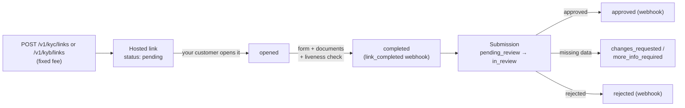
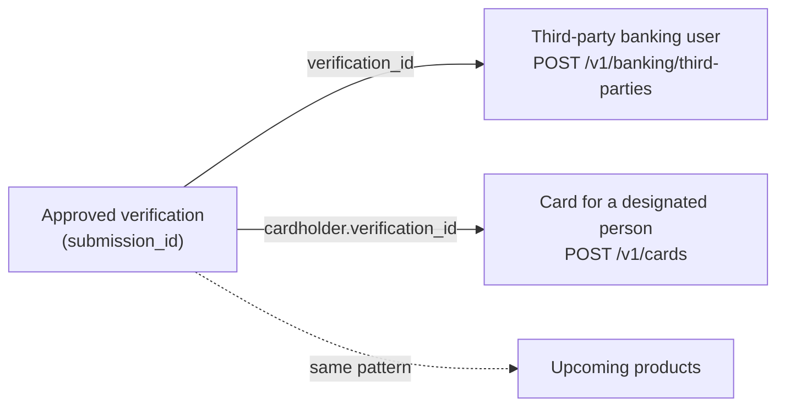

> **Environments:** Test `https://cryptobank.qbank.cl/platform` (`pk_test_...`) - Live `https://api.qbank.cl/platform` (`pk_...`).

**Identity verification** proves a person (KYC) or company (KYB) is who
they claim to be, with real evidence: a complete form, document uploads
validated by OCR and a **video liveness check**. It has two sides:

1. **Your own verification (onboarding)** — mandatory: until approved, your
   account can only **fund** (payins, crypto deposits, incoming transfers)
   and read. Person ⇒ KYC; company ⇒ KYB.
2. **Verifying your customers (company accounts only)** — generate hosted
   links or send data through the API to verify your own end customers,
   with a fixed fee per verification.



## Your own verification (onboarding)

When you register, your account starts unverified (`kyc_status: none`) and
**can only fund and read**. Any outgoing-money action (payouts, transfers,
withdrawals, banking, cards) answers `403 verification_required` until you
are approved.

### Request your verification link

```bash
curl -X POST https://api.qbank.cl/platform/v1/me/verification/link \
  -H "Authorization: Bearer <token>"
```

`201` response (if you already have an open link, the same one is returned
with `200`):

```json
{
  "link_id": "a1b2c3d4-e5f6-4a7b-8c9d-0e1f2a3b4c5d",
  "kind": "kyc",
  "url": "https://…/on/usd/individual/new?invite=abc123…",
  "status": "pending",
  "label": "Ana Pérez",
  "created_at": "2026-07-10T12:00:00Z",
  "updated_at": "2026-07-10T12:00:00Z"
}
```

The `kind` derives from your account type: person ⇒ `kyc`, company ⇒
`kyb`. Onboarding is **free** for you.
### Complete the wizard

Open the `url`: the hosted wizard guides you through the form, document
uploads (identity, proof of residence; corporate documents for companies)
and — for KYC — the camera liveness check.
### Wait for review

Check your state any time:

```bash
curl https://api.qbank.cl/platform/v1/me/verification \
  -H "Authorization: Bearer <token>"
```

```json
{
  "kyc_status": "pending",
  "required_kind": "kyc",
  "verified": false,
  "link": { "link_id": "a1b2c3d4-…", "kind": "kyc", "url": "https://…", "status": "completed" },
  "submission": { "submission_id": "f0e1d2c3-…", "kind": "kyc", "status": "in_review", "liveness_pending": false }
}
```

When compliance approves, your `kyc_status` becomes `approved`
**automatically** and every service unlocks (you receive the
`kyc_verification_status_changed` webhook with `self_onboarding: true`).

The approval also **backfills your account profile with the verified
identity**: `display_name` (person = first + last name; company = legal
name), `tax_id` and `country` are taken from the verification and from then
on are **immutable** via `PATCH /v1/me` (`409 identity_locked`) — the
verified identity is the source of truth.
> **Note**
While you wait you can fund normally: payins on every method, crypto
deposits and incoming transfers work from day one. If your verification is
rejected (`kyc_status: rejected`), contact your operator — they may ask you
to retry with a new link.
## Verifying your customers (company accounts only)

A verified **company** account can verify its own end customers. Each
created verification bills the configured fixed fee (`kyc_verification` /
`kyb_verification`; 0 = free), **automatically refunded** if creation
fails. Person accounts receive `403 company_account_required`.

### Option A — Hosted links (recommended)

Your customer completes EVERYTHING in the white-label wizard: form,
documents and liveness. You only generate the link and wait for the
webhook.

```bash KYC link (person)
curl -X POST https://api.qbank.cl/platform/v1/kyc/links \
  -H "Authorization: Bearer <token>" \
  -H "Content-Type: application/json" \
  -d '{
    "external_customer_id": "cust_123",
    "label": "Ana Pérez",
    "expires_in_days": 14,
    "idempotency_key": "kyc-link-cust-123-1"
  }'
```

```bash KYB link (company, with country)
curl -X POST https://api.qbank.cl/platform/v1/kyb/links \
  -H "Authorization: Bearer <token>" \
  -H "Content-Type: application/json" \
  -d '{
    "external_customer_id": "cust_456",
    "country": "cl",
    "label": "Comercial Andina SpA",
    "expires_in_days": 14,
    "idempotency_key": "kyb-link-cust-456-1"
  }'
```

- `external_customer_id` (required): YOUR reference for the verified
  customer — echoed back on every webhook and query. Values equal to
  `self` or ending in `:self` are reserved for account onboarding and are
  rejected with `400 invalid_payload`.
- `idempotency_key` (required): a retry with the same key returns the
  original link and **never double-charges**.
- `country` (KYB only): `us`, `cl`, `ve`, `br`, `mx`, `co`, `pe`, `bo`,
  `py`, `ar` or `generic` (with `generic_country` ISO alpha-2, e.g.
  `"ES"`). Individual KYC takes no country.
- `expires_in_days` (optional, 1–30): omitted, the link never expires.

`201` response:

```json
{
  "link_id": "b2c3d4e5-f6a7-4b8c-9d0e-1f2a3b4c5d6e",
  "kind": "kyb",
  "external_customer_id": "cust_456",
  "url": "https://…/on/cl/business/new?invite=abc123…",
  "status": "pending",
  "country": "cl",
  "label": "Comercial Andina SpA",
  "expires_at": 1721209600,
  "verification_fee": "2.000000",
  "created_at": "2026-07-10T12:00:00Z",
  "updated_at": "2026-07-10T12:00:00Z"
}
```

Query and history (every POST has its GET):

```bash
# Filtered listing
curl "https://api.qbank.cl/platform/v1/kyb/links?from=2026-07-01&to=2026-07-10&status=completed&page=1&page_size=50" \
  -H "Authorization: Bearer <token>"

# Detail (live link state)
curl https://api.qbank.cl/platform/v1/kyb/links/{link_id} \
  -H "Authorization: Bearer <token>"
```

| Link status | Meaning |
|---|---|
| `pending` | Created, your customer has not opened it |
| `opened` | Your customer opened the wizard |
| `completed` | Form submitted — the submission is born (`kyb_link_completed` / `kyc_link_completed` webhook) |
| `expired` | Expired without completion |

### Option B — Data through the API

If you already hold the customer's data, create the verification directly
(no wizard). The submission enters the same review queue:

```bash
curl -X POST https://api.qbank.cl/platform/v1/kyc/submissions \
  -H "Authorization: Bearer <token>" \
  -H "Content-Type: application/json" \
  -d '{
    "external_customer_id": "cust_789",
    "idempotency_key": "kyc-sub-cust-789-1",
    "person": {
      "first_name": "Ana",
      "last_name": "Pérez",
      "email": "ana@example.com",
      "phone": "+56912345678",
      "nationality": "CHL",
      "date_of_birth": "1990-04-12",
      "tax_id": "12.345.678-5",
      "id_type": "id_card",
      "id_number": "12345678",
      "address": {
        "line1": "Av. Siempre Viva 123",
        "city": "Santiago",
        "state": "RM",
        "postal_code": "8320000",
        "country": "CHL"
      },
      "primary_purpose": "personal_or_living_expenses",
      "most_recent_occupation": "Engineer",
      "source_of_funds": "salary"
    }
  }'
```

Data-mode notes:

- Countries in **ISO alpha-3** (`CHL`, `USA`, `VEN`…); dates `YYYY-MM-DD`;
  `id_type`: `passport | id_card | drivers_license`.
- KYB: body `{ external_customer_id, country?, business: {…}, ubos?,
  directors?, signers?, bank_info?, metadata? }` on
  `POST /v1/kyb/submissions`.
- **No liveness is required at creation**: the KYC submission carries
  `liveness_pending: true`; close it with a [liveness
  link](#liveness-check-liveness-link).
- Re-sending with the same `external_customer_id` while the submission is
  open (`pending_review`, `changes_requested`, `more_info_required`)
  **updates** the same submission and does not charge again.

`201` response:

```json
{
  "submission_id": "c3d4e5f6-a7b8-4c9d-0e1f-2a3b4c5d6e7f",
  "kind": "kyc",
  "external_customer_id": "cust_789",
  "status": "pending_review",
  "liveness_pending": true,
  "verification_fee": "1.500000",
  "created_at": "2026-07-10T12:05:00Z",
  "updated_at": "2026-07-10T12:05:00Z"
}
```

Query and history:

```bash
curl "https://api.qbank.cl/platform/v1/kyc/submissions?from=2026-07-01&to=2026-07-10&status=approved&page=1&page_size=50" \
  -H "Authorization: Bearer <token>"

curl https://api.qbank.cl/platform/v1/kyc/submissions/{submission_id} \
  -H "Authorization: Bearer <token>"
```

The detail adds what compliance requested: `pending_documents`,
`rejection_reason`, `changes_requested_comments`; on KYC also
`liveness_pending` and `documents_received`; on KYB `aml_decision`.

| Submission status | Meaning |
|---|---|
| `pending_review` | Received, in the compliance queue |
| `in_review` | Compliance took the case |
| `changes_requested` | Data must be fixed and re-sent |
| `more_info_required` | Documents missing ([upload them via API](#documents-through-the-api)) |
| `escalated` | Escalated to senior review |
| `approved` / `approved_partial` | Approved (final) |
| `rejected` | Rejected (final) |

### Documents through the API

Documents are optional at creation (if missing, compliance will request
them via `more_info_required`). 3-step flow:

### Presign

```bash
curl -X POST https://api.qbank.cl/platform/v1/kyc/submissions/{submission_id}/documents \
  -H "Authorization: Bearer <token>" \
  -H "Content-Type: application/json" \
  -d '{
    "category": "identity",
    "filename": "cedula.jpg",
    "content_type": "image/jpeg",
    "file_size": 482133
  }'
```

```json
{ "upload_url": "https://storage…", "key": "public-api/…", "expires_in": 900 }
```

Categories — KYC: `identity`, `proofOfResidence`; KYB: `legalPresence`,
`ownershipStructure`, `controlStructure`, `companyDetails`. Types:
`application/pdf`, `image/png`, `image/jpeg`; 15 MB max; the upload URL
expires in 15 minutes.
### Upload

`PUT` the binary straight to `upload_url` with the same `Content-Type`.
### Confirm

```bash
curl -X POST https://api.qbank.cl/platform/v1/kyc/submissions/{submission_id}/documents/confirm \
  -H "Authorization: Bearer <token>" \
  -H "Content-Type: application/json" \
  -d '{ "key": "public-api/…", "category": "identity", "filename": "cedula.jpg", "content_type": "image/jpeg" }'
```

```json
{ "status": "received", "ocr": "queued" }
```

Confirming queues the OCR validation; the result arrives via the
`kyc_document_validated` / `kyb_document_validated` webhook and is
queryable with GET:

```bash
curl https://api.qbank.cl/platform/v1/kyc/submissions/{submission_id}/documents \
  -H "Authorization: Bearer <token>"
```

```json
{
  "items": [
    { "category": "identity", "status": "completed", "outcome": "MATCH", "score": 0.97, "summary": "Document matches the submitted identity", "filename": "cedula.jpg" }
  ],
  "meta": { "retrieved": 1 }
}
```

`outcome`: `MATCH`, `REVIEW` (manual review), `NO_MATCH`.
### Liveness check (liveness link)

KYC submissions created through the API are born with
`liveness_pending: true` (the liveness check is a browser camera flow).
Generate a minimal hosted link for your customer to complete it:

```bash
curl -X POST https://api.qbank.cl/platform/v1/kyc/submissions/{submission_id}/liveness_link \
  -H "Authorization: Bearer <token>" \
  -H "Content-Type: application/json" \
  -d '{ "expires_in_days": 7 }'
```

```json
{ "url": "https://…/on/liveness/<token>", "status": "pending", "expires_at": 1751234567 }
```

- Free (the service was billed when the submission was created). If an
  open link exists, the POST returns the same one; if the check already
  passed, `400 liveness_already_completed`.
- `GET .../liveness_link` returns the latest link and the current check
  state (`{ "liveness": { "status", "outcome", "passed" } }`).
- On pass (outcome `PASS` or `REVIEW`): the submission clears
  `liveness_pending` and the `kyc_liveness_completed` webhook fires.

## One verification for everything (reusable identity)

A customer's approved verification is their **single identity** inside
CBPay: you never re-type their data or re-upload their documents in any
other product.



- **Third-party banking**: `POST /v1/banking/third-parties` requires the
  `verification_id` of an **approved** verification of the third party.
  The type (`INDIVIDUAL`/`COMPANY`) comes from the kind (KYC ⇒ person,
  KYB ⇒ company), the data (name, email, address) auto-fills from the
  verified profile, and the already-validated documents are re-delivered
  automatically to the banking provider (`documents_synced` in the
  response). Details in
  [Banking](https://docs.cbpayapp.com/en/guides/banking#third-party-banking-users-companies-only).
- **Cards for designated persons**: `POST /v1/cards` with a person
  `cardholder` requires `cardholder.verification_id` of that person's
  **approved KYC**. The cardholder's identity and documents come from the
  verification; you only add the issuer-specific fields (`occupation`,
  `salary_usd`). Details in [Cards](https://docs.cbpayapp.com/en/guides/cards).
- **Your own account**: your approved onboarding is reused too — when
  creating your banking customer or your first card, missing data and
  documents auto-fill from your verification.

Explicit fields in your request **always win** over the autofill.

> **Important**
Without an approved verification of the third party, the banking
registration and designated card issuance answer
`422 verification_required`. Verify first (hosted links or API data) and
use the approved `submission_id` as `verification_id`.
## Compliance report (KYB only)

For every KYB verification you can download the **signed compliance
report** (PDF, evidence for your own auditors):

```bash
curl -o report.pdf https://api.qbank.cl/platform/v1/kyb/submissions/{submission_id}/report \
  -H "Authorization: Bearer <token>"
```

It is free (the service was billed when the verification was created).

## Verification report (PDF + JSON)

Besides the processor's report, every decided KYC or KYB submission has its
**verification report** generated by the platform. It is the full file, not a
summary: verified identity (person or company), declared economic profile,
risk attestations, masked bank account, decision lifecycle, documents with
their document validation, liveness check, **related parties with their own
screening** (KYB) and the AML screening with the detail of every match — all
with an integrity hash and a public verification code. Two formats
(`?format=pdf|json`, default `pdf`) and three languages (`?lang=en|es|zh`,
default `en`). It is free: it is a read of a verification you already paid
for.

Report sections:

| Section | Contents |
|---|---|
| Subject | Verified identity: person (document, nationality, tax residence, occupation) or company (registration, incorporation, jurisdiction, ISIC industry, website) |
| Economic profile | Source of funds, purpose of the relationship, expected volumes and revenue, expected chains |
| Attestations | Declared risk answers (money services, third-party funds, high-risk activities, prohibited countries) |
| Bank account | Bank, holder and account number **masked at the source** (never in full) |
| Documents | Category, file, status, validation outcome, score, validation timestamp and rejection reason. The PDF adds **identity document photos** when the provider supplies them (if none, the section is omitted) |
| Liveness | Per role (holder, UBO N): outcome, gate, liveness / antispoofing / face similarity scores. The PDF embeds selfie/frames when live media exists; JSON only declares metadata (`has_selfie`, gestures, hashes) without URLs |
| Related parties | KYB only: UBOs, control persons and signers, each with identity, ownership, their documents, their liveness and **their own AML screening** |
| AML screening | Risk level, indicators, matches with aliases, sanctions lists with source and validity, PEP positions, RCA links and adverse media. The PDF closing includes the full AML annex (attribution and sources) when a screening exists |

> **Note**
**How to read the PDF.** The report opens with a **navigable cover**: an index
of cards with icon, title and page number that are **clickable** and jump to
their section. Every section carries its own icon and accent bar (the same
visual language as the AML report), identity document and liveness photos keep
their real aspect ratio, and no heading is ever left alone at the bottom of a
page. Adverse media entries in the AML annex carry a **“view source”** chip and
the public verification URL in the closing block is clickable — for safety
**only `http` and `https` links are embedded**; any other scheme is dropped and
the text stays unlinked.
### For your third parties (company accounts)

```bash
# PDF in Spanish
curl -o report.pdf "https://api.qbank.cl/platform/v1/kyb/submissions/{submission_id}/verification-report?lang=es" \
  -H "Authorization: Bearer <token>"

# JSON (same content as the PDF)
curl "https://api.qbank.cl/platform/v1/kyc/submissions/{submission_id}/verification-report?format=json" \
  -H "Authorization: Bearer <token>"
```

A third party's report is **complete**: the AML section includes the risk
level, indicators and matches (names, sanctions lists, PEP, adverse media).
You perform the due diligence on your customer and this report is your
evidence.

`format=json` response (shape summary — the PDF renders from the same model):

```json
{
  "report_id": "IDR-C3D4E5F6A7B8",
  "kind": "kyb",
  "scope": "third_party",
  "generated_at": "2026-07-27T19:04:11Z",
  "generated_by": "CBPay",
  "language": "es",
  "aml_detail": true,
  "submission_id": "c3d4e5f6-a7b8-4c9d-0e1f-2a3b4c5d6e7f",
  "external_customer_id": "cust_789",
  "status": "approved",
  "risk_band": "low",
  "aml_decision": "no_match",
  "subject": {
    "type": "company",
    "name": "Importadora Andina SpA",
    "company": {
      "legal_name": "Importadora Andina SpA",
      "registration_number": "77.123.456-7",
      "incorporation_date": "2019-04-12",
      "incorporation_country": "CHL",
      "website": "https://andina.example",
      "countries_of_operation": ["CL", "PE"]
    },
    "address": { "city": "Santiago", "country": "CL" },
    "registered_address": { "line1": "Av. Apoquindo 1234", "city": "Santiago", "country": "CL" },
    "industry": { "code": "G4690", "label": "Wholesale trade" },
    "economic_profile": {
      "source_of_funds": "business_revenue",
      "primary_purpose": "supplier_payments",
      "annual_revenue_usd": "250000",
      "monthly_payments_usd": "40000",
      "expected_chains": ["tron", "ethereum"]
    },
    "attestations": [
      { "key": "att_money_services", "value": false },
      { "key": "att_high_risk_activities", "items": [] }
    ],
    "bank_account": {
      "bank_name": "Banco de Chile",
      "account_holder": "Importadora Andina SpA",
      "account_masked": "****4321",
      "country": "CL",
      "currency": "CLP"
    }
  },
  "parties": [
    {
      "source": "ubo",
      "index": 0,
      "kind": "ubo",
      "name": "Javier Villablanca",
      "person": {
        "first_name": "Javier",
        "last_name": "Villablanca",
        "date_of_birth": "1985-03-04",
        "nationality": "CL",
        "id_type": "national_id",
        "id_number": "12345678-9"
      },
      "address": { "city": "Santiago", "country": "CL" },
      "ownership_percent": "60",
      "has_ownership": true,
      "has_control": true,
      "documents": [
        { "category": "uboIdentity:0", "status": "validated", "outcome": "MATCH", "party_index": 0 }
      ],
      "liveness": { "role": "ubo:0", "outcome": "PASSED", "passed_gate": true },
      "aml": {
        "screening_id": "d5f6a7b8-9c0d-4e1f-2a3b-4c5d6e7f8a9b",
        "risk_level": "no_risk",
        "sanctions": "clear",
        "pep": "clear",
        "adverse_media": "clear",
        "monitor": true,
        "matches_total": 0
      }
    }
  ],
  "documents": [
    {
      "category": "registration",
      "filename": "deed.pdf",
      "status": "validated",
      "outcome": "MATCH",
      "score": "0.97",
      "validated_at": "2026-07-26T14:02:00Z"
    }
  ],
  "liveness": [
    { "role": "ubo:0", "outcome": "PASSED", "passed_gate": true, "liveness_score": "0.99" }
  ],
  "aml": {
    "screening_id": "b7e1c2d3-4f5a-6b7c-8d9e-0f1a2b3c4d5e",
    "risk_level": "no_risk",
    "status": "no_hits",
    "monitor": true,
    "screened_at": "2026-07-26T14:05:12Z",
    "sanctions": "clear",
    "pep": "clear",
    "adverse_media": "clear",
    "screening_result": "no_hits",
    "indicators": [
      { "key": "ind_sanctions", "hit": false },
      { "key": "ind_pep", "hit": false },
      { "key": "ind_adverse_media", "hit": false }
    ],
    "subject_rows": [
      { "key": "legal_name", "value": "Importadora Andina SpA" }
    ],
    "matches_total": 0
  },
  "content_sha256": "9f2b4c…",
  "verification_code": "Bc3d4e5f6a7b84c9d0e1f2a3b4c5d6e7f9f2b4c6d8e0a1b3c5d7",
  "verification_url": "https://api.qbank.cl/platform/verify/reports/Bc3d4e5f6a7b84c9d0e1f2a3b4c5d6e7f9f2b4c6d8e0a1b3c5d7"
}
```

> **Note**
If the verification does not yet have a linked AML screening (older
verifications), the first download runs it automatically **at no cost**. If
the screening is unavailable at that moment, the report is generated anyway
with `"partial": ["aml_unavailable"]` — the section is never fabricated.
### Related parties and their screening (KYB)

In a company verification, every UBO, control person and signer in the file
comes out as a `parties[]` entry with their full identity, their ownership,
the documents and liveness check that belong to them, and **their own AML
screening with continuous monitoring enabled**. The `(source, index)` pair is
the party's stable identity inside the file: it is what links their documents
(`uboIdentity:0`) and what makes their screening always the same, no matter
how many times you download the report.

Screening the parties is **free** (it is a due-diligence duty, not a billable
product) and stays monitored: if a UBO lands on a sanctions list after
onboarding, the alert shows up on its own.

> **Note**
If a party does not have its screening yet at download time, the report is
generated with `"partial": ["party_aml_unavailable"]` and the missing
screening runs in the background: the next download already carries it.
### For your own onboarding

```bash
curl -o report.pdf "https://api.qbank.cl/platform/v1/me/verification/report?lang=en" \
  -H "Authorization: Bearer <token>"
```

In the report of your own verification the AML section is **aggregated**
(`aml_detail: false`): you see the status per category — `sanctions`, `pep`
and `adverse_media` as `clear` or `under_review` — without the match details.
The same applies to the screening of your related parties: their AML sections
are aggregated too. The rest of the file (identity, economic profile,
documents, liveness, parties) is complete.

### Public report verification

Every report carries a `verification_code` (printed on the PDF next to a QR).
Anyone can confirm its authenticity without credentials:

```bash
curl "https://api.qbank.cl/platform/verify/reports/Bc3d4e5f6a7b84c9d0e1f2a3b4c5d6e7f9f2b4c6d8e0a1b3c5d7"
```

```json
{
  "valid": true,
  "type": "verification_report",
  "kind": "kyb",
  "status": "approved",
  "decision": "approved",
  "date": "2026-07-27",
  "issued_by": "CBPay"
}
```

The public page confirms only the type, the current decision status, the date
and the issuing brand — never data about the subject. In a browser it responds
with an HTML page carrying your brand.

## Webhooks

| Event | When |
|---|---|
| `kyc_verification_status_changed` / `kyb_verification_status_changed` | The submission changed state (whole lifecycle: received, in review, changes requested, approved, rejected…) |
| `kyc_link_completed` / `kyb_link_completed` | Your customer completed a hosted link |
| `kyc_document_validated` / `kyb_document_validated` | OCR finished for a document uploaded through the API |
| `kyc_liveness_completed` | The liveness check was completed from a liveness link |

Example payload (`kyc_verification_status_changed`):

```json
{
  "account_id": "9b1deb4d-3b7d-4bad-9bdd-2b0d7b3dcb6d",
  "kind": "kyc",
  "event": "approved",
  "submission_id": "c3d4e5f6-a7b8-4c9d-0e1f-2a3b4c5d6e7f",
  "external_customer_id": "cust_789",
  "status": "approved",
  "risk_band": "low",
  "decision": "approved"
}
```

Your own onboarding arrives with `"self_onboarding": true` instead of
`external_customer_id`. Subscribe like every other event (see
[Webhooks](https://docs.cbpayapp.com/en/webhooks)).

## Costs (configured by your operator, can be 0)

| Service | When it is billed |
|---|---|
| `kyc_verification` | When creating a third-party KYC link or submission |
| `kyb_verification` | When creating a third-party KYB link or submission |

The charge comes out of your default settlement balance, is refunded if
creation fails, and **your own onboarding never bills**. Re-sends of an
open submission and liveness links do not charge again.

## Errors

| HTTP | `error` | Cause | Solution |
|---|---|---|---|
| 400 | `idempotency_key_required` | Creation POST without a key | Send `idempotency_key` (body or header) |
| 400 | `invalid_payload` | Missing `external_customer_id` or another required field | Check the body |
| 400 | `liveness_already_completed` | The liveness check already passed | Nothing to do |
| 400 | `invalid_format` | Invalid `format` when requesting a verification report | Use `pdf` or `json` |
| 400 | `invalid_language` | Invalid `lang` when requesting a verification report | Use `en`, `es` or `zh` |
| 402 | `insufficient_funds` | Balance cannot cover the fee | Fund the account and retry |
| 403 | `verification_required` | Your account has not approved its own verification | Complete your [onboarding](#your-own-verification-onboarding) |
| 403 | `company_account_required` | A person account tried to verify third parties | Company accounts only |
| 403 | `service_disabled` | The `kyc` service is disabled for your account | Contact your operator |
| 404 | `not_found` | The link/submission does not exist or is not yours | Check the id |
| 404 | `verification_not_found` | You requested your self report without a registered verification | Complete your onboarding first |
| 409 | `already_verified` | Onboarding link requested with an already-approved account | Nothing to do |
| 503 | `verifications_unavailable` | Service temporarily unavailable (the fee was refunded) | Retry later |

## FAQ

#### Why can't I create payouts right after registering?
Every account must approve its identity verification before moving money
out (a regulatory requirement). Meanwhile you can fund (payins, crypto
deposits, incoming transfers) and explore the API. Request your link with
`POST /v1/me/verification/link` and complete it — approval unlocks
everything automatically.
#### Hosted links vs data through the API — which one?
With links, your customer completes everything in the wizard (form +
documents + liveness) and you never handle sensitive data. With API data
you send the fields and upload documents via presign — useful if you have
your own form — but the liveness check still needs a liveness link (it is
a camera flow, impossible server-to-server).
#### When is the fee billed and when not?
It bills when CREATING a third-party link or submission (live mode). Not
billed: your own onboarding, re-sends of an open submission (same
external_customer_id), liveness links, queries and documents. If creation
fails, the fee is refunded automatically.
#### Why can't my person account create links?
Third-party verification is a B2B tool for integrators (company accounts).
A person account only needs its own onboarding, which is free and lives at
/v1/me/verification.
#### Compliance asked for more documents — how do I send them?
You will receive `more_info_required` with `pending_documents` in the
submission detail. Upload each document with this page's presign → upload →
confirm flow; on confirmation the submission returns to the review queue.
#### Does this replace AML screening?
No: they complement each other. Verification proves identity with evidence
(documents, video); [AML screening](https://docs.cbpayapp.com/en/guides/aml) checks the identity
against sanctions/PEP/adverse-media lists and can watch it continuously.
#### Can I reuse a customer's verification in other products?
Yes — that is the design: an approved verification works as the single
identity. Pass its `submission_id` as `verification_id` when registering a
third-party banking user or issuing a card for a designated person: data
and documents auto-fill. See
[reusable identity](#one-verification-for-everything-reusable-identity).
