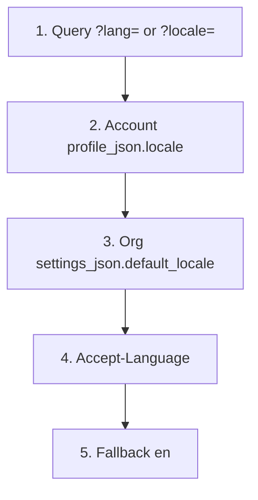

> **Environments:** Test `https://cryptobank.qbank.cl/platform` (`pk_test_...`) - Live `https://api.qbank.cl/platform` (`pk_...`).

Human-facing surfaces of the platform (hosted pages, PDFs, CSV **headers**)
resolve a locale of `en`, `es` or `zh`. The **default is English**. JSON API
responses and webhooks stay in English regardless of locale (labels, error
codes and `message` strings).

> **Note**
`locale` on the account is the human preference. It never translates the
JSON contract. If you need a Spanish PDF, pass `?lang=es` or set the
account locale — the `GET /v1/payouts/{id}` body is still English.
## Resolution chain

Authenticated API calls (`resolveRequestLocale`) walk this list and stop at
the first **valid** value. An invalid `?lang=` / `?locale=` is **ignored**
(never `400`) and the next step wins.



Public pages (checkout, tracker, receipts, status, hosted card page) insert
one extra step **between** the query and the account: the payer cookie
`cbpay_pay_locale` (see [Cookies](#two-cookies)).

Workers, receipt emails and PDFs generated without a request use the account
locale, then the org default, then English.

## Set the account locale

`GET /v1/me` exposes `locale` (`en` | `es` | `zh`). Missing or invalid
stored values are returned as `en`.

`PATCH /v1/me` accepts `locale` (string). It stays editable after KYC/KYB
approval — unlike `display_name`, `tax_id` and `country`.

| Body | Effect |
|---|---|
| omitted | Profile locale is not touched |
| `""` (empty) | Stored as `en` |
| `en` / `es` / `zh` (or variants such as `en-US`, `es-CL`, `zh-CN`) | Normalized and stored |
| anything else | `400 invalid_locale` — `"locale must be en, es or zh"` |

```bash
curl -X PATCH "https://api.qbank.cl/platform/v1/me" \
  -H "Authorization: Bearer <token>" \
  -H "Content-Type: application/json" \
  -d '{"locale": "en"}'
```

```json
{
  "id": "9b1deb4d-3b7d-4bad-9bdd-2b0d7b3dcb6d",
  "org_id": "1c9e7a2b-5f6d-4e3a-8c1b-2a9d8e7f6a5b",
  "type": "person",
  "status": "active",
  "kyc_status": "approved",
  "email": "ana@example.com",
  "display_name": "Ana Perez",
  "tax_id": "12345678-9",
  "phone": "+56987654321",
  "country": "CL",
  "locale": "en",
  "created_at": "2026-07-07T12:00:00Z",
  "updated_at": "2026-08-17T15:00:00Z"
}
```

Register (`POST /v1/auth/register`) and admin-created accounts stamp locale
at birth: explicit body `locale` > `Accept-Language` > org `default_locale`
> English. Invalid non-empty `locale` on register is the same
`400 invalid_locale`.

## Existing accounts vs new accounts

A one-shot deploy migration (`db/platform/092_account_locale_es_preconfig.sql`)
sets `locale=es` on accounts that had **no** locale yet. It is **not** an
API. After that deploy:

- **Existing** accounts stay in Spanish until the holder patches `locale`.
- **New** accounts are born in English unless the body, `Accept-Language` or
  the org default says otherwise.

## Organization default

Platform admins set `default_locale` with
`PUT /v1/admin/orgs/{orgID}/settings` (`key: default_locale`, value `"en"`,
`"es"` or `"zh"`). `""` clears the override so the org falls back to
English. Invalid values return `400 invalid_value` (not `invalid_locale`).
The `cbpay` organization does not carry this setting — accounts there use
the rest of the chain.

## Public pages, checkout and tracker

Hosted pages honor, in order: `?lang=` / `?locale=` → cookie
`cbpay_pay_locale` → (if there is a session) account locale → org default →
`Accept-Language` → `en`. The HTML is emitted with `<html lang="...">`.

Query overrides are never a `400`. Unknown values fall through.

Receipt and statement PDFs accept `?lang=en|es|zh` (default **English**).
Filenames follow the locale: `statement_…` / `receipt_…` (en),
`cartola_…` / `comprobante_…` (es), `对账单_…` / `收据_…` (zh).

Human HTTP responses stamp `Content-Language` and `Vary: Accept-Language`.

## Two cookies

| Cookie | Who sets it | Who reads it |
|---|---|---|
| `cbpay_pay_locale` | Platform, on public payer pages (`SetPayerLocaleCookie`: `Secure`, `SameSite=Lax`, `HttpOnly=false`, 30 days, `Path=/`) | Backend, **only** on public/checkout/payer pages |
| `cbpay_lang` | Front SSR of the portal (already existed) | Front only. **The backend never reads it** |

Do not send a `cb_locale` cookie — it is not part of this API.

## CSV exports

Platform CSV downloads (movements, payouts, payins, transfers, revenue,
audit log, Qscore batch results, card investigations, firewall export)
localize **header row** labels to the caller's locale. Cell values stay
raw (IDs, amounts, status codes). Expense CSV is unchanged in this
release.

Example Qscore batch header in English:

```csv
Document ID,Subject type,Status,Score,Band,Verify code,Report ID,Error code
12.345.678-5,person,ready,715,B,Q3f5c9f2d7d214b8c9a2d2d5f6a1b8c01a1b2c3d4e5f60718293a,3f5c9f2d-7d21-4b8c-9a2d-2d5f6a1b8c01,
```

## Out of scope

Telegram notifications, the card issuer's 3-D Secure **challenge** page,
and right-to-left scripts are not localized by this chain.

## Errors

| HTTP | `error` | When | What to do |
|---|---|---|---|
| 400 | `invalid_locale` | `PATCH /v1/me` or register sent a non-empty locale outside `en`/`es`/`zh` | Send `en`, `es` or `zh` (empty string stores English) |
| 400 | `invalid_value` | Org setting `default_locale` is not `en`/`es`/`zh` or `""` | Platform-admin only; see [errors](https://docs.cbpayapp.com/en/errors) |
| 400 | `invalid_language` | A **PDF report** `lang` (AML / verification) is not `en`/`es`/`zh` | Different code — report language, not account locale |

Full catalog: [Errors](https://docs.cbpayapp.com/en/errors). Profile fields: [Your profile](https://docs.cbpayapp.com/en/guides/profile).

## FAQ

#### Why is my existing account in Spanish after this release?
Accounts that already existed were pre-configured `locale=es` by the
one-shot deploy migration. New accounts default to English. Patch
`locale` on `PATCH /v1/me` to switch.
#### Does changing locale translate API JSON?
No. JSON bodies and webhooks stay in English. Locale applies to hosted
HTML, PDFs, CSV **headers** and similar human documents.
#### Why did an invalid ?lang=es-MX not return 400?
Query locale is best-effort. Unsupported values are ignored and the next
step in the chain is used. Only `PATCH /v1/me` / register persist a
locale and reject garbage with `invalid_locale`.
#### Which cookie should my checkout set?
The payer cookie is `cbpay_pay_locale`. The portal cookie `cbpay_lang` is
front-only and does not affect the API.
