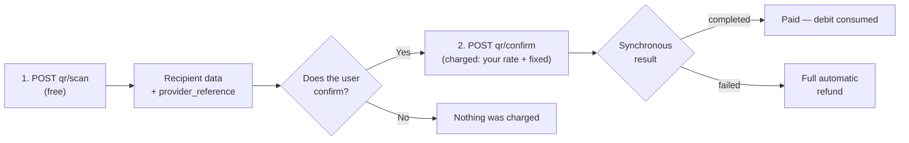

> **Environments:** Test `https://cryptobank.qbank.cl/platform` (`pk_test_...`) - Live `https://api.qbank.cl/platform` (`pk_...`).

In Bolivia (the local interoperable QR) and Brazil (**PIX QR**, including
the "copia e cola" code) you can also **pay a collection QR** in two
steps: scan and confirm. Scanning is **free**; you are only charged on
confirm, exactly like a regular payout (your rate + fixed fee). Without
`country`/`currency` Bolivia (BOB) is assumed; for Brazil send
`country: "BR"` and `currency: "BRL"`.



## 1. Scan the QR (free)

#### Bolivia

```bash
curl -X POST https://api.qbank.cl/platform/v1/payouts/qr/scan \
  -H "Authorization: Bearer <token>" \
  -H "Content-Type: application/json" \
  -d '{
    "qr_payload": "<QR content>",
    "currency": "BOB"
  }'
```

Returns the recipient's data so the user can confirm who they are paying:

```json
{
  "scan_id": "…",
  "provider_reference": "…",
  "beneficiary_name": "Juan Quispe",
  "destination_account": "…",
  "amount": "700.00",
  "currency": "BOB",
  "glosa": "",
  "status": "…"
}
```

#### Brazil (PIX QR)

`qr_payload` takes the raw PIX QR content (the EMV BR Code) **or the
"copia e cola" code** — they are the same string:

```bash
curl -X POST https://api.qbank.cl/platform/v1/payouts/qr/scan \
  -H "Authorization: Bearer <token>" \
  -H "Content-Type: application/json" \
  -d '{
    "country": "BR",
    "currency": "BRL",
    "qr_payload": "00020126360014br.gov.bcb.pix0114+5511998765432520400005303986540575.005802BR5913LOJA DA MARIA6009SAO PAULO62110507PED423163040BF9"
  }'
```

The scan decodes the BR Code locally (validating its checksum) and returns
the destination PIX key, the merchant name and the amount when the QR
carries a fixed one:

```json
{
  "scan_id": "PIXSCAN-…",
  "provider_reference": "<the same EMV payload>",
  "beneficiary_name": "LOJA DA MARIA",
  "destination_account": "+5511998765432",
  "amount": "75.00",
  "currency": "BRL",
  "glosa": "",
  "status": "scanned"
}
```

- An empty `amount` means an **open-amount** QR: you decide how much to pay
  on confirm. With a fixed amount, the confirm must send exactly that
  amount.
- **Static** PIX QRs are supported (the printed/reusable ones with the key
  embedded). A **dynamic** QR (payload carrying the PSP's URL instead of a
  key) answers `400` with
  `dynamic pix qr codes are not supported yet` — ask the beneficiary for
  their PIX key and use the [`pix`](https://docs.cbpayapp.com/en/guides/payouts#examples-by-country) method.
- A tampered or truncated payload answers `400` (invalid CRC checksum).

## 2. Confirm the payment (charged here)

#### Bolivia

```bash
curl -X POST https://api.qbank.cl/platform/v1/payouts/qr/confirm \
  -H "Authorization: Bearer <token>" \
  -H "Content-Type: application/json" \
  -d '{
    "provider_reference": "<from the scan>",
    "amount": "700.00",
    "currency": "BOB",
    "description": "QR lunch payment",
    "idempotency_key": "qr-2026-07-07-a"
  }'
```

#### Brazil (PIX QR)

```bash
curl -X POST https://api.qbank.cl/platform/v1/payouts/qr/confirm \
  -H "Authorization: Bearer <token>" \
  -H "Content-Type: application/json" \
  -d '{
    "country": "BR",
    "currency": "BRL",
    "provider_reference": "<from the scan>",
    "amount": "75.00",
    "description": "Order 4231",
    "idempotency_key": "qr-br-2026-07-16-a"
  }'
```

- `amount` is always required: with a fixed-amount QR it must match
  exactly — otherwise you get `422` with the payout in `status: failed`
  (`status_message: "amount mismatch: the qr requires exactly 75.00 BRL"`)
  and the **refund already applied**; fix the amount and retry with a new
  key. With an open-amount QR whatever you send is what gets paid.
- A **static PIX QR is reusable by design** (a shop's printed QR gets paid
  many times): you can pay it again with a different `idempotency_key`. A
  failed attempt **does not burn the QR**.
- The payment travels through the same PIX rail as the `pix` method
  (24/7); the QR's `txid` goes with it so the merchant reconciles
  automatically.

- `usdt_amount + fixed fee` is debited at **your rate**, just like a
  `bank_transfer`.
- The result is **synchronous**: the response already carries the final
  state (`completed`, or `failed` with an automatic refund) — no waiting.
- Retries with the same `idempotency_key` return the original payout. In
  Bolivia the scan reference is single-use (a scanned QR can only be paid
  once); in Brazil a static PIX QR is reusable and each payment carries its
  own key.
## Errors

| HTTP | Code | What to do |
|---|---|---|
| 400 | `invalid_qr_payload` | The QR is unreadable, corrupt or a dynamic QR (not supported) — nothing was created and your key was not consumed; ask the payer for a static QR |
| 400 | `idempotency_key_required` | Reusable static QRs require an explicit `idempotency_key` on confirm |
| 402 | `insufficient_funds` | Top up your balance and retry with the same key |
| 403 | `compliance_hold` | The beneficiary failed screening; the payout was not created |
| 422 | payout `failed` + refund | The amount does not match a fixed-amount QR, or the rail rejected the payment — the debit is refunded automatically |
| 503 | `channel_unavailable` | Rail temporarily unavailable; retry later with the same key |

The general error catalog lives in [Errors](https://docs.cbpayapp.com/en/errors).

## FAQ

#### Does scanning a QR cost anything?
No — the scan is a free local read. You are only charged when the confirm
creates the payout.
#### Can I pay the same QR twice?
One-time QRs (fixed reference) admit a single payment. Reusable static QRs
can be paid legitimately more than once — that is why the confirm requires
an explicit `idempotency_key` per payment.
#### Are dynamic QRs supported?
Not yet — a dynamic QR answers `invalid_qr_payload` (400) with guidance.
Ask the payer for the static QR of the destination.
#### Which FX rate applies?
The same as a regular payout: the rate quoted at confirm, frozen for that
operation, with your spread already inside.
#### What if the scanned amount differs from what I want to pay?
Fixed-amount QRs must be paid exactly; a mismatch fails the payout with an
automatic refund. Open-amount QRs accept the amount you pass on confirm.
#### How do I retry a failed confirm safely?
Retry with the **same** `idempotency_key` — the QR never gets "burned" by
validation errors: nothing is created until the payload validates.
