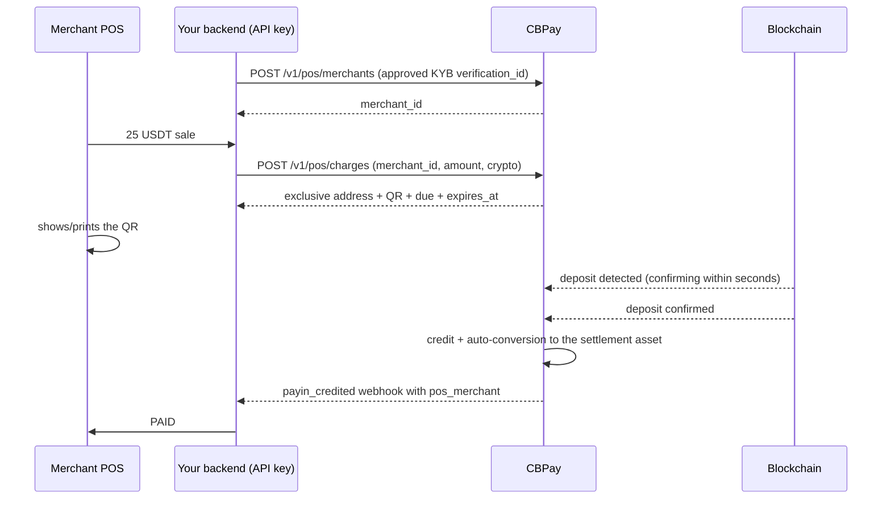

> **Environments:** Test `https://cryptobank.qbank.cl/platform` (`pk_test_...`) - Live `https://api.qbank.cl/platform` (`pk_...`).

QR Crypto POS is the product for **processors/acquirers with a company account**
operating physical POS terminals: you register your merchants (restaurants,
hotels, stores) as verified *merchants* and generate **crypto QR charges
with an exact amount** (USDT, USDC, BTC). The POS shows or prints the QR,
the customer scans it with their wallet or exchange app, and the API detects
the on-chain payment: the balance is credited to **your account**
(auto-converted to your settlement asset) with the **merchant attribution**
on every charge — so you know exactly how much each merchant collected and
can settle with them later over any rail (transfers, fiat payouts, crypto).

> **Note**
QR Crypto POS is available to **verified company accounts** with the `pos` service
enabled. Every charge uses an **exclusive address** (an ephemeral wallet
from the [universal checkout link](https://docs.cbpayapp.com/en/guides/checkout)
engine): payments can never cross between charges.
## End-to-end flow



## 1. Register the merchant (once per client)

Every merchant is bound to an **approved** [third-party KYC/KYB
verification](https://docs.cbpayapp.com/en/guides/kyc) — the merchant identity comes from there, never
hand-declared. You can set an **informative commission** (`fee_percent` +
`fee_fixed`): it moves no money, but the API computes it on every paid
charge and the summary tells you the net to distribute.

```bash
curl -X POST "https://api.qbank.cl/platform/v1/pos/merchants" \
  -H "Authorization: Bearer $API_KEY" -H "Content-Type: application/json" \
  -d '{
    "verification_id": "9e2f41d0-6b3e-4b57-9d5c-2f2f0a97c001",
    "name": "La Terraza Restaurant",
    "external_ref": "resto-001",
    "fee_percent": "1",
    "fee_fixed": "0"
  }'
```

```json
{
  "merchant_id": "d2875683-fc80-4c7b-876a-fb585d7c6982",
  "account_id": "5138e8dd-64bd-43ef-aafe-8d9ef23bec9e",
  "name": "La Terraza Restaurant",
  "verification_id": "9e2f41d0-6b3e-4b57-9d5c-2f2f0a97c001",
  "external_ref": "resto-001",
  "fee_percent": "1",
  "fee_fixed": "0",
  "status": "active",
  "created_at": "2026-07-17T19:40:00Z",
  "updated_at": "2026-07-17T19:40:00Z"
}
```

Query with `GET /v1/pos/merchants` (paginated) and `GET /v1/pos/merchants/{id}`.
`PATCH /v1/pos/merchants/{id}` updates `status` (`active`/`disabled` — a
disabled merchant cannot generate new charges), the commission and the
`external_ref`. Identity is never edited: it comes from the verification.

## 2. Create the charge (one per sale)

The contract mirrors the universal checkout link: the amount is denominated
in your `settlement_asset` (your account default when omitted) and the **due
the customer pays is quoted in the QR's crypto** at charge-creation time —
when the customer pays in a different asset than yours, the conversion is
already included in the due (you receive your exact target).

```bash
curl -X POST "https://api.qbank.cl/platform/v1/pos/charges" \
  -H "Authorization: Bearer $API_KEY" -H "Content-Type: application/json" \
  -d '{
    "merchant_id": "d2875683-fc80-4c7b-876a-fb585d7c6982",
    "amount": "25",
    "crypto": "tron:usdt",
    "reference": "TICKET-0451",
    "expires_in": 900,
    "idempotency_key": "pos-0451-1"
  }'
```

```json
{
  "charge_id": "66773a3a-9911-4482-ae3c-09a481aba018",
  "payin_id": "bd3d88ca-af9c-4c05-a6f8-0982a2d187d5",
  "status": "pending",
  "amount": "25",
  "settlement_asset": "USDT",
  "crypto": "tron:usdt",
  "chain": "tron",
  "asset": "USDT",
  "address": "TC5SToDEigQtie7Crf9et7ui7zDsvdDHeG",
  "due": "25.000000",
  "received": "0.000000",
  "qr_payload": "TC5SToDEigQtie7Crf9et7ui7zDsvdDHeG",
  "qr_png_base64": "iVBORw0KGgo…",
  "merchant": { "id": "d2875683-…", "name": "La Terraza Restaurant", "external_ref": "resto-001" },
  "reference": "TICKET-0451",
  "expires_at": "2026-07-17T19:55:00Z",
  "receipt_url": "https://api.qbank.cl/platform/v1/payins/bd3d88ca-…/receipt",
  "created_at": "2026-07-17T19:40:00Z"
}
```

- `crypto`: `tron:usdt`, `eth:usdt`, `eth:usdc` or `btc:btc`.
- `expires_in`: 300–86400 seconds (default 900). Quotes involving BTC are
  frozen for 15 minutes (`quote_expires_at`).
- `idempotency_key` is **required**: retrying with the same key returns the
  SAME charge and the SAME address (`idempotency_hit: true`) — a POS retry
  can never open a second charge.
- The **QR is the raw address** (compatible with Binance and every wallet);
  print the `due` next to it.

> **Tip**
For POS volume we recommend **TRON/USDT** as the primary rail: it confirms
in ~1 minute with the lowest network costs. BTC confirms in ~30 minutes —
fine for large tickets, not for coffee.
## 3. Detect the payment (polling or webhook)

**POS polling**: `GET /v1/pos/charges/{charge_id}` every few seconds. As
soon as the deposit appears on-chain (2-3 s typical, BEFORE confirmations),
the response carries the **early detection**:

```json
{
  "charge_id": "66773a3a-…",
  "status": "pending",
  "confirming": true,
  "detected_amount": "25.000000",
  "due": "25.000000",
  "received": "0.000000"
}
```

`confirming` is a UX signal ("payment detected, confirming…") — the actual
credit only happens on on-chain confirmation: `status` flips to `paid`,
`received` reflects the accumulated total and `paid_at` is stamped.

**Webhook** (recommended to close the sale): `payin_credited` arrives with
the attribution block:

```json
{
  "event_type": "payin_credited",
  "data": {
    "payin_id": "bd3d88ca-…",
    "kind": "pos",
    "settled_via": "crypto:tron:usdt",
    "crypto_amount": "25.000000",
    "settlement_asset": "USDT",
    "asset_amount": "25",
    "pos_merchant": { "id": "d2875683-…", "name": "La Terraza Restaurant", "external_ref": "resto-001" },
    "receipt_url": "…"
  }
}
```

### Charge states

| State | Meaning | What to do |
|---|---|---|
| `pending` | Waiting for the payment | The POS keeps showing the QR |
| `pending` + `confirming: true` | Deposit detected, confirming on-chain | Show "payment detected" (TRON ~1 min, ETH minutes, BTC ~30 min) |
| `paid` | Target reached and credited to your balance | Close the sale; the auto-swap to your settlement asset runs by itself |
| `expired` | Expired without completing the payment | Create a new charge if the customer still wants to pay |

**Partial payments** accumulate (`received`) toward the target; `paid` only
when complete. **Late payments**: money arriving AFTER expiry is still
credited to your account (the address stays alive) and the webhook fires —
the expired charge's `received` reflects it for reconciliation; a real
payment is never lost. **Overpayments** (tips) are credited too.

## 4. Reconcile and distribute per merchant

`GET /v1/pos/charges?from=…&to=…&merchant_id=…` lists each merchant's
charges (`merchant_id`, `status` filters; standard pagination).

`GET /v1/pos/summary?from=…&to=…` returns the PER-MERCHANT aggregate — the
view for settling with each client:

```bash
curl "https://api.qbank.cl/platform/v1/pos/summary?from=2026-07-01&to=2026-07-17" \
  -H "Authorization: Bearer $API_KEY"
```

```json
{
  "from": "2026-07-01", "to": "2026-07-17",
  "merchants": [
    {
      "merchant_id": "d2875683-…",
      "name": "La Terraza Restaurant",
      "external_ref": "resto-001",
      "charges_count": 214,
      "paid_count": 201,
      "fee_percent": "1",
      "fee_fixed": "0",
      "totals": [
        { "settlement_asset": "USDT", "gross": "5025.000000", "processor_fee": "50.250000", "net_for_merchant": "4972.750000" }
      ],
      "refunded": [ { "asset": "USDT", "amount": "2.000000" } ]
    }
  ]
}
```

`gross` is what was collected (the target of paid charges), `processor_fee`
is your commission configured on the merchant, and `net_for_merchant` is
what you owe them (same-asset refunds already deducted). Distribute over the
existing rails: [transfers](https://docs.cbpayapp.com/en/guides/transfers),
[fiat payouts](https://docs.cbpayapp.com/en/guides/payouts) or [crypto withdrawals](https://docs.cbpayapp.com/en/guides/crypto).

## 5. Refunds

`POST /v1/pos/charges/{charge_id}/refund` returns (part of) what was
received to the payer as a **regular crypto withdrawal** from your balance —
with hold, withdrawal fee and every compliance control of the rail.

```bash
curl -X POST "https://api.qbank.cl/platform/v1/pos/charges/66773a3a-…/refund" \
  -H "Authorization: Bearer $API_KEY" -H "Content-Type: application/json" \
  -d '{
    "amount": "25",
    "to_address": "TXHkw6bYtL2j…",
    "idempotency_key": "pos-ref-0451-1"
  }'
```

```json
{
  "refund_id": "b92b1ac0-…",
  "charge_id": "66773a3a-…",
  "withdrawal_id": "4630fe8c-…",
  "amount": "25.000000",
  "asset": "USDT",
  "to_address": "TXHkw6bYtL2j…",
  "status": "processing",
  "tx_id": "SIMTX…",
  "created_at": "2026-07-17T20:01:00Z"
}
```

Key rules:

- **`to_address` is always explicit.** We never auto-refund to the deposit
  origin: it may be an exchange hot wallet your customer does not control
  (the money would be lost). Ask for and confirm the refund address; the
  received `from_address` values stay in the charge detail as a reference.
- **Hard cap**: the sum of a charge's refunds can never exceed what it
  received (`422 refund_exceeds_received`), even under concurrent requests.
- Available on any charge **with received funds** — including an expired
  charge that got a late payment (the most common refund case).
- The amount is refunded in the **charge's crypto**: since the payment was
  converted to your settlement asset, you need balance in that crypto
  ([swap](https://docs.cbpayapp.com/en/guides/swaps) back if missing; the error is
  `insufficient_funds`).
- The status follows the withdrawal lifecycle (`pending` → `processing` →
  `completed`/`failed`; a failed withdrawal refunds your debit and releases
  the cap). Query with `GET /v1/pos/charges/{id}/refunds`.

## Product errors

| HTTP | Code | Fix |
|---|---|---|
| 422 | `verification_required` | Register the merchant with the `verification_id` of their approved third-party KYC/KYB |
| 422 | `verification_not_approved` | Wait for the verification approval (or check its status) before registering the merchant |
| 422 | `merchant_disabled` | Re-enable the merchant (`PATCH status: "active"`) before charging |
| 400 | `idempotency_key_required` | Send `idempotency_key` on the charge and the refund (body or `Idempotency-Key` header) |
| 400 | `invalid_request` | `crypto` must be `tron:usdt`, `eth:usdt`, `eth:usdc` or `btc:btc`; `expires_in` between 300 and 86400 |
| 503 | `pricing_unavailable` | The crypto price is not settlement grade (BTC); retry in a moment |
| 422 | `nothing_received` | The charge has not received any on-chain payment: there is nothing to refund |
| 422 | `refund_exceeds_received` | Lower the amount: received − already refunded is the maximum |
| 400 | `to_address_required` | Send the explicit refund address (never auto-refunded to the origin) |
| 402 | `insufficient_funds` | Not enough balance in the charge's crypto for the refund: swap back first |
| 403 | `company_required` | QR Crypto POS is for company accounts |

## FAQ

#### How long does the POS wait for confirmation?
Early detection (`confirming: true`) appears within 2-3 seconds. Final
confirmation depends on the network: TRON ~1 minute, Ethereum a few minutes,
Bitcoin ~30 minutes. You decide whether to release the sale on `confirming`
(your risk) or wait for `paid`. For POS we recommend TRON/USDT.
#### Can I print the QR on paper?
Yes — `qr_png_base64` is print-ready and `qr_payload` is the raw address in
case your POS renders the QR locally. Print the `due` and the network next
to it: the customer must send the exact amount over the right network.
#### What if the customer pays less, more, or late?
Less: the charge stays `pending`, accumulating (`received`) toward the
target. More (tips): the excess is credited too. Late (after expiry): still
credited with its webhook — the expired charge's detail shows the `received`
for reconciliation. A real payment is never lost.
#### Is the money held in the restaurant's name?
No — everything is credited to YOUR account (the processor), converted to
your settlement asset. The per-merchant attribution (charges, webhooks and
summary) tells you exactly how much belongs to each merchant so you can
distribute over the rail of your choice.
#### Which fees apply?
Every credited payment pays your account's `funding` fee (percent + fixed)
and, when the paid asset differs from your settlement asset, the automatic
conversion with its spread. The per-merchant commission
(`fee_percent`/`fee_fixed`) is yours with your client: informative, we never
charge it.
#### Can a POS terminal query the status directly against CBPay?
In this version the POS talks to YOUR backend and your backend queries with
your API key (a physical terminal must never hold your key). If you need
backend-less POS terminals, tell us: a public read-only polling token per
charge is on the roadmap.
