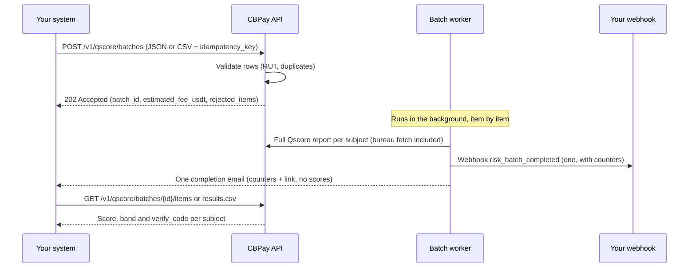

> **Environments:** Test `https://cryptobank.qbank.cl/platform` (`pk_test_...`) - Live `https://api.qbank.cl/platform` (`pk_...`).

Batch scoring is the high-volume flavor of [Qscore](https://docs.cbpayapp.com/en/guides/qscore): instead of requesting one credit report at a time, you submit a **batch** of subjects (Chilean RUTs today) and CBPay generates a full Qscore report for each one **asynchronously**. When the batch finishes you receive **one** webhook and **one** email with the counters — never one notification per subject.

Use it to re-score an existing portfolio (monthly refresh of your debtors), to run a one-time due-diligence sweep over a list of suppliers, or to backfill scores after onboarding a new book of business. For one-off checks on a single subject, keep using the [individual report](https://docs.cbpayapp.com/en/guides/qscore).

## How it works



> **Note**
  The batch is accepted immediately (`202`) and processed by a background worker. Each item goes through the **same pipeline as an individual report** — including the on-demand bureau fetch — so a batch score is identical to the score you would get one by one, with the same deterministic model (1–999, bands A–E, `SC` when the subject has no data).
## Step by step

### Create the batch

Send `POST /v1/qscore/batches` with the subjects as a JSON array **or** as CSV text (`subjects_csv`). Every request needs an `idempotency_key`: a replay with the same key returns the original batch with `idempotency_hit: true` and never duplicates the batch or its charges.

Invalid rows are **rejected at creation time** and reported in `rejected_items` — the batch only processes the valid ones. A `doc_id` that fails the country check digit yields `invalid_doc_id`; the same `doc_id` twice inside one batch yields `duplicate_in_batch` (reported with its normalized form). An unrecognized `subject_type` is **not** an error: the row is accepted and the type is inferred as described below.

#### JSON
    ```bash
    curl -X POST https://api.qbank.cl/platform/v1/qscore/batches \
      -H "Authorization: Bearer pk_live_..." \
      -H "Content-Type: application/json" \
      -d '{
        "country": "CL",
        "purpose": "credit_evaluation",
        "lang": "es",
        "subjects": [
          {"doc_id": "12.345.678-5"},
          {"doc_id": "15.678.234-3"},
          {"doc_id": "11.222.333-9"},
          {"doc_id": "76.543.210-3", "subject_type": "company"},
          {"doc_id": "12.345.678-9"},
          {"doc_id": "12.345.678-5"}
        ],
        "idempotency_key": "portfolio-2026-08-refresh-01"
      }'
    ```

    ```json
    {
      "batch_id": "b7f2c1a4-3e5d-4f8a-9c2b-1d0e6a8f4c5d",
      "status": "pending",
      "purpose": "credit_evaluation",
      "country": "CL",
      "lang": "es",
      "total_items": 4,
      "processed_items": 0,
      "succeeded_items": 0,
      "failed_items": 0,
      "estimated_fee_usdt": "14.50",
      "created_at": "2026-08-09T14:32:10Z",
      "rejected_count": 2,
      "rejected_items": [
        {
          "line": 5,
          "doc_id": "12.345.678-9",
          "error_code": "invalid_doc_id",
          "error": "doc_id is not valid for CL"
        },
        {
          "line": 6,
          "doc_id": "12345678-5",
          "error_code": "duplicate_in_batch",
          "error": "doc_id appears more than once in the batch"
        }
      ]
    }
    ```

    The estimate above assumes a configured fee of `4.00` USDT per person report and `2.50` USDT per company report: 3 × 4.00 + 1 × 2.50 = **14.50**. Your estimate reflects the fees configured for your account.
#### CSV
    ```bash
    curl -X POST https://api.qbank.cl/platform/v1/qscore/batches \
      -H "Authorization: Bearer pk_live_..." \
      -H "Content-Type: application/json" \
      -d '{
        "country": "CL",
        "purpose": "supplier_onboarding",
        "lang": "es",
        "subjects_csv": "doc_id,subject_type\n12.345.678-5,person\n76.543.210-3,company\n96.123.450-6,company",
        "idempotency_key": "suppliers-2026-08-01"
      }'
    ```

    The CSV payload is a **string field inside the JSON body** (not a file upload): a header row `doc_id[,subject_type]` followed by one subject per line, up to 5 MB.

    ```json
    {
      "batch_id": "c8a3d2b5-4f6e-5a9b-8d3c-2e1f7b9a5d6e",
      "status": "pending",
      "purpose": "supplier_onboarding",
      "country": "CL",
      "lang": "es",
      "total_items": 3,
      "processed_items": 0,
      "succeeded_items": 0,
      "failed_items": 0,
      "estimated_fee_usdt": "9.00",
      "created_at": "2026-08-09T15:04:44Z",
      "rejected_count": 0,
      "rejected_items": []
    }
    ```
| Field | Type | Rules |
|---|---|---|
| `country` | string | Required. `CL` today. |
| `purpose` | string | Required. Closed list (Ley 20.575): `credit_evaluation`, `tenant_screening`, `hiring`, `supplier_onboarding`, `other`. `self_access` is **not allowed** in batches — the holder's own report is free via [my-report](https://docs.cbpayapp.com/en/guides/qscore). |
| `lang` | string | `es` (default), `en` or `zh` — language of the generated PDF reports. |
| `subjects` | array | 1–5,000 items: `{doc_id, subject_type?}`. XOR with `subjects_csv`. |
| `subjects_csv` | string | CSV text with header `doc_id[,subject_type]`, up to 5 MB. XOR with `subjects`. |
| `subject_type` | string | Optional per row: `person` or `company`. If omitted **or unrecognized** for `CL`, it is inferred from the RUT series (first digit 5–9 → `company`; anything else → `person`). |
| `idempotency_key` | string | **Required.** Unique per batch; the replay never duplicates. |

An idempotent replay returns `200` (not `202`) with the original batch and `idempotency_hit: true`; the `rejected_items` / `rejected_count` detail is only included in the original creation response.

### Wait for the completion signal

The worker processes items one by one. You do **not** need to poll: when the batch reaches a final state you get exactly **one** `risk_batch_completed` webhook and **one** completion email with the counters and a link to your account.

Reports inside a batch never emit the individual `risk_report_ready` webhook or per-report emails — **the batch is the signal**. If you still want to poll, `GET /v1/qscore/batches/{id}` returns the live counters (`processed_items`, `succeeded_items`, `failed_items`).

```bash
curl "https://api.qbank.cl/platform/v1/qscore/batches/b7f2c1a4-3e5d-4f8a-9c2b-1d0e6a8f4c5d" \
  -H "Authorization: Bearer pk_live_..."
```

```json
{
  "batch_id": "b7f2c1a4-3e5d-4f8a-9c2b-1d0e6a8f4c5d",
  "status": "completed_with_errors",
  "purpose": "credit_evaluation",
  "country": "CL",
  "lang": "es",
  "total_items": 4,
  "processed_items": 4,
  "succeeded_items": 3,
  "failed_items": 1,
  "estimated_fee_usdt": "14.50",
  "created_at": "2026-08-09T14:32:10Z",
  "started_at": "2026-08-09T14:34:02Z",
  "completed_at": "2026-08-09T14:41:37Z"
}
```

### Read the results

Per-item results are available as JSON (paginated) or as a CSV export ready for Excel.

```bash
curl "https://api.qbank.cl/platform/v1/qscore/batches/b7f2c1a4-3e5d-4f8a-9c2b-1d0e6a8f4c5d/items?status=ready&page=1&page_size=50" \
  -H "Authorization: Bearer pk_live_..."
```

```json
{
  "items": [
    {
      "item_id": "e1f0a9b8-7c6d-4e5f-8a9b-0c1d2e3f4a5b",
      "report_id": "3f5c9f2d-7d21-4b8c-9a2d-2d5f6a1b8c01",
      "doc_id": "12.345.678-5",
      "subject_type": "person",
      "status": "ready",
      "score": 715,
      "band": "B",
      "created_at": "2026-08-09T14:32:10Z",
      "completed_at": "2026-08-09T14:34:52Z"
    },
    {
      "item_id": "f2a1b0c9-8d7e-4f6a-9b0c-1d2e3f4a5b6c",
      "report_id": "7c9a1f3d-2e44-4b8a-9d51-0a1b2c3d4e5f",
      "doc_id": "15.678.234-3",
      "subject_type": "person",
      "status": "ready",
      "score": 430,
      "band": "D",
      "created_at": "2026-08-09T14:32:10Z",
      "completed_at": "2026-08-09T14:35:41Z"
    },
    {
      "item_id": "a3b2c1d0-9e8f-4a7b-8c1d-2e3f4a5b6c7d",
      "report_id": "9d0e1f2a-3b4c-4d5e-8f6a-7b8c9d0e1f2a",
      "doc_id": "76.543.210-3",
      "subject_type": "company",
      "status": "ready",
      "score": 604,
      "band": "C",
      "created_at": "2026-08-09T14:32:10Z",
      "completed_at": "2026-08-09T14:36:22Z"
    }
  ],
  "meta": {"page": 1, "page_size": 50, "total": 3}
}
```

For a failed item, `score` is `null` and the row carries `error_code` / `error_message` instead:

```json
{
  "item_id": "b4c3d2e1-0f9a-4b8c-9d2e-3f4a5b6c7d8e",
  "doc_id": "11.222.333-9",
  "subject_type": "person",
  "status": "failed",
  "score": null,
  "error_code": "generation_failed",
  "error_message": "the report could not be generated; the fee was refunded",
  "created_at": "2026-08-09T14:32:10Z",
  "completed_at": "2026-08-09T14:37:05Z"
}
```

The CSV export (`GET /v1/qscore/batches/{id}/results.csv`) streams every row with a UTF-8 BOM so Excel opens it correctly, and includes the public `verify_code` of each report. Every cell is sanitized against CSV formula injection. You can download it at **any time**, including while the batch is still `processing` — rows for items still `pending` have empty score/band/verify_code fields:

```bash
curl -OJ "https://api.qbank.cl/platform/v1/qscore/batches/b7f2c1a4-3e5d-4f8a-9c2b-1d0e6a8f4c5d/results.csv" \
  -H "Authorization: Bearer pk_live_..."
```

```csv
doc_id,subject_type,status,score,band,verify_code,report_id,error_code
12.345.678-5,person,ready,715,B,Q3f5c9f2d7d214b8c9a2d2d5f6a1b8c01a1b2c3d4e5f60718293a,3f5c9f2d-7d21-4b8c-9a2d-2d5f6a1b8c01,
15.678.234-3,person,ready,430,D,Q7c9a1f3d2e444b8a9d510a1b2c3d4e5fb2c3d4e5f60718293a4b5,7c9a1f3d-2e44-4b8a-9d51-0a1b2c3d4e5f,
76.543.210-3,company,ready,604,C,Q9d0e1f2a3b4c4d5e8f6a7b8c9d0e1f2ac3d4e5f60718293a4b5c6,9d0e1f2a-3b4c-4d5e-8f6a-7b8c9d0e1f2a,
11.222.333-9,person,failed,,,,,generation_failed
```

Each `report_id` is a full individual report: you can download its PDF with the standard [report download](https://docs.cbpayapp.com/en/guides/qscore) endpoint, and anyone can verify its authenticity at `https://business.cbpayapp.com/verify/qscore/{verify_code}`.
## List and search your batches

`GET /v1/qscore/batches` returns your batches paginated, with optional `from`/`to` date filters (`YYYY-MM-DD`, UTC, both inclusive — an invalid date yields `400 invalid_range`):

```bash
curl "https://api.qbank.cl/platform/v1/qscore/batches?page=1&page_size=50&from=2026-08-01&to=2026-08-09" \
  -H "Authorization: Bearer pk_live_..."
```

```json
{
  "items": [
    {
      "batch_id": "b7f2c1a4-3e5d-4f8a-9c2b-1d0e6a8f4c5d",
      "account_id": "a1b2c3d4-5e6f-7a8b-9c0d-1e2f3a4b5c6d",
      "status": "completed_with_errors",
      "purpose": "credit_evaluation",
      "country": "CL",
      "lang": "es",
      "total_items": 4,
      "processed_items": 4,
      "succeeded_items": 3,
      "failed_items": 1,
      "estimated_fee_usdt": "14.50",
      "created_at": "2026-08-09T14:32:10Z",
      "started_at": "2026-08-09T14:34:02Z",
      "completed_at": "2026-08-09T14:41:37Z"
    }
  ],
  "meta": {"page": 1, "page_size": 50, "total": 1}
}
```

Pagination is `page` + `page_size` (default 50, maximum 200).

## Batch and item statuses

**Batch** (`GET /v1/qscore/batches/{id}`):

| Status | Meaning | Terminal? |
|---|---|---|
| `pending` | Accepted, waiting for the worker | No |
| `processing` | The worker is generating reports item by item | No |
| `completed` | Every item finished successfully | Yes |
| `completed_with_errors` | Finished, but at least one item failed (failed items were refunded) | Yes |
| `failed` | The batch itself failed (infrastructure) — check `error_code` / `error_message` | Yes |

**Item** (`GET /v1/qscore/batches/{id}/items`):

| Status | Meaning |
|---|---|
| `pending` | Queued, not processed yet |
| `ready` | Report generated — `score`, `band` and `report_id` are set |
| `failed` | Terminal failure for this subject — the item fee was **refunded automatically** |

## Billing

Each item charges the standalone fee configured for your account (`risk_report_person` or `risk_report_company`) when the worker processes it. `estimated_fee_usdt` in the creation response is the upfront estimate for the valid items.

- **Idempotent charges**: every item is charged with a deterministic billing reference derived from the batch and the item, so a worker restart never double-charges an item.
- **Automatic refunds**: an item that ends `failed` gets its fee refunded in the same run. You only pay for reports that were actually generated.
- Charges and refunds appear in your [statement](https://docs.cbpayapp.com/en/guides/statement) like any other Qscore fee.

## Errors

| HTTP | Code | What to do |
|---|---|---|
| 400 | `invalid_payload` | The body is not valid JSON, `country` is missing, you sent both `subjects` and `subjects_csv` (send exactly one), or the CSV text is malformed / over 5 MB / has no rows |
| 400 | `purpose_required` / `invalid_purpose` | Send a `purpose` from the closed list; `self_access` is not allowed in batches |
| 400 | `idempotency_key_required` | Every batch creation needs an `idempotency_key` |
| 400 | `no_valid_items` | Every row was rejected (`invalid_doc_id` / `duplicate_in_batch`) and **no batch was created** — the response is the standard error shape; validate the file locally (each `doc_id` must pass the country check digit and be unique) and resubmit with a **new** idempotency key |
| 400 | `too_many_items` | A batch accepts at most 5,000 subjects — split the portfolio into several batches, each with its own idempotency key |
| 400 | `invalid_range` | A `from`/`to` date on a listing endpoint is not `YYYY-MM-DD` — fix the format and retry |
| 401 | `unauthorized` | Missing or invalid API key |
| 403 | `verification_required` | Your account identity verification (KYC/KYB) is not approved yet — complete it before creating batches |
| 403 | `service_disabled` | The `risk` product is not enabled for your account — contact your organization admin |
| 404 | `not_found` | The batch does not exist or belongs to another account |

## Webhook: `risk_batch_completed`

Exactly **one** webhook per batch, delivered to the subscriptions of the owning account when the batch reaches a final state. Subscribe with event type `risk_batch_completed` (see [webhooks](https://docs.cbpayapp.com/en/webhooks)). The event type travels in the `X-Webhook-Event` header and the body is the flat payload:

```http
POST https://your-server.example/webhooks/cbpay
X-Webhook-Event: risk_batch_completed
X-Webhook-Signature: t=1754764330,v1=…
Content-Type: application/json
```

```json
{
  "batch_id": "b7f2c1a4-3e5d-4f8a-9c2b-1d0e6a8f4c5d",
  "status": "completed_with_errors",
  "total_items": 4,
  "succeeded_items": 3,
  "failed_items": 1,
  "country": "CL",
  "purpose": "credit_evaluation"
}
```

> **Important**
  The webhook carries **counters only** — never scores or documents. Fetch the results with `GET /v1/qscore/batches/{id}/items` or the CSV export. The completion email follows the same data-minimization rule: counters and a link, nothing else.
## FAQ

#### How long does a batch take?
    It depends on the size and on how fresh the bureau data is for each subject. Each item is a full report (including the on-demand bureau fetch), so plan for a few seconds per item; a 1,000-subject batch typically finishes in well under an hour. You do not need to wait online — the webhook tells you when it is done.
#### Do batch scores differ from individual report scores?
    No. The worker runs the exact same pipeline as an individual report, with the same deterministic model version. Scoring the same subject individually or inside a batch yields the same result at the same point in time.
#### What happens if my portfolio has more than 5,000 subjects?
    Split it into several batches of up to 5,000 each, with a distinct `idempotency_key` per batch. Batches are processed independently and each sends its own completion webhook.
#### Can I mix persons and companies in one batch?
    Yes. Declare `subject_type` per row or let the API infer it from the Chilean RUT series. Each item is billed with the fee that matches its type.
#### What if the worker crashes mid-batch?
    Processing is crash-safe: the worker resumes the batch where it left off, and the deterministic billing reference guarantees an item is never charged twice.
#### Can I cancel a running batch?
    Not in this version. A batch that is already `processing` runs to completion; items that fail are refunded automatically.
#### Who can see my batches?
    Only your account — any other account gets `404 not_found`. Batches are never visible across organizations. The individual reports generated by a batch are regular Qscore reports, so they show up in the same places as any other report (including your organization's admin view of reports).
