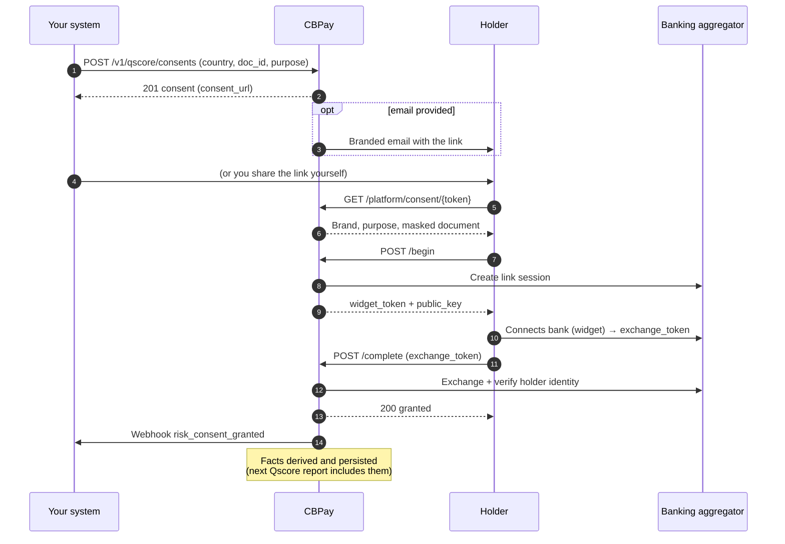

## What it is and when to use it

A **consent link** is a URL you create for a subject (a person or a company identified by their document) so the **holder** can authorize read access to their banking data through a secure connection flow. Once the holder grants it, CBPay derives **positive facts** (accounts, balances, income and expense activity over the last 90 days) and feeds them to the subject's credit file — the Qscore reflects them on the next report.

Use it when the subject has little or no credit history and their banking activity is the strongest evidence of their real payment capacity — for example a tenant with no bureau record, or a supplier asking for better commercial terms.

- **You** create the link (optionally emailed to the holder, with your organization's branding).
- **The holder** opens it, sees your brand and the declared purpose, connects their bank through the secure widget and confirms — or declines.
- **CBPay** validates that the bank-verified document matches the subject's `doc_id` **exactly** (an account owned by a different document can never grant the consent), derives the facts and notifies you by webhook.

> **Environments:** Test `https://cryptobank.qbank.cl/platform` (`pk_test_...`) - Live `https://api.qbank.cl/platform` (`pk_...`).

## How the flow works



The link is a **capability URL**: the 128-bit token in it is the authorization to view and decide. It works without any login, shows only your brand, the purpose and the holder's masked document (last 4 characters), and expires after a TTL you choose (7 days by default, 30 maximum).

## Step by step

### Create the consent link

`POST /v1/qscore/consents` — requires the `risk` service flag and a verified account. The `idempotency_key` is **mandatory**: creating sends an email when `email` is provided, and a retry with the same key returns the original consent with `idempotency_hit: true` instead of creating a duplicate.

```json Request
{
  "country": "CL",
  "doc_id": "11111111-1",
  "subject_type": "person",
  "purpose": "tenant_screening",
  "email": "maria.torres@example.cl",
  "expires_in_days": 7,
  "idempotency_key": "consent-maria-torres-2026-08-09"
}
```

```json Response 201
{
  "consent_id": "9f2c1ab4-7d3e-4c1a-8f55-2b9e0c4d6a71",
  "subject_id": "5d2a8f19-3b7c-4e92-a1d4-6c8b0f2e5a93",
  "channel": "link",
  "status": "pending",
  "purpose": "tenant_screening",
  "consent_url": "https://api.qbank.cl/platform/consent/cns_3f8a1c94e2b745109d6f8a0c2e5b7d19",
  "email": "maria.torres@example.cl",
  "created_at": "2026-08-09T14:32:10Z",
  "updated_at": "2026-08-09T14:32:10Z",
  "expires_at": "2026-08-16T14:32:10Z"
}
```

- `country` — ISO alpha-2, required. Coverage today: `CL`.
- `doc_id` — required, validated with the country's check digit (Chilean RUT, e.g. `11111111-1`).
- `subject_type` — `person` or `company`; inferred from the document if omitted.
- `purpose` — required: `credit_evaluation`, `tenant_screening`, `hiring`, `supplier_onboarding` or `other`. Data protection law requires declaring it. `self_access` is **rejected** here — your own report goes through `POST /v1/qscore/my-report`.
- `email` — optional; if present, the holder receives the link in a branded email from your organization.
- `expires_in_days` — optional; default 7, maximum 30.

Share `consent_url` with the holder (or let the email deliver it).
### The holder opens the link

The public page first loads `GET /platform/consent/{token}` (no authentication) to show your brand, the declared purpose and the masked document:

```json Response 200
{
  "status": "pending",
  "purpose": "tenant_screening",
  "country": "CL",
  "subject_type": "person",
  "doc_id": "******11-1",
  "org": {
    "name": "Arriendos del Sur",
    "website": "https://arriendosdelsur.cl",
    "logo_url": "https://cdn.cbpayapp.com/org/arriendos-del-sur/logo.png"
  },
  "expires_at": "2026-08-16T14:32:10Z"
}
```

The public view never exposes the holder's email, full document, internal IDs or the token itself.
### The holder connects their bank

Choosing **Authorize** calls `POST /platform/consent/{token}/begin`, which opens a secure bank-connection session:

```json Response 200
{
  "widget_token": "wgt_6f1c9a2d8e4b4c0a9f3d5e7b1a2c4d6e",
  "public_key": "wpk_9d8c7b6a5f4e3d2c1b0a9f8e7d6c5b4a",
  "expires_at": "2026-08-09T14:47:10Z"
}
```

The page mounts the banking widget with those credentials; the holder authenticates with their bank and authorizes the connection. The widget returns an `exchange_token` to the page.
### The consent is granted

The page sends `POST /platform/consent/{token}/complete` with the `exchange_token`:

```json Request
{ "exchange_token": "ext_2b4d6f8a0c1e3a5c7e9b1d3f5a7c9e1b" }
```

```json Response 200
{
  "status": "granted",
  "granted_at": "2026-08-09T14:46:02Z",
  "holder_name": "María Torres"
}
```

Before sealing the grant, CBPay verifies two things and rejects otherwise:

- the banking connection is `active` — otherwise `409 link_inactive`;
- the document verified by the bank matches the subject's `doc_id` **exactly** (both normalized) — otherwise `409 holder_mismatch`.

Once granted, CBPay derives the positive facts in the background and emits the `risk_consent_granted` webhook.
### Track the consent

```bash
curl "https://api.qbank.cl/platform/v1/qscore/consents?status=pending&from=2026-08-01&to=2026-08-31&page=1&page_size=50" \
  -H "Authorization: Bearer pk_live_..."
```

```json Response 200
{
  "consents": [
    {
      "consent_id": "9f2c1ab4-7d3e-4c1a-8f55-2b9e0c4d6a71",
      "subject_id": "5d2a8f19-3b7c-4e92-a1d4-6c8b0f2e5a93",
      "channel": "link",
      "status": "pending",
      "purpose": "tenant_screening",
      "consent_url": "https://api.qbank.cl/platform/consent/cns_3f8a1c94e2b745109d6f8a0c2e5b7d19",
      "email": "maria.torres@example.cl",
      "created_at": "2026-08-09T14:32:10Z",
      "updated_at": "2026-08-09T14:32:10Z",
      "expires_at": "2026-08-16T14:32:10Z"
    }
  ],
  "total": 1,
  "page": 1,
  "page_size": 50
}
```

`GET /v1/qscore/consents/{id}` returns a single consent (another account's consent answers `404 not_found`). A `pending` link past its `expires_at` flips to `expired` the next time it is read.
### Revoke if needed

`POST /v1/qscore/consents/{id}/revoke` cancels a consent (for example when the operation fell through). A consent that was already granted, revoked or expired answers `409 already_decided`. Revoking emits the `risk_consent_revoked` webhook.

```json Response 200
{
  "consent_id": "9f2c1ab4-7d3e-4c1a-8f55-2b9e0c4d6a71",
  "subject_id": "5d2a8f19-3b7c-4e92-a1d4-6c8b0f2e5a93",
  "channel": "link",
  "status": "revoked",
  "purpose": "tenant_screening",
  "consent_url": "https://api.qbank.cl/platform/consent/cns_3f8a1c94e2b745109d6f8a0c2e5b7d19",
  "email": "maria.torres@example.cl",
  "created_at": "2026-08-09T14:32:10Z",
  "updated_at": "2026-08-09T15:05:41Z",
  "expires_at": "2026-08-16T14:32:10Z",
  "revoked_at": "2026-08-09T15:05:41Z"
}
```
## States

| State | Meaning | What to do |
|---|---|---|
| `pending` | Created, waiting for the holder | Wait for the webhook, or share the link again |
| `granted` | The holder connected their bank and the identity matched | Facts are derived automatically; generate the Qscore report |
| `revoked` | The holder declined, or you revoked it | The link is dead — create a new one if you still need the authorization |
| `expired` | The TTL passed without a decision | Create a new link (longer `expires_in_days` if needed) |

A consent is decided **exactly once**: every terminal state rejects further transitions with `409 already_decided`.

## Errors

Public (holder) endpoints share an IP throttle with the verification surfaces: **30 requests per minute per IP** — a `429 rate_limited` response means slow down. A nonexistent or malformed token always answers a generic `404 not_found` (anti-enumeration).

| HTTP | `error` | Solution |
|---|---|---|
| 400 | `invalid_payload` | Missing/invalid body — check `country`, `doc_id` and `exchange_token` formats |
| 400 | `purpose_required` | `purpose` is mandatory when creating a link — declare it |
| 400 | `invalid_purpose` | `purpose` must be one of `credit_evaluation`, `tenant_screening`, `hiring`, `supplier_onboarding`, `other`; `self_access` is rejected here (use `POST /v1/qscore/my-report` for your own data) |
| 400 | `invalid_doc_id` | The document fails the country's validation (bad check digit) — fix the format |
| 400 | `invalid_subject_type` | Send `person` or `company` explicitly |
| 400 | `invalid_email` | The `email` is malformed — fix it or omit it (the link works without an email) |
| 400 | `idempotency_key_required` | The create call requires an `idempotency_key` — send one (a retry with the same key never duplicates the link nor re-sends the email) |
| 403 | `verification_required` | Your account needs an approved KYC/KYB before creating consent links |
| 404 | `not_found` | No consent with that id/token (also the answer for another account's consent) |
| 409 | `already_decided` | The link was already decided (`granted`, `revoked`, `expired`) — create a new one |
| 409 | `link_inactive` | The banking connection is not `active` — the holder must reconnect from the same link |
| 409 | `holder_mismatch` | The bank-verified document does not match the subject's `doc_id` — check you created the link for the right document |
| 429 | `rate_limited` | Public endpoints throttle — slow down |
| 502 | `provider_error` | The data provider could not create or complete the bank session — retry; if it persists, contact support |
| 503 | `org_credential_missing` | Your organization is not fully configured for this feature — contact CBPay support |

See the [error catalog](https://docs.cbpayapp.com/en/errors) for the full list.

## Webhooks

Subscribe to these events to get notified when the holder decides:

| Event | Fires when |
|---|---|
| `risk_consent_granted` | The holder connected their bank and the consent was granted |
| `risk_consent_revoked` | The holder declined, or the consent was revoked by API |

```json risk_consent_granted
{
  "event_type": "risk_consent_granted",
  "consent_id": "9f2c1ab4-7d3e-4c1a-8f55-2b9e0c4d6a71",
  "subject_id": "5d2a8f19-3b7c-4e92-a1d4-6c8b0f2e5a93",
  "country": "CL",
  "doc_id": "11111111-1",
  "subject_type": "person",
  "purpose": "tenant_screening",
  "status": "granted",
  "previous_status": "pending",
  "holder_name": "María Torres",
  "openfinance_link_id": "lnk_8f7e6d5c4b3a29180f7e6d5c4b3a2918",
  "granted_at": "2026-08-09T14:46:02Z"
}
```
```json risk_consent_revoked
{
  "event_type": "risk_consent_revoked",
  "consent_id": "9f2c1ab4-7d3e-4c1a-8f55-2b9e0c4d6a71",
  "subject_id": "5d2a8f19-3b7c-4e92-a1d4-6c8b0f2e5a93",
  "country": "CL",
  "doc_id": "11111111-1",
  "subject_type": "person",
  "purpose": "tenant_screening",
  "status": "revoked",
  "previous_status": "pending",
  "revoked_at": "2026-08-09T15:05:41Z"
}
```
The `doc_id` travels **full** in the webhook (it is your own account's data), so you can reconcile against the subject you created the link for.

## How it feeds the Qscore

Granting a consent triggers a background derivation: CBPay reads the link's accounts and activity (last 90 days), aggregates positive facts — accounts count, available and current balances, income and expense totals — and persists them to the subject's credit file. Raw movements are never stored nor exposed (data minimization).

Every Qscore report generated afterwards re-derives the subject's `granted` consents, so the positive data is fresh in each report. No extra call is needed on your side.

## FAQ

#### Does the holder need a CBPay account?
    No. The link is fully public and works without login — the 128-bit token in the URL is the authorization. The holder only sees your brand, the purpose and their masked document.
#### What if the holder connects an account owned by someone else?
    The grant is rejected with `409 holder_mismatch`: the document verified by the bank must match the subject's `doc_id` exactly. An account owned by a different document can never grant the consent — this is the identity proof of the flow.
#### Can I revoke a consent after it was granted?
    A granted consent is a terminal state and rejects transitions (`409 already_decided`). To stop using the data, stop generating reports for the subject; the banking connection itself is managed by the holder at their bank.
#### How long does the link live?
    7 days by default, configurable with `expires_in_days` up to 30. An expired link flips to `expired` and can no longer be used — create a new one.
#### Is the email mandatory?
    No. Without `email` you get the `consent_url` in the response and share it yourself (WhatsApp, SMS, your own email). With `email`, CBPay sends a branded email on your behalf. Either way the create call needs an `idempotency_key`.
#### Which countries are covered?
    Coverage today: Chile (`CL`). More corridors are added as banking aggregation becomes available in each country — creating a link for an uncovered country fails at connect time with `502 provider_error`.
#### What data exactly is derived?
    Aggregated facts only: number of accounts, available/current balance totals, currency, institutions, first observation date, and income/expense/movement totals over 90 days. Individual transactions are never stored nor exposed.
