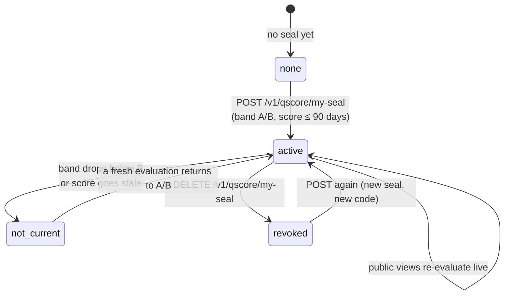

> **Environments:** Test `https://cryptobank.qbank.cl/platform` (`pk_test_...`) - Live `https://api.qbank.cl/platform` (`pk_...`).

The **Qscore seal** is a public, verifiable badge that a company with a strong credit standing can display on its website, quotes and emails: a public verification page plus an embeddable SVG badge that shows the company's **current** Qscore band (A or B).

It is free, self-service, and radically honest by design: the badge is evaluated **live** on every view. If the score drops below band B or goes stale (no evaluation in the last 90 days), the public surface stops showing the band on its own — you never have to remember to take it down, and you can never display a band you no longer hold.

## When to use it

- You are a **company account** with an approved KYB and a Qscore band of **A or B** (score ≥ 650), evaluated within the last 90 days — from any report, self or purchased by a third party.
- You want to prove creditworthiness to customers, suppliers or partners with a link they can verify themselves, instead of sending PDFs.
- You want the proof to **expire on its own** when it stops being true.

> **Note**
The seal is available for **companies only**. Personal accounts already have per-report public verification codes on every Qscore report they pull (see the [Qscore guide](https://docs.cbpayapp.com/en/guides/qscore)).
## How it works



- **Activation** creates a seal with a cryptographically signed public code. Activating twice is safe: the second call returns the existing seal (`idempotency_hit: true`).
- **Every public view re-evaluates eligibility live**: the page and the badge show the band only if the seal is active **and** the subject still qualifies right now.
- **Revocation is yours**: `DELETE` retires the seal permanently (that code will forever answer "revoked"). You can activate a new seal later — with a new code.

## Step 1 — Activate your seal

Requires an account session (company account with approved KYB). No request body and no idempotency key: activation is naturally idempotent per subject.

```bash
curl -X POST https://api.qbank.cl/platform/v1/qscore/my-seal \
  -H "Authorization: Bearer $SESSION_TOKEN"
```

`201 Created` — the seal is active:

```json
{
  "seal": {
    "seal_id": "c8f3e2a1-9b4d-4c7e-8a1f-2e5d6b7c8a91",
    "subject_id": "3e9b7c41-2f68-4a1d-8c5e-9a0d4b6f8e21",
    "status": "active",
    "created_at": "2026-08-09T14:22:10Z",
    "verify_code": "Sc8f3e2a19b4d4c7e8a1f2e5d6b7c8a91a1b2c3d4e5f60718",
    "verify_url": "https://api.qbank.cl/platform/verify/qscore/seal/Sc8f3e2a19b4d4c7e8a1f2e5d6b7c8a91a1b2c3d4e5f60718",
    "badge_url": "https://api.qbank.cl/platform/verify/qscore/seal/Sc8f3e2a19b4d4c7e8a1f2e5d6b7c8a91a1b2c3d4e5f60718/badge.svg"
  },
  "subject_id": "3e9b7c41-2f68-4a1d-8c5e-9a0d4b6f8e21",
  "eligibility": {
    "eligible": true,
    "band": "A",
    "score": 831,
    "evaluated_at": "2026-08-07T16:45:31Z"
  }
}
```

Calling `POST` again while the seal is active returns `200 OK` with the **same** seal and `"idempotency_hit": true` — retries never create duplicates. The account receives a branded email when the seal is activated (and another when it is revoked).

## Step 2 — Check status and eligibility

```bash
curl https://api.qbank.cl/platform/v1/qscore/my-seal \
  -H "Authorization: Bearer $SESSION_TOKEN"
```

`200 OK`:

```json
{
  "subject_id": "3e9b7c41-2f68-4a1d-8c5e-9a0d4b6f8e21",
  "seal": {
    "seal_id": "c8f3e2a1-9b4d-4c7e-8a1f-2e5d6b7c8a91",
    "subject_id": "3e9b7c41-2f68-4a1d-8c5e-9a0d4b6f8e21",
    "status": "active",
    "created_at": "2026-08-09T14:22:10Z",
    "verify_code": "Sc8f3e2a19b4d4c7e8a1f2e5d6b7c8a91a1b2c3d4e5f60718",
    "verify_url": "https://api.qbank.cl/platform/verify/qscore/seal/Sc8f3e2a19b4d4c7e8a1f2e5d6b7c8a91a1b2c3d4e5f60718",
    "badge_url": "https://api.qbank.cl/platform/verify/qscore/seal/Sc8f3e2a19b4d4c7e8a1f2e5d6b7c8a91a1b2c3d4e5f60718/badge.svg"
  },
  "eligibility": {
    "eligible": true,
    "band": "A",
    "score": 831,
    "evaluated_at": "2026-08-07T16:45:31Z"
  }
}
```

The `eligibility` block is always **live** — use it to know whether you could activate (or keep displaying) the seal before doing anything:

| `reason` (when `eligible: false`) | Meaning |
|---|---|
| `no_score` | No Qscore evaluation exists yet — pull your self report first (`POST /v1/qscore/my-report`) |
| `band_too_low` | The current band is C, D or E — only A and B qualify |
| `score_stale` | The last evaluation is older than 90 days — generate a fresh report |
| `companies_only` | Personal accounts do not get seals (200 with `seal: null`) |

A revoked seal keeps showing in the response with `status: "revoked"` and `revoked_at`, and **without** `verify_code`/`verify_url`/`badge_url`.

## Step 3 — Publish it

Share the `verify_url` directly, or embed the badge on your site. The badge is a plain SVG served without credentials:

```html
<a href="https://api.qbank.cl/platform/verify/qscore/seal/Sc8f3e2a19b4d4c7e8a1f2e5d6b7c8a91a1b2c3d4e5f60718" target="_blank" rel="noopener">
</a>
```

- The badge is **180×64**, dark background, with the band letter (A or B) while the seal is current.
- If the seal stops being current, the same URL renders a **grey "NO VIGENTE" badge** — it never shows a stale band and never errors visually on your page.
- `Cache-Control: public, max-age=300`: viewers may cache the image for up to 5 minutes. The badge labels are in Spanish ("VERIFICADO" / "NO VIGENTE").
- The badge URL answers `404` (empty) only for invalid or tampered codes.

## Step 4 — Revoke it (optional)

Retire the seal at any time. Revocation is **permanent for that code**: the public page will forever show "seal revoked", and the badge goes grey. You can activate a new seal afterwards with a fresh code.

```bash
curl -X DELETE https://api.qbank.cl/platform/v1/qscore/my-seal \
  -H "Authorization: Bearer $SESSION_TOKEN"
```

`200 OK`:

```json
{
  "seal": {
    "seal_id": "c8f3e2a1-9b4d-4c7e-8a1f-2e5d6b7c8a91",
    "subject_id": "3e9b7c41-2f68-4a1d-8c5e-9a0d4b6f8e21",
    "status": "revoked",
    "created_at": "2026-08-09T14:22:10Z",
    "revoked_at": "2026-08-09T18:03:44Z"
  }
}
```

## What verifiers see (public, no credentials)

Anyone with the link can check the seal — JSON for machines, a branded HTML page for browsers (`Accept: text/html`):

```bash
curl https://api.qbank.cl/platform/verify/qscore/seal/Sc8f3e2a19b4d4c7e8a1f2e5d6b7c8a91a1b2c3d4e5f60718
```

Current seal — `200 OK`:

```json
{
  "valid": true,
  "type": "qscore_seal",
  "seal_status": "active",
  "band": "A",
  "evaluated_at": "2026-08-07",
  "company_name": "Comercial Andes SpA",
  "doc_id": "76.543.210-3",
  "country": "CL"
}
```

Revoked seal — `200 OK`:

```json
{
  "valid": false,
  "seal_status": "revoked",
  "revoked_at": "2026-08-09"
}
```

Seal no longer eligible (band dropped or score stale) — `200 OK`:

```json
{
  "valid": false,
  "seal_status": "not_current"
}
```

Invalid or tampered code — `404`:

```json
{
  "valid": false,
  "seal_status": "not_current"
}
```

> **Important**
**Anti-oracle by design.** When a seal is not current, the public surface says only `not_current` — it never reveals the band the company fell to, the score, or the reason (stale vs. dropped). The numeric score never appears on any public surface: only the band, only while deserved.
Public endpoints are rate limited per IP (`429 too_many_attempts`).

## Seal states

| State | Where it shows | Public surface |
|---|---|---|
| `active` | Authenticated API, while eligibility holds | Band A/B + company name, document and country |
| `not_current` | Public surfaces only (the seal is active but eligibility no longer holds) | Grey badge, `valid: false`, no band, no reason |
| `revoked` | Everywhere | "Revoked" page with the revocation date; grey badge |

## Errors

| HTTP | `error` | Solution |
|---|---|---|
| 400 | `invalid_tax_id` | The verified tax id of the account is not valid for its country — contact support to fix your verified data |
| 401 | `unauthorized` | Sign in with a company account session |
| 403 | `kyc_required` | Complete the identity verification (KYB) first |
| 404 | `no_active_seal` | `DELETE` was called without an active seal — nothing to revoke |
| 409 | `no_tax_id` | The verified account has no tax id on file — complete your verified data first |
| 409 | `identity_mismatch` | The account tax id does not match the verified identity document — contact support |
| 409 | `seal_companies_only` | The account is a person; seals are for companies only |
| 409 | `seal_not_eligible` | Band is not A/B or the evaluation is older than 90 days — check `GET` for the live `eligibility.reason`, generate a fresh report and retry |
| 429 | `too_many_attempts` | Public verification is rate limited per IP — wait a moment and retry |

See the [errors page](https://docs.cbpayapp.com/en/errors) for the full catalog.

## Webhooks and fees

The seal emits **no webhooks** and charges **no fee** — it is a self-service surface over your own verified data, like the self credit report. State changes are delivered by branded email to the account (activation and revocation).

## FAQ

#### Does the seal cost anything?
    No. Activating, displaying and revoking the seal is free. The Qscore evaluations behind it follow the normal rules (your self report is free every 30 days).
#### Which report makes me eligible?
    Any of them: your own self report or a report a third party purchased about your company. The seal always reads the **latest** score on file, whatever its origin.
#### What happens if my score drops after I publish the badge?
    The badge and the page turn grey / `not_current` on their own at the next view — evaluated live, at most 5 minutes of cache. When a fresh evaluation returns you to band A/B, the seal shows the band again without any action from you (as long as you did not revoke it).
#### Can I revoke and re-activate?
    Yes. Revocation is permanent for the revoked code (it will always answer "revoked"), but you can activate a new seal at any time, which gets a new code and new URLs.
#### Can a person account get a seal?
    No — seals are for companies. Personal reports carry their own public verification code printed on each report (see the [Qscore guide](https://docs.cbpayapp.com/en/guides/qscore)).
#### Can verifiers see my numeric score?
    Never. The public page and JSON show only the band (A or B), the company name, document and country, and the evaluation date — while the seal is current.
