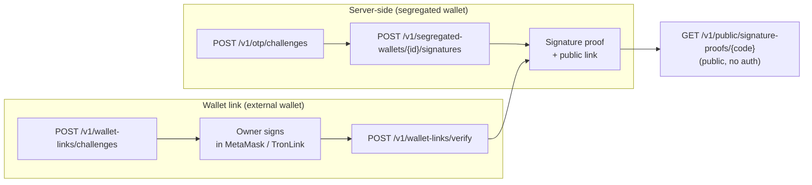

> **Environments:** Test `https://cryptobank.qbank.cl/platform` (`pk_test_...`) - Live `https://api.qbank.cl/platform` (`pk_...`).

A **signature proof** is cryptographic evidence that a wallet belongs to your
account, **without moving funds and without an on-chain transaction**. CBPay
builds a structured, human-readable **anti-phishing envelope** (title, purpose,
wallet, nonce and validity window), the wallet signs it with
**EIP-191** (Ethereum) or **TIP-191** (TRON), and anyone can verify the result
on a **public link** — no authentication required.

Two ways to produce a proof:

| Flow | Who signs | Use it when |
|---|---|---|
| **Server-side** | CBPay signs with your **segregated wallet** (custody `cbpay`) | The wallet is custodied by CBPay and you need an attestation on demand |
| **Wallet link** | The owner signs in **their own wallet** (MetaMask, TronLink…) | You need to prove ownership of an **external** wallet you don't custody |

> **Note**
Every proof expires **10 minutes** after it is issued
(`expires_at`). A proof attests a moment in time; if a counterparty needs a
fresh one, create a new signature.


## The anti-phishing envelope

CBPay never signs a free-form message. Both flows build the same structured
envelope, so the signer always sees **what** is being attested, **which**
wallet signs it and **until when** it is valid:

```text
CBPay Signature Proof
Domain: https://api.qbank.cl/platform
Purpose: wallet_ownership
Wallet: 0x71C7656EC7ab88b098defB751B7401B5f6d8976F
Nonce: 9f2c4a7d1e5b48c0a3f69d2e7b1c4a58
Issued: 2026-08-20T14:03:22Z
Expires: 2026-08-20T14:13:22Z
Statement: I control this wallet
```

The `wallet_link` purpose adds an `Account:` line with your masked account id.
A signature whose envelope is expired, not yet valid, or bound to a different
wallet is rejected.

## 1. Server-side signature (segregated wallet)

Sign with a [segregated wallet](https://docs.cbpayapp.com/en/guides/segregated-wallets) custodied by
CBPay (`custody: cbpay`). Because this flow produces a signature with a
custodied key, it requires **KYC approved** and an **OTP** challenge.

### Create the OTP challenge

Ask for a one-time code for the `sign_message` action and verify it to get
an `X-OTP-Token` (see [OTP](https://docs.cbpayapp.com/en/security-2fa)).
### Request the signature

```bash
curl -X POST https://api.qbank.cl/platform/v1/segregated-wallets/b7e3f1a2-4c5d-4e6f-8a9b-0c1d2e3f4a5b/signatures \
  -H "Authorization: Bearer <token>" \
  -H "X-OTP-Token: <otp-token>" \
  -H "Content-Type: application/json" \
  -d '{
    "purpose": "wallet_ownership",
    "statement": "I control this wallet"
  }'
```

`purpose` is `wallet_ownership` or `treasury_attestation`. `statement` is an
optional free-text line (max **140** runes) embedded in the envelope.

```json 201
{
  "proof_id": "c41d8f2e-9a3b-4c7d-ae1f-5b6c8d0e2f4a",
  "wallet_id": "b7e3f1a2-4c5d-4e6f-8a9b-0c1d2e3f4a5b",
  "chain": "eth",
  "address": "0x71C7656EC7ab88b098defB751B7401B5f6d8976F",
  "purpose": "wallet_ownership",
  "statement": "I control this wallet",
  "envelope": "CBPay Signature Proof\nDomain: https://api.qbank.cl/platform\nPurpose: wallet_ownership\nWallet: 0x71C7656EC7ab88b098defB751B7401B5f6d8976F\nNonce: 9f2c4a7d1e5b48c0a3f69d2e7b1c4a58\nIssued: 2026-08-20T14:03:22Z\nExpires: 2026-08-20T14:13:22Z\nStatement: I control this wallet",
  "message_hash": "4a5b6c7d8e9f0a1b2c3d4e5f6a7b8c9d0e1f2a3b4c5d6e7f8a9b0c1d2e3f4a5b",
  "signature": "9f2c4a7d1e5b48c0a3f69d2e7b1c4a589f2c4a7d1e5b48c0a3f69d2e7b1c4a589f2c4a7d1e5b48c0a3f69d2e7b1c4a589f2c4a7d1e5b48c0a3f69d2e7b1c1b",
  "proof_code": "G9f2c4a7d1e5b48c0a3f69d2e7b1c4a58c41d8f2e9a3b4c7dae",
  "verify_url": "https://api.qbank.cl/platform/v1/public/signature-proofs/G9f2c4a7d1e5b48c0a3f69d2e7b1c4a58c41d8f2e9a3b4c7dae",
  "status": "signed",
  "issued_at": "2026-08-20T14:03:22Z",
  "signed_at": "2026-08-20T14:03:22Z",
  "expires_at": "2026-08-20T14:13:22Z"
}
```
### Share the public link

Send `verify_url` to the counterparty. They open it without credentials and
see the proof, its status and the signature.
Every signature also triggers a **security email** to the account owner and a
`wallet_signature_created` webhook.

### List, detail and revoke

```bash
# List proofs of the wallet
curl "https://api.qbank.cl/platform/v1/segregated-wallets/b7e3f1a2-4c5d-4e6f-8a9b-0c1d2e3f4a5b/signatures?page=1&page_size=50" \
  -H "Authorization: Bearer <token>"

# All proofs of the account (paginated, from/to filters)
curl "https://api.qbank.cl/platform/v1/signature-proofs?from=2026-08-01&to=2026-08-20" \
  -H "Authorization: Bearer <token>"

# Detail
curl "https://api.qbank.cl/platform/v1/signature-proofs/c41d8f2e-9a3b-4c7d-ae1f-5b6c8d0e2f4a" \
  -H "Authorization: Bearer <token>"

# Revoke (the public link keeps working and shows status revoked)
curl -X POST "https://api.qbank.cl/platform/v1/signature-proofs/c41d8f2e-9a3b-4c7d-ae1f-5b6c8d0e2f4a/revoke" \
  -H "Authorization: Bearer <token>"
```

## 2. Link an external wallet (MetaMask / TronLink)

To prove ownership of a wallet **you** hold the keys to (not custodied by
CBPay), complete a signed challenge:

### Create the challenge

```bash
curl -X POST https://api.qbank.cl/platform/v1/wallet-links/challenges \
  -H "Authorization: Bearer <token>" \
  -H "Content-Type: application/json" \
  -d '{ "chain": "eth", "address": "0x71C7656EC7ab88b098defB751B7401B5f6d8976F" }'
```

```json 201
{
  "link_id": "d52e9c41-7b3a-4e8f-b2d6-1a9c5e7f3b8d",
  "chain": "eth",
  "address": "0x71C7656EC7ab88b098defB751B7401B5f6d8976F",
  "nonce": "9f2c4a7d1e5b48c0a3f69d2e7b1c4a58",
  "envelope": "CBPay Signature Proof\nDomain: https://api.qbank.cl/platform\nPurpose: wallet_link\nWallet: 0x71C7656EC7ab88b098defB751B7401B5f6d8976F\nAccount: ae8c…\nNonce: 9f2c4a7d1e5b48c0a3f69d2e7b1c4a58\nIssued: 2026-08-20T14:03:22Z\nExpires: 2026-08-20T14:13:22Z",
  "status": "pending",
  "expires_at": "2026-08-20T14:13:22Z"
}
```
### Sign the envelope in the wallet

Show the `envelope` text to the owner and ask them to sign it **exactly as
shown** with the wallet at `address` (MetaMask `personal_sign` for `eth`,
TronLink for `tron`). The challenge expires in **10 minutes**.
### Submit the signature

```bash
curl -X POST https://api.qbank.cl/platform/v1/wallet-links/verify \
  -H "Authorization: Bearer <token>" \
  -H "Content-Type: application/json" \
  -d '{
    "link_id": "d52e9c41-7b3a-4e8f-b2d6-1a9c5e7f3b8d",
    "signature": "9f2c4a7d1e5b48c0a3f69d2e7b1c4a589f2c4a7d1e5b48c0a3f69d2e7b1c4a589f2c4a7d1e5b48c0a3f69d2e7b1c4a589f2c4a7d1e5b48c0a3f69d2e7b1c1b"
  }'
```

```json 200
{
  "link_id": "d52e9c41-7b3a-4e8f-b2d6-1a9c5e7f3b8d",
  "chain": "eth",
  "address": "0x71C7656EC7ab88b098defB751B7401B5f6d8976F",
  "status": "linked",
  "linked_at": "2026-08-20T14:05:10Z",
  "proof_id": "c41d8f2e-9a3b-4c7d-ae1f-5b6c8d0e2f4a",
  "verify_url": "https://api.qbank.cl/platform/v1/public/signature-proofs/G9f2c4a7d1e5b48c0a3f69d2e7b1c4a58c41d8f2e9a3b4c7dae"
}
```
A successful verification creates a signature proof (`purpose: wallet_link`)
and fires the `wallet_linked` webhook. List and revoke links:

```bash
curl "https://api.qbank.cl/platform/v1/wallet-links" -H "Authorization: Bearer <token>"
curl -X DELETE "https://api.qbank.cl/platform/v1/wallet-links/d52e9c41-7b3a-4e8f-b2d6-1a9c5e7f3b8d" -H "Authorization: Bearer <token>"
```

## 3. Public verification

Anyone with the link can verify a proof — no account, no token:

```bash
curl "https://api.qbank.cl/platform/v1/public/signature-proofs/G9f2c4a7d1e5b48c0a3f69d2e7b1c4a58c41d8f2e9a3b4c7dae"
```

```json 200
{
  "proof_code": "G9f2c4a7d1e5b48c0a3f69d2e7b1c4a58c41d8f2e9a3b4c7dae",
  "status": "signed",
  "valid": true,
  "chain": "eth",
  "address": "0x71C7656EC7ab88b098defB751B7401B5f6d8976F",
  "purpose": "wallet_ownership",
  "statement": "I control this wallet",
  "issued_at": "2026-08-20T14:03:22Z",
  "signed_at": "2026-08-20T14:03:22Z",
  "expires_at": "2026-08-20T14:13:22Z",
  "message_hash": "4a5b6c7d8e9f0a1b2c3d4e5f6a7b8c9d0e1f2a3b4c5d6e7f8a9b0c1d2e3f4a5b",
  "signature": "9f2c4a7d1e5b48c0a3f69d2e7b1c4a589f2c4a7d1e5b48c0a3f69d2e7b1c4a589f2c4a7d1e5b48c0a3f69d2e7b1c4a589f2c4a7d1e5b48c0a3f69d2e7b1c1b",
  "verified_live": true
}
```

`valid` is `true` only when the proof is signed, not revoked, not expired and
the signature still matches the envelope (`verified_live` re-checks the
cryptography on every call). An unknown or malformed code returns
`404 not_found`.

## Status

| Status | Meaning | Terminal? |
|---|---|---|
| `pending` | Challenge created, waiting for the owner's signature (wallet link only) | No — expires in 10 min |
| `signed` | Proof signed and valid | No — can be revoked or expire |
| `revoked` | The account revoked the proof | Yes |
| `expired` | The 10-minute window elapsed | Yes |

## Errors

| HTTP | Code | Solution |
|---|---|---|
| 400 | `invalid_json` / `invalid_payload` | Malformed body; check the JSON |
| 400 | `invalid_purpose` | Use `wallet_ownership` or `treasury_attestation` |
| 400 | `invalid_statement` | Statement exceeds 280 characters |
| 400 | `unsupported_chain` | Chain must be `eth` or `tron` |
| 400 | `invalid_address` | Address doesn't match the chain format |
| 403 | `verification_required` | The account needs KYC approved |
| 403 | `otp_required` / `otp_invalid` | Create and verify an OTP challenge, send `X-OTP-Token` |
| 404 | `not_found` | Wrong wallet/link/proof id, or unknown proof code |
| 409 | `custody_transferred` | The wallet was exported; it no longer signs server-side |
| 409 | `challenge_consumed` | The challenge was already used; create a new one |
| 409 | `proof_not_signable` | The proof is not in a signable state |
| 410 | `challenge_expired` | The 10-minute challenge window elapsed; create a new one |
| 422 | `sign_rejected` | The statement doesn't fit the envelope (max 140 runes) |
| 422 | `signature_mismatch` | The signature doesn't match the address/envelope |
| 429 | `too_many_attempts` | Public verification rate limit; wait and retry |
| 502 | `signer_unavailable` / `verification_failed` | Transient signing/verification failure; retry |

## Webhooks

Subscribe to these events (see [Webhooks](https://docs.cbpayapp.com/en/webhooks)):

```json wallet_signature_created
{
  "proof_id": "c41d8f2e-9a3b-4c7d-ae1f-5b6c8d0e2f4a",
  "account_id": "ae8c5f21-3b7d-4a9e-c6f2-8d1b4e6a9c3f",
  "wallet_id": "b7e3f1a2-4c5d-4e6f-8a9b-0c1d2e3f4a5b",
  "chain": "eth",
  "address": "0x71C7656EC7ab88b098defB751B7401B5f6d8976F",
  "purpose": "wallet_ownership",
  "proof_code": "G9f2c4a7d1e5b48c0a3f69d2e7b1c4a58c41d8f2e9a3b4c7dae",
  "verify_url": "https://api.qbank.cl/platform/v1/public/signature-proofs/G9f2c4a7d1e5b48c0a3f69d2e7b1c4a58c41d8f2e9a3b4c7dae"
}
```

```json wallet_linked
{
  "link_id": "d52e9c41-7b3a-4e8f-b2d6-1a9c5e7f3b8d",
  "account_id": "ae8c5f21-3b7d-4a9e-c6f2-8d1b4e6a9c3f",
  "chain": "eth",
  "address": "0x71C7656EC7ab88b098defB751B7401B5f6d8976F",
  "proof_id": "c41d8f2e-9a3b-4c7d-ae1f-5b6c8d0e2f4a"
}
```

## FAQ

#### Does a signature proof move funds or cost gas?
    No. Signing a message is purely cryptographic: no on-chain transaction, no
    network fee, no balance change.
#### How long is a proof valid?
    10 minutes from `issued_at`. After that the public link shows the proof as
    expired. Create a new signature when a fresh attestation is needed.
#### Can I revoke a proof?
    Yes — `POST /v1/signature-proofs/{proofID}/revoke`. The public link keeps
    working and reports `status: revoked`, so past verifications remain
    auditable.
#### Which wallets can sign in the wallet-link flow?
    Any wallet that supports `personal_sign` on Ethereum (EIP-191) or message
    signing on TRON (TIP-191) — MetaMask, TronLink and compatible wallets.
#### Why was my statement rejected?
    The envelope accepts up to 140 runes of statement. Requests over 280
    characters fail with `invalid_statement`; between 141 and 280 the envelope
    rejects them with `sign_rejected`.
