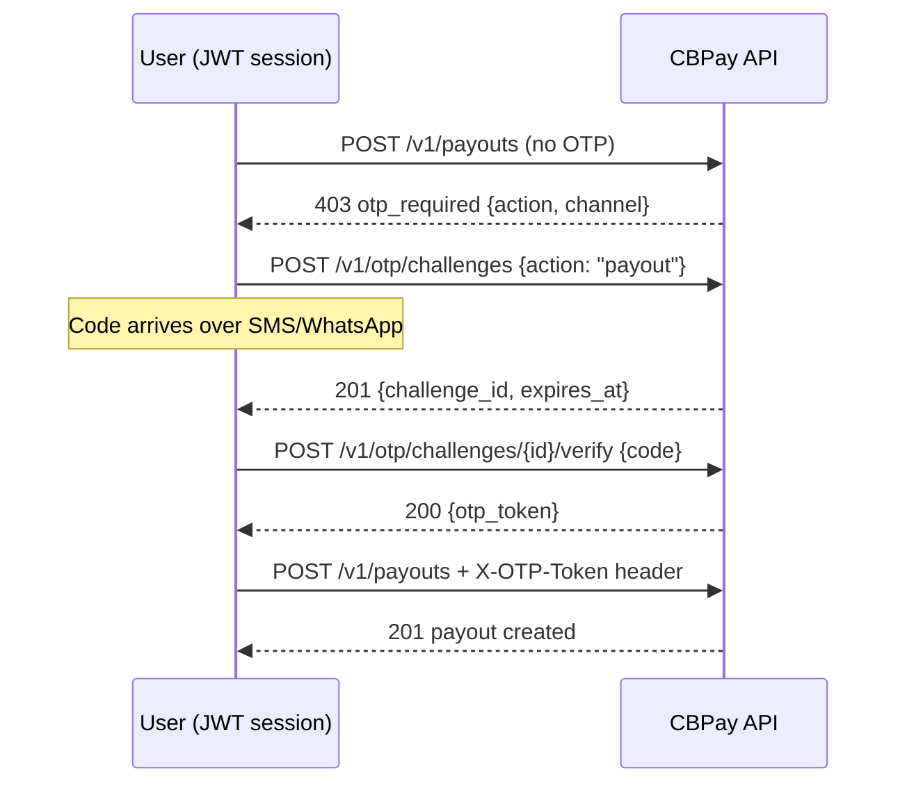

CBPay can require a **one-time verification code (OTP)** before sensitive
actions: logging in, creating a payout, withdrawing crypto, revealing a
card, issuing an API key… The code arrives over **SMS or WhatsApp** to the
account's phone, and your operator decides **which actions require it and
over which channel** — per account or for the whole organization.

> **Note**
OTP applies **only to user sessions** (JWT login). **`pk_` API keys are
exempt**: they are server-to-server integrations with no human holding a
phone on the other side. If your whole operation runs on API keys, this
page changes nothing in your integration.
> **Note**
This page covers the **per-action OTP flow** your integration must handle
(`otp_required` → challenge → verify). Everything the end user manages about
their own factors — enabling 2FA, channels (SMS/WhatsApp/email), the
authenticator app (TOTP), recovery codes and passkeys — lives in
[Profile & security](https://docs.cbpayapp.com/en/guides/profile).
## How it works



The `otp_token` is **single use**, bound to your user and to the action it
was issued for, and expires with the challenge (10 minutes after the code
was sent).

## 1. Check your policy

`GET /v1/otp/settings` tells you whether OTP is active and which actions
require it:

```bash
curl https://api.qbank.cl/platform/v1/otp/settings \
  -H "Authorization: Bearer <token>"
```

```json
{
  "enabled": true,
  "phone": "********5678",
  "phone_verified": true,
  "actions": [
    { "action": "login", "required": true, "channel": "sms" },
    { "action": "payout", "required": true, "channel": "whatsapp" },
    { "action": "crypto_withdrawal", "required": true, "channel": "sms" },
    { "action": "transfer", "required": false, "channel": "sms" },
    { "action": "banking_operation", "required": false, "channel": "sms" },
    { "action": "card_reveal", "required": true, "channel": "sms" },
    { "action": "api_key_create", "required": true, "channel": "sms" },
    { "action": "member_add", "required": false, "channel": "sms" },
    { "action": "phone_change", "required": true, "channel": "sms" }
  ]
}
```

## 2. Request the code

```bash
curl -X POST https://api.qbank.cl/platform/v1/otp/challenges \
  -H "Authorization: Bearer <token>" \
  -H "Content-Type: application/json" \
  -d '{ "action": "payout" }'
```

Response `201` — the code is already on its way to the account's phone:

```json
{
  "challenge_id": "6f1c02aa-93a1-4f0e-a7d1-1f2e3c4b5a69",
  "account_id": "9b1deb4d-3b7d-4bad-9bdd-2b0d7b3dcb6d",
  "action": "payout",
  "channel": "whatsapp",
  "phone": "********5678",
  "status": "pending",
  "created_at": "2026-07-08T21:00:00Z",
  "expires_at": "2026-07-08T21:10:00Z"
}
```

If the account has no phone: `409 phone_required` (set it with
`PATCH /v1/me`). Hourly send limits apply — exceeding them returns
`429 too_many_attempts`.

## 3. Verify the code

```bash
curl -X POST https://api.qbank.cl/platform/v1/otp/challenges/6f1c02aa-93a1-4f0e-a7d1-1f2e3c4b5a69/verify \
  -H "Authorization: Bearer <token>" \
  -H "Content-Type: application/json" \
  -d '{ "code": "482913" }'
```

```json
{
  "challenge_id": "6f1c02aa-93a1-4f0e-a7d1-1f2e3c4b5a69",
  "action": "payout",
  "otp_token": "otp_Zk9uY2XIr1EYE0lq8xqlM3VayVZYX4aa11bb22cc33",
  "expires_at": "2026-07-08T21:10:00Z",
  "note": "single use: send it in the X-OTP-Token header of the protected action"
}
```

Wrong code → `401 invalid_code` (you get 5 attempts per challenge).

## 4. Execute the action with the token

```bash
curl -X POST https://api.qbank.cl/platform/v1/payouts \
  -H "Authorization: Bearer <token>" \
  -H "X-OTP-Token: otp_Zk9uY2XIr1EYE0lq8xqlM3VayVZYX4aa11bb22cc33" \
  -H "Content-Type: application/json" \
  -d '{ "country": "CL", "currency": "CLP", "method": "bank_transfer", "amount": "50000", "beneficiary": { "...": "..." }, "idempotency_key": "pay-991" }'
```

The token is consumed on use, even if the action fails afterwards (for
example, insufficient funds): retrying requires verifying a new challenge.
Your `idempotency_key` remains the duplicate protection — OTP does not
replace it.

## Two-step login

If your policy requires OTP on `login`, `POST /v1/auth/login` no longer
returns the session directly:

```json
{
  "otp_required": true,
  "pending_token": "eyJhbGciOi…",
  "challenge_id": "8a2b…",
  "channel": "sms",
  "phone": "********5678",
  "expires_at": "2026-07-08T21:10:00Z",
  "note": "verify the code with POST /v1/auth/login/otp to receive the session token"
}
```

The `pending_token` **cannot call the API**: it is only exchanged, along
with the code, for the real session:

```bash
curl -X POST https://api.qbank.cl/platform/v1/auth/login/otp \
  -H "Content-Type: application/json" \
  -d '{ "pending_token": "eyJhbGciOi…", "code": "482913" }'
```

```json
{
  "access_token": "eyJhbGciOi…",
  "expires_at": "2026-07-09T21:00:00Z",
  "account_id": "9b1deb4d-3b7d-4bad-9bdd-2b0d7b3dcb6d",
  "role": "owner"
}
```

## The account's phone

- **E.164** format (`+56912345678`), set at registration, through
  `PATCH /v1/me` or by your operator.
- `phone_verified` flips to `true` the first time you verify a challenge:
  it proves the holder has the phone in hand.
- **Changing the phone** (action `phone_change`) validates the code against
  the **previous** number — nobody can redirect your codes without holding
  your current phone.
- If the phone is linked for the first time (or changed without
  verification), SMS/WhatsApp challenges stay locked for **24 hours**: the
  anti session-hijacking window. During the cooldown, if you have the
  authenticator app enrolled or a verified email, the challenge is issued
  automatically over that stronger factor (the channel comes back in the
  challenge response); you only get `403 phone_binding_cooldown` when no
  alternative factor exists. A phone set by your operator has no cooldown.
- The **two-step login** honors the same rule: with login 2FA over
  SMS/WhatsApp and the phone in cooldown, the login code is issued over the
  authenticator app or your login email instead (the effective `channel`
  comes back in the login response) — it is never sent to a recently
  linked, unverified number. Without an alternative factor the login
  responds `403 phone_binding_cooldown` until the cooldown expires.

## Errors

| HTTP | `error` | What it means | What to do |
|---|---|---|---|
| 403 | `otp_required` | The action requires OTP and no `X-OTP-Token` was sent | Create and verify a challenge, retry with the header |
| 403 | `otp_invalid` | Token invalid, expired or already used | Verify a new challenge |
| 403 | `session_required` | You requested a challenge with an API key | Challenges are for user sessions only |
| 403 | `phone_binding_cooldown` | Phone linked less than 24 h ago without verification and no alternative factor (authenticator app or verified email) | Enroll the authenticator app or verify your email; otherwise wait out the cooldown or ask your operator to set the number |
| 401 | `invalid_code` | The code does not match | Check the SMS/WhatsApp and retry (5 attempts) |
| 401 | `invalid_pending_token` | The intermediate login token expired | Log in again |
| 409 | `phone_required` | The account has no phone | `PATCH /v1/me` with an E.164 `phone` |
| 409 | `otp_phone_missing` | Login requires OTP and there is no phone | Contact your operator |
| 409 | `challenge_not_pending` | The challenge expired or was already used | Create a new one |
| 429 | `too_many_attempts` | Send/verification limits reached | Wait a few minutes |
| 503 | `otp_unavailable` | The verification service is unavailable | Retry; the action stays blocked (OTP is never skipped) |

## FAQ

#### Does OTP affect my server-to-server integrations?
    No. `pk_` API keys are exempt by design: automation never goes through
    OTP. Guard your keys accordingly — issuing a new key CAN require OTP
    (action `api_key_create`).
#### Can I choose SMS or WhatsApp?
    The channel is configured by your operator per action (per account or
    for the whole organization). You see it in `GET /v1/otp/settings`.
#### How long does a code last and how many attempts do I get?
    The code and challenge last 10 minutes. You get 5 verifications per
    challenge and an hourly send limit. The resulting `otp_token` is single
    use.
#### Can I request one token and use it for several actions?
    No: the token is bound to the exact action the challenge was created
    for (a `payout` token does not work for `transfer`) and is consumed on
    first use.
#### The action failed after consuming the token — do I pay twice?
    No. A consumed token only means you must verify a new challenge; the
    operation's `idempotency_key` still guarantees there are no duplicates.
