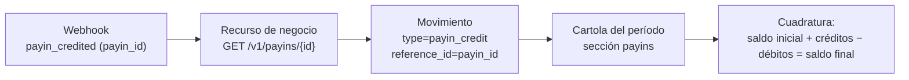

Cada vez que tu saldo cambia, CBPay escribe una **entrada inmutable** en el
ledger con el saldo resultante. `GET /v1/movements` es tu fuente de verdad
para conciliar: nada mueve dinero sin dejar asiento.

## Consultar movimientos

```bash
curl "https://api.qbank.cl/platform/v1/movements?from=2026-07-01&to=2026-07-08&page_size=100" \
  -H "Authorization: Bearer <token>"
```

```json
{
  "account_id": "9b1deb4d-3b7d-4bad-9bdd-2b0d7b3dcb6d",
  "page": 1,
  "page_size": 100,
  "movements": [
    {
      "id": "a3f1…",
      "asset": "USDT",
      "amount": "-101.602460",
      "type": "payout_debit",
      "reference_type": "payout",
      "reference_id": "8e2a…",
      "description": "Payout 700.00 BOB",
      "balance_after": "3898.397540",
      "created_at": "2026-07-07T15:22:10Z"
    }
  ]
}
```

Filtros: `from`/`to` (`YYYY-MM-DD`, UTC), `type`, `asset`, `page`,
`page_size` (máx. 200). Cada entrada trae `reference_type` +
`reference_id`: el recurso de negocio que la originó.

### Exportar a CSV / Excel

Agrega `format=csv` o `format=xlsx` para descargar las mismas filas como
archivo listo para contabilidad (hasta 10.000 filas por descarga). También
disponible en los listados de `payouts`, `payins` y `transfers`:

```bash
curl -o movimientos.xlsx "https://api.qbank.cl/platform/v1/movements?from=2026-07-01&to=2026-07-13&format=xlsx" \
  -H "Authorization: Bearer <token>"
```

## Catálogo completo de tipos

| `type` | Signo | Origen (`reference_type`) |
|---|---|---|
| `payin_credit` | + | Cobro fiat abonado (`payin`) |
| `payout_debit` / `payout_refund` | − / + | Payout creado / reembolso si falló (`payout`) |
| `transfer_in` / `transfer_out` | + / − | Transferencia interna recibida / enviada (`transfer`) |
| `funding` | + | Depósito USDT on-chain acreditado (`deposit`) |
| `withdrawal_debit` / `withdrawal_refund` | − / + | Retiro on-chain / reembolso si falló (`withdrawal`) |
| `card_debit` / `card_refund` | − / + | Compra con tarjeta / reversa (`card_transaction`) |
| `card_fee` / `card_fee_refund` | − / + | Fee de tarjeta (emisión, mensualidad, cancelación) |
| `compliance_fee` / `compliance_refund` | − / + | Cobro por screening KYC / reembolso si falló |
| `wallet_creation_fee` / `wallet_creation_refund` | − / + | Fee por creación de wallet |
| `banking_fee` / `banking_fee_refund` | − / + | Fee de operación banking |
| `adjustment` | ± | Ajuste manual auditado del administrador |

> **Nota**
Los saldos de banking viven en tus cuentas bancarias (no en el ledger
USDT): aquí solo aparecen sus **fees**. Las comisiones transaccionales de
payout/payin/retiro no tienen asiento propio — viajan dentro del monto de
su operación (`total_debit`, `usdt_credited`).
## Conciliación en tres capas

Tu integración tiene tres vistas del mismo dinero. Así se mapean:

| Capa | Qué es | Clave de cruce |
|---|---|---|
| **Webhooks** | Notificación push de cada evento | `payout_id` / `payin_id` / `transfer_id` / `withdrawal_id` |
| **Movements** | Asiento contable inmutable con `balance_after` | `reference_id` = el mismo id del recurso |
| **Cartola** | Estado de cuenta del período (JSON/PDF/Excel) con cuadratura | Secciones por producto con los mismos ids |



### Receta de conciliación diaria

### Descarga los movimientos del día

`GET /v1/movements?from=AYER&to=AYER` paginando hasta el final.
### Cruza contra tu registro interno

Tu `idempotency_key` derivada de tu id interno te permite unir cada
operación tuya con su `reference_id` de CBPay.
### Verifica la continuidad del saldo

Ordena por fecha: el `balance_after` de cada entrada debe ser el
anterior ± `amount`. Cualquier salto es señal de que te falta una
entrada (no de un error del ledger — es inmutable).
### Cierra el período con la cartola

La [cartola](https://docs.cbpayapp.com/es/guias/cartola) garantiza la identidad contable
`saldo_inicial + créditos − débitos = saldo_final` y te sirve como
respaldo formal (PDF/Excel).
## Movements vs cartola: ¿cuándo usar cuál?

- **`GET /v1/movements`** — programático, paginado, en vivo: para tu
  conciliación automática y tu UI de historial.
- **Cartola** — snapshot del período con totales, desgloses por producto/
  país/moneda y cuadratura garantizada: para cierres contables, auditoría
  y para compartir con tu equipo de finanzas.

Ambos leen el mismo ledger: nunca van a discrepar entre sí.
