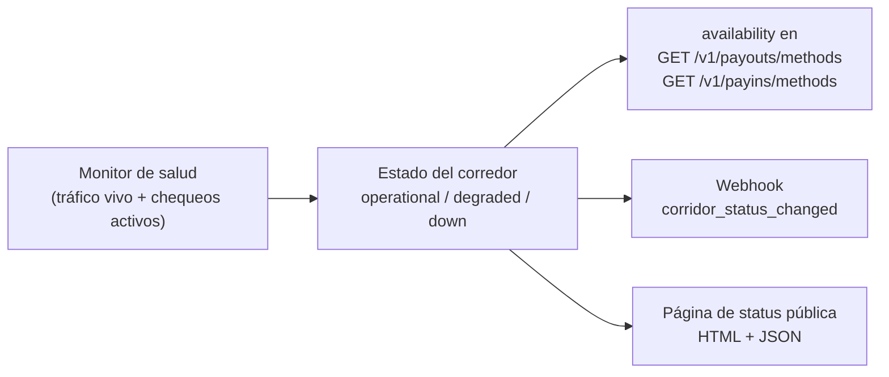

> **Ambientes:** Test `https://cryptobank.qbank.cl/platform` (`pk_test_...`) - Live `https://api.qbank.cl/platform` (`pk_...`).

Los rieles de pago pueden degradarse o caerse — una caída de la red bancaria,
una ventana de mantenimiento del canal, un incidente aguas arriba. La
plataforma monitorea la salud de cada corredor (país / moneda / método) **en
tiempo real**, combinando el resultado del tráfico vivo con chequeos activos
de salud, y te expone ese estado por tres superficies para que tu producto
reaccione antes que tus usuarios:

1. **`availability` en los catálogos de métodos** — decide al renderizar si
   mostrar, advertir u ocultar un corredor.
2. **Webhook `corridor_status_changed`** — recibe el push en el momento en
   que un corredor cambia de estado, sin polling.
3. **Página de status pública** — una página hosteada y brandeada
   (HTML + JSON) que puedes linkear desde tu app o tu propio tooling de
   status.



> **Nota**
El monitor es **observabilidad, no un gate**: un corredor `down` NO bloquea
tus requests. Tú mantienes el control — puedes seguir enviando (los requests
fallarán con los códigos de error de siempre y los refunds aplican como
siempre) o pausar ese corredor en tu UI hasta que se recupere.
## Estados de un corredor

| Estado | Significado | Qué hacer |
|---|---|---|
| `operational` | El corredor procesa con normalidad. | Nada — operación normal. |
| `degraded` | Se detectó una tasa elevada de errores de infraestructura en la ventana reciente. Algunas operaciones pueden fallar o demorar más. | Considera mostrar una advertencia en tu UI; reintentar con la misma `idempotency_key` es seguro. |
| `down` | Fallas de infraestructura consecutivas o chequeos de salud fallando. Es muy probable que los despachos nuevos fallen. | Prefiere ocultar o deshabilitar el corredor en tu UI hasta que se recupere; lo que igual envíes resolverá a los estados finales de siempre (las operaciones fallidas se reembolsan como siempre). |

Las transiciones tienen histéresis: un timeout aislado jamás declara una
caída, y la recuperación exige una ventana estable sostenida — el estado que
lees es significativo, no ruido.

## 1. Availability en los catálogos de métodos

`GET /v1/payouts/methods` y `GET /v1/payins/methods` ahora incluyen el campo
ADITIVO `availability` por corredor. El resto del shape no cambia.

```bash
curl "https://api.qbank.cl/platform/v1/payouts/methods" \
  -H "Authorization: Bearer pk_..."
```

```json
{
  "items": [
    {
      "country": "VE",
      "currency": "VES",
      "method": "bank_transfer",
      "availability": "down"
    },
    {
      "country": "MX",
      "currency": "MXN",
      "method": "bank_transfer",
      "availability": "operational"
    }
  ]
}
```

Un corredor sin incidentes registrados es siempre `operational` — el monitor
solo persiste lo que ha observado.

## 2. El webhook `corridor_status_changed`

Suscribe tu endpoint al evento `corridor_status_changed`
([guía de webhooks](https://docs.cbpayapp.com/es/webhooks)) y recibirás cada transición en el momento
en que ocurre — caída **y** recuperación:

```json
{
  "event_type": "corridor_status_changed",
  "data": {
    "flow": "payout",
    "country": "VE",
    "currency": "VES",
    "method": "bank_transfer",
    "status": "down",
    "previous_status": "operational",
    "since": "2026-07-24T22:10:00Z",
    "reason": "consecutive infrastructure failures"
  }
}
```

| Campo | Descripción |
|---|---|
| `flow` | `payout` o `payin` — la dirección del corredor afectado. |
| `country` / `currency` / `method` | La clave del corredor, igual que en los catálogos de métodos. |
| `status` | Estado nuevo: `operational`, `degraded` o `down`. |
| `previous_status` | Estado previo a la transición. |
| `since` | Cuándo comenzó el estado nuevo (RFC 3339, UTC). |
| `reason` | Causa corta legible (jamás incluye identidades de canales internos). |

El evento es un **broadcast**: no está ligado a una operación tuya, así que
no lleva `account_id`. El consumo idempotente aplica como en todo webhook
(dedupe por id de entrega).

## 3. Página de status pública

Tu organización tiene una página de status hosteada con el estado vivo de
cada corredor, el uptime de los últimos 90 días y el historial de
incidentes. Es pública (sin auth), brandeada con la identidad de tu
organización y apta para compartir con tus propios clientes.

- **HTML**: `GET /status/{orgToken}` — página self-contained que puedes
  linkear o embeber.
- **JSON**: `GET /v1/status/{orgToken}` — la misma data para tu propio
  tooling de status o monitores.

El `orgToken` es un token opaco que tu operador te comparte (los org admins
pueden leerlo como `status_page_url` en `GET /v1/org/branding`).

```bash
curl "https://api.qbank.cl/platform/v1/status/{orgToken}"
```

```json
{
  "status": "degraded",
  "generated_at": "2026-07-24T22:15:00Z",
  "corridors": [
    {
      "flow": "payout",
      "country": "VE",
      "currency": "VES",
      "method": "bank_transfer",
      "status": "down",
      "since": "2026-07-24T22:10:00Z",
      "uptime_90d_pct": 99.62
    }
  ],
  "incidents": [
    {
      "flow": "payout",
      "country": "VE",
      "currency": "VES",
      "method": "bank_transfer",
      "from_status": "operational",
      "to_status": "down",
      "reason": "consecutive infrastructure failures",
      "at": "2026-07-24T22:10:00Z"
    }
  ]
}
```

| Campo | Descripción |
|---|---|
| `status` | Estado global de la página: el peor estado entre todos los corredores. |
| `corridors[]` | Estado actual por corredor más `uptime_90d_pct` (porcentaje de los últimos 90 días en `operational`). |
| `incidents[]` | Transiciones más recientes (caídas y recuperaciones), la más nueva primero. |

Un token desconocido o mal formado responde `404` — el token no revela si
una organización existe. El endpoint tiene rate limit por IP.

## FAQ

#### ¿Un corredor down rechaza mis requests?
    No. El monitor jamás bloquea despachos. Un corredor `down` significa que
    las operaciones nuevas muy probablemente fallarán con los códigos de
    error de siempre (`channel_unavailable`, rechazo del canal, estados por
    timeout) — las operaciones fallidas se reembolsan exactamente como
    siempre. Usa `availability` para decidir qué mostrar en tu UI.
#### ¿Qué tan rápido se detecta una caída?
    El monitor evalúa continuamente, combinando cada despacho real con
    chequeos activos de salud periódicos, así que las caídas se detectan
    típicamente en pocos minutos incluso en corredores con poco tráfico. La
    histéresis evita que un timeout aislado haga parpadear el estado.
#### ¿Necesito hacer polling a los catálogos para seguir la disponibilidad?
    No — suscríbete a `corridor_status_changed` y recibirás cada transición
    por push. Los catálogos son un snapshot conveniente para el momento de
    renderizar; el webhook es el feed de cambios.
#### ¿Qué pasa con las operaciones en vuelo cuando un corredor cae?
    Se resuelven solas: cada operación llega a su estado final (`completed`
    o `failed` con refund) por la maquinaria de webhooks y conciliación de
    siempre. Nunca necesitas re-enviar — reintentar con la misma
    `idempotency_key` es siempre seguro.
#### ¿Puedo white-labelear la página de status?
    Sí. La página usa el branding de tu organización (logo, colores, nombre)
    automáticamente — la misma configuración que usan los comprobantes y las
    páginas hosteadas. Pide a tu operador la URL de la página de status de
    tu organización, o léela desde <code>GET /v1/org/branding</code> si eres
    org admin.
#### ¿Por qué no veo qué proveedor está detrás de un incidente?
    Por diseño la plataforma es agnóstica al proveedor: los corredores se
    identifican solo por país, moneda y método. Las causas de los incidentes
    están normalizadas y jamás incluyen identidades de canales internos.
