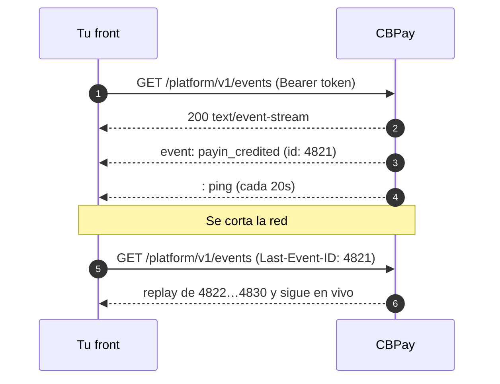

Los webhooks empujan eventos a **tu servidor**. El stream de eventos en tiempo
real los empuja a **tu front**: un solo `GET` de larga duración que recibe cada
evento en el momento, con replay garantizado si se corta la conexión.

Usa el stream para mantener un dashboard vivo (saldos, payins que acreditan,
payouts que liquidan, autorizaciones de tarjeta, alertas KYT para los admins).
Usa [webhooks](https://docs.cbpayapp.com/es/webhooks) para todo lo que deba sobrevivir a que cierren el
navegador — los dos canales llevan **los mismos eventos con el mismo payload**
y el mismo `event_id`, así no escribes dos mapeos.



## Abrir el stream

El endpoint pide la misma credencial `Authorization: Bearer` que el resto de la
API, así que el `EventSource` nativo del navegador (que no puede mandar
headers) **no sirve**. Usa `fetch` leyendo el cuerpo como stream:

```js Navegador (fetch)
const res = await fetch("https://api.qbank.cl/platform/v1/events", {
  headers: {
    Authorization: `Bearer ${token}`,
    Accept: "text/event-stream",
  },
});

const reader = res.body.pipeThrough(new TextDecoderStream()).getReader();
let buffer = "";
let lastEventId = null;

while (true) {
  const { value, done } = await reader.read();
  if (done) break;
  buffer += value;

  // Los frames SSE se separan con una línea en blanco
  let sep;
  while ((sep = buffer.indexOf("\n\n")) !== -1) {
    const frame = buffer.slice(0, sep);
    buffer = buffer.slice(sep + 2);
    if (frame.startsWith(":")) continue; // heartbeat

    const id = frame.match(/^id: (.+)$/m)?.[1];
    const type = frame.match(/^event: (.+)$/m)?.[1];
    const data = frame.match(/^data: (.+)$/m)?.[1];
    if (id) lastEventId = id; // guárdalo: es tu cursor de replay
    handle(type, data ? JSON.parse(data) : null);
  }
}
```

```bash curl
curl -N https://api.qbank.cl/platform/v1/events \
  -H "Authorization: Bearer <token>" \
  -H "Accept: text/event-stream"
```

```text Respuesta
: cbpay event stream

retry: 3000

id: 4821
event: payin_credited
data: {"event_id":"9f1c…","type":"payin_credited","account_id":"ae8c…","created_at":"2026-07-25T18:42:07Z","cursor":"4821","data":{"payin_id":"7d2f…","usdt_credited":"99.700000","status":"credited"}}

: ping
```

Cada frame de evento trae tres líneas:

| Línea | Qué significa |
|---|---|
| `id:` | Cursor monótono del log. Guarda el último que procesaste: es tu `Last-Event-ID`. |
| `event:` | El tipo de evento (`payin_credited`, `payout_status_changed`, …), idéntico al catálogo de webhooks. |
| `data:` | Envoltorio JSON: `event_id`, `type`, `account_id`, `created_at`, `cursor` y `data` (el **mismo payload** que entrega el webhook). |

## Reconectar sin huecos

Si se corta la conexión, reconecta mandando el último cursor procesado. El
servidor replaya desde el log todo lo que te perdiste antes de volver al vivo,
así una red inestable nunca pierde un evento.

```js Header
await fetch("https://api.qbank.cl/platform/v1/events", {
  headers: {
    Authorization: `Bearer ${token}`,
    "Last-Event-ID": lastEventId, // ej. "4821"
  },
});
```

```bash Query param
curl -N "https://api.qbank.cl/platform/v1/events?last_event_id=4821" \
  -H "Authorization: Bearer <token>"
```

> **Nota**
El replay tiene tope de **1.000 eventos**. Si estuviste desconectado el tiempo
suficiente para perderte más, el stream emite un evento de control
`replay_truncated` y conviene reconciliar con `?snapshot=true` o con
[`GET /v1/events/history`](#historial-consultable) en vez de asumir
continuidad.
## Snapshot inicial

Abrir con `?snapshot=true` envía primero el **estado actual** y después los
deltas. Elimina la carrera clásica de "leo los endpoints REST, después me
suscribo y pierdo lo que pasó en el medio": el cursor se toma con la
suscripción ya abierta, así nada se cae por la rendija.

```bash
curl -N "https://api.qbank.cl/platform/v1/events?snapshot=true" \
  -H "Authorization: Bearer <token>"
```

```text
id: 4820
event: snapshot
data: {"generated_at":"2026-07-25T18:42:00Z","scope":{"org_admin":false,"account_id":"ae8c…","types":[]},"balances":[{"asset":"USDT","available":"1025.000000","held":"0.000000"}]}

id: 4821
event: payin_credited
data: {…}
```

El snapshot es **estado absoluto**, nunca deltas: aplicarlo dos veces es
inocuo. Trae `balances` para una credencial de cuenta (los mismos campos de
[`GET /v1/balances`](https://docs.cbpayapp.com/es/guias/analytics)) y, para un admin de organización,
los contadores de `health` operativa.

## Filtrar por tipo de evento

`?types=` acota lo que recibes. Solo puede **restringir** lo que tu credencial
ya ve, jamás ampliarlo. Un tipo desconocido se rechaza con
`400 invalid_event_type` en vez de dejarte esperando eventos que no llegan.

```bash
curl -N "https://api.qbank.cl/platform/v1/events?types=payin_credited,payout_status_changed" \
  -H "Authorization: Bearer <token>"
```

## Alcance: cuenta vs admin de organización

| Credencial | Qué entrega el stream |
|---|---|
| Cuenta (`pk_…` o sesión de member) | Solo los eventos de esa cuenta. |
| Admin de organización con `ops:read` | Todas las cuentas de la organización más los eventos org-wide (alertas KYT, salud de corredores, aprobaciones). `?account_id=` filtra dentro de la organización. |

Una cuenta nunca ve los eventos de otra cuenta ni la superficie de compliance
org-wide. El stream jamás entrega un campo que esa misma credencial no pudiera
leer por REST.

## Eventos de control

Además de tus eventos de negocio, el stream emite eventos de protocolo. No
llevan `id:` (salvo `snapshot`), así que no mueven tu cursor de replay.

| `event:` | Cuándo | Qué hacer |
|---|---|---|
| `snapshot` | Abriste con `?snapshot=true` | Reemplaza el estado local con el payload. |
| `reconnect` | Se alcanzó la vida máxima (30 min) o se llenó el buffer del servidor | Reconecta con `Last-Event-ID`. |
| `unauthorized` | Sesión revocada, key deshabilitada o cuenta bloqueada | Autentícate de nuevo. |
| `replay_truncated` | Más de 1.000 eventos perdidos | Reconcilia con `?snapshot=true` o con el historial. |
| `error` | No se pudo construir el replay o el snapshot | Reintenta; cae a REST. |

Cada 20 segundos llega un comentario `: ping` para que ningún proxy corte una
conexión ociosa — ignora las líneas que empiezan con `:`.

## Límites

| Límite | Valor | Por qué |
|---|---|---|
| Streams simultáneos por cuenta | 5 | Una pestaña por dispositivo sobra; las conexiones filtradas son un bug. |
| Streams simultáneos por organización | 50 | Protege el hub compartido. |
| Vida de la conexión | 30 min | Termina con `reconnect`; el cursor lo hace transparente. |
| Heartbeat | cada 20 s | Queda holgado bajo el timeout de lectura del proxy. |
| Revalidación de credencial | cada 60 s | Una sesión revocada deja de recibir eventos al instante. |
| Aperturas de stream por IP | 600 por hora | Absorbe reconexiones legítimas; corta un bucle de reintento roto. |

Pasarse del límite de concurrencia devuelve `429 too_many_streams`. Pasarse de
la cuota de aperturas devuelve `429 rate_limited` — esa cuenta *intentos*, así
que un cliente que reconecta en bucle la quema aunque no tenga ningún stream
abierto. Respeta siempre el `retry:` (3 s) más backoff exponencial.

## Historial consultable

El mismo log que alimenta el stream se lee por REST — útil para auditoría, para
una vista de "qué me perdí" o cuando el replay quedó truncado.

```bash
curl "https://api.qbank.cl/platform/v1/events/history?from=2026-07-01&to=2026-07-25&event_type=payin_credited&page=1&page_size=50" \
  -H "Authorization: Bearer <token>"
```

```json
{
  "page": 1,
  "page_size": 50,
  "total": 3,
  "events": [
    {
      "event_id": "9f1c0d3a-6b52-4c81-9f0e-2a7d5b1c8e44",
      "type": "payin_credited",
      "account_id": "ae8c…",
      "created_at": "2026-07-25T18:42:07Z",
      "cursor": "4821",
      "data": { "payin_id": "7d2f…", "usdt_credited": "99.700000" }
    }
  ]
}
```

Un evento puntual por su id público:

```bash
curl https://api.qbank.cl/platform/v1/events/9f1c0d3a-6b52-4c81-9f0e-2a7d5b1c8e44 \
  -H "Authorization: Bearer <token>"
```

> **Importante**
El log de eventos guarda **90 días**. Es un buffer de notificación, no el
registro financiero: saldos, payins, payouts, transferencias y asientos del
ledger son inmutables y siguen disponibles por el tiempo que exige la
regulación en sus propios endpoints y en la [cartola](https://docs.cbpayapp.com/es/guias/cartola).
## Errores

| HTTP | Código | Solución |
|---|---|---|
| 400 | `invalid_event_type` | Usa un tipo del [catálogo de webhooks](https://docs.cbpayapp.com/es/webhooks#eventos). |
| 400 | `invalid_range` | `from`/`to` son obligatorios en el historial (`YYYY-MM-DD`, `from` antes de `to`). |
| 404 | `not_found` | El evento no existe o es de otra cuenta. |
| 429 | `too_many_streams` | Cierra un stream abierto antes de abrir otro. |
| 429 | `rate_limited` | Demasiadas aperturas desde esta IP (600/h). Aplica backoff; nunca reconectes en bucle. |
| 503 | `stream_unavailable` | Reintenta con backoff; el stream está temporalmente no disponible. |

Lista completa en [Errores](https://docs.cbpayapp.com/es/errores).

## Preguntas frecuentes

#### ¿Reemplazo los webhooks por el stream?
    No. El stream vive mientras vive la pestaña; los webhooks llegan a tu
    backend aunque nadie esté mirando. Usa el stream para la UI y los webhooks
    para todo lo que dispare lógica de negocio (conciliación, contabilidad,
    notificaciones).
#### ¿Puede llegarme el mismo evento dos veces?
    Sí — tras una reconexión el replay puede reentregar el evento del borde, y
    ambos canales (webhook y stream) comparten el mismo `event_id`.
    Deduplica por `event_id` y trata cada payload como estado absoluto.
#### ¿Por qué se cierra la conexión a los 30 minutos?
    Por diseño. Un stream sin tope de vida esconde conexiones filtradas. El
    servidor manda antes un evento de control `reconnect`, y reconectar con
    `Last-Event-ID` continúa exactamente donde ibas.
#### ¿Necesito una suscripción como con los webhooks?
    No. El stream no se configura: entrega todo lo que tu credencial puede
    ver. Las suscripciones de webhook solo controlan las entregas HTTP a tu
    servidor.
#### No llega nada, ni siquiera el heartbeat.
    Revisa que tu cliente HTTP no esté bufereando la respuesta (en `fetch`, lee
    `res.body` como stream en vez de esperar `res.text()`) y que ningún proxy
    tuyo esté bufereando `text/event-stream`. CBPay ya desactiva el buffering
    de su lado.
#### ¿Un admin de organización puede seguir una sola cuenta?
    Sí, con `?account_id=`. El filtro solo opera dentro de tu propia
    organización; cualquier otra cosa devuelve 404.
