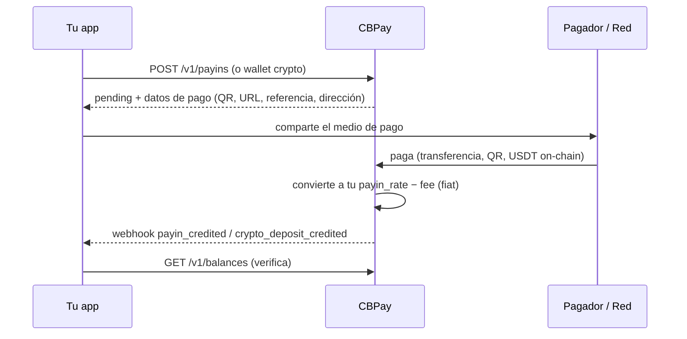
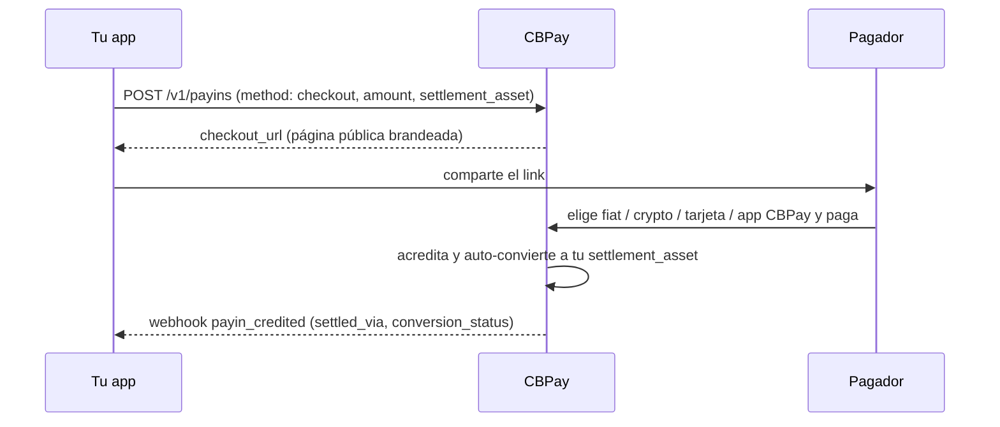
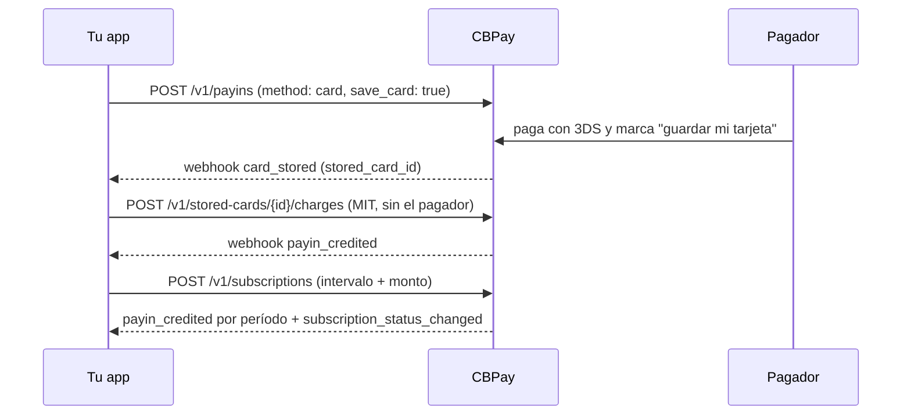
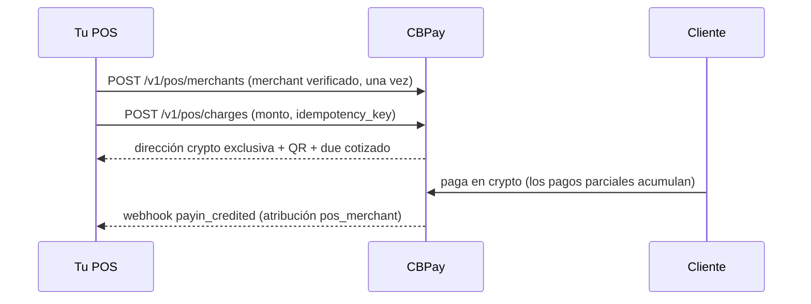
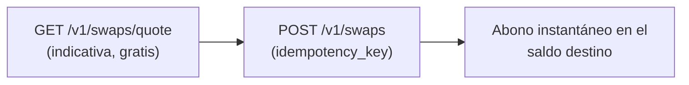
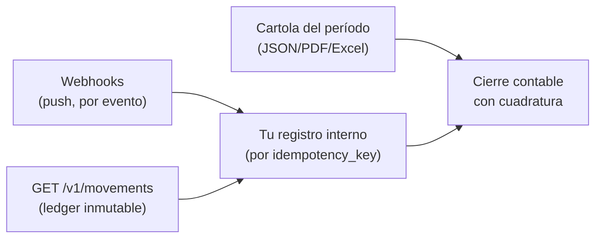
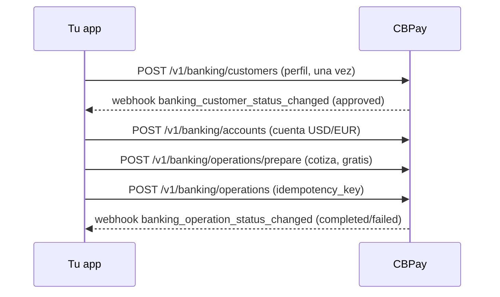

Esta página conecta los productos en **flujos completos de negocio**: qué
llamar, qué esperar y qué webhook cierra cada ciclo. Cada flujo linkea a la
guía detallada de su producto.

## 1. Fondear la cuenta

Tres caminos para que entre dinero; todos terminan en un abono al saldo
USDT y un webhook:



| Camino | Endpoint | Webhook de cierre |
|---|---|---|
| Cobro fiat (QR, transferencia, página de pago, pull) | `POST /v1/payins` / `/collect` | `payin_credited` |
| Depósito USDT on-chain | `POST /v1/crypto/wallets` (dirección fija) | `crypto_deposit_credited` |
| Transferencia interna de otra cuenta | — (la inicia el emisor) | `transfer_received` |

Detalle: [payins](https://docs.cbpayapp.com/es/guias/payins) · [crypto](https://docs.cbpayapp.com/es/guias/crypto) ·
[transferencias](https://docs.cbpayapp.com/es/guias/transferencias).

## 2. Dispersar (payout)

```mermaid
sequenceDiagram
    participant App as Tu app
    participant CB as CBPay
    participant Banco as Riel local
    App->>CB: POST /v1/payouts (idempotency_key)
    CB-->>App: 202 processing (fx_rate, total_debit; débito queda en held)
    CB->>Banco: ejecuta la dispersión
    alt pagado
        Banco-->>CB: confirmación
        CB-->>App: webhook payout_status_changed (completed)
    else rechazo
        Banco-->>CB: rechazo
        CB->>CB: reembolsa el débito COMPLETO a available
        CB-->>App: webhook payout_status_changed (failed + status_code)
    end
    App->>CB: GET /v1/payouts/{id} (verifica estado final)
```

Variante **QR** (Bolivia, PIX de Brasil): `POST /v1/payouts/qr/scan`
(gratis, decodifica) → muestra los datos → `POST /v1/payouts/qr/confirm`
(cobra como un payout normal). Detalle: [payouts](https://docs.cbpayapp.com/es/guias/payouts) ·
[payout QR](https://docs.cbpayapp.com/es/guias/qr-payout).

## 3. Cobrar a un cliente

Elige la modalidad según el país y la experiencia que quieras dar:

| Modalidad | Países | Experiencia del pagador | Confirmación |
|---|---|---|---|
| Página de pago hosted | CL | Abre una URL y paga desde su banco | Automática |
| QR | BO, BR (PIX) | Escanea con su app bancaria | Automática |
| Transferencia anunciada | CL, PE, MX, BR | Transfiere incluyendo la referencia | Automática por referencia (o monto) |
| CLABE / CVU dedicada | MX, AR | Transfiere a una cuenta fija tuya | Automática, sin referencias |
| Cobro pull (c2p / débito) | VE | Autoriza con OTP y tú ejecutas el cobro | **Síncrona** en la misma llamada |
| Pago con tarjeta | BO (BOB/USD) | Ingresa su tarjeta en una página hosted segura (3DS) | Automática |
| Link de cobro universal | Todos los países activos + crypto + tarjetas | Abre un link y elige cómo pagar | Automática |

Todos cierran con `payin_credited` y el abono neto en tu saldo.
Detalle: [payins](https://docs.cbpayapp.com/es/guias/payins) · [checkout](https://docs.cbpayapp.com/es/guias/checkout).

## 4. Checkout end-to-end

Un link, todos los rieles, liquidado en el saldo que elijas:



Detalle: [checkout](https://docs.cbpayapp.com/es/guias/checkout).

## 5. Tarjetas guardadas y suscripciones

Guarda la tarjeta una vez (con consentimiento del pagador) y cóbrala
después — con un clic, sin el pagador presente (MIT) o con un calendario
recurrente:



Detalle: [tarjetas guardadas y suscripciones](https://docs.cbpayapp.com/es/guias/stored-cards-subscriptions).

## 6. Cobro QR POS (procesadores)

Para empresas que operan puntos de venta físicos:



Detalle: [QR POS](https://docs.cbpayapp.com/es/guias/qr-pos).

## 7. Convertir saldos (swaps)



Una llamada convierte entre USDT, USDC, BTC y GOLD a la tasa de tu
cuenta — la plata no sale de la cuenta, así que no requiere OTP. Detalle:
[swaps](https://docs.cbpayapp.com/es/guias/swaps).

## 8. Conciliar



Receta completa en
[movimientos y conciliación](https://docs.cbpayapp.com/es/conceptos/movimientos-y-conciliacion) y
[cartola](https://docs.cbpayapp.com/es/guias/cartola).

## 9. Banking internacional end-to-end



El saldo banking vive en tus cuentas bancarias (separado del USDT); CBPay
solo cobra los fees fijos configurados. Detalle:
[banking](https://docs.cbpayapp.com/es/guias/banking).

> **Tip**
¿Primera integración? Sigue el [inicio rápido](https://docs.cbpayapp.com/es/inicio-rapido) (fondeo →
payout → webhook) y vuelve aquí cuando agregues productos.
