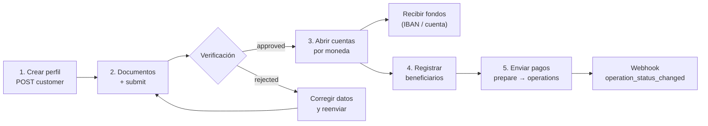
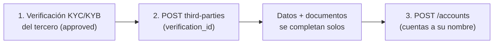

> **Ambientes:** Test `https://cryptobank.qbank.cl/platform` (`pk_test_...`) - Live `https://api.qbank.cl/platform` (`pk_...`).

Banking te da **cuentas bancarias reales** a nombre de tu perfil verificado:
recibes fondos por rieles internacionales (SEPA, SWIFT, ACH según la
moneda), mantienes saldo en moneda fiat y envías pagos a terceros. Es un
producto distinto de tu saldo USDT: **el dinero de banking vive en tus
cuentas bancarias**, no en el saldo CBPay.

| Concepto | Dónde vive | Se consulta con |
|---|---|---|
| Saldo USDT CBPay | Ledger CBPay | `GET /v1/balances` |
| Saldos bancarios | Tus cuentas bancarias | `GET /v1/banking/accounts/{id}/balance` |

> **Nota**
Las comisiones de banking (`banking_customer`, `banking_account`,
`banking_operation`) son fijas, se debitan de tu **saldo USDT** al ejecutar
cada operación y se **reembolsan automáticamente** si la operación falla.
Con comisión 0 (el default) el servicio es gratis. El campo `banking_fee`
de cada respuesta te muestra lo cobrado.
## El flujo completo



1. **Crea tu perfil bancario** (`POST /v1/banking/customer`) — una sola vez.
2. **Sube documentos** de verificación y **envíalo a revisión**.
3. Cuando quede `approved`, **abre cuentas** por moneda.
4. **Registra beneficiarios** (counterparties) para pagos a terceros.
5. **Envía pagos**: cotiza con `prepare` y ejecuta con `operations`.

Los cambios de estado te llegan por los webhooks
`banking_customer_status_changed` y `banking_operation_status_changed`
([webhooks](https://docs.cbpayapp.com/es/webhooks)).

## 1. Crea tu perfil bancario

Una vez por cuenta. Si no envías `type`, `name` o `email`, se completan con
los datos de tu cuenta CBPay:

```bash
curl -X POST https://api.qbank.cl/platform/v1/banking/customer \
  -H "Authorization: Bearer <token>" \
  -H "Content-Type: application/json" \
  -d '{
    "currency": "USD",
    "address": { "countryIso": "CL", "city": "Santiago" }
  }'
```

Respuesta `201`:

```json
{
  "customer_id": "9f2b…",
  "provider_id": "…",
  "status": "draft",
  "data": { "item": { "…": "…" } },
  "created_at": "2026-07-07T12:00:00Z",
  "banking_fee": "5.000000"
}
```

Si tu cuenta ya tiene perfil bancario — `409 banking_customer_exists`.
Consulta el estado en cualquier momento:

```bash
curl https://api.qbank.cl/platform/v1/banking/customer \
  -H "Authorization: Bearer <token>"
```

## 2. Documentos y verificación

Sube cada documento en base64 (gratis):

```bash
curl -X POST https://api.qbank.cl/platform/v1/banking/customer/documents \
  -H "Authorization: Bearer <token>" \
  -H "Content-Type: application/json" \
  -d '{
    "type": "PASSPORT",
    "filename": "pasaporte.pdf",
    "attach": "<contenido en base64>"
  }'
```

Y envía el perfil a revisión (gratis):

```bash
curl -X POST https://api.qbank.cl/platform/v1/banking/customer/submit \
  -H "Authorization: Bearer <token>"
```

Estados del perfil: `draft` → `submitted` → `under_review` →
**`approved`** o `rejected`. El webhook
`banking_customer_status_changed` te avisa cada cambio — del perfil propio
(`customer_kind: self`) y de los terceros que registres
(`customer_kind: third_party`, con su `third_party_id`):

```json
{
  "account_id": "…",
  "customer_id": "9f2b…",
  "customer_kind": "self",
  "kyc_status": "approved"
}
```

## 3. Abre cuentas bancarias

Con el perfil `approved`, crea una cuenta por moneda. Monedas disponibles:
**USD** (rieles ACH/Fedwire/SWIFT) y **EUR** (SEPA/SWIFT):

```bash Cuenta USD
curl -X POST https://api.qbank.cl/platform/v1/banking/accounts \
  -H "Authorization: Bearer <token>" \
  -H "Content-Type: application/json" \
  -d '{ "currency": "USD", "name": "Operativa USD" }'
```

```bash Cuenta EUR
curl -X POST https://api.qbank.cl/platform/v1/banking/accounts \
  -H "Authorization: Bearer <token>" \
  -H "Content-Type: application/json" \
  -d '{ "currency": "EUR", "name": "Operativa EUR" }'
```

Respuesta `201` — `data` incluye los datos para **recibir** (número de
cuenta/IBAN, routing, banco):

```json
{
  "account_id": "c4d1…",
  "provider_id": "…",
  "status": "active",
  "data": { "…": "…" },
  "banking_fee": "1.000000"
}
```

Lista tus cuentas, consulta el detalle de una cuenta puntual y su saldo:

```bash
curl https://api.qbank.cl/platform/v1/banking/accounts \
  -H "Authorization: Bearer <token>"

curl https://api.qbank.cl/platform/v1/banking/accounts/c4d1… \
  -H "Authorization: Bearer <token>"

curl https://api.qbank.cl/platform/v1/banking/accounts/c4d1…/balance \
  -H "Authorization: Bearer <token>"
```

El detalle (`GET /v1/banking/accounts/{id}`) devuelve la cuenta EN VIVO —
nombre, moneda, estado y bajo `data` los **requisitos para recibir
fondos** (rieles wire y locales: banco, número de cuenta/IBAN, routing).
Úsalo para mostrar las instrucciones de depósito de una cuenta específica
sin recorrer el listado:

```json
{
  "account_id": "c4d1…",
  "provider_id": "…",
  "source": "live",
  "data": {
    "name": "Operativa USD",
    "currencyCode": "USD",
    "status": "ACCEPT",
    "requisites": [
      { "type": "SWIFT", "…": "…" },
      { "type": "LOCAL", "…": "…" }
    ]
  }
}
```

`source` indica de dónde salió el detalle: `live` (el banco respondió en
vivo) o `mirror` (el banco no pudo servir la cuenta en ese momento y se
devuelve el último snapshot conocido — los requisitos de depósito siguen
disponibles).

> **Nota**
El listado expone solo las cuentas **habilitadas para tu operación** según
la configuración del corredor. Una cuenta no habilitada no aparece en el
listado y sus consultas por id responden `404 not_found`.
> **Nota**
**Límite para cuentas persona**: una cuenta persona puede tener **máximo 1
cuenta bancaria**. Al intentar la segunda recibirás `409
banking_account_limit`. Las cuentas empresa no tienen límite.
## Usuarios de terceros (solo empresas)

Si tu cuenta es **empresa**, además de tus cuentas propias puedes dar de
alta **usuarios banking de terceros** — tus clientes finales (personas o
empresas) — cada uno con su identidad y verificación propias y **cuentas
bancarias a su nombre**. Sin límite de terceros ni de cuentas por tercero.



### Alta del tercero

El alta exige el `verification_id` de una [verificación KYC/KYB
**aprobada**](https://docs.cbpayapp.com/es/guias/kyc) del tercero — su identidad única en CBPay. El
tipo sale del kind de la verificación (KYC ⇒ `INDIVIDUAL`, KYB ⇒
`COMPANY`), los datos (nombre, email, dirección) se completan solos desde
el perfil verificado (lo que envíes explícito gana) y los **documentos ya
validados se re-entregan automáticamente** al proveedor bancario. Se cobra
el fee de perfil bancario (se reembolsa si el alta falla):

```bash
curl -X POST https://api.qbank.cl/platform/v1/banking/third-parties \
  -H "Authorization: Bearer <token>" \
  -H "Content-Type: application/json" \
  -d '{
    "verification_id": "c3d4e5f6-a7b8-4c9d-0e1f-2a3b4c5d6e7f"
  }'
```

Respuesta `201`:

```json
{
  "third_party_id": "7f2a…",
  "customer_id": "…",
  "kind": "third_party",
  "status": "pending",
  "verification_id": "c3d4e5f6-a7b8-4c9d-0e1f-2a3b4c5d6e7f",
  "documents_synced": 2,
  "registered_at": "2026-07-10T15:00:00Z",
  "banking_fee": "1.000000"
}
```

> **Nota**
`documents_synced` cuenta los documentos de la verificación que quedaron
cargados automáticamente en el perfil bancario del tercero. Si alguno no se
pudo sincronizar (o el banco pide categorías adicionales), súbelo por el
flujo manual de documentos de más abajo y luego haz `submit`.
Guarda el `third_party_id`: todas las rutas del tercero lo usan. Lista y
consulta (el GET trae el estado de verificación en vivo):

```bash
curl "https://api.qbank.cl/platform/v1/banking/third-parties?page=1&page_size=50" \
  -H "Authorization: Bearer <token>"

curl https://api.qbank.cl/platform/v1/banking/third-parties/7f2a… \
  -H "Authorization: Bearer <token>"
```

### Verificación del tercero (gratis)

Igual que tu propio perfil, pero sobre el tercero:

```bash
curl -X POST https://api.qbank.cl/platform/v1/banking/third-parties/7f2a…/documents \
  -H "Authorization: Bearer <token>" \
  -H "Content-Type: application/json" \
  -d '{ "type": "PASSPORT", "file_base64": "…" }'

curl -X POST https://api.qbank.cl/platform/v1/banking/third-parties/7f2a…/submit \
  -H "Authorization: Bearer <token>"
```

### Cuentas del tercero

Con el tercero aprobado, ábrele cuentas (mismo fee `banking_account`) y
opera igual que con las tuyas:

```bash
curl -X POST https://api.qbank.cl/platform/v1/banking/third-parties/7f2a…/accounts \
  -H "Authorization: Bearer <token>" \
  -H "Content-Type: application/json" \
  -d '{ "currency": "USD", "name": "Cuenta Carlos" }'

curl https://api.qbank.cl/platform/v1/banking/third-parties/7f2a…/accounts \
  -H "Authorization: Bearer <token>"

curl https://api.qbank.cl/platform/v1/banking/third-parties/7f2a…/accounts/{bankAccountID}/balance \
  -H "Authorization: Bearer <token>"
```

- Cada tercero es tuyo y solo tuyo: otra cuenta CBPay jamás puede verlo ni
  operarlo (responde `404`).
- Una cuenta **persona** que intente crear terceros recibe
  `403 company_required`.
- Sin `verification_id` (o con una verificación no aprobada) el alta
  responde `422 verification_required` / `422 verification_not_approved`.
  Si envías un `type` que no calza con el kind de la verificación,
  `422 verification_kind_mismatch`. Los terceros creados antes de esta
  regla siguen operando con normalidad.
- Los terceros dados de alta alimentan la métrica "usuarios nuevos" de tu
  [resumen de cuenta](https://docs.cbpayapp.com/es/guias/analytics).

## 4. Registra beneficiarios

Para pagar a terceros, primero registra al beneficiario con sus datos
bancarios (gratis; pasa por moderación antes de poder usarse):

```bash
curl -X POST https://api.qbank.cl/platform/v1/banking/counterparties \
  -H "Authorization: Bearer <token>" \
  -H "Content-Type: application/json" \
  -d '{
    "description": "Proveedor ACME",
    "profile": {
      "name": "ACME LLC",
      "address": { "addressLine1": "1 Main St", "city": "New York", "stateIso": "NY", "countryIso": "US", "postalCode": "10001" },
      "additionalInfo": { "type": "CORPORATION" }
    },
    "accounts": [
      {
        "currencyCode": "USD",
        "bank": { "name": "Test Bank", "number": "011000138" },
        "fiat": {
          "number": "0532013000",
          "routingNumber": "011000138",
          "additionalInformation": { "type": "TYPE_FIAT_US", "accountType": "CHECKING", "supportedRails": ["ACH"] }
        }
      }
    ]
  }'
```

Lista los tuyos con `GET /v1/banking/counterparties` y agrega más cuentas a
un beneficiario existente con
`POST /v1/banking/counterparties/{id}/accounts`.

## 5. Envía pagos

Dos tipos de operación:

| `type` | Qué hace | `paymentType` |
|---|---|---|
| `TRANSFER` | Entre tus propias cuentas bancarias | `EMPTY` |
| `WITHDRAW` | A un beneficiario registrado | Según el rail (ej. `SEPA_CT`) |

Cotiza primero (gratis, no mueve dinero):

```bash
curl -X POST https://api.qbank.cl/platform/v1/banking/operations/prepare \
  -H "Authorization: Bearer <token>" \
  -H "Content-Type: application/json" \
  -d '{
    "currency": "USD",
    "type": "WITHDRAW",
    "paymentType": "SEPA_CT",
    "sourceRequisit": { "account": "c4d1…" },
    "destinationRequisit": { "beneficiar": "<cuenta del beneficiario>" },
    "amount": { "currencyCode": "USD", "units": "250", "nanos": 0 }
  }'
```

Ejecuta con clave de idempotencia (se cobra `banking_operation` aquí):

```bash WITHDRAW (a un beneficiario)
curl -X POST https://api.qbank.cl/platform/v1/banking/operations \
  -H "Authorization: Bearer <token>" \
  -H "Idempotency-Key: pago-acme-0071" \
  -H "Content-Type: application/json" \
  -d '{
    "currency": "USD",
    "type": "WITHDRAW",
    "paymentType": "SEPA_CT",
    "sourceRequisit": { "account": "c4d1…" },
    "destinationRequisit": { "beneficiar": "<cuenta del beneficiario>" },
    "amount": { "currencyCode": "USD", "units": "250", "nanos": 0 },
    "comment": "Factura 8841"
  }'
```

```bash TRANSFER (entre tus cuentas)
curl -X POST https://api.qbank.cl/platform/v1/banking/operations \
  -H "Authorization: Bearer <token>" \
  -H "Idempotency-Key: mov-interno-0012" \
  -H "Content-Type: application/json" \
  -d '{
    "currency": "USD",
    "type": "TRANSFER",
    "paymentType": "EMPTY",
    "sourceRequisit": { "account": "c4d1…" },
    "destinationRequisit": { "account": "<otra cuenta tuya>" },
    "amount": { "currencyCode": "USD", "units": "100", "nanos": 0 }
  }'
```

Respuesta `202`:

```json
{
  "operation_id": "7e8a…",
  "provider_id": "…",
  "status": "pending",
  "idempotency_key": "platform:…:pago-acme-0071",
  "data": { "…": "…" },
  "banking_fee": "2.000000"
}
```

- El estado final llega por el webhook `banking_operation_status_changed`
  (`completed` / `failed`); también puedes consultar
  `GET /v1/banking/operations/{id}`. Cuando la operación queda en estado
  final, el webhook incluye su `receipt_url` y puedes descargar el
  comprobante PDF con `GET /v1/banking/operations/{id}/receipt`
  ([comprobantes](https://docs.cbpayapp.com/es/guias/comprobantes)).
- Reintentos con la misma `Idempotency-Key` devuelven la operación original
  (`idempotency_hit: true`) **sin volver a cobrar** la comisión.

> **Nota**
**Trazabilidad completa.** Cada operación bancaria queda registrada en tu
cuenta: aparece en la sección `banking_operations` de la
[cartola](https://docs.cbpayapp.com/es/guias/cartola), su dinero cuadra en los saldos espejo
`BANK_USD`/`BANK_EUR` (sección `assets`), y su volumen suma al
`gross_volume` de [analytics](https://docs.cbpayapp.com/es/guias/analytics). El saldo autoritativo
sigue siendo el del banco: el espejo se reconcilia periódicamente.
El historial completo, con filtros:

```bash
curl "https://api.qbank.cl/platform/v1/banking/operations?from=2026-07-01&to=2026-07-08&status=completed&type=WITHDRAW&page_size=50" \
  -H "Authorization: Bearer <token>"
```

```json
{
  "items": [
    {
      "id": "7e8a…",
      "type": "withdraw",
      "status": "completed"
    }
  ],
  "meta": { "page": 1, "page_size": 50, "retrieved": 1 }
}
```

## Estados de operación

| Estado | Significado |
|---|---|
| `pending` | Aceptada, esperando procesamiento |
| `processing` | En ejecución en el rail bancario |
| `completed` | El dinero llegó — final |
| `failed` | Falló; si hubo comisión de la operación, se reembolsó |
| `cancelled` | Cancelada antes de ejecutarse |

## Errores

| HTTP | `error` | Qué hacer |
|---|---|---|
| 400 | `idempotency_key_required` | Envía la clave en body o header |
| 402 | `insufficient_funds` | Saldo USDT insuficiente para la comisión de banking |
| 403 | `account_blocked` | La cuenta no está activa; contacta al equipo de CBPay |
| 409 | `banking_customer_exists` | Tu cuenta ya tiene perfil bancario (`GET /v1/banking/customer`) |
| 409 | `no_banking_customer` | Crea primero tu perfil (`POST /v1/banking/customer`) |
| 409 | `banking_account_limit` | Las cuentas persona tienen máximo 1 cuenta bancaria |
| 403 | `company_required` | Los usuarios de terceros solo están disponibles para cuentas empresa |
| 422 | `verification_required` | El alta de terceros exige `verification_id` de una verificación aprobada ([verifica primero](https://docs.cbpayapp.com/es/guias/kyc)) |
| 422 | `verification_not_approved` | La verificación referenciada aún no está aprobada; espera la aprobación |
| 422 | `verification_kind_mismatch` | El `type` enviado no calza con el kind de la verificación (KYC ⇒ INDIVIDUAL, KYB ⇒ COMPANY) |
| 422 | `verification_invalid` | Referenciaste tu verificación de onboarding; el tercero necesita la suya propia |
| 404 | `not_found` | El tercero (o la verificación) no existe o no pertenece a tu cuenta |
| 502 | `banking_request_failed` | Error del corredor bancario; la comisión se reembolsó — reintenta |
## FAQ

#### ¿El dinero banking aparece en mi saldo USDT?
No. El dinero banking vive en tus cuentas bancarias y se consulta con
`GET /v1/banking/accounts/{id}/balance`. El saldo autoritativo es el del
banco; tu [cartola](https://docs.cbpayapp.com/es/guias/cartola) lo concilia en los saldos espejo
`BANK_USD`/`BANK_EUR`. Solo las **comisiones** banking se debitan de tu
saldo USDT.
#### ¿Qué pasa con la comisión si una operación falla?
Se reembolsa automáticamente — comisiones de perfil, cuenta y operación por
igual. Un reintento con la misma `Idempotency-Key` devuelve la operación
original (`idempotency_hit: true`) y jamás cobra dos veces.
#### ¿Cuántas cuentas bancarias puedo abrir?
Una por moneda (USD, EUR). Además, las cuentas **persona** pueden tener
como máximo 1 cuenta bancaria en total (`409 banking_account_limit`); las
cuentas empresa no tienen límite.
#### ¿Por qué una de mis cuentas no aparece en el listado?
El listado solo expone las cuentas **habilitadas para tu operación** según
la configuración del corredor. Una cuenta no habilitada no aparece y sus
consultas por id responden `404 not_found` — contacta a tu equipo CBPay si
necesitas habilitarla.
#### ¿Una cuenta persona puede registrar usuarios terceros?
No — los terceros son una capacidad de empresa (`403 company_required`). El
registro además exige el `verification_id` de una verificación KYC/KYB
**aprobada** del tercero.
#### ¿Cómo sé cuándo un pago llegó a su estado final?
Suscríbete a `banking_operation_status_changed`: se dispara en `completed`
/ `failed` e incluye el `receipt_url` una vez final. También puedes
consultar `GET /v1/banking/operations/{id}`.
