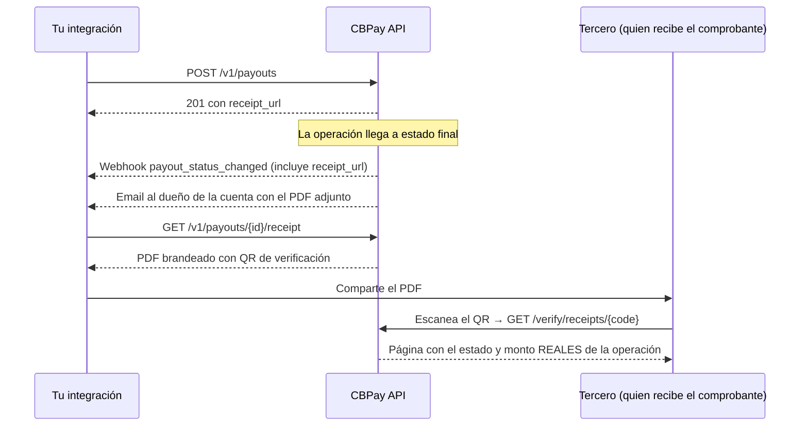

> **Ambientes:** Test `https://cryptobank.qbank.cl/platform` (`pk_test_...`) - Live `https://api.qbank.cl/platform` (`pk_...`).

Cada operación de tu cuenta — payouts, payins, transferencias, depósitos y
retiros crypto, conversiones y compras con tarjeta — tiene un **comprobante
PDF descargable** con la marca de la plataforma: logo, colores, estado de la
operación y un **código de verificación firmado con QR** que cualquier
persona puede consultar públicamente para confirmar que el documento es
auténtico.

No necesitas construir nada: toda respuesta y webhook de una operación
incluye su `receipt_url` listo para descargar, y al llegar a estado final el
comprobante también se envía **automáticamente por email** al dueño de la
cuenta (con opt-out).



## Descargar un comprobante

Todo recurso transaccional con `GET /{id}` tiene su `GET .../receipt`. El
PDF sale en español por defecto; agrega `?lang=en` para inglés.

| Operación | Endpoint |
|---|---|
| Payout | `GET /v1/payouts/{payoutID}/receipt` |
| Payin | `GET /v1/payins/{payinID}/receipt` |
| Transferencia interna | `GET /v1/transfers/{transferID}/receipt` |
| Retiro crypto | `GET /v1/crypto/withdrawals/{withdrawalID}/receipt` |
| Depósito crypto | `GET /v1/crypto/deposits/{depositID}/receipt` |
| Conversión (swap) | `GET /v1/swaps/{swapID}/receipt` |
| Compra con tarjeta | `GET /v1/cards/{cardID}/transactions/{transactionID}/receipt` |
| Operación bancaria | `GET /v1/banking/operations/{operationID}/receipt` |
| Envío desde wallet segregada | `GET /v1/segregated-wallets/{walletID}/sends/{sendID}/receipt` |
| Depósito en wallet segregada | `GET /v1/segregated-wallets/{walletID}/deposits/{depositID}/receipt` |

```bash
curl "https://api.qbank.cl/platform/v1/payouts/9b1deb4d-3b7d-4bad-9bdd-2b0d7b3dcb6d/receipt?lang=es" \
  -H "Authorization: Bearer $CBPAY_TOKEN" \
  -o comprobante.pdf
```

El `depositID` de los depósitos crypto viene en `GET /v1/crypto/transactions`
(campo `deposit_id` de cada depósito, junto a su `receipt_url`).

> **Nota**
Solo el dueño de la operación (o el admin de la organización) puede
descargar el comprobante: un ID ajeno responde `404 not_found`. El PDF
muestra los datos del beneficiario tal como los enviaste.
## `receipt_url` en respuestas y webhooks

No construyas las URLs a mano: toda respuesta de payout, payin,
transferencia, retiro, depósito, swap y transacción de tarjeta incluye
`receipt_url`, y los webhooks de estados finales
(`payout_status_changed`, `payin_credited`, `transfer_received`,
`crypto_deposit_credited`, `crypto_withdrawal_status_changed`,
`card_transaction`) también lo llevan en el payload.

```json
{
  "payout_id": "9b1deb4d-3b7d-4bad-9bdd-2b0d7b3dcb6d",
  "status": "completed",
  "local_amount": "800.00",
  "currency": "VES",
  "receipt_url": "https://api.qbank.cl/platform/v1/payouts/9b1deb4d-3b7d-4bad-9bdd-2b0d7b3dcb6d/receipt"
}
```

## Estados y marca de agua

El comprobante refleja el estado de la operación **al momento de la
descarga**:

| Estado de la operación | Badge | Marca de agua |
|---|---|---|
| `completed` / `credited` / `confirmed` | Verde "Completada" | No |
| `pending` / `processing` | Ámbar "En proceso" | Sí — "EN PROCESO" diagonal |
| `failed` / `declined` / `reversed` | Rojo "Fallida" | Sí — "FALLIDA" diagonal |

> **Importante**
Un comprobante con marca de agua **no es prueba de pago**: la operación aún
no se completó (o falló). Vuelve a descargarlo cuando llegue el webhook de
estado final y saldrá limpio.
## Verificación de autenticidad (QR)

Cada PDF lleva impreso un **código de verificación firmado** y su QR. El QR
abre una URL pública — sin credenciales — que responde con los datos
**reales y actuales** de la operación:

```bash
curl "https://api.qbank.cl/platform/verify/receipts/P9b1deb4d3b7d4bad9bdd2b0d7b3dcb6d16827185..."
```

```json
{
  "valid": true,
  "type": "payout",
  "status": "ok",
  "raw_status": "completed",
  "amount": "800.00 VES",
  "detail": "Venezuela — Pago Móvil",
  "date": "2026-07-11 15:29 UTC",
  "issued_by": "CBPay"
}
```

Si la misma URL se abre en un **navegador** (por ejemplo al escanear el QR
con el teléfono), redirige a la **página pública de seguimiento** — una
página hospedada estilo Wise con el estado en vivo, un timeline paso a paso
y la descarga del PDF. Ver [Link de seguimiento de transacciones](https://docs.cbpayapp.com/es/guias/seguimiento).

- La respuesta **nunca** incluye datos personales del beneficiario, cuentas
  ni direcciones: solo tipo, estado, monto y fecha.
- El código está firmado criptográficamente: uno adulterado o inventado
  responde `404` con `"valid": false`.
- La verificación muestra los datos **vigentes**: si alguien edita el PDF
  para inflar el monto, el QR lo delata al instante.
- El `verify_url` incluido en los payloads de comprobante y en los emails
  apunta directo a la página de seguimiento: quien lo recibe aterriza en la
  vista con timeline.

## Email automático con el comprobante

Cuando una operación llega a estado final (completada o fallida), el dueño
de la cuenta recibe un email con el PDF adjunto y el link de verificación.
Aplica a payouts, payins, transferencias enviadas, depósitos y retiros
crypto y conversiones (las compras con tarjeta no envían email, para no
saturar tu bandeja).

Para desactivarlo (o reactivarlo) por cuenta:

```bash
curl -X PATCH "https://api.qbank.cl/platform/v1/me" \
  -H "Authorization: Bearer $CBPAY_TOKEN" \
  -H "Content-Type: application/json" \
  -d '{"receipt_emails": false}'
```

## Errores propios

| HTTP | Código | Causa y solución |
|---|---|---|
| 404 | `not_found` | El ID no existe o no pertenece a tu cuenta. Verifica el ID en el listado del producto. |
| 429 | `too_many_attempts` | Demasiadas verificaciones públicas desde tu IP. Espera un momento y reintenta. |
| 500 | `receipt_render_failed` | Error transitorio generando el PDF. Reintenta la descarga. |

## FAQ

#### ¿El comprobante se genera una sola vez o puedo descargarlo cuando quiera?
    Cuantas veces quieras: se genera al vuelo con los datos vigentes de la
    operación. Por eso un comprobante descargado en `pending` sale con marca
    de agua y el mismo endpoint, después del webhook final, entrega la
    versión limpia.
#### ¿Puedo compartir el comprobante con el beneficiario o con un auditor?
    Sí — para eso existe. Quien lo reciba puede escanear el QR y confirmar
    contra la plataforma que el documento es auténtico y que el estado y el
    monto son los reales, sin necesidad de credenciales.
#### ¿Qué pasa si alguien edita el PDF?
    El PDF es solo la representación: la verdad vive en la plataforma. El QR
    y el código llevan una firma criptográfica ligada a la operación real; al
    consultarlos se muestran el monto y estado verdaderos, por lo que
    cualquier adulteración queda en evidencia.
#### ¿En qué idiomas está el comprobante?
    Inglés (`?lang=en`), español (`?lang=es`) y chino simplificado
    (`?lang=zh`). La página pública de seguimiento detecta el idioma del
    navegador del visitante automáticamente.
#### ¿Con qué marca sale el comprobante?
    Con el branding de la plataforma donde operas (logo, colores y datos de
    contacto del operador). La cartola PDF/Excel usa la misma identidad.
#### ¿El QR expira?
    No. El código verifica mientras exista la operación, y siempre responde
    su estado vigente.
- **Link de seguimiento de transacciones** - Cada comprobante tiene además una página pública de seguimiento compartible con timeline del estado en vivo — sin iniciar sesión.
