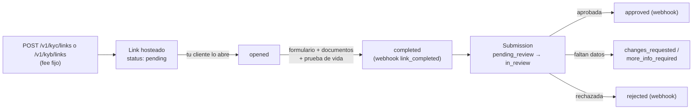
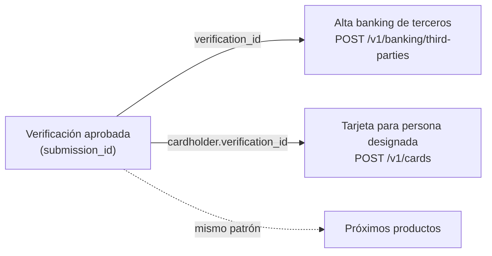

> **Ambientes:** Test `https://cryptobank.qbank.cl/platform` (`pk_test_...`) - Live `https://api.qbank.cl/platform` (`pk_...`).

La **verificación de identidad** comprueba que una persona (KYC) o empresa
(KYB) es quien dice ser, con evidencia real: formulario completo, subida de
documentos validados por OCR y **prueba de vida en video**. Tiene dos caras:

1. **Tu propia verificación (onboarding)** — obligatoria: hasta aprobarla,
   tu cuenta solo puede **fondear** (payins, depósitos crypto, recibir
   transferencias) y consultar. Persona ⇒ KYC; empresa ⇒ KYB.
2. **Verificación de tus clientes (solo cuentas empresa)** — generas links
   hosteados o envías los datos por API para verificar a tus propios
   clientes finales, con una comisión fija por verificación.



## Tu propia verificación (onboarding)

Al registrarte, tu cuenta nace sin verificar (`kyc_status: none`) y **solo
puede fondear y leer**. Cualquier acción de dinero saliente (payouts,
transferencias, retiros, banking, tarjetas) responde
`403 verification_required` hasta que apruebes.

### Pide tu link de verificación

```bash
curl -X POST https://api.qbank.cl/platform/v1/me/verification/link \
  -H "Authorization: Bearer <token>"
```

Respuesta `201` (si ya tienes un link vigente, se devuelve el mismo con
`200`):

```json
{
  "link_id": "a1b2c3d4-e5f6-4a7b-8c9d-0e1f2a3b4c5d",
  "kind": "kyc",
  "url": "https://…/on/usd/individual/new?invite=abc123…",
  "status": "pending",
  "label": "Ana Pérez",
  "created_at": "2026-07-10T12:00:00Z",
  "updated_at": "2026-07-10T12:00:00Z"
}
```

El `kind` sale de tu tipo de cuenta: persona ⇒ `kyc`, empresa ⇒ `kyb`. El
onboarding **no tiene costo** para ti.
### Completa el wizard

Abre la `url`: el wizard hosteado te guía por el formulario, la subida de
documentos (identidad, comprobante de domicilio; societarios para
empresas) y — en KYC — la prueba de vida en video frente a la cámara.
### Espera la revisión

Consulta tu estado cuando quieras:

```bash
curl https://api.qbank.cl/platform/v1/me/verification \
  -H "Authorization: Bearer <token>"
```

```json
{
  "kyc_status": "pending",
  "required_kind": "kyc",
  "verified": false,
  "link": { "link_id": "a1b2c3d4-…", "kind": "kyc", "url": "https://…", "status": "completed" },
  "submission": { "submission_id": "f0e1d2c3-…", "kind": "kyc", "status": "in_review", "liveness_pending": false }
}
```

Cuando compliance aprueba, tu `kyc_status` pasa a `approved`
**automáticamente** y todos los servicios se desbloquean (recibirás el
webhook `kyc_verification_status_changed` con `self_onboarding: true`).

La aprobación además **rellena el perfil de tu cuenta con la identidad
verificada**: `display_name` (persona = nombre + apellido; empresa = razón
social), `tax_id` y `country` se toman de la verificación y desde ese
momento quedan **inmutables** vía `PATCH /v1/me` (`409 identity_locked`) —
la identidad verificada es la fuente de verdad.
> **Nota**
Mientras esperas la aprobación puedes fondear con normalidad: payins en
todos los métodos, depósitos crypto y transferencias entrantes funcionan
desde el día uno. Si tu verificación es rechazada (`kyc_status: rejected`),
contacta a tu operador — puede pedirte reintentar con un link nuevo.
## Verificar a tus clientes (solo cuentas empresa)

Una cuenta **empresa** verificada puede verificar a sus propios clientes
finales. Cada verificación creada cobra la comisión fija configurada
(`kyc_verification` / `kyb_verification`; 0 = gratis), que se **reembolsa
automáticamente** si la creación falla. Las cuentas persona reciben
`403 company_account_required`.

### Opción A — Links hosteados (recomendada)

Tu cliente completa TODO en el wizard de marca blanca: formulario,
documentos y prueba de vida. Tú solo generas el link y esperas el webhook.

```bash Link KYC (persona)
curl -X POST https://api.qbank.cl/platform/v1/kyc/links \
  -H "Authorization: Bearer <token>" \
  -H "Content-Type: application/json" \
  -d '{
    "external_customer_id": "cust_123",
    "label": "Ana Pérez",
    "expires_in_days": 14,
    "idempotency_key": "kyc-link-cust-123-1"
  }'
```

```bash Link KYB (empresa, con país)
curl -X POST https://api.qbank.cl/platform/v1/kyb/links \
  -H "Authorization: Bearer <token>" \
  -H "Content-Type: application/json" \
  -d '{
    "external_customer_id": "cust_456",
    "country": "cl",
    "label": "Comercial Andina SpA",
    "expires_in_days": 14,
    "idempotency_key": "kyb-link-cust-456-1"
  }'
```

- `external_customer_id` (obligatorio): TU referencia del cliente
  verificado — la recibes de vuelta en cada webhook y consulta. Los valores
  `self` o terminados en `:self` están reservados para el onboarding de la
  cuenta y se rechazan con `400 invalid_payload`.
- `idempotency_key` (obligatoria): un retry con la misma clave devuelve el
  link original y **nunca cobra dos veces**.
- `country` (solo KYB): `us`, `cl`, `ve`, `br`, `mx`, `co`, `pe`, `bo`,
  `py`, `ar` o `generic` (con `generic_country` ISO alpha-2, ej. `"ES"`).
  El KYC individual no lleva país.
- `expires_in_days` (opcional, 1–30): sin enviarlo, el link no vence.

Respuesta `201`:

```json
{
  "link_id": "b2c3d4e5-f6a7-4b8c-9d0e-1f2a3b4c5d6e",
  "kind": "kyb",
  "external_customer_id": "cust_456",
  "url": "https://…/on/cl/business/new?invite=abc123…",
  "status": "pending",
  "country": "cl",
  "label": "Comercial Andina SpA",
  "expires_at": 1721209600,
  "verification_fee": "2.000000",
  "created_at": "2026-07-10T12:00:00Z",
  "updated_at": "2026-07-10T12:00:00Z"
}
```

Consulta e historial (todo POST tiene su GET):

```bash
# Listado con filtros
curl "https://api.qbank.cl/platform/v1/kyb/links?from=2026-07-01&to=2026-07-10&status=completed&page=1&page_size=50" \
  -H "Authorization: Bearer <token>"

# Detalle (estado vivo del link)
curl https://api.qbank.cl/platform/v1/kyb/links/{link_id} \
  -H "Authorization: Bearer <token>"
```

| Estado del link | Significado |
|---|---|
| `pending` | Creado, tu cliente aún no lo abre |
| `opened` | Tu cliente abrió el wizard |
| `completed` | Formulario enviado — nace la submission (webhook `kyb_link_completed` / `kyc_link_completed`) |
| `expired` | Venció sin completarse |

### Opción B — Datos por API

Si ya tienes los datos del cliente en tu sistema, créale la verificación
directo (sin wizard). La submission entra al mismo queue de revisión:

```bash
curl -X POST https://api.qbank.cl/platform/v1/kyc/submissions \
  -H "Authorization: Bearer <token>" \
  -H "Content-Type: application/json" \
  -d '{
    "external_customer_id": "cust_789",
    "idempotency_key": "kyc-sub-cust-789-1",
    "person": {
      "first_name": "Ana",
      "last_name": "Pérez",
      "email": "ana@ejemplo.com",
      "phone": "+56912345678",
      "nationality": "CHL",
      "date_of_birth": "1990-04-12",
      "tax_id": "12.345.678-5",
      "id_type": "id_card",
      "id_number": "12345678",
      "address": {
        "line1": "Av. Siempre Viva 123",
        "city": "Santiago",
        "state": "RM",
        "postal_code": "8320000",
        "country": "CHL"
      },
      "primary_purpose": "personal_or_living_expenses",
      "most_recent_occupation": "Engineer",
      "source_of_funds": "salary"
    }
  }'
```

Notas del modo datos:

- Países en **ISO alpha-3** (`CHL`, `USA`, `VEN`…); fechas `YYYY-MM-DD`;
  `id_type`: `passport | id_card | drivers_license`.
- KYB: body `{ external_customer_id, country?, business: {…}, ubos?,
  directors?, signers?, bank_info?, metadata? }` en
  `POST /v1/kyb/submissions`.
- **No se exige prueba de vida al crear**: la submission KYC queda con
  `liveness_pending: true` y la cierras con un [liveness
  link](#prueba-de-vida-liveness-link).
- Re-enviar con el mismo `external_customer_id` mientras la submission
  siga abierta (`pending_review`, `changes_requested`,
  `more_info_required`) **actualiza** la misma submission y no cobra de
  nuevo.

Respuesta `201`:

```json
{
  "submission_id": "c3d4e5f6-a7b8-4c9d-0e1f-2a3b4c5d6e7f",
  "kind": "kyc",
  "external_customer_id": "cust_789",
  "status": "pending_review",
  "liveness_pending": true,
  "verification_fee": "1.500000",
  "created_at": "2026-07-10T12:05:00Z",
  "updated_at": "2026-07-10T12:05:00Z"
}
```

Consulta e historial:

```bash
curl "https://api.qbank.cl/platform/v1/kyc/submissions?from=2026-07-01&to=2026-07-10&status=approved&page=1&page_size=50" \
  -H "Authorization: Bearer <token>"

curl https://api.qbank.cl/platform/v1/kyc/submissions/{submission_id} \
  -H "Authorization: Bearer <token>"
```

El detalle agrega lo que compliance pidió: `pending_documents`,
`rejection_reason`, `changes_requested_comments`; en KYC además
`liveness_pending` y `documents_received`; en KYB `aml_decision`.

| Estado de la submission | Significado |
|---|---|
| `pending_review` | Recibida, en cola de compliance |
| `in_review` | Compliance tomó el caso |
| `changes_requested` | Hay que corregir datos y re-enviar |
| `more_info_required` | Faltan documentos ([súbelos por API](#documentos-por-api)) |
| `escalated` | Caso escalado a revisión senior |
| `approved` / `approved_partial` | Aprobada (final) |
| `rejected` | Rechazada (final) |

### Documentos por API

Los documentos son opcionales al crear (si faltan, compliance los pedirá
con `more_info_required`). Flujo de 3 pasos:

### Presign

```bash
curl -X POST https://api.qbank.cl/platform/v1/kyc/submissions/{submission_id}/documents \
  -H "Authorization: Bearer <token>" \
  -H "Content-Type: application/json" \
  -d '{
    "category": "identity",
    "filename": "cedula.jpg",
    "content_type": "image/jpeg",
    "file_size": 482133
  }'
```

```json
{ "upload_url": "https://storage…", "key": "public-api/…", "expires_in": 900 }
```

Categorías — KYC: `identity`, `proofOfResidence`; KYB: `legalPresence`,
`ownershipStructure`, `controlStructure`, `companyDetails`. Tipos:
`application/pdf`, `image/png`, `image/jpeg`; máximo 15 MB; la URL vence en
15 minutos.
### Upload

`PUT` del binario directo a `upload_url` con el mismo `Content-Type`.
### Confirm

```bash
curl -X POST https://api.qbank.cl/platform/v1/kyc/submissions/{submission_id}/documents/confirm \
  -H "Authorization: Bearer <token>" \
  -H "Content-Type: application/json" \
  -d '{ "key": "public-api/…", "category": "identity", "filename": "cedula.jpg", "content_type": "image/jpeg" }'
```

```json
{ "status": "received", "ocr": "queued" }
```

Al confirmar se dispara la validación OCR; el resultado llega por el
webhook `kyc_document_validated` / `kyb_document_validated` y se consulta
con GET:

```bash
curl https://api.qbank.cl/platform/v1/kyc/submissions/{submission_id}/documents \
  -H "Authorization: Bearer <token>"
```

```json
{
  "items": [
    { "category": "identity", "status": "completed", "outcome": "MATCH", "score": 0.97, "summary": "Document matches the submitted identity", "filename": "cedula.jpg" }
  ],
  "meta": { "retrieved": 1 }
}
```

`outcome`: `MATCH` (coincide), `REVIEW` (revisión manual), `NO_MATCH`.
### Prueba de vida (liveness link)

Las submissions KYC creadas por datos nacen con `liveness_pending: true`
(la prueba de vida es un flujo de cámara en browser). Genera un link
mínimo hosteado para que tu cliente la complete:

```bash
curl -X POST https://api.qbank.cl/platform/v1/kyc/submissions/{submission_id}/liveness_link \
  -H "Authorization: Bearer <token>" \
  -H "Content-Type: application/json" \
  -d '{ "expires_in_days": 7 }'
```

```json
{ "url": "https://…/on/liveness/<token>", "status": "pending", "expires_at": 1751234567 }
```

- No cobra (el servicio se cobró al crear la submission). Si ya hay un
  link vigente, el POST devuelve el mismo; si la prueba ya fue superada,
  `400 liveness_already_completed`.
- `GET .../liveness_link` devuelve el último link y el estado del check
  (`{ "liveness": { "status", "outcome", "passed" } }`).
- Al pasar (outcome `PASS` o `REVIEW`): la submission limpia
  `liveness_pending` y llega el webhook `kyc_liveness_completed`.

## Una sola verificación para todo (identidad reutilizable)

La verificación aprobada de un cliente es su **identidad única** dentro de
CBPay: no vuelves a tipear sus datos ni a subir sus documentos en ningún
otro producto.



- **Banking para terceros**: `POST /v1/banking/third-parties` exige el
  `verification_id` de una verificación **aprobada** del tercero. El tipo
  (`INDIVIDUAL`/`COMPANY`) sale del kind (KYC ⇒ persona, KYB ⇒ empresa),
  los datos (nombre, email, dirección) se completan solos desde el perfil
  verificado, y los documentos ya validados se re-entregan automáticamente
  al proveedor bancario (`documents_synced` en la respuesta). Detalle en
  [Banking](https://docs.cbpayapp.com/es/guias/banking#usuarios-banking-de-terceros-solo-empresas).
- **Tarjetas para personas designadas**: `POST /v1/cards` con un
  `cardholder` de persona exige `cardholder.verification_id` de un **KYC
  aprobado** de esa persona. Identidad y documentos del titular salen de la
  verificación; solo agregas los campos propios del emisor (`occupation`,
  `salary_usd`). Detalle en [Tarjetas](https://docs.cbpayapp.com/es/guias/tarjetas).
- **Tu propia cuenta**: tu onboarding aprobado también se reutiliza — al
  crear tu banking customer o tu primera tarjeta, los datos y documentos
  faltantes se completan desde tu verificación.

Los campos explícitos de tu request **siempre ganan** sobre el autofill.

> **Importante**
Sin una verificación aprobada del tercero, el alta banking y la emisión de
tarjetas designadas responden `422 verification_required`. Verifica primero
(links hosteados o datos por API) y usa el `submission_id` aprobado como
`verification_id`.
## Informe de compliance (solo KYB)

Para cada verificación KYB puedes descargar el **informe de compliance
firmado** (PDF, evidencia para tus propios auditores):

```bash
curl -o report.pdf https://api.qbank.cl/platform/v1/kyb/submissions/{submission_id}/report \
  -H "Authorization: Bearer <token>"
```

Es gratuito (el servicio se cobró al crear la verificación).

## Informe de verificación (PDF + JSON)

Además del informe del procesador, cada submission KYC o KYB decidida tiene
su **informe de verificación** generado por la plataforma. Es el expediente
completo, no un resumen: identidad verificada (persona o empresa), perfil
económico declarado, declaraciones de riesgo, cuenta bancaria enmascarada,
ciclo de vida de la decisión, documentos con su validación documental, prueba
de vida, **partes relacionadas con su propio screening** (KYB) y screening
AML con el detalle de cada coincidencia — todo con hash de integridad y
código de verificación pública. Dos formatos (`?format=pdf|json`, default
`pdf`) y tres idiomas (`?lang=en|es|zh`, default `en`). Es gratuito: es la
lectura de una verificación ya pagada.

Secciones del informe:

| Sección | Contenido |
|---|---|
| Sujeto | Identidad verificada: persona (documento, nacionalidad, residencia fiscal, ocupación) o empresa (registro, constitución, jurisdicción, industria ISIC, sitio) |
| Perfil económico | Origen de fondos, propósito de la relación, volúmenes e ingresos esperados, redes esperadas |
| Declaraciones | Respuestas de riesgo declaradas (servicios monetarios, fondos de terceros, actividades de alto riesgo, países prohibidos) |
| Cuenta bancaria | Banco, titular y número **enmascarado en origen** (nunca completo) |
| Documentos | Categoría, archivo, estado, resultado de validación, score, fecha de validación y motivo de rechazo |
| Prueba de vida | Por rol (titular, UBO N): resultado, gate, scores de liveness / antispoofing / similitud facial |
| Partes relacionadas | Solo KYB: UBOs, personas de control y firmantes, cada una con identidad, participación, sus documentos, su liveness y **su propio screening AML** |
| Screening AML | Nivel de riesgo, indicadores, coincidencias con alias, listas de sanciones con fuente y vigencia, posiciones PEP, vínculos RCA y medios adversos |

### De tus terceros (cuentas empresa)

```bash
# PDF en español
curl -o informe.pdf "https://api.qbank.cl/platform/v1/kyb/submissions/{submission_id}/verification-report?lang=es" \
  -H "Authorization: Bearer <token>"

# JSON (mismo contenido que el PDF)
curl "https://api.qbank.cl/platform/v1/kyc/submissions/{submission_id}/verification-report?format=json" \
  -H "Authorization: Bearer <token>"
```

El informe de un tercero es **completo**: la sección AML incluye nivel de
riesgo, indicadores y coincidencias (nombres, listas de sanciones, PEP,
medios adversos). Tú realizas la diligencia sobre tu cliente y este informe
es tu evidencia.

Respuesta `format=json` (resumen del shape — el PDF sale del mismo modelo):

```json
{
  "report_id": "IDR-C3D4E5F6A7B8",
  "kind": "kyb",
  "scope": "third_party",
  "generated_at": "2026-07-27T19:04:11Z",
  "generated_by": "CBPay",
  "language": "es",
  "aml_detail": true,
  "submission_id": "c3d4e5f6-a7b8-4c9d-0e1f-2a3b4c5d6e7f",
  "external_customer_id": "cust_789",
  "status": "approved",
  "risk_band": "low",
  "aml_decision": "no_match",
  "subject": {
    "type": "company",
    "name": "Importadora Andina SpA",
    "company": {
      "legal_name": "Importadora Andina SpA",
      "registration_number": "77.123.456-7",
      "incorporation_date": "2019-04-12",
      "incorporation_country": "CHL",
      "website": "https://andina.example",
      "countries_of_operation": ["CL", "PE"]
    },
    "address": { "city": "Santiago", "country": "CL" },
    "registered_address": { "line1": "Av. Apoquindo 1234", "city": "Santiago", "country": "CL" },
    "industry": { "code": "G4690", "label": "Comercio al por mayor" },
    "economic_profile": {
      "source_of_funds": "business_revenue",
      "primary_purpose": "supplier_payments",
      "annual_revenue_usd": "250000",
      "monthly_payments_usd": "40000",
      "expected_chains": ["tron", "ethereum"]
    },
    "attestations": [
      { "key": "att_money_services", "value": false },
      { "key": "att_high_risk_activities", "items": [] }
    ],
    "bank_account": {
      "bank_name": "Banco de Chile",
      "account_holder": "Importadora Andina SpA",
      "account_masked": "****4321",
      "country": "CL",
      "currency": "CLP"
    }
  },
  "parties": [
    {
      "source": "ubo",
      "index": 0,
      "kind": "ubo",
      "name": "Javier Villablanca",
      "person": {
        "first_name": "Javier",
        "last_name": "Villablanca",
        "date_of_birth": "1985-03-04",
        "nationality": "CL",
        "id_type": "national_id",
        "id_number": "12345678-9"
      },
      "address": { "city": "Santiago", "country": "CL" },
      "ownership_percent": "60",
      "has_ownership": true,
      "has_control": true,
      "documents": [
        { "category": "uboIdentity:0", "status": "validated", "outcome": "MATCH", "party_index": 0 }
      ],
      "liveness": { "role": "ubo:0", "outcome": "PASSED", "passed_gate": true },
      "aml": {
        "screening_id": "d5f6a7b8-9c0d-4e1f-2a3b-4c5d6e7f8a9b",
        "risk_level": "no_risk",
        "sanctions": "clear",
        "pep": "clear",
        "adverse_media": "clear",
        "monitor": true,
        "matches_total": 0
      }
    }
  ],
  "documents": [
    {
      "category": "registration",
      "filename": "escritura.pdf",
      "status": "validated",
      "outcome": "MATCH",
      "score": "0.97",
      "validated_at": "2026-07-26T14:02:00Z"
    }
  ],
  "liveness": [
    { "role": "ubo:0", "outcome": "PASSED", "passed_gate": true, "liveness_score": "0.99" }
  ],
  "aml": {
    "screening_id": "b7e1c2d3-4f5a-6b7c-8d9e-0f1a2b3c4d5e",
    "risk_level": "no_risk",
    "status": "no_hits",
    "monitor": true,
    "screened_at": "2026-07-26T14:05:12Z",
    "sanctions": "clear",
    "pep": "clear",
    "adverse_media": "clear",
    "screening_result": "no_hits",
    "indicators": [
      { "key": "ind_sanctions", "hit": false },
      { "key": "ind_pep", "hit": false },
      { "key": "ind_adverse_media", "hit": false }
    ],
    "subject_rows": [
      { "key": "legal_name", "value": "Importadora Andina SpA" }
    ],
    "matches_total": 0
  },
  "content_sha256": "9f2b4c…",
  "verification_code": "Bc3d4e5f6a7b84c9d0e1f2a3b4c5d6e7f9f2b4c6d8e0a1b3c5d7",
  "verification_url": "https://api.qbank.cl/platform/verify/reports/Bc3d4e5f6a7b84c9d0e1f2a3b4c5d6e7f9f2b4c6d8e0a1b3c5d7"
}
```

> **Nota**
Si la verificación aún no tiene screening AML enlazado (verificaciones
antiguas), la primera descarga lo ejecuta automáticamente **sin costo**. Si
el screening no está disponible en ese momento, el informe sale igual con
`"partial": ["aml_unavailable"]` — la sección jamás se inventa.
### Partes relacionadas y su screening (KYB)

En una verificación de empresa, cada UBO, persona de control y firmante del
expediente sale como una entrada de `parties[]` con su identidad completa,
su participación, los documentos y la prueba de vida que le corresponden, y
**su propio screening AML con monitoreo continuo activado**. El par
`(source, index)` es la identidad estable de la parte dentro del expediente:
es lo que enlaza sus documentos (`uboIdentity:0`) y lo que hace que su
screening sea siempre el mismo, sin importar cuántas veces descargues el
informe.

El screening de las partes es **gratuito** (es una obligación de diligencia,
no un producto facturable) y queda bajo monitoreo: si un UBO entra a una
lista de sanciones después del alta, la alerta aparece sola.

> **Nota**
Si alguna parte todavía no tiene su screening al momento de la descarga, el
informe sale con `"partial": ["party_aml_unavailable"]` y el screening
faltante se ejecuta en segundo plano: la descarga siguiente ya lo trae.
### De tu propio onboarding

```bash
curl -o informe.pdf "https://api.qbank.cl/platform/v1/me/verification/report?lang=es" \
  -H "Authorization: Bearer <token>"
```

En el informe de tu propia verificación la sección AML va **agregada**
(`aml_detail: false`): verás el estado por categoría — `sanctions`, `pep` y
`adverse_media` como `clear` o `under_review` — sin el detalle de
coincidencias. Lo mismo aplica al screening de tus partes relacionadas: sus
secciones AML también van agregadas. El resto del expediente (identidad,
perfil económico, documentos, prueba de vida, partes) sale completo.

### Verificación pública del informe

Todo informe lleva un `verification_code` (impreso en el PDF junto a un QR).
Cualquiera puede confirmar su autenticidad sin credenciales:

```bash
curl "https://api.qbank.cl/platform/verify/reports/Bc3d4e5f6a7b84c9d0e1f2a3b4c5d6e7f9f2b4c6d8e0a1b3c5d7"
```

```json
{
  "valid": true,
  "type": "verification_report",
  "kind": "kyb",
  "status": "approved",
  "decision": "approved",
  "date": "2026-07-27",
  "issued_by": "CBPay"
}
```

La página pública confirma solo el tipo, el estado vigente de la decisión, la
fecha y la marca emisora — nunca datos del sujeto. En un navegador responde
una página HTML con tu marca.

## Webhooks

| Evento | Cuándo |
|---|---|
| `kyc_verification_status_changed` / `kyb_verification_status_changed` | La submission cambió de estado (todo el ciclo: recibida, en revisión, cambios pedidos, aprobada, rechazada…) |
| `kyc_link_completed` / `kyb_link_completed` | Tu cliente completó un link hosteado |
| `kyc_document_validated` / `kyb_document_validated` | Terminó el OCR de un documento subido por API |
| `kyc_liveness_completed` | La prueba de vida fue completada desde un liveness link |

Payload de ejemplo (`kyc_verification_status_changed`):

```json
{
  "account_id": "9b1deb4d-3b7d-4bad-9bdd-2b0d7b3dcb6d",
  "kind": "kyc",
  "event": "approved",
  "submission_id": "c3d4e5f6-a7b8-4c9d-0e1f-2a3b4c5d6e7f",
  "external_customer_id": "cust_789",
  "status": "approved",
  "risk_band": "low",
  "decision": "approved"
}
```

Tu propio onboarding llega con `"self_onboarding": true` en vez de
`external_customer_id`. Suscríbete igual que al resto de eventos (ver
[Webhooks](https://docs.cbpayapp.com/es/webhooks)).

## Costos (configurados por tu operador, pueden ser 0)

| Servicio | Cuándo se cobra |
|---|---|
| `kyc_verification` | Al crear un link o submission KYC de un tercero |
| `kyb_verification` | Al crear un link o submission KYB de un tercero |

El cargo sale de tu saldo de settlement predeterminado, se reembolsa si la
creación falla, y **tu propio onboarding nunca cobra**. Re-envíos de una
submission abierta y liveness links no cobran de nuevo.

## Errores

| HTTP | `error` | Causa | Solución |
|---|---|---|---|
| 400 | `idempotency_key_required` | POST de creación sin clave | Envía `idempotency_key` (body o header) |
| 400 | `invalid_payload` | Falta `external_customer_id` u otro campo requerido | Revisa el body |
| 400 | `liveness_already_completed` | La prueba de vida ya fue superada | Nada que hacer |
| 400 | `invalid_format` | `format` inválido al pedir un informe de verificación | Usa `pdf` o `json` |
| 400 | `invalid_language` | `lang` inválido al pedir un informe de verificación | Usa `en`, `es` o `zh` |
| 402 | `insufficient_funds` | Saldo insuficiente para la comisión | Fondea la cuenta y reintenta |
| 403 | `verification_required` | Tu cuenta aún no aprobó su propia verificación | Completa tu [onboarding](#tu-propia-verificacion-onboarding) |
| 403 | `company_account_required` | Una cuenta persona intentó verificar terceros | Solo cuentas empresa |
| 403 | `service_disabled` | El servicio `kyc` está deshabilitado para tu cuenta | Contacta a tu operador |
| 404 | `not_found` | El link/submission no existe o no es tuyo | Verifica el id |
| 404 | `verification_not_found` | Pediste tu informe self sin una verificación registrada | Completa tu onboarding primero |
| 409 | `already_verified` | Pediste link de onboarding con la cuenta ya aprobada | Nada que hacer |
| 503 | `verifications_unavailable` | Servicio temporalmente no disponible (la comisión se reembolsó) | Reintenta más tarde |

## Preguntas frecuentes

#### ¿Por qué no puedo hacer payouts recién registrado?
Toda cuenta debe aprobar su verificación de identidad antes de mover dinero
hacia afuera (es un requisito regulatorio). Mientras tanto puedes fondear
(payins, depósitos crypto, recibir transferencias) y explorar la API. Pide
tu link con `POST /v1/me/verification/link` y complétalo — la aprobación
desbloquea todo automáticamente.
#### ¿Qué diferencia hay entre links hosteados y datos por API?
Con links, tu cliente completa todo en el wizard (formulario + documentos +
prueba de vida) y tú no manejas datos sensibles. Con datos por API tú envías
los campos y subes documentos vía presign — útil si ya tienes tu propio
formulario — pero la prueba de vida igual requiere un liveness link (es un
flujo de cámara, no se puede hacer server-to-server).
#### ¿Cuándo se cobra la comisión y cuándo no?
Se cobra al CREAR un link o una submission de terceros (modo live). No
cobran: tu propio onboarding, los re-envíos de una submission abierta (mismo
external_customer_id), los liveness links, las consultas y los documentos.
Si la creación falla, la comisión se reembolsa sola.
#### ¿Por qué mi cuenta persona no puede crear links?
La verificación de terceros es una herramienta B2B para integradores
(cuentas empresa). Una cuenta persona solo necesita su propio onboarding,
que es gratis y va por /v1/me/verification.
#### Compliance pidió más documentos, ¿cómo los mando?
Recibirás `more_info_required` con `pending_documents` en el detalle de la
submission. Sube cada documento con el flujo presign → upload → confirm de
esta página; al confirmarse, la submission vuelve a la cola de revisión.
#### ¿Esto reemplaza al AML screening?
No: son productos complementarios. La verificación comprueba la identidad
con evidencia (documentos, video); el [AML screening](https://docs.cbpayapp.com/es/guias/aml)
contrasta la identidad contra listas de sanciones/PEP/prensa adversa y
puede vigilarla de forma continua.
#### ¿Puedo reusar la verificación de un cliente en otros productos?
Sí — ese es el diseño: una verificación aprobada sirve como identidad única.
Pasa su `submission_id` como `verification_id` al dar de alta un usuario
banking de tercero o al emitir una tarjeta para una persona designada: los
datos y documentos se completan solos. Ver
[identidad reutilizable](#una-sola-verificacion-para-todo-identidad-reutilizable).
