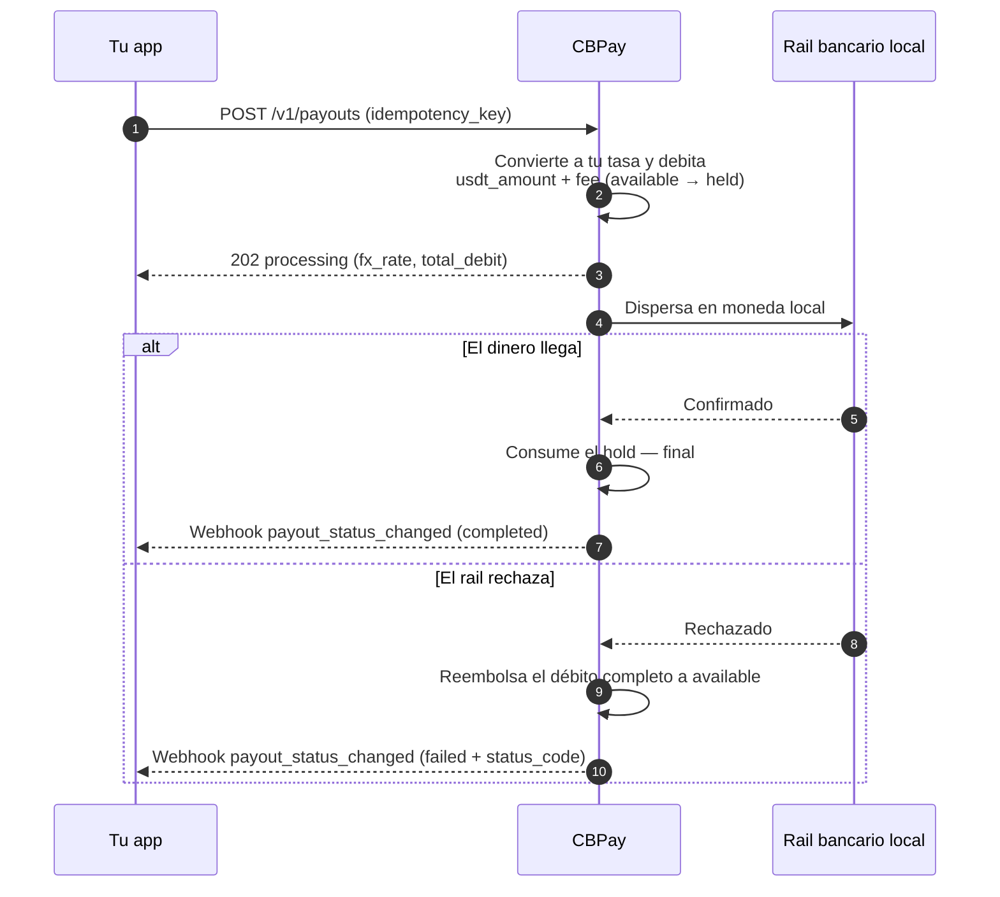

> **Ambientes:** Test `https://cryptobank.qbank.cl/platform` (`pk_test_...`) - Live `https://api.qbank.cl/platform` (`pk_...`).

Un payout envía dinero en moneda local a una cuenta bancaria del país
destino. El monto se convierte de moneda local a USDT con **la tasa de tu
cuenta** (la de `GET /v1/rates`) y se debita `usdt_amount + fee` (el fijo,
si está configurado) de tu saldo.

Así se ve el ciclo completo, incluido qué pasa con tu saldo en cada paso:



## 1. Descubre los corredores disponibles

Los países, monedas y métodos disponibles los define CBPay.
Consúltalos siempre por catálogo:

```bash
curl https://api.qbank.cl/platform/v1/payouts/methods \
  -H "Authorization: Bearer <token>"
```

```json
{
  "items": [
    { "country": "CL", "currency": "CLP", "method": "bank_transfer" },
    { "country": "PE", "currency": "PEN", "method": "bank_transfer" },
    { "country": "PE", "currency": "PEN", "method": "yape" },
    { "country": "BO", "currency": "BOB", "method": "qr" }
  ],
  "meta": { "retrieved": 4 }
}
```

Corredores y métodos disponibles:

| País | Moneda | Métodos |
|---|---|---|
| Chile | CLP | `bank_transfer` |
| Perú | PEN | `bank_transfer`, `yape` |
| México | MXN | `bank_transfer` (SPEI: CLABE o tarjeta de débito) |
| Venezuela | VES | `bank_transfer`, `pago_movil` |
| Bolivia | BOB / USD | `bank_transfer`, `qr` (ver [Payout QR](#payout-qr)) |
| Brasil | BRL | `pix` (por llave o a cuenta), `qr` (QR PIX — ver [Payout QR](#payout-qr)) |
| Ecuador | USD | `bank_transfer`, `deuna`, `cash_pickup`, `cnb` |
| Paraguay | PYG | `bank_transfer` |
| Argentina | ARS / USD | `bank_transfer` (CBU o CVU) |

La disponibilidad puede variar; el catálogo (`GET /v1/payouts/methods`) es
siempre la fuente de verdad. Si un país tiene un solo método, `method` es
opcional. Todos los métodos se cobran igual: tu tasa + fijo.

Para transferencias bancarias necesitas además el catálogo de bancos (de
ahí sale el `bank_code` del beneficiario):

```bash
curl "https://api.qbank.cl/platform/v1/payouts/banks?country=CL" \
  -H "Authorization: Bearer <token>"
```

```json
{
  "items": [
    { "code": "001", "name": "Banco de Chile" },
    { "code": "012", "name": "Banco del Estado de Chile" },
    { "code": "016", "name": "Banco de Crédito e Inversiones" }
  ],
  "meta": { "retrieved": 3 }
}
```

## 2. Crea el payout

```bash
curl -X POST https://api.qbank.cl/platform/v1/payouts \
  -H "Authorization: Bearer <token>" \
  -H "Content-Type: application/json" \
  -d '{
    "country": "MX",
    "currency": "MXN",
    "method": "bank_transfer",
    "amount": "1500.00",
    "beneficiary": {
      "name": "María López",
      "account_type": "clabe",
      "account_number": "012180001234567895"
    },
    "description": "Pago factura 8841",
    "idempotency_key": "factura-8841"
  }'
```

> **Importante**
`beneficiary` es un objeto de pares clave/valor cuyos campos requeridos
dependen del corredor (RUT y banco en Chile, CLABE en México, CCI en Perú,
llave PIX en Brasil, etc.). El catálogo de métodos documenta los campos de
cada uno.
> **Nota**
Cada payout guarda al beneficiario como [contacto](https://docs.cbpayapp.com/es/guias/contactos)
automáticamente (`"save_contact": false` para no guardarlo). Para repetirle
un pago sin re-tipear sus datos, envía `"beneficiary_contact_id"` en vez de
`beneficiary` — se usa su beneficiario guardado más reciente para ese país
y método (`422 no_saved_destination` si no tiene).
Respuesta `202 Accepted`:

```json
{
  "payout_id": "0d4f…",
  "account_id": "…",
  "idempotency_key": "factura-8841",
  "country": "MX",
  "currency": "MXN",
  "method": "bank_transfer",
  "local_amount": "1500.00",
  "fx_rate": "17.50",
  "usdt_amount": "85.714286",
  "fee": "0.300000",
  "total_debit": "86.014286",
  "settlement_asset": "USDT",
  "settlement_amount": "86.014286",
  "settlement_rate": "1",
  "status": "processing",
  "created_at": "2026-07-06T20:00:00Z"
}
```

En ese momento tu saldo ya refleja el débito: `total_debit` pasó de
`available` a `held` (en el saldo del `settlement_asset`).

### Pagar desde otro saldo (`settlement_asset`)

Por defecto el débito sale de tu asset de settlement predeterminado (USDT
salvo que lo cambies con `PUT /v1/settlement`). Para pagar una operación
puntual desde otro saldo, agrega `settlement_asset` al request. Ejemplo:
un payout de 100.000 CLP pagado desde el saldo BTC pasa por cuatro
transformaciones, todas registradas en la respuesta:

1. **CLP → USDT** a tu tasa: `100000 / 950.25 = 105.235465 USDT`.
2. **+ comisión fija**: `105.235465 + 0.30 = 105.535465 USDT` (`total_debit`).
3. **USDT → BTC** al precio efectivo de settlement (`settlement_rate`
   `109029.34070000`): `105.535465 / 109029.3407 = 0.00096795 BTC`
   (redondeo hacia arriba al satoshi).
4. **Débito y hold en BTC**: `settlement_amount` `0.00096795` sale de tu
   saldo BTC; el beneficiario recibe sus 100.000 CLP igual que siempre.

```json
{
  "country": "CL",
  "currency": "CLP",
  "local_amount": "100000",
  "fx_rate": "950.25",
  "usdt_amount": "105.235465",
  "fee": "0.300000",
  "total_debit": "105.535465",
  "settlement_asset": "BTC",
  "settlement_amount": "0.00096795",
  "settlement_rate": "109029.34070000",
  "status": "processing"
}
```

Si el payout falla, se reembolsa el `settlement_amount` exacto a tu saldo
BTC — nunca se re-cotiza. Si el precio de ejecución de BTC/GOLD no está
disponible en ese momento recibirás `503 pricing_unavailable`, y los
assets volátiles tienen un límite por operación
(`422 settlement_limit_exceeded`; consúltalo en `GET /v1/settlement`).

## 3. Recibe el estado final

Suscríbete al evento `payout_status_changed` ([webhooks](https://docs.cbpayapp.com/es/webhooks)):

```json
{
  "payout_id": "0d4f…",
  "account_id": "…",
  "country": "MX",
  "currency": "MXN",
  "local_amount": "1500.00",
  "usdt_amount": "85.714286",
  "total_debit": "86.014286",
  "status": "completed",
  "status_code": ""
}
```

- **`completed`**: el dinero llegó; el hold se consume.
- **`failed`**: se reembolsa el débito completo automáticamente
  (`payout_refund` en tu ledger).

También puedes consultar en cualquier momento:

```bash
curl https://api.qbank.cl/platform/v1/payouts/0d4f… \
  -H "Authorization: Bearer <token>"
```

### Estados del payout

| Estado | Significado | ¿Tu saldo? |
|---|---|---|
| `processing` | Aceptado y en ejecución en el rail local | Débito retenido en `held` |
| `completed` | El dinero llegó al beneficiario | Hold consumido — final |
| `failed` | El corredor lo rechazó o falló | **Reembolso automático completo** (monto + comisión) |

## Consulta e historial

Cada payout se puede leer individualmente y el listado acepta filtros:

```bash
# Un payout
curl https://api.qbank.cl/platform/v1/payouts/0d4f… \
  -H "Authorization: Bearer <token>"

# Historial con filtros: fechas, estado, país y paginación
curl "https://api.qbank.cl/platform/v1/payouts?from=2026-07-01&to=2026-07-08&status=failed&country=MX&page=1&page_size=50" \
  -H "Authorization: Bearer <token>"
```

```json
{
  "page": 1,
  "page_size": 50,
  "payouts": [
    {
      "payout_id": "0d4f…",
      "country": "MX",
      "currency": "MXN",
      "method": "bank_transfer",
      "local_amount": "1500.00",
      "fx_rate": "17.50",
      "usdt_amount": "85.714286",
      "fee": "0.300000",
      "total_debit": "86.014286",
      "status": "failed",
      "status_code": "core_rejected",
      "status_message": "beneficiary account does not exist",
      "created_at": "2026-07-06T20:00:00Z"
    }
  ]
}
```

`from`/`to` van en `YYYY-MM-DD` (UTC, ambos inclusive); una fecha inválida
responde `400 invalid_range`.

## Ejemplos por país

Cada corredor con su `beneficiary` exacto, el request completo y la
respuesta real. Las tasas (`fx_rate`) son ilustrativas — siempre aplican
las de tu cuenta en `GET /v1/rates`; el débito es `usdt_amount + fee`
(fijo, si está configurado; aquí `0.30`).

### Campos del beneficiary por corredor

| País | Método | Campos del `beneficiary` |
|---|---|---|
| CL | `bank_transfer` | `name`, `tax_id` (RUT), `bank_code`, `account_type`, `account_number` |
| PE | `bank_transfer` | `name`, `account_number` (CCI de 20 dígitos) |
| PE | `yape` | `name`, `phone` (`51XXXXXXXXX`) |
| MX | `bank_transfer` | `name`, `account_type` (`clabe`/`debit_card`), `account_number` (+ `bank_code` si es tarjeta) |
| VE | `pago_movil` | `phone`, `bank_code` (SUDEBAN), `document_value` |
| VE | `bank_transfer` | `name`, `account_number` (20 dígitos), `document_value` |
| BO | `bank_transfer` | `name`, `tax_id`, `bank_code`, `account_number` |
| BR | `pix` | `name`, `tax_id` + (`pix_key` y `pix_key_type`) o (`bank_code` ISPB, `branch_code`, `account_number`) |
| EC | `bank_transfer` | `name`, `document_value` (cédula), `sender_name`, `account_number` (+ `bank_code` y `account_type` si es a otro banco) |
| EC | `deuna` | `name`, `document_value`, `sender_name`, `phone` (celular de la billetera) |
| EC | `cash_pickup` / `cnb` | `name`, `document_value`, `sender_name` — el beneficiario retira con su documento |
| PY | `bank_transfer` | `name` (≤35), `tax_id`, `bank_code`, `account_number` |
| AR | `bank_transfer` | `name`, `tax_id` (CUIT/CUIL de 11 dígitos), `account_number` (CBU o CVU de 22 dígitos; USD solo CBU) |

#### Chile

Transferencia bancaria en CLP. Requiere RUT, banco y cuenta:

```bash
curl -X POST https://api.qbank.cl/platform/v1/payouts \
  -H "Authorization: Bearer <token>" \
  -H "Content-Type: application/json" \
  -d '{
    "country": "CL",
    "currency": "CLP",
    "method": "bank_transfer",
    "amount": "100000",
    "beneficiary": {
      "name": "Pedro Soto Fuentes",
      "tax_id": "12.345.678-5",
      "bank_code": "012",
      "account_type": "checking",
      "account_number": "123456789"
    },
    "description": "Pago proveedor",
    "idempotency_key": "cl-prov-0091"
  }'
```

```json
{
  "payout_id": "b3e1…",
  "country": "CL",
  "currency": "CLP",
  "method": "bank_transfer",
  "local_amount": "100000",
  "fx_rate": "925.69",
  "usdt_amount": "108.027528",
  "fee": "0.300000",
  "total_debit": "108.327528",
  "status": "processing"
}
```

El catálogo de bancos (`GET /v1/payouts/banks?country=CL`) da los
`bank_code` vigentes.

#### Perú

Dos métodos: transferencia bancaria (CCI interbancario) y **Yape** (al
número de teléfono).

```bash bank_transfer (CCI)
curl -X POST https://api.qbank.cl/platform/v1/payouts \
  -H "Authorization: Bearer <token>" \
  -H "Content-Type: application/json" \
  -d '{
    "country": "PE",
    "currency": "PEN",
    "method": "bank_transfer",
    "amount": "1000.00",
    "beneficiary": {
      "name": "Rosa Álvarez Díaz",
      "account_number": "00219300123456789012"
    },
    "idempotency_key": "pe-cci-3310"
  }'
```

```bash yape (teléfono)
curl -X POST https://api.qbank.cl/platform/v1/payouts \
  -H "Authorization: Bearer <token>" \
  -H "Content-Type: application/json" \
  -d '{
    "country": "PE",
    "currency": "PEN",
    "method": "yape",
    "amount": "150.00",
    "beneficiary": {
      "name": "Luis Ramos Vega",
      "phone": "51987654321"
    },
    "idempotency_key": "pe-yape-8874"
  }'
```

```json
{
  "payout_id": "c7a2…",
  "country": "PE",
  "currency": "PEN",
  "method": "yape",
  "local_amount": "150.00",
  "fx_rate": "3.40",
  "usdt_amount": "44.117648",
  "fee": "0.300000",
  "total_debit": "44.417648",
  "status": "completed"
}
```

En `yape` el teléfono va en formato `51XXXXXXXXX` (11 dígitos con código de
país). El resultado suele ser síncrono.

#### México

SPEI en MXN, a CLABE (18 dígitos) o a tarjeta de débito:

```bash CLABE
curl -X POST https://api.qbank.cl/platform/v1/payouts \
  -H "Authorization: Bearer <token>" \
  -H "Content-Type: application/json" \
  -d '{
    "country": "MX",
    "currency": "MXN",
    "method": "bank_transfer",
    "amount": "1500.00",
    "beneficiary": {
      "name": "María López",
      "account_type": "clabe",
      "account_number": "012180001234567895"
    },
    "idempotency_key": "mx-clabe-8841"
  }'
```

```bash Tarjeta de débito
curl -X POST https://api.qbank.cl/platform/v1/payouts \
  -H "Authorization: Bearer <token>" \
  -H "Content-Type: application/json" \
  -d '{
    "country": "MX",
    "currency": "MXN",
    "method": "bank_transfer",
    "amount": "800.00",
    "beneficiary": {
      "name": "Jorge Herrera",
      "account_type": "debit_card",
      "account_number": "4152313412341234",
      "bank_code": "40012"
    },
    "idempotency_key": "mx-card-1102"
  }'
```

```json
{
  "payout_id": "0d4f…",
  "country": "MX",
  "currency": "MXN",
  "method": "bank_transfer",
  "local_amount": "1500.00",
  "fx_rate": "17.50",
  "usdt_amount": "85.714286",
  "fee": "0.300000",
  "total_debit": "86.014286",
  "status": "processing"
}
```

Con CLABE el banco destino se deriva de los primeros dígitos; con tarjeta
es obligatorio `bank_code`.

#### Venezuela

Dos métodos: **Pago Móvil** (teléfono + banco + cédula) y transferencia
bancaria (cuenta de 20 dígitos):

```bash pago_movil
curl -X POST https://api.qbank.cl/platform/v1/payouts \
  -H "Authorization: Bearer <token>" \
  -H "Content-Type: application/json" \
  -d '{
    "country": "VE",
    "currency": "VES",
    "method": "pago_movil",
    "amount": "2000.00",
    "beneficiary": {
      "phone": "04141234567",
      "bank_code": "0102",
      "document_value": "V12345678"
    },
    "idempotency_key": "ve-pm-5567"
  }'
```

```bash bank_transfer
curl -X POST https://api.qbank.cl/platform/v1/payouts \
  -H "Authorization: Bearer <token>" \
  -H "Content-Type: application/json" \
  -d '{
    "country": "VE",
    "currency": "VES",
    "method": "bank_transfer",
    "amount": "5000.00",
    "beneficiary": {
      "name": "Carmen Delgado",
      "account_number": "01020123456789012345",
      "document_value": "V87654321"
    },
    "idempotency_key": "ve-bank-7810"
  }'
```

```json
{
  "payout_id": "e9b4…",
  "country": "VE",
  "currency": "VES",
  "method": "pago_movil",
  "local_amount": "2000.00",
  "fx_rate": "666.00",
  "usdt_amount": "3.003004",
  "fee": "0.300000",
  "total_debit": "3.303004",
  "status": "completed"
}
```

`bank_code` usa códigos SUDEBAN; en `bank_transfer` puede derivarse de los
primeros 4 dígitos de la cuenta.

#### Bolivia

Transferencia ACH en BOB o USD (además del
[payout QR](#payout-qr)):

```bash
curl -X POST https://api.qbank.cl/platform/v1/payouts \
  -H "Authorization: Bearer <token>" \
  -H "Content-Type: application/json" \
  -d '{
    "country": "BO",
    "currency": "BOB",
    "method": "bank_transfer",
    "amount": "1382.00",
    "beneficiary": {
      "name": "Juan Quispe Mamani",
      "tax_id": "4567890",
      "bank_code": "1016",
      "account_number": "1234567890"
    },
    "idempotency_key": "bo-ach-2204"
  }'
```

```json
{
  "payout_id": "f2c8…",
  "country": "BO",
  "currency": "BOB",
  "method": "bank_transfer",
  "local_amount": "1382.00",
  "fx_rate": "6.91",
  "usdt_amount": "200.000000",
  "fee": "0.300000",
  "total_debit": "200.300000",
  "status": "processing"
}
```

Para USD envía `currency: "USD"` con la misma estructura.

#### Brasil

PIX por llave (además del
[QR PIX](#payout-qr)):

```bash
curl -X POST https://api.qbank.cl/platform/v1/payouts \
  -H "Authorization: Bearer <token>" \
  -H "Content-Type: application/json" \
  -d '{
    "country": "BR",
    "currency": "BRL",
    "method": "pix",
    "amount": "350.00",
    "beneficiary": {
      "name": "João da Silva",
      "tax_id": "123.456.789-09",
      "pix_key_type": "cpf",
      "pix_key": "12345678909"
    },
    "idempotency_key": "br-pix-3321"
  }'
```

```json
{
  "payout_id": "a6d1…",
  "country": "BR",
  "currency": "BRL",
  "method": "pix",
  "local_amount": "350.00",
  "fx_rate": "5.13",
  "usdt_amount": "68.226121",
  "fee": "0.300000",
  "total_debit": "68.526121",
  "status": "processing"
}
```

`pix_key_type`: `cpf`, `cnpj`, `phone`, `email` o `evp` (llave aleatoria).

**PIX a cuenta (sin llave)** — si el beneficiario no tiene o no entrega su
llave PIX, envía sus datos bancarios; llega igual de rápido (mismo riel
PIX, 24/7):

```bash
curl -X POST https://api.qbank.cl/platform/v1/payouts \
  -H "Authorization: Bearer <token>" \
  -H "Content-Type: application/json" \
  -d '{
    "country": "BR",
    "currency": "BRL",
    "method": "pix",
    "amount": "350.00",
    "beneficiary": {
      "name": "Empresa Exemplo Ltda",
      "tax_id": "19.385.062/0001-20",
      "bank_code": "45678923",
      "branch_code": "1",
      "account_number": "765432",
      "account_type": "CACC"
    },
    "idempotency_key": "br-pix-acct-3322"
  }'
```

- `bank_code` es el **ISPB** del banco destino (8 dígitos), `branch_code`
  la agencia y `account_type` el tipo de cuenta (`CACC` corriente —
  default —, `SVGS` ahorro, `TRAN` cuenta de pago, `SLRY` salario).
- El estado final llega por el webhook `payout_status_changed`
  (conciliación continua contra el rail); consulta puntual con
  `GET /v1/payouts/{id}`.

#### Ecuador

Remesas en **USD** (1 a 10.000 por operación, máx. 2 decimales) con cuatro
métodos: transferencia bancaria, billetera **DE UNA** (por celular),
retiro en **ventanilla** (`cash_pickup`) y retiro en **corresponsal no
bancario** (`cnb`). Es un corredor de remesas: además del beneficiario, el
rail exige los datos del **ordenante** (quien envía), que van planos
dentro del mismo `beneficiary` con prefijo `sender_*`.

```bash bank_transfer (a cuenta)
curl -X POST https://api.qbank.cl/platform/v1/payouts \
  -H "Authorization: Bearer <token>" \
  -H "Content-Type: application/json" \
  -d '{
    "country": "EC",
    "currency": "USD",
    "method": "bank_transfer",
    "amount": "250.00",
    "beneficiary": {
      "name": "Carlos Andrade Vera",
      "document_value": "1712345678",
      "account_number": "2203456789",
      "sender_name": "Ana Torres Silva",
      "sender_document_value": "V23456789",
      "sender_country": "US"
    },
    "idempotency_key": "ec-bank-4471"
  }'
```

```bash deuna (billetera)
curl -X POST https://api.qbank.cl/platform/v1/payouts \
  -H "Authorization: Bearer <token>" \
  -H "Content-Type: application/json" \
  -d '{
    "country": "EC",
    "currency": "USD",
    "method": "deuna",
    "amount": "80.00",
    "beneficiary": {
      "name": "Lucia Paredes Mora",
      "document_value": "0923456781",
      "phone": "0998765432",
      "sender_name": "Ana Torres Silva"
    },
    "idempotency_key": "ec-deuna-5520"
  }'
```

```bash cash_pickup (ventanilla)
curl -X POST https://api.qbank.cl/platform/v1/payouts \
  -H "Authorization: Bearer <token>" \
  -H "Content-Type: application/json" \
  -d '{
    "country": "EC",
    "currency": "USD",
    "method": "cash_pickup",
    "amount": "120.00",
    "beneficiary": {
      "name": "Miguel Zambrano Loor",
      "document_value": "1309876543",
      "sender_name": "Ana Torres Silva"
    },
    "idempotency_key": "ec-cash-6612"
  }'
```

```bash cnb (corresponsal)
curl -X POST https://api.qbank.cl/platform/v1/payouts \
  -H "Authorization: Bearer <token>" \
  -H "Content-Type: application/json" \
  -d '{
    "country": "EC",
    "currency": "USD",
    "method": "cnb",
    "amount": "60.00",
    "beneficiary": {
      "name": "Rosa Cedeño Vera",
      "document_value": "0801234567",
      "sender_name": "Ana Torres Silva"
    },
    "idempotency_key": "ec-cnb-7703"
  }'
```

```json
{
  "payout_id": "9f3a…",
  "country": "EC",
  "currency": "USD",
  "method": "bank_transfer",
  "local_amount": "250.00",
  "fx_rate": "1",
  "usdt_amount": "250.000000",
  "fee": "0.300000",
  "total_debit": "250.300000",
  "status": "processing"
}
```

- Ecuador está dolarizado: la moneda local ES el USD (`fx_rate: "1"`).
- `document_value` es la cédula del beneficiario; `document_type` acepta
  `IDCD` (cédula, default), `CCPT` (pasaporte) o `TXID` (RUC).
- En `bank_transfer`, si omites `bank_code` la cuenta es del banco emisor
  del corredor; para **otro banco** envía el `bank_code` del catálogo
  (`GET /v1/payouts/banks?country=EC`) más `account_type`
  (`checking` o `savings`).
- Nombres estructurados opcionales (`given_name`, `middle_name`,
  `first_surname`, `second_surname` y sus pares `sender_*`): si los
  tienes, envíalos — mandan sobre la separación automática de `name`.
- El estado final llega por webhook `payout_status_changed`
  (con conciliación periódica de respaldo).

#### Paraguay

Transferencia bancaria en PYG:

```bash
curl -X POST https://api.qbank.cl/platform/v1/payouts \
  -H "Authorization: Bearer <token>" \
  -H "Content-Type: application/json" \
  -d '{
    "country": "PY",
    "currency": "PYG",
    "method": "bank_transfer",
    "amount": "500000",
    "beneficiary": {
      "name": "Sofía Benítez",
      "tax_id": "4123456",
      "bank_code": "0011",
      "account_number": "600123456"
    },
    "idempotency_key": "py-bank-9917"
  }'
```

```json
{
  "payout_id": "d4e7…",
  "country": "PY",
  "currency": "PYG",
  "method": "bank_transfer",
  "local_amount": "500000",
  "fx_rate": "6055.76",
  "usdt_amount": "82.566020",
  "fee": "0.300000",
  "total_debit": "82.866020",
  "status": "processing"
}
```

`name` acepta hasta 35 caracteres en este corredor.

#### Argentina

Transferencia bancaria en **ARS** o **USD** a cualquier **CBU o CVU** de
22 dígitos (cuentas bancarias y billeteras virtuales). No necesitas
`bank_code`: el CBU/CVU identifica el banco por sí solo.

```bash ARS (CBU o CVU)
curl -X POST https://api.qbank.cl/platform/v1/payouts \
  -H "Authorization: Bearer <token>" \
  -H "Content-Type: application/json" \
  -d '{
    "country": "AR",
    "currency": "ARS",
    "method": "bank_transfer",
    "amount": "50000.00",
    "beneficiary": {
      "name": "Julieta Fernandez",
      "tax_id": "27-23456789-1",
      "account_number": "2850590940090418135201"
    },
    "idempotency_key": "ar-ars-3311"
  }'
```

```bash USD (solo CBU)
curl -X POST https://api.qbank.cl/platform/v1/payouts \
  -H "Authorization: Bearer <token>" \
  -H "Content-Type: application/json" \
  -d '{
    "country": "AR",
    "currency": "USD",
    "method": "bank_transfer",
    "amount": "100.00",
    "beneficiary": {
      "name": "Julieta Fernandez",
      "tax_id": "27-23456789-1",
      "account_number": "2850590940090418135201"
    },
    "idempotency_key": "ar-usd-3312"
  }'
```

```json
{
  "payout_id": "b7c1…",
  "country": "AR",
  "currency": "ARS",
  "method": "bank_transfer",
  "local_amount": "50000.00",
  "fx_rate": "1250.00",
  "usdt_amount": "40.000000",
  "fee": "0.300000",
  "total_debit": "40.300000",
  "status": "completed"
}
```

- `tax_id` es el **CUIT/CUIL** del titular de la cuenta destino (11
  dígitos; los guiones se aceptan y se normalizan).
- **USD opera solo de cuenta bancaria a cuenta bancaria (CBU)**: una CVU
  (billetera virtual) no admite dólares — el payout se rechaza antes de
  enviarse.
- La mayoría de los payouts se confirma en la misma llamada
  (`status: "completed"`); si el rail queda en `processing`, el estado
  final llega por webhook `payout_status_changed`.
- Excepcional: el rail puede **reversar** una transferencia ya acreditada
  (por ejemplo, por orden del banco receptor). Si ocurre, el payout pasa a
  `failed`, el débito se reembolsa completo y recibes el webhook
  `payout_status_changed`.

## Payout QR

Pagar un QR de cobro (Bolivia, PIX de Brasil) ahora tiene su propia guía:

- **Payout QR** - Escanea el QR gratis, muestra a tu usuario los datos del destinatario y confirma el pago en una segunda llamada — se cobra como un payout normal.

## Errores frecuentes

| HTTP | `error` | Qué hacer |
|---|---|---|
| 400 | `idempotency_key_required` | Envía la clave en body o header |
| 400 | `beneficiary_required` | Incluye el objeto `beneficiary` |
| 402 | `insufficient_funds` | Fondea la cuenta; el payout no se creó |
| 403 | `account_blocked` | La cuenta no está activa; contacta al equipo de CBPay |
| 403 | `service_disabled` | Payouts no está habilitado para tu cuenta — ver [servicios](https://docs.cbpayapp.com/es/conceptos/servicios) |
| 403 | `compliance_hold` | El payout fue retenido por los controles de cumplimiento de la plataforma y NO se creó (sin débito). Por política no se informa la razón exacta — contacta a soporte con el timestamp; ver [errores](https://docs.cbpayapp.com/es/errores) |
| 422 | `currency_not_supported` | No hay tasa FX para esa moneda |
| 422 | (payout con `status: failed`) | El corredor rechazó los datos; el débito ya fue reembolsado — corrige `beneficiary` y reintenta con clave nueva |
| 503 | `channel_unavailable` | El canal de pago está temporalmente no disponible; reintenta más tarde con la MISMA `idempotency_key` |
| 503 | `compliance_check_unavailable` | La verificación de cumplimiento no se pudo evaluar; el payout NO se creó — reintenta con la MISMA `idempotency_key` |

## Rechazo inmediato vs fallo posterior

Si el procesador rechaza el payout al crearlo, recibes `422` con el objeto
en `status: failed` y el reembolso ya aplicado. Si falla después (por
ejemplo, cuenta destino inexistente detectada por el banco), te llega el
webhook con `status: failed` y el reembolso automático en ese momento.

### Cómo leer `status_code` en un payout fallido

| `status_code` | Significado | Acción |
|---|---|---|
| `core_rejected` | El procesador rechazó la operación al crearla (datos del beneficiario inválidos, corredor no disponible) | Lee `status_message`, corrige y crea un payout nuevo con clave nueva |
| `channel_unavailable` | El canal de pago quedó temporalmente no disponible | Reintenta más tarde; el reembolso (si hubo débito) ya está aplicado |
| *otro código* | Rechazo posterior del riel bancario (p. ej. cuenta destino cerrada) | Igual: corrige los datos y crea una operación nueva |
| *(vacío)* | Fallo genérico del corredor | Revisa `status_message`; si no es claro, contacta soporte con el `payout_id` |

En todos los casos el reembolso ya está aplicado — verifícalo con la
entrada `payout_refund` en
[movimientos](https://docs.cbpayapp.com/es/conceptos/movimientos-y-conciliacion).

> **Nota**
Un payout en `processing` no se puede cancelar por API: el rail ya lo tiene.
Espera el estado final por webhook o `GET` — llega siempre, con reembolso
automático si falla.
## FAQ

#### ¿Cuándo se debita mi saldo?
Al crear: el payout debita y retiene los fondos de inmediato. Si el payout
falla, el monto exacto debitado (comisión incluida) se reembolsa
automáticamente.
#### ¿Puedo cancelar un payout en processing?
No — una vez despachado al riel se resuelve solo a `completed` o `failed`.
Suscríbete a `payout_status_changed` para el estado final.
#### ¿Qué tasa FX usa mi payout?
La tasa cotizada al crear (devuelta como `fx_rate`), congelada para esa
operación. Tu spread acordado ya viene dentro de la tasa.
#### ¿Puedo pagar desde un saldo distinto de USDT?
Sí — fija un default por cuenta (`PUT /v1/settlement`) o sobreescribe por
payout con `settlement_asset` (USDC, BTC, GOLD). Los reembolsos devuelven
el monto liquidado exacto, jamás se re-cotizan.
#### ¿Qué significa compliance_hold (403)?
El beneficiario no pasó el screening de compliance: el payout **no** se
creó y tu `idempotency_key` no se consumió. Revisa los datos del
beneficiario o contacta a tu equipo CBPay.
#### ¿Cómo reintento sin riesgo tras un timeout o 5xx?
Reintenta con la **misma** `idempotency_key`: recibes el payout original
(`idempotency_hit: true`) — jamás un duplicado. Una clave nueva es un
payout nuevo e independiente.
