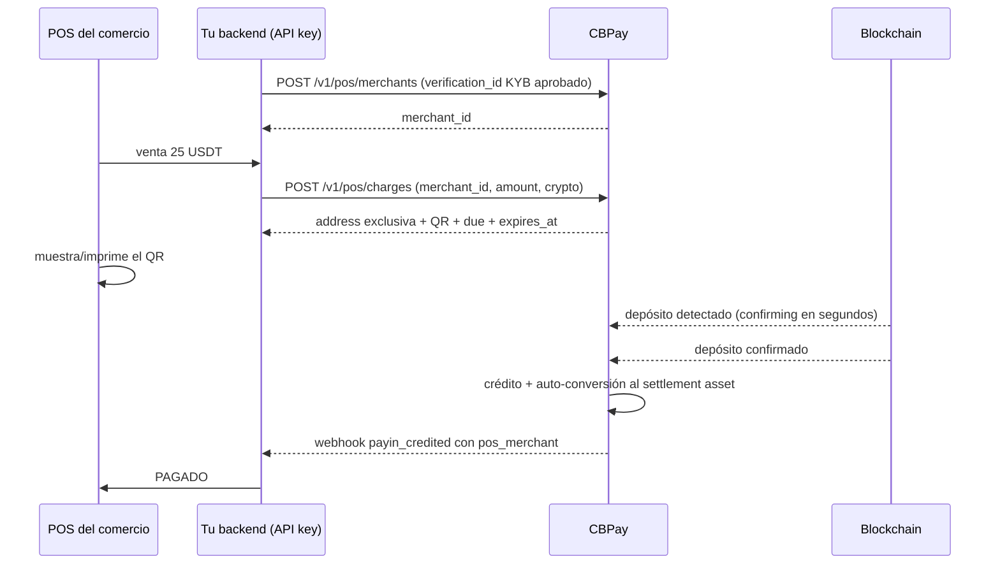

> **Ambientes:** Test `https://cryptobank.qbank.cl/platform` (`pk_test_...`) - Live `https://api.qbank.cl/platform` (`pk_...`).

QR Crypto POS es el producto para **procesadores y adquirentes con cuenta empresa**
que operan POS físicos: registras a tus comercios (restaurantes, hoteles,
tiendas) como *merchants* verificados y generas **cobros QR crypto con monto
exacto** (USDT, USDC, BTC). El POS muestra o imprime el QR, el cliente lo
escanea con su wallet o exchange, y la API detecta el pago on-chain: el saldo
se acredita a **tu cuenta** (convertido automático a tu settlement asset) con
la **atribución del merchant** en cada cobro — así sabes exactamente cuánto
recaudó cada comercio para repartirle después por cualquiera de los rieles
(transferencias, payouts fiat, crypto).

> **Nota**
QR Crypto POS está disponible para **cuentas empresa verificadas** con el servicio
`pos` habilitado. Cada cobro usa una **dirección exclusiva** (wallet efímera
del motor del [link de cobro universal](https://docs.cbpayapp.com/es/guias/checkout)):
no hay riesgo de cruzar pagos entre cobros.
## Flujo completo



## 1. Registra el merchant (una vez por comercio)

Cada merchant nace amarrado a una [verificación KYC/KYB de terceros](https://docs.cbpayapp.com/es/guias/kyc)
**aprobada** — la identidad del comercio sale de ahí, no se declara a mano.
Puedes fijarle una **comisión informativa** (`fee_percent` + `fee_fixed`):
no mueve dinero, pero la API la calcula en cada cobro pagado y el resumen te
dice el neto a repartirle.

```bash
curl -X POST "https://api.qbank.cl/platform/v1/pos/merchants" \
  -H "Authorization: Bearer $API_KEY" -H "Content-Type: application/json" \
  -d '{
    "verification_id": "9e2f41d0-6b3e-4b57-9d5c-2f2f0a97c001",
    "name": "Restaurant La Terraza",
    "external_ref": "resto-001",
    "fee_percent": "1",
    "fee_fixed": "0"
  }'
```

```json
{
  "merchant_id": "d2875683-fc80-4c7b-876a-fb585d7c6982",
  "account_id": "5138e8dd-64bd-43ef-aafe-8d9ef23bec9e",
  "name": "Restaurant La Terraza",
  "verification_id": "9e2f41d0-6b3e-4b57-9d5c-2f2f0a97c001",
  "external_ref": "resto-001",
  "fee_percent": "1",
  "fee_fixed": "0",
  "status": "active",
  "created_at": "2026-07-17T19:40:00Z",
  "updated_at": "2026-07-17T19:40:00Z"
}
```

Consulta con `GET /v1/pos/merchants` (paginado) y `GET /v1/pos/merchants/{id}`.
Con `PATCH /v1/pos/merchants/{id}` cambias `status` (`active`/`disabled` — un
merchant deshabilitado no puede generar cobros nuevos), la comisión y el
`external_ref`. La identidad no se edita: viene de la verificación.

## 2. Genera el cobro (uno por venta)

El contrato es el mismo del link de cobro universal: el monto se expresa en
tu `settlement_asset` (el default de tu cuenta si no lo mandas) y el **due
que paga el cliente se cotiza en el crypto del QR** al momento de crear el
cobro — si el cliente paga en un asset distinto al tuyo, la conversión ya
está incluida en el due (tú recibes tu meta exacta).

```bash
curl -X POST "https://api.qbank.cl/platform/v1/pos/charges" \
  -H "Authorization: Bearer $API_KEY" -H "Content-Type: application/json" \
  -d '{
    "merchant_id": "d2875683-fc80-4c7b-876a-fb585d7c6982",
    "amount": "25",
    "crypto": "tron:usdt",
    "reference": "TICKET-0451",
    "expires_in": 900,
    "idempotency_key": "pos-0451-1"
  }'
```

```json
{
  "charge_id": "66773a3a-9911-4482-ae3c-09a481aba018",
  "payin_id": "bd3d88ca-af9c-4c05-a6f8-0982a2d187d5",
  "status": "pending",
  "amount": "25",
  "settlement_asset": "USDT",
  "crypto": "tron:usdt",
  "chain": "tron",
  "asset": "USDT",
  "address": "TC5SToDEigQtie7Crf9et7ui7zDsvdDHeG",
  "due": "25.000000",
  "received": "0.000000",
  "qr_payload": "TC5SToDEigQtie7Crf9et7ui7zDsvdDHeG",
  "qr_png_base64": "iVBORw0KGgo…",
  "merchant": { "id": "d2875683-…", "name": "Restaurant La Terraza", "external_ref": "resto-001" },
  "reference": "TICKET-0451",
  "expires_at": "2026-07-17T19:55:00Z",
  "receipt_url": "https://api.qbank.cl/platform/v1/payins/bd3d88ca-…/receipt",
  "created_at": "2026-07-17T19:40:00Z"
}
```

- `crypto`: `tron:usdt`, `eth:usdt`, `eth:usdc` o `btc:btc`.
- `expires_in`: 300–86400 segundos (default 900). Cotizaciones con BTC se
  congelan 15 minutos (`quote_expires_at`).
- `idempotency_key` es **obligatoria**: el retry con la misma clave devuelve
  el MISMO cobro y la MISMA dirección (`idempotency_hit: true`) — jamás se
  abre un segundo cobro por un reintento del POS.
- El **QR es la dirección cruda** (compatible con Binance y todas las
  wallets); imprime el `due` al lado.

> **Tip**
Para volumen de POS recomendamos **TRON/USDT** como riel primario: confirma
en ~1 minuto y con los costos de red más bajos. BTC confirma en ~30 minutos —
útil para tickets altos, no para café.
## 3. Detecta el pago (polling o webhook)

**Polling del POS**: `GET /v1/pos/charges/{charge_id}` cada pocos segundos.
Apenas el depósito aparece on-chain (2-3 s típicos, ANTES de confirmar), la
respuesta trae la **detección temprana**:

```json
{
  "charge_id": "66773a3a-…",
  "status": "pending",
  "confirming": true,
  "detected_amount": "25.000000",
  "due": "25.000000",
  "received": "0.000000"
}
```

`confirming` es señal de UX ("pago detectado, confirmando…") — el crédito
real llega SOLO con la confirmación on-chain: `status` pasa a `paid`,
`received` refleja lo acumulado y `paid_at` queda estampado.

**Webhook** (recomendado para marcar la venta): `payin_credited` llega con el
bloque de atribución:

```json
{
  "event_type": "payin_credited",
  "data": {
    "payin_id": "bd3d88ca-…",
    "kind": "pos",
    "settled_via": "crypto:tron:usdt",
    "crypto_amount": "25.000000",
    "settlement_asset": "USDT",
    "asset_amount": "25",
    "pos_merchant": { "id": "d2875683-…", "name": "Restaurant La Terraza", "external_ref": "resto-001" },
    "receipt_url": "…"
  }
}
```

### Estados del cobro

| Estado | Significado | Qué hacer |
|---|---|---|
| `pending` | Esperando el pago | El POS sigue mostrando el QR |
| `pending` + `confirming: true` | Depósito detectado, confirmando on-chain | Mostrar "pago detectado" (TRON ~1 min, ETH minutos, BTC ~30 min) |
| `paid` | Meta alcanzada y acreditada a tu saldo | Cerrar la venta; el auto-swap a tu settlement asset corre solo |
| `expired` | Venció sin completar el pago | Generar un cobro nuevo si el cliente aún quiere pagar |

**Pagos parciales**: se acumulan (`received`) hasta la meta; `paid` solo al
completarla. **Pagos tardíos**: si la plata llega DESPUÉS de expirar, se
acredita igual a tu cuenta (la dirección sigue viva) y el webhook se emite —
`received` del cobro expirado lo refleja para que concilies, jamás se pierde
un pago real. **Sobrepagos** (propinas): también se acreditan.

## 4. Concilia y reparte por merchant

`GET /v1/pos/charges?from=…&to=…&merchant_id=…` lista los cobros de cada
comercio (filtros `merchant_id`, `status`; paginación estándar).

`GET /v1/pos/summary?from=…&to=…` entrega el agregado POR MERCHANT — la vista
para liquidar con cada cliente:

```bash
curl "https://api.qbank.cl/platform/v1/pos/summary?from=2026-07-01&to=2026-07-17" \
  -H "Authorization: Bearer $API_KEY"
```

```json
{
  "from": "2026-07-01", "to": "2026-07-17",
  "merchants": [
    {
      "merchant_id": "d2875683-…",
      "name": "Restaurant La Terraza",
      "external_ref": "resto-001",
      "charges_count": 214,
      "paid_count": 201,
      "fee_percent": "1",
      "fee_fixed": "0",
      "totals": [
        { "settlement_asset": "USDT", "gross": "5025.000000", "processor_fee": "50.250000", "net_for_merchant": "4972.750000" }
      ],
      "refunded": [ { "asset": "USDT", "amount": "2.000000" } ]
    }
  ]
}
```

`gross` es lo recaudado (la meta de los cobros pagados), `processor_fee` tu
comisión configurada en el merchant, y `net_for_merchant` lo que le debes
repartir (devoluciones en el mismo asset ya descontadas). El reparto lo haces
con los rieles existentes: [transferencias](https://docs.cbpayapp.com/es/guias/transferencias),
[payouts fiat](https://docs.cbpayapp.com/es/guias/payouts) o [retiros crypto](https://docs.cbpayapp.com/es/guias/crypto).

## 5. Devoluciones

`POST /v1/pos/charges/{charge_id}/refund` devuelve (parte de) lo recibido al
pagador como un **retiro crypto normal** desde tu saldo — con hold, fee de
retiro y todos los controles de compliance del riel.

```bash
curl -X POST "https://api.qbank.cl/platform/v1/pos/charges/66773a3a-…/refund" \
  -H "Authorization: Bearer $API_KEY" -H "Content-Type: application/json" \
  -d '{
    "amount": "25",
    "to_address": "TXHkw6bYtL2j…",
    "idempotency_key": "pos-ref-0451-1"
  }'
```

```json
{
  "refund_id": "b92b1ac0-…",
  "charge_id": "66773a3a-…",
  "withdrawal_id": "4630fe8c-…",
  "amount": "25.000000",
  "asset": "USDT",
  "to_address": "TXHkw6bYtL2j…",
  "status": "processing",
  "tx_id": "SIMTX…",
  "created_at": "2026-07-17T20:01:00Z"
}
```

Reglas clave:

- **`to_address` es siempre explícita.** Nunca devolvemos automático a la
  dirección de origen: puede ser la hot wallet de un exchange donde tu
  cliente no controla esa dirección (la plata se perdería). Pídele la
  dirección de devolución y confírmala; los `from_address` recibidos quedan
  en el detalle del cobro como referencia.
- **Tope duro**: la suma de devoluciones de un cobro jamás puede superar lo
  recibido (`422 refund_exceeds_received`), incluso con requests
  concurrentes.
- Aplica sobre cualquier cobro **con pago recibido** — incluido un cobro
  expirado que recibió un pago tardío (el caso más común de devolución).
- El monto se devuelve en el **crypto del cobro**: como el pago se convirtió
  a tu settlement asset, necesitas saldo en ese crypto (haz un
  [swap](https://docs.cbpayapp.com/es/guias/swaps) de vuelta si te falta; el error es
  `insufficient_funds`).
- El estado sigue el ciclo del retiro (`pending` → `processing` →
  `completed`/`failed`; un retiro fallido reembolsa tu débito y libera el
  tope). Consulta con `GET /v1/pos/charges/{id}/refunds`.

## Errores propios

| HTTP | Código | Solución |
|---|---|---|
| 422 | `verification_required` | Registra al merchant con el `verification_id` de su KYC/KYB de terceros aprobado |
| 422 | `verification_not_approved` | Espera la aprobación de la verificación (o revisa su estado) antes de registrar el merchant |
| 422 | `merchant_disabled` | Reactiva el merchant (`PATCH status: "active"`) antes de generar cobros |
| 400 | `idempotency_key_required` | Manda `idempotency_key` en el cobro y en la devolución (body o header `Idempotency-Key`) |
| 400 | `invalid_request` | `crypto` debe ser `tron:usdt`, `eth:usdt`, `eth:usdc` o `btc:btc`; `expires_in` entre 300 y 86400 |
| 503 | `pricing_unavailable` | El precio del crypto no está en grado de liquidación (BTC); reintenta en un momento |
| 422 | `nothing_received` | El cobro no ha recibido ningún pago on-chain: no hay nada que devolver |
| 422 | `refund_exceeds_received` | Baja el monto: recibido − ya devuelto es el máximo |
| 400 | `to_address_required` | Manda la dirección de devolución explícita (jamás se auto-devuelve al origen) |
| 402 | `insufficient_funds` | Te falta saldo en el crypto del cobro para la devolución: haz un swap de vuelta primero |
| 403 | `company_required` | QR Crypto POS es para cuentas empresa |

## FAQ

#### ¿Cuánto demora en confirmar el pago en el POS?
La detección temprana (`confirming: true`) aparece en 2-3 segundos. La
confirmación final depende de la red: TRON ~1 minuto, Ethereum unos minutos,
Bitcoin ~30 minutos. Tú decides si liberas la venta con `confirming` (riesgo
tuyo) o esperas el `paid`. Para POS recomendamos TRON/USDT.
#### ¿Puedo imprimir el QR en papel?
Sí — `qr_png_base64` está listo para imprimir y `qr_payload` es la dirección
cruda por si tu POS genera el QR localmente. Imprime el `due` y la red al
lado: el cliente debe enviar el monto exacto por la red correcta.
#### ¿Qué pasa si el cliente paga menos, más, o tarde?
Menos: el cobro queda `pending` acumulando (`received`) hasta la meta. Más
(propina): el excedente también se acredita. Tarde (después de expirar): se
acredita igual con su webhook — el detalle del cobro expirado muestra el
`received` para que concilies. Nunca se pierde un pago real.
#### ¿El dinero queda a nombre del restaurant?
No — todo se acredita a TU cuenta (el procesador), convertido a tu settlement
asset. La atribución por merchant (cobros, webhooks y summary) te dice
exactamente cuánto corresponde a cada comercio para que le repartas por el
riel que prefieras.
#### ¿Qué comisiones aplican?
Cada pago acreditado paga el fee de `funding` de tu cuenta (porcentual +
fijo) y, si el asset pagado difiere de tu settlement asset, la conversión
automática con su spread. La comisión por merchant (`fee_percent`/`fee_fixed`)
es tuya con tu cliente: informativa, no la cobramos nosotros.
#### ¿Un POS puede consultar el estado directo contra CBPay?
En esta versión el POS habla con TU backend y tu backend consulta con tu API
key (una máquina física no debe guardar tu key). Si necesitas POS sin backend
propio, cuéntanos: un token público de solo-lectura por cobro está en el
roadmap.
