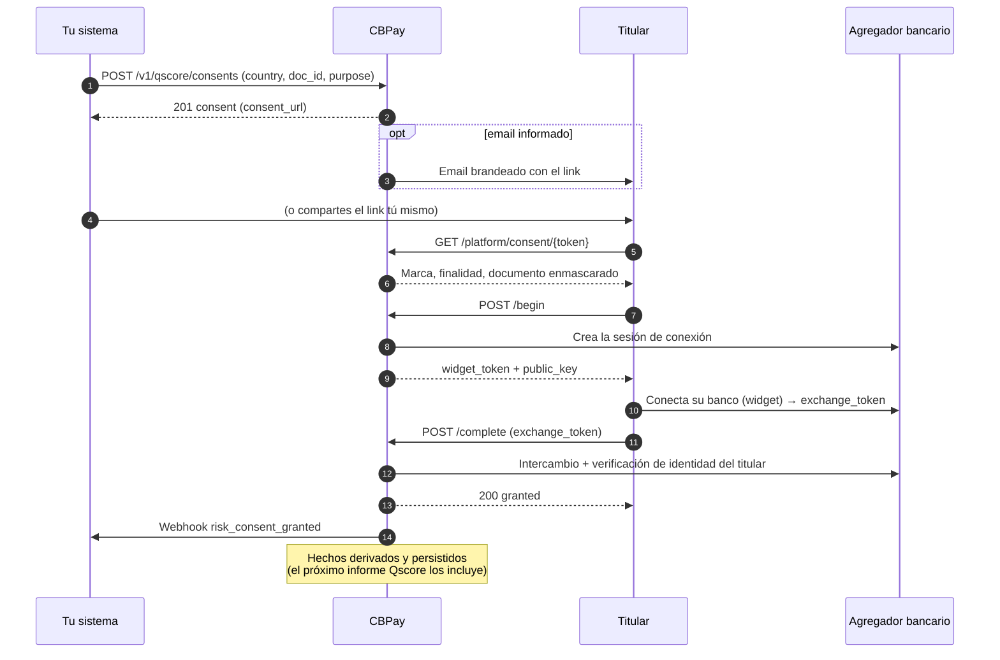

## Qué es y cuándo usarlo

Un **link de consentimiento** es una URL que creas para un sujeto (una persona o empresa identificada por su documento) para que el **titular** autorice el acceso de lectura a sus datos bancarios a través de un flujo de conexión seguro. Cuando el titular lo otorga, CBPay deriva **hechos positivos** (cuentas, saldos, actividad de ingresos y gastos de los últimos 90 días) y los alimenta al historial crediticio del sujeto — el Qscore los refleja en el próximo informe.

Úsalo cuando el sujeto tiene poco o ningún historial crediticio y su actividad bancaria es la mejor evidencia de su capacidad real de pago — por ejemplo un arrendatario sin registro en buró, o un proveedor que pide mejores condiciones comerciales.

- **Tú** creas el link (opcionalmente enviado por correo al titular, con el branding de tu organización).
- **El titular** lo abre, ve tu marca y la finalidad declarada, conecta su banco por el widget seguro y confirma — o rechaza.
- **CBPay** valida que el documento verificado por el banco calce **exactamente** con el `doc_id` del sujeto (una cuenta de OTRO documento jamás otorga el consentimiento), deriva los hechos y te notifica por webhook.

> **Ambientes:** Test `https://cryptobank.qbank.cl/platform` (`pk_test_...`) - Live `https://api.qbank.cl/platform` (`pk_...`).

## Cómo funciona el flujo



El link es una **URL de capacidad**: el token de 128 bits que lleva ES la autorización para verlo y decidirlo. Funciona sin login, solo muestra tu marca, la finalidad y el documento enmascarado del titular (últimos 4 caracteres), y vence al cumplirse el TTL que elijas (7 días por defecto, 30 máximo).

## Paso a paso

### Crea el link de consentimiento

`POST /v1/qscore/consents` — exige el service flag `risk` y una cuenta verificada. La `idempotency_key` es **obligatoria**: el create envía un correo cuando informas `email`, y un retry con la misma clave devuelve el consent original con `idempotency_hit: true` en vez de crear un duplicado.

```json Request
{
  "country": "CL",
  "doc_id": "11111111-1",
  "subject_type": "person",
  "purpose": "tenant_screening",
  "email": "maria.torres@example.cl",
  "expires_in_days": 7,
  "idempotency_key": "consent-maria-torres-2026-08-09"
}
```

```json Response 201
{
  "consent_id": "9f2c1ab4-7d3e-4c1a-8f55-2b9e0c4d6a71",
  "subject_id": "5d2a8f19-3b7c-4e92-a1d4-6c8b0f2e5a93",
  "channel": "link",
  "status": "pending",
  "purpose": "tenant_screening",
  "consent_url": "https://api.qbank.cl/platform/consent/cns_3f8a1c94e2b745109d6f8a0c2e5b7d19",
  "email": "maria.torres@example.cl",
  "created_at": "2026-08-09T14:32:10Z",
  "updated_at": "2026-08-09T14:32:10Z",
  "expires_at": "2026-08-16T14:32:10Z"
}
```

- `country` — ISO alpha-2, requerido. Cobertura hoy: `CL`.
- `doc_id` — requerido, validado con el dígito verificador del país (RUT chileno, ej. `11111111-1`).
- `subject_type` — `person` o `company`; se infiere del documento si lo omites.
- `purpose` — requerido: `credit_evaluation`, `tenant_screening`, `hiring`, `supplier_onboarding` u `other`. La ley de protección de datos exige declararlo. `self_access` se **rechaza** aquí — tu propio informe va por `POST /v1/qscore/my-report`.
- `email` — opcional; si viene, el titular recibe el link en un correo brandeado de tu organización.
- `expires_in_days` — opcional; default 7, máximo 30.

Comparte el `consent_url` con el titular (o deja que el correo lo entregue).
### El titular abre el link

La página pública primero carga `GET /platform/consent/{token}` (sin autenticación) para mostrar tu marca, la finalidad declarada y el documento enmascarado:

```json Response 200
{
  "status": "pending",
  "purpose": "tenant_screening",
  "country": "CL",
  "subject_type": "person",
  "doc_id": "******11-1",
  "org": {
    "name": "Arriendos del Sur",
    "website": "https://arriendosdelsur.cl",
    "logo_url": "https://cdn.cbpayapp.com/org/arriendos-del-sur/logo.png"
  },
  "expires_at": "2026-08-16T14:32:10Z"
}
```

La vista pública jamás expone el email del titular, el documento completo, IDs internos ni el propio token.
### El titular conecta su banco

Al elegir **Autorizar** se llama `POST /platform/consent/{token}/begin`, que abre una sesión segura de conexión bancaria:

```json Response 200
{
  "widget_token": "wgt_6f1c9a2d8e4b4c0a9f3d5e7b1a2c4d6e",
  "public_key": "wpk_9d8c7b6a5f4e3d2c1b0a9f8e7d6c5b4a",
  "expires_at": "2026-08-09T14:47:10Z"
}
```

La página monta el widget bancario con esas credenciales; el titular se autentica con su banco y autoriza la conexión. El widget devuelve un `exchange_token` a la página.
### El consentimiento queda otorgado

La página envía `POST /platform/consent/{token}/complete` con el `exchange_token`:

```json Request
{ "exchange_token": "ext_2b4d6f8a0c1e3a5c7e9b1d3f5a7c9e1b" }
```

```json Response 200
{
  "status": "granted",
  "granted_at": "2026-08-09T14:46:02Z",
  "holder_name": "María Torres"
}
```

Antes de sellar el otorgamiento, CBPay verifica dos cosas y rechaza en caso contrario:

- la conexión bancaria está `active` — si no, `409 link_inactive`;
- el documento verificado por el banco calza **exactamente** con el `doc_id` del sujeto (ambos normalizados) — si no, `409 holder_mismatch`.

Una vez otorgado, CBPay deriva los hechos positivos en background y emite el webhook `risk_consent_granted`.
### Sigue el consentimiento

```bash
curl "https://api.qbank.cl/platform/v1/qscore/consents?status=pending&from=2026-08-01&to=2026-08-31&page=1&page_size=50" \
  -H "Authorization: Bearer pk_live_..."
```

```json Response 200
{
  "consents": [
    {
      "consent_id": "9f2c1ab4-7d3e-4c1a-8f55-2b9e0c4d6a71",
      "subject_id": "5d2a8f19-3b7c-4e92-a1d4-6c8b0f2e5a93",
      "channel": "link",
      "status": "pending",
      "purpose": "tenant_screening",
      "consent_url": "https://api.qbank.cl/platform/consent/cns_3f8a1c94e2b745109d6f8a0c2e5b7d19",
      "email": "maria.torres@example.cl",
      "created_at": "2026-08-09T14:32:10Z",
      "updated_at": "2026-08-09T14:32:10Z",
      "expires_at": "2026-08-16T14:32:10Z"
    }
  ],
  "total": 1,
  "page": 1,
  "page_size": 50
}
```

`GET /v1/qscore/consents/{id}` devuelve un consentimiento puntual (el de otra cuenta responde `404 not_found`). Un link `pending` que pasó su `expires_at` se marca `expired` la próxima vez que se lee.
### Revócalo si hace falta

`POST /v1/qscore/consents/{id}/revoke` cancela un consentimiento (por ejemplo si la operación se cayó). Uno ya otorgado, revocado o expirado responde `409 already_decided`. Revocar emite el webhook `risk_consent_revoked`.

```json Response 200
{
  "consent_id": "9f2c1ab4-7d3e-4c1a-8f55-2b9e0c4d6a71",
  "subject_id": "5d2a8f19-3b7c-4e92-a1d4-6c8b0f2e5a93",
  "channel": "link",
  "status": "revoked",
  "purpose": "tenant_screening",
  "consent_url": "https://api.qbank.cl/platform/consent/cns_3f8a1c94e2b745109d6f8a0c2e5b7d19",
  "email": "maria.torres@example.cl",
  "created_at": "2026-08-09T14:32:10Z",
  "updated_at": "2026-08-09T15:05:41Z",
  "expires_at": "2026-08-16T14:32:10Z",
  "revoked_at": "2026-08-09T15:05:41Z"
}
```
## Estados

| Estado | Significado | Qué hacer |
|---|---|---|
| `pending` | Creado, esperando al titular | Espera el webhook o vuelve a compartir el link |
| `granted` | El titular conectó su banco y la identidad calzó | Los hechos se derivan solos; genera el informe Qscore |
| `revoked` | El titular rechazó, o tú lo revocaste | El link muere — crea uno nuevo si sigues necesitando la autorización |
| `expired` | Pasó el TTL sin decisión | Crea un link nuevo (con más `expires_in_days` si hace falta) |

Un consentimiento se decide **exactamente una vez**: todo estado terminal rechaza más transiciones con `409 already_decided`.

## Errores

Los endpoints públicos (del titular) comparten un throttle por IP con las superficies de verificación: **30 requests por minuto por IP** — un `429 rate_limited` significa bajar el ritmo. Un token inexistente o malformado siempre responde un `404 not_found` genérico (anti-enumeración).

| HTTP | `error` | Solución |
|---|---|---|
| 400 | `invalid_payload` | Body faltante/inválido — revisa los formatos de `country`, `doc_id` y `exchange_token` |
| 400 | `purpose_required` | `purpose` es obligatorio al crear el link — decláralo |
| 400 | `invalid_purpose` | `purpose` debe ser `credit_evaluation`, `tenant_screening`, `hiring`, `supplier_onboarding` u `other`; `self_access` se rechaza aquí (usa `POST /v1/qscore/my-report` para tus propios datos) |
| 400 | `invalid_doc_id` | El documento no pasa la validación del país (dígito verificador malo) — corrige el formato |
| 400 | `invalid_subject_type` | Envía `person` o `company` explícitamente |
| 400 | `invalid_email` | El `email` está mal formado — corrígelo u omítelo (el link funciona sin correo) |
| 400 | `idempotency_key_required` | El create exige una `idempotency_key` — envía una (un retry con la misma clave jamás duplica el link ni reenvía el correo) |
| 403 | `verification_required` | Tu cuenta necesita un KYC/KYB aprobado antes de crear links de consentimiento |
| 404 | `not_found` | No existe un consentimiento con ese id/token (también es la respuesta para el de otra cuenta) |
| 409 | `already_decided` | El link ya fue decidido (`granted`, `revoked`, `expired`) — crea uno nuevo |
| 409 | `link_inactive` | La conexión bancaria no está `active` — el titular debe reconectar desde el mismo link |
| 409 | `holder_mismatch` | El documento verificado por el banco no calza con el `doc_id` del sujeto — verifica que creaste el link para el documento correcto |
| 429 | `rate_limited` | Throttle de los endpoints públicos — baja el ritmo |
| 502 | `provider_error` | El proveedor de datos no pudo crear o completar la sesión bancaria — reintenta; si persiste, contacta a soporte |
| 503 | `org_credential_missing` | Tu organización no está completamente configurada para esta funcionalidad — contacta a soporte CBPay |

Mira el [catálogo de errores](https://docs.cbpayapp.com/es/errores) para la lista completa.

## Webhooks

Suscríbete a estos eventos para saber cuándo el titular decide:

| Evento | Se dispara cuando |
|---|---|
| `risk_consent_granted` | El titular conectó su banco y el consentimiento quedó otorgado |
| `risk_consent_revoked` | El titular rechazó, o el consentimiento fue revocado por API |

```json risk_consent_granted
{
  "event_type": "risk_consent_granted",
  "consent_id": "9f2c1ab4-7d3e-4c1a-8f55-2b9e0c4d6a71",
  "subject_id": "5d2a8f19-3b7c-4e92-a1d4-6c8b0f2e5a93",
  "country": "CL",
  "doc_id": "11111111-1",
  "subject_type": "person",
  "purpose": "tenant_screening",
  "status": "granted",
  "previous_status": "pending",
  "holder_name": "María Torres",
  "openfinance_link_id": "lnk_8f7e6d5c4b3a29180f7e6d5c4b3a2918",
  "granted_at": "2026-08-09T14:46:02Z"
}
```
```json risk_consent_revoked
{
  "event_type": "risk_consent_revoked",
  "consent_id": "9f2c1ab4-7d3e-4c1a-8f55-2b9e0c4d6a71",
  "subject_id": "5d2a8f19-3b7c-4e92-a1d4-6c8b0f2e5a93",
  "country": "CL",
  "doc_id": "11111111-1",
  "subject_type": "person",
  "purpose": "tenant_screening",
  "status": "revoked",
  "previous_status": "pending",
  "revoked_at": "2026-08-09T15:05:41Z"
}
```
El `doc_id` viaja **completo** en el webhook (es data de tu propia cuenta), así puedes reconciliarlo con el sujeto para el que creaste el link.

## Cómo alimenta el Qscore

Otorgar un consentimiento gatilla una derivación en background: CBPay lee las cuentas y la actividad del link (últimos 90 días), agrega hechos positivos — cantidad de cuentas, saldos disponible y contable, totales de ingresos y gastos — y los persiste en el historial crediticio del sujeto. Los movimientos crudos jamás se guardan ni se exponen (minimización de datos).

Cada informe Qscore generado después re-deriva los consents `granted` del sujeto, así que la data positiva va fresca en cada informe. No necesitas ninguna llamada extra de tu lado.

## FAQ

#### ¿El titular necesita una cuenta CBPay?
    No. El link es completamente público y funciona sin login — el token de 128 bits de la URL ES la autorización. El titular solo ve tu marca, la finalidad y su documento enmascarado.
#### ¿Qué pasa si el titular conecta una cuenta de otra persona?
    El otorgamiento se rechaza con `409 holder_mismatch`: el documento verificado por el banco debe calzar exactamente con el `doc_id` del sujeto. Una cuenta de OTRO documento jamás otorga el consentimiento — es la prueba de identidad del flujo.
#### ¿Puedo revocar un consentimiento ya otorgado?
    Un consentimiento otorgado es un estado terminal y rechaza transiciones (`409 already_decided`). Para dejar de usar la data, deja de generar informes del sujeto; la conexión bancaria misma la administra el titular en su banco.
#### ¿Cuánto vive el link?
    7 días por defecto, configurable con `expires_in_days` hasta 30. Un link vencido se marca `expired` y ya no se puede usar — crea uno nuevo.
#### ¿El email es obligatorio?
    No. Sin `email` recibes el `consent_url` en la respuesta y lo compartes tú (WhatsApp, SMS, tu propio correo). Con `email`, CBPay envía un correo brandeado en tu nombre. En ambos casos el create exige una `idempotency_key`.
#### ¿Qué países cubre?
    Cobertura hoy: Chile (`CL`). Se suman más corredores a medida que la agregación bancaria está disponible en cada país — crear un link para un país sin cobertura falla al conectar con `502 provider_error`.
#### ¿Qué datos se derivan exactamente?
    Solo hechos agregados: cantidad de cuentas, saldos disponible y contable, moneda, instituciones, fecha de primera observación y totales de ingresos/gastos/movimientos a 90 días. Las transacciones individuales jamás se guardan ni se exponen.
